# To run the web app on local
```
pip install gradio

```
```
python app.py

```

<p>
    

</p>

<h1 align="center"><font size="5">Projet Machine Learning</font></h1>
<h4  align="center">  3IA - 2022/2023 </h4>

🎯 **Objectives** :  
L'objectif de ce projet est de:

- Comprendre les données en faisant des graphiques, utilisant pandas,...
- Faire la Préparation des données nettoyage, encodage, normalisation et etc ... 
- Faire l'étape de feautres selection.
- Tester 8 algorithmes de classification (K_nearst neighbors, Arbre de décision, Régression Logistique, Naive Bayes ,SVM, Random Forest, Xgboost,neural network) pour la résolution d'un problème de classification binaire(deux classes)
- Régler le maximum de paramètres pour chaque algorithme
- Tracer la matrice de confusion et afficher __classification_report__ de chaque algorithme
- Choisir le meilleur algorithme en utilisant __classification_report__
- Tracer les courbes ROC et calculer Auc pour les algorithmes.


# Base de données __Predicting Credit Card Defaul__

Cette recherche a porté sur le cas des défauts de paiement des clients(les crédits) à Taïwan et compare l'exactitude prédictive de la probabilité de défaut parmi des méthodes d'exploration de données.
    

    
 <p>vous pouvez consulter le fichier sur ce lien:
    (<a href="https://archive.ics.uci.edu/ml/datasets/default+of+credit+card+clients">click ici</a>)  
    <br><br>
Cette recherche a utilisé une variable binaire, le paiement par défaut X24: Paiement par défaut (1=clients crédibles, 0=clients non crédibles) (Oui = 1, Non =0), comme variable de réponse.<br><br>Cette étude a passé en revue la littérature et a utilisé les 23 variables suivantes comme variables explicatives :<br><br>
X1 : Montant du crédit accordé (dollar NT) : il comprend à la fois le crédit à la consommation individuel et son crédit (supplémentaire) familial.<br>
X2 : Sexe (1 = masculin ; 2 = féminin).<br>
X3 : Éducation (1 = études supérieures ; 2 = université ; 3 = lycée ; 4 = autres).<br>
X4 : Etat civil (1 = marié ; 2 = célibataire ; 3 = autres).<br>
X5 : Âge (année).<br>
X6 - X11 : Historique des paiements passés. Nous avons suivi les derniers relevés de paiements mensuels (d'avril à septembre 2005) comme suit : X6 = le statut de remboursement en septembre 2005 ; X7 = l'état du remboursement en août 2005 ; . . .;X11 = l'état de remboursement en avril 2005. L'échelle de mesure de l'état de remboursement est : -1 = payer en bonne et due forme ; 1 = retard de paiement d'un mois ; 2 = retard de paiement de deux mois ; . . .; 8 = retard de paiement de huit mois ; 9 = retard de paiement de neuf mois et plus.<br>
X12-X17 : Montant du relevé de facture (dollar NT). X12 = montant du relevé de facture en septembre 2005 ; X13 = montant du relevé de facture en août 2005 ; . . .; X17 = montant du relevé de facture en avril 2005.<br>
X18-X23 : Montant du paiement précédent (dollar NT). X18 = montant payé en septembre 2005 ; X19 = montant payé en août 2005 ; . . .;X23 = montant payé en avril 2005.<br>

<center style="color:red">on peut catégoriser les clients entre defaulters (qui ont des crédits)"y=1" et non defaulters "y=0"</center>

# Data understanding


```python
#!pip install imblearn
#!pip install -U imbalanced-learn
#!pip install optuna
#!pip install scikit-optimize
```


```python
# Chargement des bibliothèques
import numpy as np
import pandas as pd
import matplotlib.pyplot as plt
import optuna
from sklearn.preprocessing import RobustScaler
import warnings
warnings.filterwarnings("ignore", category=UserWarning)
warnings.filterwarnings("ignore", category=FutureWarning)
```

### Importer l'ensemble de données :  default_of_credit_card_clients.xls

#### Question : Créer une variable `data` à qui vous affectez la base de données 

`default_of_credit_card_clients.xls`


```python
data = pd.read_excel('default_of_credit_card_clients.xls')
```


```python
data.head()
```


<div>
<style scoped>
    .dataframe tbody tr th:only-of-type {
        vertical-align: middle;
    }

    .dataframe tbody tr th {
        vertical-align: top;
    }

    .dataframe thead th {
        text-align: right;
    }
</style>
<table border="1" class="dataframe">
  <thead>
    <tr style="text-align: right;">
      <th></th>
      <th>Unnamed: 0</th>
      <th>X1</th>
      <th>X2</th>
      <th>X3</th>
      <th>X4</th>
      <th>X5</th>
      <th>X6</th>
      <th>X7</th>
      <th>X8</th>
      <th>X9</th>
      <th>...</th>
      <th>X15</th>
      <th>X16</th>
      <th>X17</th>
      <th>X18</th>
      <th>X19</th>
      <th>X20</th>
      <th>X21</th>
      <th>X22</th>
      <th>X23</th>
      <th>Y</th>
    </tr>
  </thead>
  <tbody>
    <tr>
      <th>0</th>
      <td>ID</td>
      <td>LIMIT_BAL</td>
      <td>SEX</td>
      <td>EDUCATION</td>
      <td>MARRIAGE</td>
      <td>AGE</td>
      <td>PAY_0</td>
      <td>PAY_2</td>
      <td>PAY_3</td>
      <td>PAY_4</td>
      <td>...</td>
      <td>BILL_AMT4</td>
      <td>BILL_AMT5</td>
      <td>BILL_AMT6</td>
      <td>PAY_AMT1</td>
      <td>PAY_AMT2</td>
      <td>PAY_AMT3</td>
      <td>PAY_AMT4</td>
      <td>PAY_AMT5</td>
      <td>PAY_AMT6</td>
      <td>default payment next month</td>
    </tr>
    <tr>
      <th>1</th>
      <td>1</td>
      <td>20000</td>
      <td>2</td>
      <td>2</td>
      <td>1</td>
      <td>24</td>
      <td>2</td>
      <td>2</td>
      <td>-1</td>
      <td>-1</td>
      <td>...</td>
      <td>0</td>
      <td>0</td>
      <td>0</td>
      <td>0</td>
      <td>689</td>
      <td>0</td>
      <td>0</td>
      <td>0</td>
      <td>0</td>
      <td>1</td>
    </tr>
    <tr>
      <th>2</th>
      <td>2</td>
      <td>120000</td>
      <td>2</td>
      <td>2</td>
      <td>2</td>
      <td>26</td>
      <td>-1</td>
      <td>2</td>
      <td>0</td>
      <td>0</td>
      <td>...</td>
      <td>3272</td>
      <td>3455</td>
      <td>3261</td>
      <td>0</td>
      <td>1000</td>
      <td>1000</td>
      <td>1000</td>
      <td>0</td>
      <td>2000</td>
      <td>1</td>
    </tr>
    <tr>
      <th>3</th>
      <td>3</td>
      <td>90000</td>
      <td>2</td>
      <td>2</td>
      <td>2</td>
      <td>34</td>
      <td>0</td>
      <td>0</td>
      <td>0</td>
      <td>0</td>
      <td>...</td>
      <td>14331</td>
      <td>14948</td>
      <td>15549</td>
      <td>1518</td>
      <td>1500</td>
      <td>1000</td>
      <td>1000</td>
      <td>1000</td>
      <td>5000</td>
      <td>0</td>
    </tr>
    <tr>
      <th>4</th>
      <td>4</td>
      <td>50000</td>
      <td>2</td>
      <td>2</td>
      <td>1</td>
      <td>37</td>
      <td>0</td>
      <td>0</td>
      <td>0</td>
      <td>0</td>
      <td>...</td>
      <td>28314</td>
      <td>28959</td>
      <td>29547</td>
      <td>2000</td>
      <td>2019</td>
      <td>1200</td>
      <td>1100</td>
      <td>1069</td>
      <td>1000</td>
      <td>0</td>
    </tr>
  </tbody>
</table>
<p>5 rows × 25 columns</p>
</div>


#### Question : Quelle est la dimension de `data`?


```python
data.shape
```


    (30001, 25)


#### Question :  En utilisant la méthode `head` (resp la méthode `tail` ) afiicher les trois premières lignes de `data`(resp les trois dérnières lignes de `data`)


```python
data.head(3)
```


<div>
<style scoped>
    .dataframe tbody tr th:only-of-type {
        vertical-align: middle;
    }

    .dataframe tbody tr th {
        vertical-align: top;
    }

    .dataframe thead th {
        text-align: right;
    }
</style>
<table border="1" class="dataframe">
  <thead>
    <tr style="text-align: right;">
      <th></th>
      <th>Unnamed: 0</th>
      <th>X1</th>
      <th>X2</th>
      <th>X3</th>
      <th>X4</th>
      <th>X5</th>
      <th>X6</th>
      <th>X7</th>
      <th>X8</th>
      <th>X9</th>
      <th>...</th>
      <th>X15</th>
      <th>X16</th>
      <th>X17</th>
      <th>X18</th>
      <th>X19</th>
      <th>X20</th>
      <th>X21</th>
      <th>X22</th>
      <th>X23</th>
      <th>Y</th>
    </tr>
  </thead>
  <tbody>
    <tr>
      <th>0</th>
      <td>ID</td>
      <td>LIMIT_BAL</td>
      <td>SEX</td>
      <td>EDUCATION</td>
      <td>MARRIAGE</td>
      <td>AGE</td>
      <td>PAY_0</td>
      <td>PAY_2</td>
      <td>PAY_3</td>
      <td>PAY_4</td>
      <td>...</td>
      <td>BILL_AMT4</td>
      <td>BILL_AMT5</td>
      <td>BILL_AMT6</td>
      <td>PAY_AMT1</td>
      <td>PAY_AMT2</td>
      <td>PAY_AMT3</td>
      <td>PAY_AMT4</td>
      <td>PAY_AMT5</td>
      <td>PAY_AMT6</td>
      <td>default payment next month</td>
    </tr>
    <tr>
      <th>1</th>
      <td>1</td>
      <td>20000</td>
      <td>2</td>
      <td>2</td>
      <td>1</td>
      <td>24</td>
      <td>2</td>
      <td>2</td>
      <td>-1</td>
      <td>-1</td>
      <td>...</td>
      <td>0</td>
      <td>0</td>
      <td>0</td>
      <td>0</td>
      <td>689</td>
      <td>0</td>
      <td>0</td>
      <td>0</td>
      <td>0</td>
      <td>1</td>
    </tr>
    <tr>
      <th>2</th>
      <td>2</td>
      <td>120000</td>
      <td>2</td>
      <td>2</td>
      <td>2</td>
      <td>26</td>
      <td>-1</td>
      <td>2</td>
      <td>0</td>
      <td>0</td>
      <td>...</td>
      <td>3272</td>
      <td>3455</td>
      <td>3261</td>
      <td>0</td>
      <td>1000</td>
      <td>1000</td>
      <td>1000</td>
      <td>0</td>
      <td>2000</td>
      <td>1</td>
    </tr>
  </tbody>
</table>
<p>3 rows × 25 columns</p>
</div>


```python
data.tail(3)
```


<div>
<style scoped>
    .dataframe tbody tr th:only-of-type {
        vertical-align: middle;
    }

    .dataframe tbody tr th {
        vertical-align: top;
    }

    .dataframe thead th {
        text-align: right;
    }
</style>
<table border="1" class="dataframe">
  <thead>
    <tr style="text-align: right;">
      <th></th>
      <th>Unnamed: 0</th>
      <th>X1</th>
      <th>X2</th>
      <th>X3</th>
      <th>X4</th>
      <th>X5</th>
      <th>X6</th>
      <th>X7</th>
      <th>X8</th>
      <th>X9</th>
      <th>...</th>
      <th>X15</th>
      <th>X16</th>
      <th>X17</th>
      <th>X18</th>
      <th>X19</th>
      <th>X20</th>
      <th>X21</th>
      <th>X22</th>
      <th>X23</th>
      <th>Y</th>
    </tr>
  </thead>
  <tbody>
    <tr>
      <th>29998</th>
      <td>29998</td>
      <td>30000</td>
      <td>1</td>
      <td>2</td>
      <td>2</td>
      <td>37</td>
      <td>4</td>
      <td>3</td>
      <td>2</td>
      <td>-1</td>
      <td>...</td>
      <td>20878</td>
      <td>20582</td>
      <td>19357</td>
      <td>0</td>
      <td>0</td>
      <td>22000</td>
      <td>4200</td>
      <td>2000</td>
      <td>3100</td>
      <td>1</td>
    </tr>
    <tr>
      <th>29999</th>
      <td>29999</td>
      <td>80000</td>
      <td>1</td>
      <td>3</td>
      <td>1</td>
      <td>41</td>
      <td>1</td>
      <td>-1</td>
      <td>0</td>
      <td>0</td>
      <td>...</td>
      <td>52774</td>
      <td>11855</td>
      <td>48944</td>
      <td>85900</td>
      <td>3409</td>
      <td>1178</td>
      <td>1926</td>
      <td>52964</td>
      <td>1804</td>
      <td>1</td>
    </tr>
    <tr>
      <th>30000</th>
      <td>30000</td>
      <td>50000</td>
      <td>1</td>
      <td>2</td>
      <td>1</td>
      <td>46</td>
      <td>0</td>
      <td>0</td>
      <td>0</td>
      <td>0</td>
      <td>...</td>
      <td>36535</td>
      <td>32428</td>
      <td>15313</td>
      <td>2078</td>
      <td>1800</td>
      <td>1430</td>
      <td>1000</td>
      <td>1000</td>
      <td>1000</td>
      <td>1</td>
    </tr>
  </tbody>
</table>
<p>3 rows × 25 columns</p>
</div>


#### Question : Dans un seul fichier afficher les statistiques nécessaires pour `data` 


```python
print(data.describe())
```

           Unnamed: 0     X1     X2     X3     X4     X5     X6     X7     X8  \
    count       30001  30001  30001  30001  30001  30001  30001  30001  30001   
    unique      30001     82      3      8      5     57     12     12     12   
    top            ID  50000      2      2      2     29      0      0      0   
    freq            1   3365  18112  14030  15964   1605  14737  15730  15764   
    
               X9  ...    X15    X16    X17    X18    X19    X20    X21    X22  \
    count   30001  ...  30001  30001  30001  30001  30001  30001  30001  30001   
    unique     12  ...  21549  21011  20605   7944   7900   7519   6938   6898   
    top         0  ...      0      0      0      0      0      0      0      0   
    freq    16455  ...   3195   3506   4020   5249   5396   5968   6408   6703   
    
              X23      Y  
    count   30001  30001  
    unique   6940      3  
    top         0      0  
    freq     7173  23364  
    
    [4 rows x 25 columns]
    

#### Question : Quelle est la nouvelle dimension de `data`?

# Cast


```python
data = data.set_axis(data.iloc[0], axis=1)
data = data[1:]
data = data.drop(axis=1, columns='ID')
data.reset_index()
data['Y'] = data['default payment next month'].astype('category')
data = data.drop(axis=1, columns='default payment next month')
data = data.rename(columns={'PAY_0': 'PAY_1'}) # wrong column name PAY_0 setted to PAY_1
pd.options.display.max_columns = None

data.head(3)
```


<div>
<style scoped>
    .dataframe tbody tr th:only-of-type {
        vertical-align: middle;
    }

    .dataframe tbody tr th {
        vertical-align: top;
    }

    .dataframe thead th {
        text-align: right;
    }
</style>
<table border="1" class="dataframe">
  <thead>
    <tr style="text-align: right;">
      <th></th>
      <th>LIMIT_BAL</th>
      <th>SEX</th>
      <th>EDUCATION</th>
      <th>MARRIAGE</th>
      <th>AGE</th>
      <th>PAY_1</th>
      <th>PAY_2</th>
      <th>PAY_3</th>
      <th>PAY_4</th>
      <th>PAY_5</th>
      <th>PAY_6</th>
      <th>BILL_AMT1</th>
      <th>BILL_AMT2</th>
      <th>BILL_AMT3</th>
      <th>BILL_AMT4</th>
      <th>BILL_AMT5</th>
      <th>BILL_AMT6</th>
      <th>PAY_AMT1</th>
      <th>PAY_AMT2</th>
      <th>PAY_AMT3</th>
      <th>PAY_AMT4</th>
      <th>PAY_AMT5</th>
      <th>PAY_AMT6</th>
      <th>Y</th>
    </tr>
  </thead>
  <tbody>
    <tr>
      <th>1</th>
      <td>20000</td>
      <td>2</td>
      <td>2</td>
      <td>1</td>
      <td>24</td>
      <td>2</td>
      <td>2</td>
      <td>-1</td>
      <td>-1</td>
      <td>-2</td>
      <td>-2</td>
      <td>3913</td>
      <td>3102</td>
      <td>689</td>
      <td>0</td>
      <td>0</td>
      <td>0</td>
      <td>0</td>
      <td>689</td>
      <td>0</td>
      <td>0</td>
      <td>0</td>
      <td>0</td>
      <td>1</td>
    </tr>
    <tr>
      <th>2</th>
      <td>120000</td>
      <td>2</td>
      <td>2</td>
      <td>2</td>
      <td>26</td>
      <td>-1</td>
      <td>2</td>
      <td>0</td>
      <td>0</td>
      <td>0</td>
      <td>2</td>
      <td>2682</td>
      <td>1725</td>
      <td>2682</td>
      <td>3272</td>
      <td>3455</td>
      <td>3261</td>
      <td>0</td>
      <td>1000</td>
      <td>1000</td>
      <td>1000</td>
      <td>0</td>
      <td>2000</td>
      <td>1</td>
    </tr>
    <tr>
      <th>3</th>
      <td>90000</td>
      <td>2</td>
      <td>2</td>
      <td>2</td>
      <td>34</td>
      <td>0</td>
      <td>0</td>
      <td>0</td>
      <td>0</td>
      <td>0</td>
      <td>0</td>
      <td>29239</td>
      <td>14027</td>
      <td>13559</td>
      <td>14331</td>
      <td>14948</td>
      <td>15549</td>
      <td>1518</td>
      <td>1500</td>
      <td>1000</td>
      <td>1000</td>
      <td>1000</td>
      <td>5000</td>
      <td>0</td>
    </tr>
  </tbody>
</table>
</div>


```python
data = data.astype(int)
data.info()
```

    <class 'pandas.core.frame.DataFrame'>
    RangeIndex: 30000 entries, 1 to 30000
    Data columns (total 24 columns):
     #   Column     Non-Null Count  Dtype
    ---  ------     --------------  -----
     0   LIMIT_BAL  30000 non-null  int32
     1   SEX        30000 non-null  int32
     2   EDUCATION  30000 non-null  int32
     3   MARRIAGE   30000 non-null  int32
     4   AGE        30000 non-null  int32
     5   PAY_1      30000 non-null  int32
     6   PAY_2      30000 non-null  int32
     7   PAY_3      30000 non-null  int32
     8   PAY_4      30000 non-null  int32
     9   PAY_5      30000 non-null  int32
     10  PAY_6      30000 non-null  int32
     11  BILL_AMT1  30000 non-null  int32
     12  BILL_AMT2  30000 non-null  int32
     13  BILL_AMT3  30000 non-null  int32
     14  BILL_AMT4  30000 non-null  int32
     15  BILL_AMT5  30000 non-null  int32
     16  BILL_AMT6  30000 non-null  int32
     17  PAY_AMT1   30000 non-null  int32
     18  PAY_AMT2   30000 non-null  int32
     19  PAY_AMT3   30000 non-null  int32
     20  PAY_AMT4   30000 non-null  int32
     21  PAY_AMT5   30000 non-null  int32
     22  PAY_AMT6   30000 non-null  int32
     23  Y          30000 non-null  int32
    dtypes: int32(24)
    memory usage: 2.7 MB
    


```python
data.head()
```


<div>
<style scoped>
    .dataframe tbody tr th:only-of-type {
        vertical-align: middle;
    }

    .dataframe tbody tr th {
        vertical-align: top;
    }

    .dataframe thead th {
        text-align: right;
    }
</style>
<table border="1" class="dataframe">
  <thead>
    <tr style="text-align: right;">
      <th></th>
      <th>LIMIT_BAL</th>
      <th>SEX</th>
      <th>EDUCATION</th>
      <th>MARRIAGE</th>
      <th>AGE</th>
      <th>PAY_1</th>
      <th>PAY_2</th>
      <th>PAY_3</th>
      <th>PAY_4</th>
      <th>PAY_5</th>
      <th>PAY_6</th>
      <th>BILL_AMT1</th>
      <th>BILL_AMT2</th>
      <th>BILL_AMT3</th>
      <th>BILL_AMT4</th>
      <th>BILL_AMT5</th>
      <th>BILL_AMT6</th>
      <th>PAY_AMT1</th>
      <th>PAY_AMT2</th>
      <th>PAY_AMT3</th>
      <th>PAY_AMT4</th>
      <th>PAY_AMT5</th>
      <th>PAY_AMT6</th>
      <th>Y</th>
    </tr>
  </thead>
  <tbody>
    <tr>
      <th>1</th>
      <td>20000</td>
      <td>2</td>
      <td>2</td>
      <td>1</td>
      <td>24</td>
      <td>2</td>
      <td>2</td>
      <td>-1</td>
      <td>-1</td>
      <td>-2</td>
      <td>-2</td>
      <td>3913</td>
      <td>3102</td>
      <td>689</td>
      <td>0</td>
      <td>0</td>
      <td>0</td>
      <td>0</td>
      <td>689</td>
      <td>0</td>
      <td>0</td>
      <td>0</td>
      <td>0</td>
      <td>1</td>
    </tr>
    <tr>
      <th>2</th>
      <td>120000</td>
      <td>2</td>
      <td>2</td>
      <td>2</td>
      <td>26</td>
      <td>-1</td>
      <td>2</td>
      <td>0</td>
      <td>0</td>
      <td>0</td>
      <td>2</td>
      <td>2682</td>
      <td>1725</td>
      <td>2682</td>
      <td>3272</td>
      <td>3455</td>
      <td>3261</td>
      <td>0</td>
      <td>1000</td>
      <td>1000</td>
      <td>1000</td>
      <td>0</td>
      <td>2000</td>
      <td>1</td>
    </tr>
    <tr>
      <th>3</th>
      <td>90000</td>
      <td>2</td>
      <td>2</td>
      <td>2</td>
      <td>34</td>
      <td>0</td>
      <td>0</td>
      <td>0</td>
      <td>0</td>
      <td>0</td>
      <td>0</td>
      <td>29239</td>
      <td>14027</td>
      <td>13559</td>
      <td>14331</td>
      <td>14948</td>
      <td>15549</td>
      <td>1518</td>
      <td>1500</td>
      <td>1000</td>
      <td>1000</td>
      <td>1000</td>
      <td>5000</td>
      <td>0</td>
    </tr>
    <tr>
      <th>4</th>
      <td>50000</td>
      <td>2</td>
      <td>2</td>
      <td>1</td>
      <td>37</td>
      <td>0</td>
      <td>0</td>
      <td>0</td>
      <td>0</td>
      <td>0</td>
      <td>0</td>
      <td>46990</td>
      <td>48233</td>
      <td>49291</td>
      <td>28314</td>
      <td>28959</td>
      <td>29547</td>
      <td>2000</td>
      <td>2019</td>
      <td>1200</td>
      <td>1100</td>
      <td>1069</td>
      <td>1000</td>
      <td>0</td>
    </tr>
    <tr>
      <th>5</th>
      <td>50000</td>
      <td>1</td>
      <td>2</td>
      <td>1</td>
      <td>57</td>
      <td>-1</td>
      <td>0</td>
      <td>-1</td>
      <td>0</td>
      <td>0</td>
      <td>0</td>
      <td>8617</td>
      <td>5670</td>
      <td>35835</td>
      <td>20940</td>
      <td>19146</td>
      <td>19131</td>
      <td>2000</td>
      <td>36681</td>
      <td>10000</td>
      <td>9000</td>
      <td>689</td>
      <td>679</td>
      <td>0</td>
    </tr>
  </tbody>
</table>
</div>


#### Question: Utiliser la methode .nunique () pour compter le nombre de valeurs uniques qui se produisent dans une base de données ou dans une colonne


```python
data.nunique()
```


    0
    LIMIT_BAL       81
    SEX              2
    EDUCATION        7
    MARRIAGE         4
    AGE             56
    PAY_1           11
    PAY_2           11
    PAY_3           11
    PAY_4           11
    PAY_5           10
    PAY_6           10
    BILL_AMT1    22723
    BILL_AMT2    22346
    BILL_AMT3    22026
    BILL_AMT4    21548
    BILL_AMT5    21010
    BILL_AMT6    20604
    PAY_AMT1      7943
    PAY_AMT2      7899
    PAY_AMT3      7518
    PAY_AMT4      6937
    PAY_AMT5      6897
    PAY_AMT6      6939
    Y                2
    dtype: int64


#### Question: Obtenez la corrélation de "default payment next month" avec d'autres variables:


```python
data['Y']
```


    1        1
    2        1
    3        0
    4        0
    5        0
            ..
    29996    0
    29997    0
    29998    1
    29999    1
    30000    1
    Name: Y, Length: 30000, dtype: int32


```python
data.isnull().sum()
```


    0
    LIMIT_BAL    0
    SEX          0
    EDUCATION    0
    MARRIAGE     0
    AGE          0
    PAY_1        0
    PAY_2        0
    PAY_3        0
    PAY_4        0
    PAY_5        0
    PAY_6        0
    BILL_AMT1    0
    BILL_AMT2    0
    BILL_AMT3    0
    BILL_AMT4    0
    BILL_AMT5    0
    BILL_AMT6    0
    PAY_AMT1     0
    PAY_AMT2     0
    PAY_AMT3     0
    PAY_AMT4     0
    PAY_AMT5     0
    PAY_AMT6     0
    Y            0
    dtype: int64


```python
#Pour avoir une idée sur la correlation entre la variable suvived et les autres variables
import seaborn as sns
plt.figure(figsize=(10,5))
sns.heatmap(data.corr()[['Y']],cmap="RdBu_r",center=0.0, annot=True);
```


    
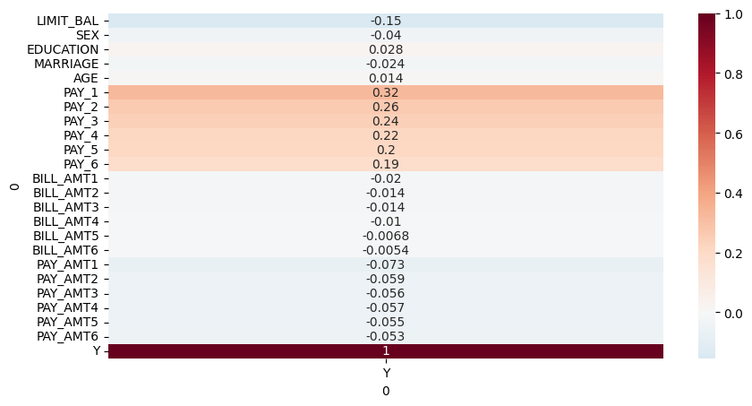
    


```python
data
```


<div>
<style scoped>
    .dataframe tbody tr th:only-of-type {
        vertical-align: middle;
    }

    .dataframe tbody tr th {
        vertical-align: top;
    }

    .dataframe thead th {
        text-align: right;
    }
</style>
<table border="1" class="dataframe">
  <thead>
    <tr style="text-align: right;">
      <th></th>
      <th>LIMIT_BAL</th>
      <th>SEX</th>
      <th>EDUCATION</th>
      <th>MARRIAGE</th>
      <th>AGE</th>
      <th>PAY_1</th>
      <th>PAY_2</th>
      <th>PAY_3</th>
      <th>PAY_4</th>
      <th>PAY_5</th>
      <th>PAY_6</th>
      <th>BILL_AMT1</th>
      <th>BILL_AMT2</th>
      <th>BILL_AMT3</th>
      <th>BILL_AMT4</th>
      <th>BILL_AMT5</th>
      <th>BILL_AMT6</th>
      <th>PAY_AMT1</th>
      <th>PAY_AMT2</th>
      <th>PAY_AMT3</th>
      <th>PAY_AMT4</th>
      <th>PAY_AMT5</th>
      <th>PAY_AMT6</th>
      <th>Y</th>
    </tr>
  </thead>
  <tbody>
    <tr>
      <th>1</th>
      <td>20000</td>
      <td>2</td>
      <td>2</td>
      <td>1</td>
      <td>24</td>
      <td>2</td>
      <td>2</td>
      <td>-1</td>
      <td>-1</td>
      <td>-2</td>
      <td>-2</td>
      <td>3913</td>
      <td>3102</td>
      <td>689</td>
      <td>0</td>
      <td>0</td>
      <td>0</td>
      <td>0</td>
      <td>689</td>
      <td>0</td>
      <td>0</td>
      <td>0</td>
      <td>0</td>
      <td>1</td>
    </tr>
    <tr>
      <th>2</th>
      <td>120000</td>
      <td>2</td>
      <td>2</td>
      <td>2</td>
      <td>26</td>
      <td>-1</td>
      <td>2</td>
      <td>0</td>
      <td>0</td>
      <td>0</td>
      <td>2</td>
      <td>2682</td>
      <td>1725</td>
      <td>2682</td>
      <td>3272</td>
      <td>3455</td>
      <td>3261</td>
      <td>0</td>
      <td>1000</td>
      <td>1000</td>
      <td>1000</td>
      <td>0</td>
      <td>2000</td>
      <td>1</td>
    </tr>
    <tr>
      <th>3</th>
      <td>90000</td>
      <td>2</td>
      <td>2</td>
      <td>2</td>
      <td>34</td>
      <td>0</td>
      <td>0</td>
      <td>0</td>
      <td>0</td>
      <td>0</td>
      <td>0</td>
      <td>29239</td>
      <td>14027</td>
      <td>13559</td>
      <td>14331</td>
      <td>14948</td>
      <td>15549</td>
      <td>1518</td>
      <td>1500</td>
      <td>1000</td>
      <td>1000</td>
      <td>1000</td>
      <td>5000</td>
      <td>0</td>
    </tr>
    <tr>
      <th>4</th>
      <td>50000</td>
      <td>2</td>
      <td>2</td>
      <td>1</td>
      <td>37</td>
      <td>0</td>
      <td>0</td>
      <td>0</td>
      <td>0</td>
      <td>0</td>
      <td>0</td>
      <td>46990</td>
      <td>48233</td>
      <td>49291</td>
      <td>28314</td>
      <td>28959</td>
      <td>29547</td>
      <td>2000</td>
      <td>2019</td>
      <td>1200</td>
      <td>1100</td>
      <td>1069</td>
      <td>1000</td>
      <td>0</td>
    </tr>
    <tr>
      <th>5</th>
      <td>50000</td>
      <td>1</td>
      <td>2</td>
      <td>1</td>
      <td>57</td>
      <td>-1</td>
      <td>0</td>
      <td>-1</td>
      <td>0</td>
      <td>0</td>
      <td>0</td>
      <td>8617</td>
      <td>5670</td>
      <td>35835</td>
      <td>20940</td>
      <td>19146</td>
      <td>19131</td>
      <td>2000</td>
      <td>36681</td>
      <td>10000</td>
      <td>9000</td>
      <td>689</td>
      <td>679</td>
      <td>0</td>
    </tr>
    <tr>
      <th>...</th>
      <td>...</td>
      <td>...</td>
      <td>...</td>
      <td>...</td>
      <td>...</td>
      <td>...</td>
      <td>...</td>
      <td>...</td>
      <td>...</td>
      <td>...</td>
      <td>...</td>
      <td>...</td>
      <td>...</td>
      <td>...</td>
      <td>...</td>
      <td>...</td>
      <td>...</td>
      <td>...</td>
      <td>...</td>
      <td>...</td>
      <td>...</td>
      <td>...</td>
      <td>...</td>
      <td>...</td>
    </tr>
    <tr>
      <th>29996</th>
      <td>220000</td>
      <td>1</td>
      <td>3</td>
      <td>1</td>
      <td>39</td>
      <td>0</td>
      <td>0</td>
      <td>0</td>
      <td>0</td>
      <td>0</td>
      <td>0</td>
      <td>188948</td>
      <td>192815</td>
      <td>208365</td>
      <td>88004</td>
      <td>31237</td>
      <td>15980</td>
      <td>8500</td>
      <td>20000</td>
      <td>5003</td>
      <td>3047</td>
      <td>5000</td>
      <td>1000</td>
      <td>0</td>
    </tr>
    <tr>
      <th>29997</th>
      <td>150000</td>
      <td>1</td>
      <td>3</td>
      <td>2</td>
      <td>43</td>
      <td>-1</td>
      <td>-1</td>
      <td>-1</td>
      <td>-1</td>
      <td>0</td>
      <td>0</td>
      <td>1683</td>
      <td>1828</td>
      <td>3502</td>
      <td>8979</td>
      <td>5190</td>
      <td>0</td>
      <td>1837</td>
      <td>3526</td>
      <td>8998</td>
      <td>129</td>
      <td>0</td>
      <td>0</td>
      <td>0</td>
    </tr>
    <tr>
      <th>29998</th>
      <td>30000</td>
      <td>1</td>
      <td>2</td>
      <td>2</td>
      <td>37</td>
      <td>4</td>
      <td>3</td>
      <td>2</td>
      <td>-1</td>
      <td>0</td>
      <td>0</td>
      <td>3565</td>
      <td>3356</td>
      <td>2758</td>
      <td>20878</td>
      <td>20582</td>
      <td>19357</td>
      <td>0</td>
      <td>0</td>
      <td>22000</td>
      <td>4200</td>
      <td>2000</td>
      <td>3100</td>
      <td>1</td>
    </tr>
    <tr>
      <th>29999</th>
      <td>80000</td>
      <td>1</td>
      <td>3</td>
      <td>1</td>
      <td>41</td>
      <td>1</td>
      <td>-1</td>
      <td>0</td>
      <td>0</td>
      <td>0</td>
      <td>-1</td>
      <td>-1645</td>
      <td>78379</td>
      <td>76304</td>
      <td>52774</td>
      <td>11855</td>
      <td>48944</td>
      <td>85900</td>
      <td>3409</td>
      <td>1178</td>
      <td>1926</td>
      <td>52964</td>
      <td>1804</td>
      <td>1</td>
    </tr>
    <tr>
      <th>30000</th>
      <td>50000</td>
      <td>1</td>
      <td>2</td>
      <td>1</td>
      <td>46</td>
      <td>0</td>
      <td>0</td>
      <td>0</td>
      <td>0</td>
      <td>0</td>
      <td>0</td>
      <td>47929</td>
      <td>48905</td>
      <td>49764</td>
      <td>36535</td>
      <td>32428</td>
      <td>15313</td>
      <td>2078</td>
      <td>1800</td>
      <td>1430</td>
      <td>1000</td>
      <td>1000</td>
      <td>1000</td>
      <td>1</td>
    </tr>
  </tbody>
</table>
<p>30000 rows × 24 columns</p>
</div>


```python
data.shape
```


    (30000, 24)


Question: Faire la comparaison des distributions avec un boxplot par rapport a la variable cible 'default payment next month'


```python
dataBoxPlot=data.drop("Y", axis=1);

sns.set(style='whitegrid')
# Déterminer la taille de la grille de subplots
nrows = 4
ncols = 6

# Créer la grille de subplots
fig, axes = plt.subplots(nrows=nrows, ncols=ncols, figsize=(20,10))
axes = axes.flatten()

# Boucler sur les colonnes du dataframe pour tracer les boxplots
for i, column in enumerate(dataBoxPlot.columns):
    sns.boxplot(x=data['Y'], y=dataBoxPlot[column], ax=axes[i])
    axes[i].set_title(column)
    
# Ajuster l'espacement entre les subplots
plt.tight_layout()

# Afficher la figure
plt.show()

```


    
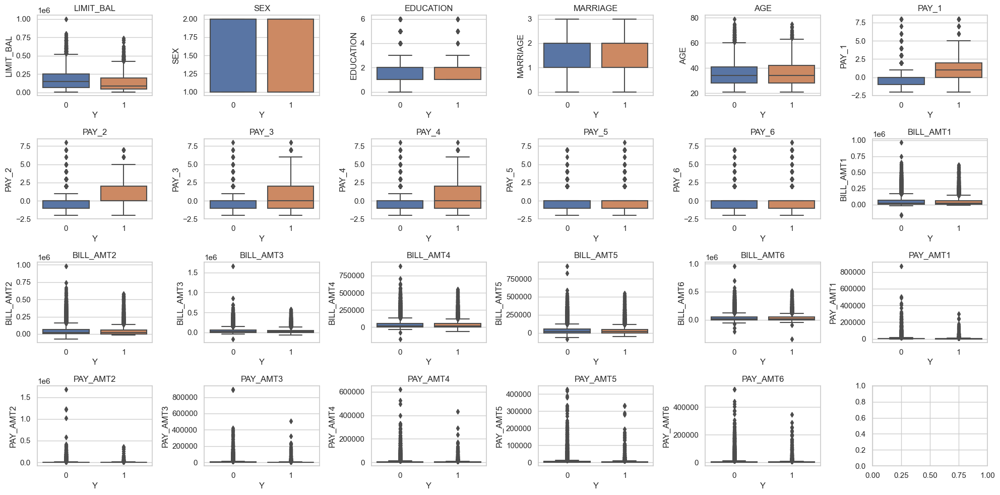
    


### Plots Supplémentaires


```python
# Définir le style de Seaborn
sns.set(style='whitegrid')

# Créer la grille de sous-graphiques
fig, axs = plt.subplots(nrows=4, ncols=6, figsize=(18, 12))

# Ajuster l'espacement entre les sous-graphiques
plt.subplots_adjust(wspace=0.4, hspace=0.4)

# Tracer les boîtes à moustaches sur chaque sous-graphique
for i, col in enumerate(data.columns):
    sns.boxplot(x=data[col], ax=axs[i//6, i%6])
    axs[i//6, i%6].set_title(col, fontsize=12)
    axs[i//6, i%6].set_xlabel('')
    axs[i//6, i%6].set_ylabel('')

# Ajouter un titre global à la figure
fig.suptitle('Distributions des features', fontsize=16)

# Ajouter des étiquettes d'axe
for ax in axs.flat:
    ax.set_xlabel('')

for ax in axs.flat:
    ax.set_ylabel('')

# Afficher la figure
plt.show()
```


    
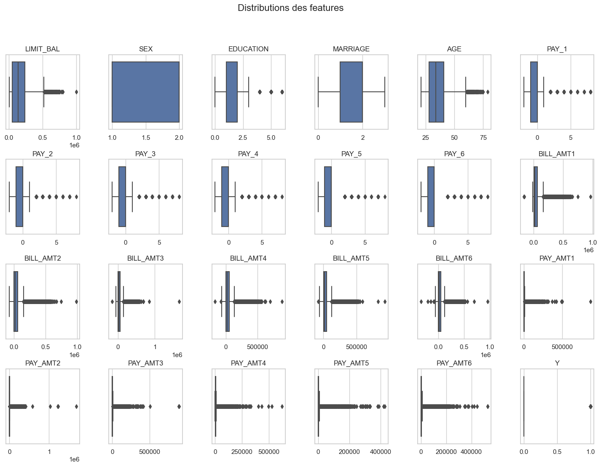
    


#### Distribution selon l'âge, le niveau d'éducation et l'éatat civil


```python
# Create a figure instance, and the subplots
fig = plt.figure(figsize=(14,14))
ax1 = fig.add_subplot(2,2,1)
ax2 = fig.add_subplot(2,2,2)
ax3 = fig.add_subplot(2,2,3)

sns.set_palette("tab20",2)
sns.countplot(x="SEX", hue='Y', 
              data=data,ax=ax1,saturation=1).set(title='Distribution selon le genre',xticklabels=['Male','Female'])
sns.countplot(x="EDUCATION", 
              hue='Y',
              data=data,ax=ax2,saturation=1).set(title="Distribution selon le niveau d'éducation",
                                                    xticklabels=['Gradschool','Univ','Highschool','others','unknown','unknown','unknown'])
sns.countplot(x="MARRIAGE",
              hue='Y', 
              data=data,ax=ax3,saturation=1).set(title="Distribution selon l'état civil",
                                                    xticklabels=['unknown','married','single','others'])
```


    [Text(0.5, 1.0, "Distribution selon l'état civil"),
     [Text(0, 0, 'unknown'),
      Text(1, 0, 'married'),
      Text(2, 0, 'single'),
      Text(3, 0, 'others')]]


    
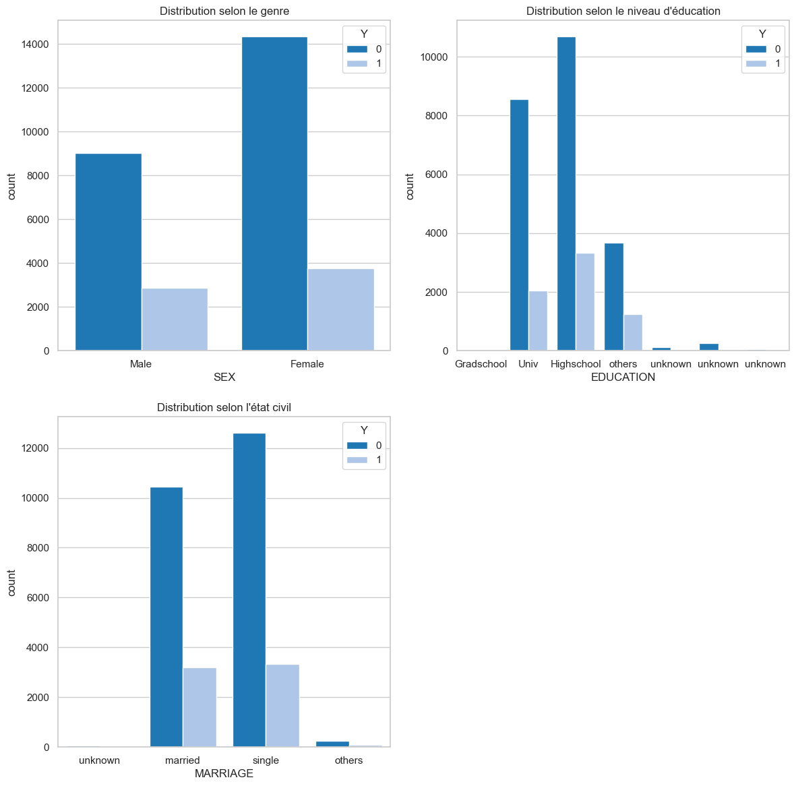
    


#### Historique de paiment


```python
# Historique de paiement
fig = plt.figure(figsize=(14,14))
ax1 = fig.add_subplot(3,2,1)
ax2 = fig.add_subplot(3,2,2)
ax3 = fig.add_subplot(3,2,3)
ax4 = fig.add_subplot(3,2,4)
ax5 = fig.add_subplot(3,2,5)
ax6 = fig.add_subplot(3,2,6)
sns.set_palette("tab20",2)
sns.countplot(x="PAY_1", hue='Y', data=data,ax=ax1,saturation=1).set_title('Historique des paiements September2005')
sns.countplot(x="PAY_2", hue='Y', data=data,ax=ax2,saturation=1).set_title('Historique des paiements Août2005')
sns.countplot(x="PAY_3", hue='Y', data=data,ax=ax3,saturation=1).set_title('Historique des paiements Juillet2005')
sns.countplot(x="PAY_4", hue='Y', data=data,ax=ax4,saturation=1).set_title('Historique des paiements Juin2005')
sns.countplot(x="PAY_5", hue='Y', data=data,ax=ax5,saturation=1).set_title('Historique des paiements Mai2005')
sns.countplot(x="PAY_6", hue='Y', data=data,ax=ax6,saturation=1).set_title('Historique des paiements Avril2005')
```


    Text(0.5, 1.0, 'Historique des paiements Avril2005')


    
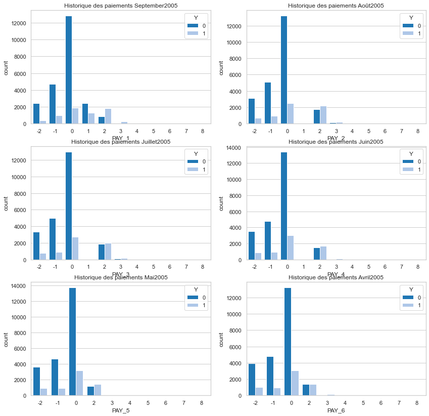
    


#### Montant du relevé de facture (dollar NT)


```python
#Montant du relevé de facture (dollar NT)
sns.pairplot(data, hue='Y',vars =['BILL_AMT1','BILL_AMT2','BILL_AMT3','BILL_AMT4','BILL_AMT5','BILL_AMT6'],palette="tab20")
```


    <seaborn.axisgrid.PairGrid at 0x19fad3b9640>


    
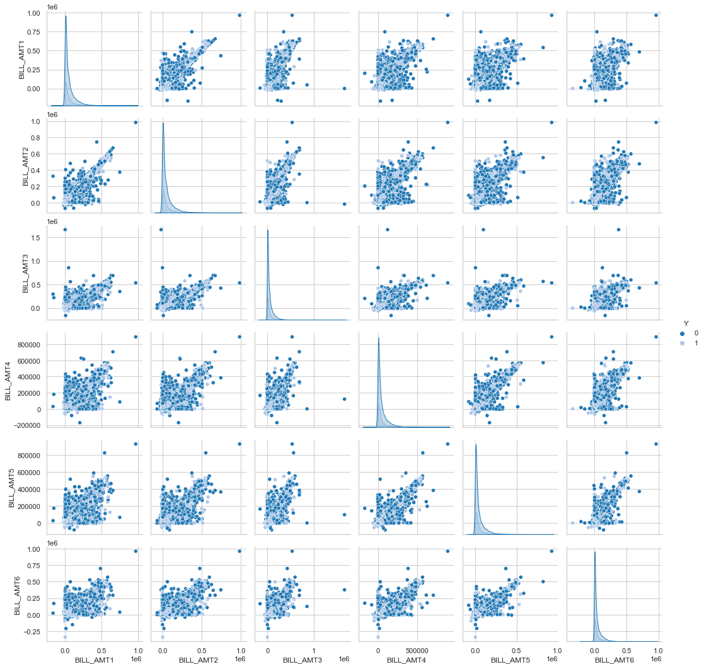
    


#### Montant du paiement précédent (dollar NT)


```python
#Montant du paiement précédent (dollar NT)
sns.pairplot(data, hue='Y',vars =['PAY_AMT1','PAY_AMT2','PAY_AMT3','PAY_AMT4','PAY_AMT5','PAY_AMT6'],palette="tab20")
```


    <seaborn.axisgrid.PairGrid at 0x19fb9a71100>


    
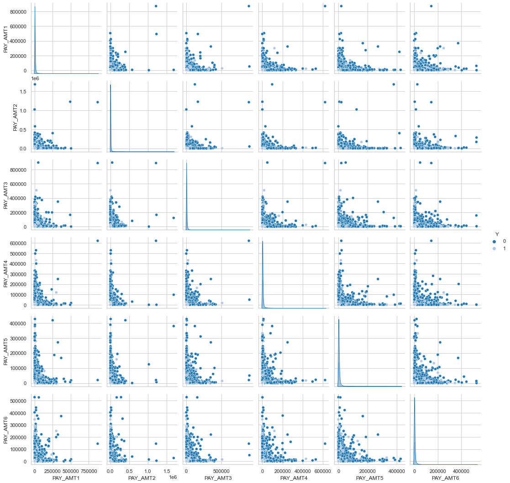
    


## Data cleaning and preprocessing

### Education and marriage features 


```python
m = (data['EDUCATION'] == 0)|(data['EDUCATION'] == 6)|(data['EDUCATION'] == 5)
data = data.drop(data.EDUCATION[m].index.values, axis=0)

m = (data['MARRIAGE'] == 0)
data = data.drop(data.MARRIAGE[m].index.values, axis=0)


```

### Paying features


```python
m = (data['PAY_1'] == -2)
data = data.drop(data.PAY_1[m].index.values, axis=0)
m = (data['PAY_2'] == -2)
data = data.drop(data.PAY_2[m].index.values, axis=0)
m = (data['PAY_3'] == -2)
data = data.drop(data.PAY_3[m].index.values, axis=0)
m = (data['PAY_4'] == -2)
data = data.drop(data.PAY_4[m].index.values, axis=0)
m = (data['PAY_5'] == -2)
data = data.drop(data.PAY_5[m].index.values, axis=0)
m = (data['PAY_6'] == -2)
data = data.drop(data.PAY_6[m].index.values, axis=0)
```

### One-hot encoding for categorical variables


```python
data['EDUCATION'] = data['EDUCATION'].astype('category')
data['SEX'] = data['SEX'].astype('category')
data['MARRIAGE'] = data['MARRIAGE'].astype('category')

data=pd.concat([pd.get_dummies(data['EDUCATION'], prefix='EDUCATION'), 
                  pd.get_dummies(data['SEX'], prefix='SEX'), 
                  pd.get_dummies(data['MARRIAGE'], prefix='MARRIAGE'),
                  data],axis=1)
data.drop(['EDUCATION'],axis=1, inplace=True)
data.drop(['SEX'],axis=1, inplace=True)
data.drop(['MARRIAGE'],axis=1, inplace=True)
data.head(3)
```


<div>
<style scoped>
    .dataframe tbody tr th:only-of-type {
        vertical-align: middle;
    }

    .dataframe tbody tr th {
        vertical-align: top;
    }

    .dataframe thead th {
        text-align: right;
    }
</style>
<table border="1" class="dataframe">
  <thead>
    <tr style="text-align: right;">
      <th></th>
      <th>EDUCATION_1</th>
      <th>EDUCATION_2</th>
      <th>EDUCATION_3</th>
      <th>EDUCATION_4</th>
      <th>SEX_1</th>
      <th>SEX_2</th>
      <th>MARRIAGE_1</th>
      <th>MARRIAGE_2</th>
      <th>MARRIAGE_3</th>
      <th>LIMIT_BAL</th>
      <th>AGE</th>
      <th>PAY_1</th>
      <th>PAY_2</th>
      <th>PAY_3</th>
      <th>PAY_4</th>
      <th>PAY_5</th>
      <th>PAY_6</th>
      <th>BILL_AMT1</th>
      <th>BILL_AMT2</th>
      <th>BILL_AMT3</th>
      <th>BILL_AMT4</th>
      <th>BILL_AMT5</th>
      <th>BILL_AMT6</th>
      <th>PAY_AMT1</th>
      <th>PAY_AMT2</th>
      <th>PAY_AMT3</th>
      <th>PAY_AMT4</th>
      <th>PAY_AMT5</th>
      <th>PAY_AMT6</th>
      <th>Y</th>
    </tr>
  </thead>
  <tbody>
    <tr>
      <th>2</th>
      <td>0</td>
      <td>1</td>
      <td>0</td>
      <td>0</td>
      <td>0</td>
      <td>1</td>
      <td>0</td>
      <td>1</td>
      <td>0</td>
      <td>120000</td>
      <td>26</td>
      <td>-1</td>
      <td>2</td>
      <td>0</td>
      <td>0</td>
      <td>0</td>
      <td>2</td>
      <td>2682</td>
      <td>1725</td>
      <td>2682</td>
      <td>3272</td>
      <td>3455</td>
      <td>3261</td>
      <td>0</td>
      <td>1000</td>
      <td>1000</td>
      <td>1000</td>
      <td>0</td>
      <td>2000</td>
      <td>1</td>
    </tr>
    <tr>
      <th>3</th>
      <td>0</td>
      <td>1</td>
      <td>0</td>
      <td>0</td>
      <td>0</td>
      <td>1</td>
      <td>0</td>
      <td>1</td>
      <td>0</td>
      <td>90000</td>
      <td>34</td>
      <td>0</td>
      <td>0</td>
      <td>0</td>
      <td>0</td>
      <td>0</td>
      <td>0</td>
      <td>29239</td>
      <td>14027</td>
      <td>13559</td>
      <td>14331</td>
      <td>14948</td>
      <td>15549</td>
      <td>1518</td>
      <td>1500</td>
      <td>1000</td>
      <td>1000</td>
      <td>1000</td>
      <td>5000</td>
      <td>0</td>
    </tr>
    <tr>
      <th>4</th>
      <td>0</td>
      <td>1</td>
      <td>0</td>
      <td>0</td>
      <td>0</td>
      <td>1</td>
      <td>1</td>
      <td>0</td>
      <td>0</td>
      <td>50000</td>
      <td>37</td>
      <td>0</td>
      <td>0</td>
      <td>0</td>
      <td>0</td>
      <td>0</td>
      <td>0</td>
      <td>46990</td>
      <td>48233</td>
      <td>49291</td>
      <td>28314</td>
      <td>28959</td>
      <td>29547</td>
      <td>2000</td>
      <td>2019</td>
      <td>1200</td>
      <td>1100</td>
      <td>1069</td>
      <td>1000</td>
      <td>0</td>
    </tr>
  </tbody>
</table>
</div>


### Replace outliers 


```python
def replace_outliers(data, target_col):
    Q1 = data.drop(columns=target_col).quantile(0.25)
    Q3 = data.drop(columns=target_col).quantile(0.75)
    IQR = Q3 - Q1

    lower_bound = Q1 - 1.5 * IQR
    upper_bound = Q3 + 1.5 * IQR

    for col in data.drop(columns=target_col):
        col_mean = np.mean(data[col])
        data[col] = np.where((data[col] < lower_bound[col]) | (data[col] > upper_bound[col]), col_mean, data[col])

    return data
```


```python
data = replace_outliers(data,"Y")
```


```python
data.head(3)
```


<div>
<style scoped>
    .dataframe tbody tr th:only-of-type {
        vertical-align: middle;
    }

    .dataframe tbody tr th {
        vertical-align: top;
    }

    .dataframe thead th {
        text-align: right;
    }
</style>
<table border="1" class="dataframe">
  <thead>
    <tr style="text-align: right;">
      <th></th>
      <th>EDUCATION_1</th>
      <th>EDUCATION_2</th>
      <th>EDUCATION_3</th>
      <th>EDUCATION_4</th>
      <th>SEX_1</th>
      <th>SEX_2</th>
      <th>MARRIAGE_1</th>
      <th>MARRIAGE_2</th>
      <th>MARRIAGE_3</th>
      <th>LIMIT_BAL</th>
      <th>AGE</th>
      <th>PAY_1</th>
      <th>PAY_2</th>
      <th>PAY_3</th>
      <th>PAY_4</th>
      <th>PAY_5</th>
      <th>PAY_6</th>
      <th>BILL_AMT1</th>
      <th>BILL_AMT2</th>
      <th>BILL_AMT3</th>
      <th>BILL_AMT4</th>
      <th>BILL_AMT5</th>
      <th>BILL_AMT6</th>
      <th>PAY_AMT1</th>
      <th>PAY_AMT2</th>
      <th>PAY_AMT3</th>
      <th>PAY_AMT4</th>
      <th>PAY_AMT5</th>
      <th>PAY_AMT6</th>
      <th>Y</th>
    </tr>
  </thead>
  <tbody>
    <tr>
      <th>2</th>
      <td>0.0</td>
      <td>1.0</td>
      <td>0.0</td>
      <td>0.0</td>
      <td>0.0</td>
      <td>1.0</td>
      <td>0.0</td>
      <td>1.0</td>
      <td>0.0</td>
      <td>120000.0</td>
      <td>26.0</td>
      <td>0.180518</td>
      <td>0.189028</td>
      <td>0.0</td>
      <td>0.0</td>
      <td>0.0</td>
      <td>0.088596</td>
      <td>2682.0</td>
      <td>1725.0</td>
      <td>2682.0</td>
      <td>3272.0</td>
      <td>3455.0</td>
      <td>3261.0</td>
      <td>0.0</td>
      <td>1000.0</td>
      <td>1000.0</td>
      <td>1000.0</td>
      <td>0.0</td>
      <td>2000.0</td>
      <td>1</td>
    </tr>
    <tr>
      <th>3</th>
      <td>0.0</td>
      <td>1.0</td>
      <td>0.0</td>
      <td>0.0</td>
      <td>0.0</td>
      <td>1.0</td>
      <td>0.0</td>
      <td>1.0</td>
      <td>0.0</td>
      <td>90000.0</td>
      <td>34.0</td>
      <td>0.000000</td>
      <td>0.000000</td>
      <td>0.0</td>
      <td>0.0</td>
      <td>0.0</td>
      <td>0.000000</td>
      <td>29239.0</td>
      <td>14027.0</td>
      <td>13559.0</td>
      <td>14331.0</td>
      <td>14948.0</td>
      <td>15549.0</td>
      <td>1518.0</td>
      <td>1500.0</td>
      <td>1000.0</td>
      <td>1000.0</td>
      <td>1000.0</td>
      <td>5000.0</td>
      <td>0</td>
    </tr>
    <tr>
      <th>4</th>
      <td>0.0</td>
      <td>1.0</td>
      <td>0.0</td>
      <td>0.0</td>
      <td>0.0</td>
      <td>1.0</td>
      <td>1.0</td>
      <td>0.0</td>
      <td>0.0</td>
      <td>50000.0</td>
      <td>37.0</td>
      <td>0.000000</td>
      <td>0.000000</td>
      <td>0.0</td>
      <td>0.0</td>
      <td>0.0</td>
      <td>0.000000</td>
      <td>46990.0</td>
      <td>48233.0</td>
      <td>49291.0</td>
      <td>28314.0</td>
      <td>28959.0</td>
      <td>29547.0</td>
      <td>2000.0</td>
      <td>2019.0</td>
      <td>1200.0</td>
      <td>1100.0</td>
      <td>1069.0</td>
      <td>1000.0</td>
      <td>0</td>
    </tr>
  </tbody>
</table>
</div>


## Normalisation

### Robust Scaler 


```python
# Initialise le RobustScaler
scaler = RobustScaler()

# Normalise les données
data[data.columns] = scaler.fit_transform(data[data.columns])

# Affiche la DataFrame normalisée
data.head(3)
```


<div>
<style scoped>
    .dataframe tbody tr th:only-of-type {
        vertical-align: middle;
    }

    .dataframe tbody tr th {
        vertical-align: top;
    }

    .dataframe thead th {
        text-align: right;
    }
</style>
<table border="1" class="dataframe">
  <thead>
    <tr style="text-align: right;">
      <th></th>
      <th>EDUCATION_1</th>
      <th>EDUCATION_2</th>
      <th>EDUCATION_3</th>
      <th>EDUCATION_4</th>
      <th>SEX_1</th>
      <th>SEX_2</th>
      <th>MARRIAGE_1</th>
      <th>MARRIAGE_2</th>
      <th>MARRIAGE_3</th>
      <th>LIMIT_BAL</th>
      <th>AGE</th>
      <th>PAY_1</th>
      <th>PAY_2</th>
      <th>PAY_3</th>
      <th>PAY_4</th>
      <th>PAY_5</th>
      <th>PAY_6</th>
      <th>BILL_AMT1</th>
      <th>BILL_AMT2</th>
      <th>BILL_AMT3</th>
      <th>BILL_AMT4</th>
      <th>BILL_AMT5</th>
      <th>BILL_AMT6</th>
      <th>PAY_AMT1</th>
      <th>PAY_AMT2</th>
      <th>PAY_AMT3</th>
      <th>PAY_AMT4</th>
      <th>PAY_AMT5</th>
      <th>PAY_AMT6</th>
      <th>Y</th>
    </tr>
  </thead>
  <tbody>
    <tr>
      <th>2</th>
      <td>0.0</td>
      <td>1.0</td>
      <td>0.0</td>
      <td>0.0</td>
      <td>0.0</td>
      <td>0.0</td>
      <td>0.0</td>
      <td>0.0</td>
      <td>0.0</td>
      <td>0.0000</td>
      <td>-0.615385</td>
      <td>1.0</td>
      <td>1.0</td>
      <td>0.0</td>
      <td>0.0</td>
      <td>0.0</td>
      <td>1.0</td>
      <td>-0.600784</td>
      <td>-0.620744</td>
      <td>-0.587972</td>
      <td>-0.577134</td>
      <td>-0.564821</td>
      <td>-0.541801</td>
      <td>-0.633602</td>
      <td>-0.390016</td>
      <td>-0.25</td>
      <td>-0.248617</td>
      <td>-0.503810</td>
      <td>0.000000</td>
      <td>1.0</td>
    </tr>
    <tr>
      <th>3</th>
      <td>0.0</td>
      <td>1.0</td>
      <td>0.0</td>
      <td>0.0</td>
      <td>0.0</td>
      <td>0.0</td>
      <td>0.0</td>
      <td>0.0</td>
      <td>0.0</td>
      <td>-0.1875</td>
      <td>0.000000</td>
      <td>0.0</td>
      <td>0.0</td>
      <td>0.0</td>
      <td>0.0</td>
      <td>0.0</td>
      <td>0.0</td>
      <td>-0.087315</td>
      <td>-0.374746</td>
      <td>-0.356975</td>
      <td>-0.322114</td>
      <td>-0.281560</td>
      <td>-0.236138</td>
      <td>-0.263177</td>
      <td>-0.260010</td>
      <td>-0.25</td>
      <td>-0.248617</td>
      <td>-0.251905</td>
      <td>0.774643</td>
      <td>0.0</td>
    </tr>
    <tr>
      <th>4</th>
      <td>0.0</td>
      <td>1.0</td>
      <td>0.0</td>
      <td>0.0</td>
      <td>0.0</td>
      <td>0.0</td>
      <td>1.0</td>
      <td>-1.0</td>
      <td>0.0</td>
      <td>-0.4375</td>
      <td>0.230769</td>
      <td>0.0</td>
      <td>0.0</td>
      <td>0.0</td>
      <td>0.0</td>
      <td>0.0</td>
      <td>0.0</td>
      <td>0.255893</td>
      <td>0.309257</td>
      <td>0.401871</td>
      <td>0.000334</td>
      <td>0.063760</td>
      <td>0.112062</td>
      <td>-0.145559</td>
      <td>-0.125065</td>
      <td>-0.20</td>
      <td>-0.223755</td>
      <td>-0.234524</td>
      <td>-0.258214</td>
      <td>0.0</td>
    </tr>
  </tbody>
</table>
</div>


```python
# BOXPLOT
cols = ['LIMIT_BAL','AGE','BILL_AMT1','BILL_AMT2','BILL_AMT3', 'BILL_AMT4', 'BILL_AMT5', 'BILL_AMT6', 'PAY_AMT1','PAY_AMT2', 'PAY_AMT3', 'PAY_AMT4', 'PAY_AMT5', 'PAY_AMT6']

fig=plt.figure(1, figsize=(25,15))
ax=fig.add_subplot(111)
sns.boxplot(data=data[cols])
plt.xticks(np.arange(0,14), labels=cols, rotation=25, fontsize=18)
plt.yticks(fontsize=18)
# plt.title('Boxplot', fontsize= 35)

plt.savefig('Fig - Boxplot')
```


    
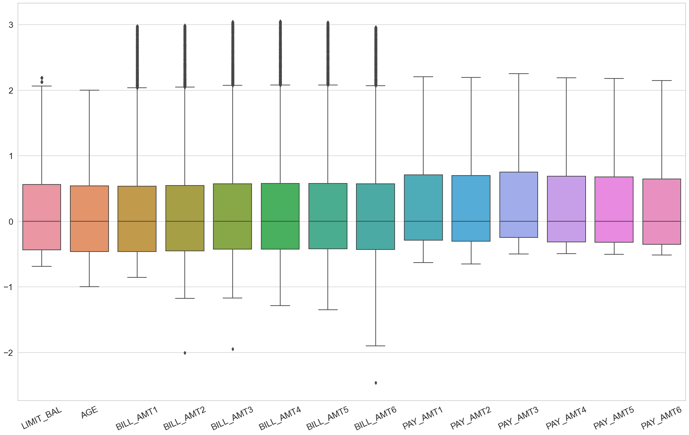
    


# SMOTE


```python
sns.set_style('darkgrid')
plt.figure(figsize=(12, 6))
sns.countplot(x = 'Y', data = data)
plt.title('Target Variable Distribution')
plt.show()
```


    
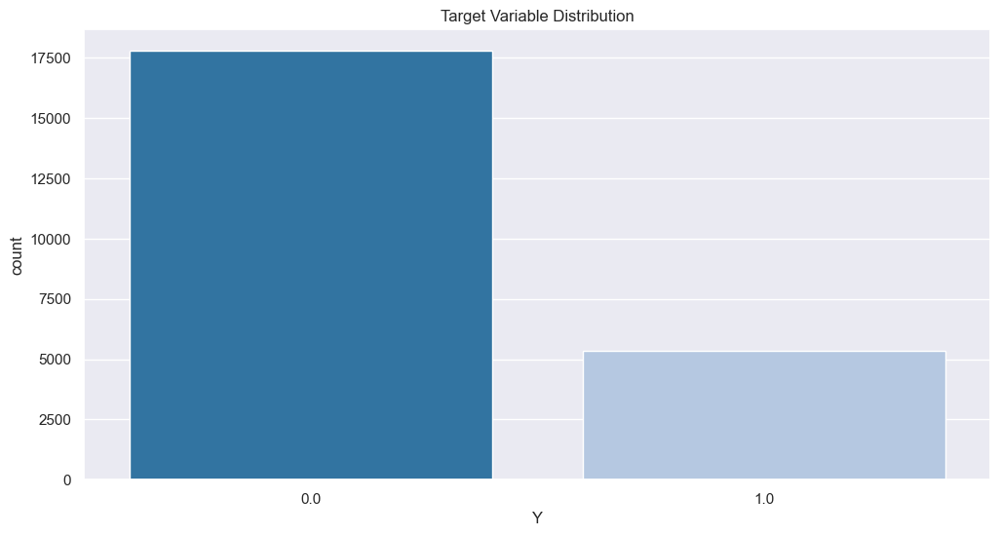
    


```python
from imblearn.over_sampling import SMOTE
X = data.drop("Y", axis=1)
y = data["Y"]
smote = SMOTE(random_state=42)
X_resampled, y_resampled = smote.fit_resample(X, y)
count_class_resampled = pd.Series(y_resampled).value_counts()
print(count_class_resampled)
data_res = pd.concat([pd.DataFrame(X_resampled), pd.DataFrame(y_resampled, columns=['Y'])], axis=1)

```

    1.0    17788
    0.0    17788
    Name: Y, dtype: int64
    


```python
data_res['Y'].value_counts().plot.pie()
plt.show()
```


    

    


```python
data_res.isnull().sum()
```


    EDUCATION_1    0
    EDUCATION_2    0
    EDUCATION_3    0
    EDUCATION_4    0
    SEX_1          0
    SEX_2          0
    MARRIAGE_1     0
    MARRIAGE_2     0
    MARRIAGE_3     0
    LIMIT_BAL      0
    AGE            0
    PAY_1          0
    PAY_2          0
    PAY_3          0
    PAY_4          0
    PAY_5          0
    PAY_6          0
    BILL_AMT1      0
    BILL_AMT2      0
    BILL_AMT3      0
    BILL_AMT4      0
    BILL_AMT5      0
    BILL_AMT6      0
    PAY_AMT1       0
    PAY_AMT2       0
    PAY_AMT3       0
    PAY_AMT4       0
    PAY_AMT5       0
    PAY_AMT6       0
    Y              0
    dtype: int64


#### Question: Pour voir les relations entre ces caractéristiques, faire des graphiques par paire :


```python
#Certe que ce graphique nous montre toutes les relations mais il est preférable de voir chaque relation des features a part
sns.pairplot(data, hue='Y', height=2.5)
plt.show()
```


    

    


#### Question: Tracer avec seaborn un graphe qui permet de voir une idée sur la correlation entre la variable 'default payment next month' et les autres variables


```python
corr = data.corr()
plt.figure(figsize = (15, 12))
sns.heatmap(corr, cmap='RdYlGn', annot = True, center = 0)
plt.title('Correlogram', fontsize = 15, color = 'darkgreen')
plt.show()
```


    
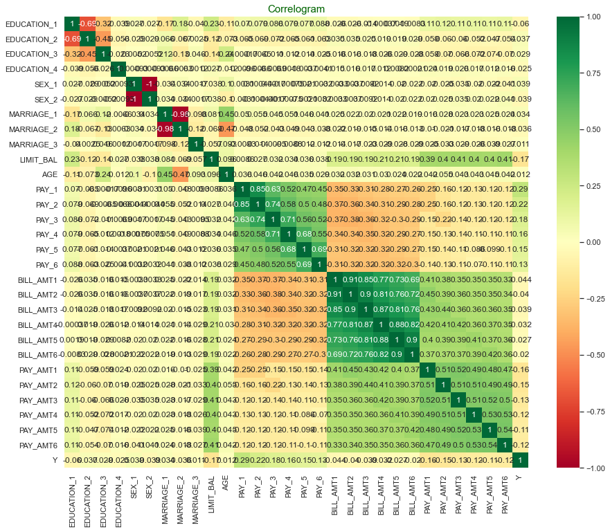
    


#### Question : Faire la sélection des feautres avec différentes méthodes: SelectKBest, correlation, Recursive Feature Elimination (RFE), VarianceThreshold...


```python
################SELECT K BEST######################
from sklearn.feature_selection import SelectKBest
from sklearn.feature_selection import f_regression

X_res = data_res.drop("Y", axis=1)
y_res = data_res["Y"]
# X est la matrice de caractéristiques
# y est la variable cible
# k est le nombre de fonctionnalités à sélectionner

# Instancier le sélecteur avec la fonction de score f_regression
selector = SelectKBest(score_func=f_regression, k=6)

# Adapter le sélecteur aux données
X_new = selector.fit_transform(X_res, y_res)
idxs_selected = selector.get_support(indices=True)

# Récupérer les noms des fonctionnalités sélectionnées
feat_names_selectKbest = X_res.columns[idxs_selected].tolist()
```


```python
feat_names_selectKbest
```


    ['LIMIT_BAL', 'PAY_1', 'PAY_2', 'PAY_3', 'PAY_AMT1', 'PAY_AMT2']


```python
################ RFE ######################
from sklearn.feature_selection import RFE
from sklearn.linear_model import LinearRegression

X_res = data_res.drop("Y", axis=1)
y_res = data_res["Y"]
# X est la matrice de caractéristiques
# y est la variable cible
# n_features_to_select est le nombre de fonctionnalités à sélectionner

# Instancier l'estimateur pour la régression linéaire
estimator = LinearRegression()

# Instancier le sélecteur RFE avec l'estimateur et le nombre de fonctionnalités à sélectionner
selector = RFE(estimator, n_features_to_select=6)

# Adapter le sélecteur aux données
selector.fit(X_res, y_res)

# Récupérer les indices des fonctionnalités sélectionnées
idxs_selected = selector.get_support(indices=True)

# Récupérer les noms des fonctionnalités sélectionnées
feat_names_RFE = X_res.columns[idxs_selected].tolist()
```


```python
feat_names_RFE
```


    ['EDUCATION_1', 'EDUCATION_2', 'EDUCATION_3', 'EDUCATION_4', 'SEX_1', 'SEX_2']


```python
from sklearn.feature_selection import VarianceThreshold

X_res = data_res.drop("Y", axis=1)

# X est la matrice de caractéristiques
# threshold est le seuil de variance

# Instancier le sélecteur avec le seuil de variance
selector = VarianceThreshold()

# Adapter le sélecteur aux données
X_new = selector.fit_transform(X_res)

# Récupérer les indices des fonctionnalités sélectionnées
idxs_selected = selector.get_support(indices=True)
# Récupérer les noms des fonctionnalités sélectionnées
feat_names_varianceThreshold = X_res.columns[idxs_selected].tolist()
```


```python
feat_names_varianceThreshold
```


    ['EDUCATION_1',
     'EDUCATION_2',
     'EDUCATION_3',
     'EDUCATION_4',
     'SEX_1',
     'SEX_2',
     'MARRIAGE_1',
     'MARRIAGE_2',
     'MARRIAGE_3',
     'LIMIT_BAL',
     'AGE',
     'PAY_1',
     'PAY_2',
     'PAY_3',
     'PAY_4',
     'PAY_5',
     'PAY_6',
     'BILL_AMT1',
     'BILL_AMT2',
     'BILL_AMT3',
     'BILL_AMT4',
     'BILL_AMT5',
     'BILL_AMT6',
     'PAY_AMT1',
     'PAY_AMT2',
     'PAY_AMT3',
     'PAY_AMT4',
     'PAY_AMT5',
     'PAY_AMT6']


#### Question: Appliquer l'analyse en composante principale pour faire des représentations graphiques des données.


```python
from sklearn.decomposition import PCA
import matplotlib.pyplot as plt

X_res = data_res.drop("Y", axis=1)
y_res = data["Y"]
# Instancier l'objet PCA avec le nombre de composantes souhaité


pca = PCA(0.98)

X_res= (X_res - X_res.mean()) / X_res.std()
# Appliquer l'ACP aux données
X_pca = pca.fit_transform(X_res)

# Créer un dataframe pour les composantes principales
df_pca = pd.DataFrame(X_pca)

# Créer un graphique avec les données projetées sur les deux premières composantes principales
plt.scatter(X_pca[:, 0], X_pca[:, 1])

plt.xlabel('Première composante principale')
plt.ylabel('Deuxième composante principale')
plt.show()
```


    
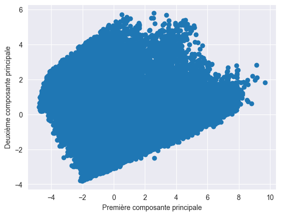
    


#### Question 5:Extraire de `data` : les observations dans une variable`X` et les classes dans une variable `y`


```python
X = data_res[feat_names_RFE]
y = data_res["Y"]
```

#### Question 6: Diviser l'ensemble des observations X et l'ensemble de classes y, chacun en deux sous-ensembles :
- un sous-ensemble d'apprentissage : 80% de l'ensemble initial
- un sous-ensemble de test : 20% de l'ensemble initial
##### __Indication__ : Fixer à 0 le générateur aléatoire


```python
from sklearn.model_selection import train_test_split
X_train, X_test, y_train, y_test = train_test_split(X, y, test_size=0.2, random_state=0)
```

# Courbe Roc et Auc

Chaque Courbe Roc et Acu est sous son modele

Cette fonction permet de sortir la courbe de ROC at AUC de chaque modele


```python
import matplotlib.pyplot as plt
from sklearn.metrics import roc_curve, auc

def plot_roc_curve(y_test, y_pred, title='ROC Curve'):
    # Calculate fpr, tpr, and thresholds
    fpr, tpr, thresholds = roc_curve(y_test, y_pred, drop_intermediate=False)
    # Calculate AUC score
    roc_auc = auc(fpr, tpr)
    # Plot ROC curve
    plt.plot(fpr, tpr, color='darkorange', label='ROC curve (area = %0.2f)' % roc_auc)
    plt.plot([0, 1], [0, 1], color='navy', linestyle='--')
    plt.xlim([0.0, 1.0])
    plt.ylim([0.0, 1.05])
    plt.xlabel('False Positive Rate')
    plt.ylabel('True Positive Rate')
    plt.title(title)
    plt.legend(loc="lower right")
    plt.show()

```

# 

#  MODELING

# 1- K Nearest Neighbor(KNN)


```python
from sklearn.neighbors import KNeighborsClassifier
from sklearn.model_selection import GridSearchCV
```

#### En utilisant la méthode GridSearchCV, identifier le meilleur nombre de voisin (tester les valeurs de $n_{neighbors}\in \{1,2,3...25\}$, ainsi que la meilleur distance à utiliser (tester les valeurs de $p\in \{1,2,3,4,5,6 \}$


```python
knn = KNeighborsClassifier()

# Définir l'espace des hyperparamètres à optimiser
param_grid = {"n_neighbors": range(1, 26), "p": range(1, 7)}

# Créer une instance de GridSearchCV pour trouver les meilleurs hyperparamètres
grid_search = GridSearchCV(knn, param_grid, cv=5)
grid_search.fit(X_train, y_train)
```


<style>#sk-container-id-1 {color: black;background-color: white;}#sk-container-id-1 pre{padding: 0;}#sk-container-id-1 div.sk-toggleable {background-color: white;}#sk-container-id-1 label.sk-toggleable__label {cursor: pointer;display: block;width: 100%;margin-bottom: 0;padding: 0.3em;box-sizing: border-box;text-align: center;}#sk-container-id-1 label.sk-toggleable__label-arrow:before {content: "▸";float: left;margin-right: 0.25em;color: #696969;}#sk-container-id-1 label.sk-toggleable__label-arrow:hover:before {color: black;}#sk-container-id-1 div.sk-estimator:hover label.sk-toggleable__label-arrow:before {color: black;}#sk-container-id-1 div.sk-toggleable__content {max-height: 0;max-width: 0;overflow: hidden;text-align: left;background-color: #f0f8ff;}#sk-container-id-1 div.sk-toggleable__content pre {margin: 0.2em;color: black;border-radius: 0.25em;background-color: #f0f8ff;}#sk-container-id-1 input.sk-toggleable__control:checked~div.sk-toggleable__content {max-height: 200px;max-width: 100%;overflow: auto;}#sk-container-id-1 input.sk-toggleable__control:checked~label.sk-toggleable__label-arrow:before {content: "▾";}#sk-container-id-1 div.sk-estimator input.sk-toggleable__control:checked~label.sk-toggleable__label {background-color: #d4ebff;}#sk-container-id-1 div.sk-label input.sk-toggleable__control:checked~label.sk-toggleable__label {background-color: #d4ebff;}#sk-container-id-1 input.sk-hidden--visually {border: 0;clip: rect(1px 1px 1px 1px);clip: rect(1px, 1px, 1px, 1px);height: 1px;margin: -1px;overflow: hidden;padding: 0;position: absolute;width: 1px;}#sk-container-id-1 div.sk-estimator {font-family: monospace;background-color: #f0f8ff;border: 1px dotted black;border-radius: 0.25em;box-sizing: border-box;margin-bottom: 0.5em;}#sk-container-id-1 div.sk-estimator:hover {background-color: #d4ebff;}#sk-container-id-1 div.sk-parallel-item::after {content: "";width: 100%;border-bottom: 1px solid gray;flex-grow: 1;}#sk-container-id-1 div.sk-label:hover label.sk-toggleable__label {background-color: #d4ebff;}#sk-container-id-1 div.sk-serial::before {content: "";position: absolute;border-left: 1px solid gray;box-sizing: border-box;top: 0;bottom: 0;left: 50%;z-index: 0;}#sk-container-id-1 div.sk-serial {display: flex;flex-direction: column;align-items: center;background-color: white;padding-right: 0.2em;padding-left: 0.2em;position: relative;}#sk-container-id-1 div.sk-item {position: relative;z-index: 1;}#sk-container-id-1 div.sk-parallel {display: flex;align-items: stretch;justify-content: center;background-color: white;position: relative;}#sk-container-id-1 div.sk-item::before, #sk-container-id-1 div.sk-parallel-item::before {content: "";position: absolute;border-left: 1px solid gray;box-sizing: border-box;top: 0;bottom: 0;left: 50%;z-index: -1;}#sk-container-id-1 div.sk-parallel-item {display: flex;flex-direction: column;z-index: 1;position: relative;background-color: white;}#sk-container-id-1 div.sk-parallel-item:first-child::after {align-self: flex-end;width: 50%;}#sk-container-id-1 div.sk-parallel-item:last-child::after {align-self: flex-start;width: 50%;}#sk-container-id-1 div.sk-parallel-item:only-child::after {width: 0;}#sk-container-id-1 div.sk-dashed-wrapped {border: 1px dashed gray;margin: 0 0.4em 0.5em 0.4em;box-sizing: border-box;padding-bottom: 0.4em;background-color: white;}#sk-container-id-1 div.sk-label label {font-family: monospace;font-weight: bold;display: inline-block;line-height: 1.2em;}#sk-container-id-1 div.sk-label-container {text-align: center;}#sk-container-id-1 div.sk-container {/* jupyter's `normalize.less` sets `[hidden] { display: none; }` but bootstrap.min.css set `[hidden] { display: none !important; }` so we also need the `!important` here to be able to override the default hidden behavior on the sphinx rendered scikit-learn.org. See: https://github.com/scikit-learn/scikit-learn/issues/21755 */display: inline-block !important;position: relative;}#sk-container-id-1 div.sk-text-repr-fallback {display: none;}</style><div id="sk-container-id-1" class="sk-top-container"><div class="sk-text-repr-fallback"><pre>GridSearchCV(cv=5, estimator=KNeighborsClassifier(),
             param_grid={&#x27;n_neighbors&#x27;: range(1, 26), &#x27;p&#x27;: range(1, 7)})</pre><b>In a Jupyter environment, please rerun this cell to show the HTML representation or trust the notebook. <br />On GitHub, the HTML representation is unable to render, please try loading this page with nbviewer.org.</b></div><div class="sk-container" hidden><div class="sk-item sk-dashed-wrapped"><div class="sk-label-container"><div class="sk-label sk-toggleable"><input class="sk-toggleable__control sk-hidden--visually" id="sk-estimator-id-1" type="checkbox" ><label for="sk-estimator-id-1" class="sk-toggleable__label sk-toggleable__label-arrow">GridSearchCV</label><div class="sk-toggleable__content"><pre>GridSearchCV(cv=5, estimator=KNeighborsClassifier(),
             param_grid={&#x27;n_neighbors&#x27;: range(1, 26), &#x27;p&#x27;: range(1, 7)})</pre></div></div></div><div class="sk-parallel"><div class="sk-parallel-item"><div class="sk-item"><div class="sk-label-container"><div class="sk-label sk-toggleable"><input class="sk-toggleable__control sk-hidden--visually" id="sk-estimator-id-2" type="checkbox" ><label for="sk-estimator-id-2" class="sk-toggleable__label sk-toggleable__label-arrow">estimator: KNeighborsClassifier</label><div class="sk-toggleable__content"><pre>KNeighborsClassifier()</pre></div></div></div><div class="sk-serial"><div class="sk-item"><div class="sk-estimator sk-toggleable"><input class="sk-toggleable__control sk-hidden--visually" id="sk-estimator-id-3" type="checkbox" ><label for="sk-estimator-id-3" class="sk-toggleable__label sk-toggleable__label-arrow">KNeighborsClassifier</label><div class="sk-toggleable__content"><pre>KNeighborsClassifier()</pre></div></div></div></div></div></div></div></div></div></div>


#### Afficher les meilleures valeurs des hyperparamètres réglés


```python
print("Best hyperparameters:", grid_search.best_params_)
```

    Best hyperparameters: {'n_neighbors': 22, 'p': 2}
    

#### Créer une instance __`final_model_knn`__ de l'algorithme de classification par KNN en utilisant les meilleurs hyperparamètres trouvés dans la question précédente
#### Entrainer __`final_model_knn`__ sur le sous-ensemble de données approprié.


```python
final_model_knn = grid_search.best_estimator_
```

#### Tracer la matrice de confusion de __`final_model_knn`__


```python
from sklearn.metrics import confusion_matrix
import seaborn as sns

y_pred_knn = final_model_knn.predict(X_test)
cm = confusion_matrix(y_test, y_pred_knn)

sns.heatmap(cm, annot=True, cmap='Blues', fmt='g', cbar=False)
plt.xlabel('Predicted labels')
plt.ylabel('True labels')
plt.show()
```


    
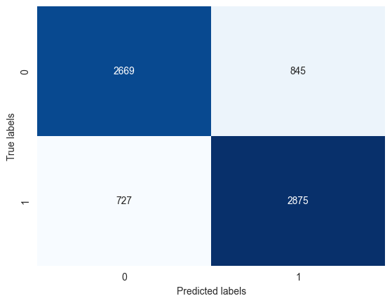
    


### Afficher le __`classification_report`__ de __`final_model_knn`__


```python
from sklearn.metrics import classification_report
report = classification_report(y_test, y_pred_knn)
print(report)
```

                  precision    recall  f1-score   support
    
             0.0       0.55      0.75      0.63      3514
             1.0       0.62      0.41      0.49      3602
    
        accuracy                           0.58      7116
       macro avg       0.59      0.58      0.56      7116
    weighted avg       0.59      0.58      0.56      7116
    
    


```python
from sklearn.metrics import accuracy_score
accuracy = accuracy_score(y_test, y_pred_knn)
print("Accuracy:", accuracy)
```

    Accuracy: 0.5750421585160203
    


```python
plot_roc_curve(y_test,y_pred,title='ROC Curve pour KNN')
```


    
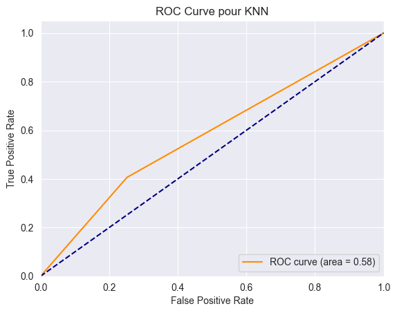
    


# 

# 

# Pour les autres algoritmes vous allez suivre pratiquement le meme raisonnement.

# 2- Decision Tree

#### Importer le modèle __`DecisionTreeClassifier`__ à partir du module __`tree`__ du module __`sklearn`__.


```python
#On va utiliser la Data de base avant La feature selection 
X_res = data_res.drop("Y", axis=1)
y_res = data_res["Y"]
```


```python
from sklearn.model_selection import train_test_split
X_train, X_test, y_train, y_test_treeD = train_test_split(X_res,y_res, test_size=0.2, random_state=0)
```


```python
from sklearn.tree import DecisionTreeClassifier
```

#### Créer un dictionaire __`param_grid`__, en vue de configurer les trois hyperparamètres suivants :
##### - __`criterion`__ : qui peut être soit l'indice de Gini soit l'entropie
##### - __`max_depth`__ : qui varie de 1 à 19
##### - __`splitter`__ : qui peut être soit best ou random


```python
param_grid = {'criterion': ['gini', 'entropy'],
              'max_depth': range(1, 20),
              'splitter': ['best', 'random']}
```

#### Créer une instance de recherche par grille appliquée sur l'algorithme de classification par arbre de décision. La recherche doit tester toutes les combinaisons des valeurs des hyperparamètres de la grille de la question précédente. La recherche doit se faire à travers une validation croisée à 5 découpes.


```python
from sklearn.model_selection import GridSearchCV
from sklearn.model_selection import KFold

cv = KFold(n_splits=5, shuffle=True, random_state=42)
clf = DecisionTreeClassifier()
grid_search = GridSearchCV(clf, param_grid=param_grid, cv=cv, n_jobs=-1)
```

#### Afficher les meilleures valeurs des hyperparamètres réglés


```python
grid_search.fit(X_train, y_train)
print(grid_search.best_params_)
```

    {'criterion': 'gini', 'max_depth': 12, 'splitter': 'best'}
    

#### Créer une instance __`final_model_dt`__ de l'algorithme de classification par arbres de décision en utilisant les meilleurs hyperparamètres trouvés dans la question précédente


```python
final_model_dt = DecisionTreeClassifier(**grid_search.best_params_)
final_model_dt.fit(X_train, y_train)
```


<style>#sk-container-id-2 {color: black;background-color: white;}#sk-container-id-2 pre{padding: 0;}#sk-container-id-2 div.sk-toggleable {background-color: white;}#sk-container-id-2 label.sk-toggleable__label {cursor: pointer;display: block;width: 100%;margin-bottom: 0;padding: 0.3em;box-sizing: border-box;text-align: center;}#sk-container-id-2 label.sk-toggleable__label-arrow:before {content: "▸";float: left;margin-right: 0.25em;color: #696969;}#sk-container-id-2 label.sk-toggleable__label-arrow:hover:before {color: black;}#sk-container-id-2 div.sk-estimator:hover label.sk-toggleable__label-arrow:before {color: black;}#sk-container-id-2 div.sk-toggleable__content {max-height: 0;max-width: 0;overflow: hidden;text-align: left;background-color: #f0f8ff;}#sk-container-id-2 div.sk-toggleable__content pre {margin: 0.2em;color: black;border-radius: 0.25em;background-color: #f0f8ff;}#sk-container-id-2 input.sk-toggleable__control:checked~div.sk-toggleable__content {max-height: 200px;max-width: 100%;overflow: auto;}#sk-container-id-2 input.sk-toggleable__control:checked~label.sk-toggleable__label-arrow:before {content: "▾";}#sk-container-id-2 div.sk-estimator input.sk-toggleable__control:checked~label.sk-toggleable__label {background-color: #d4ebff;}#sk-container-id-2 div.sk-label input.sk-toggleable__control:checked~label.sk-toggleable__label {background-color: #d4ebff;}#sk-container-id-2 input.sk-hidden--visually {border: 0;clip: rect(1px 1px 1px 1px);clip: rect(1px, 1px, 1px, 1px);height: 1px;margin: -1px;overflow: hidden;padding: 0;position: absolute;width: 1px;}#sk-container-id-2 div.sk-estimator {font-family: monospace;background-color: #f0f8ff;border: 1px dotted black;border-radius: 0.25em;box-sizing: border-box;margin-bottom: 0.5em;}#sk-container-id-2 div.sk-estimator:hover {background-color: #d4ebff;}#sk-container-id-2 div.sk-parallel-item::after {content: "";width: 100%;border-bottom: 1px solid gray;flex-grow: 1;}#sk-container-id-2 div.sk-label:hover label.sk-toggleable__label {background-color: #d4ebff;}#sk-container-id-2 div.sk-serial::before {content: "";position: absolute;border-left: 1px solid gray;box-sizing: border-box;top: 0;bottom: 0;left: 50%;z-index: 0;}#sk-container-id-2 div.sk-serial {display: flex;flex-direction: column;align-items: center;background-color: white;padding-right: 0.2em;padding-left: 0.2em;position: relative;}#sk-container-id-2 div.sk-item {position: relative;z-index: 1;}#sk-container-id-2 div.sk-parallel {display: flex;align-items: stretch;justify-content: center;background-color: white;position: relative;}#sk-container-id-2 div.sk-item::before, #sk-container-id-2 div.sk-parallel-item::before {content: "";position: absolute;border-left: 1px solid gray;box-sizing: border-box;top: 0;bottom: 0;left: 50%;z-index: -1;}#sk-container-id-2 div.sk-parallel-item {display: flex;flex-direction: column;z-index: 1;position: relative;background-color: white;}#sk-container-id-2 div.sk-parallel-item:first-child::after {align-self: flex-end;width: 50%;}#sk-container-id-2 div.sk-parallel-item:last-child::after {align-self: flex-start;width: 50%;}#sk-container-id-2 div.sk-parallel-item:only-child::after {width: 0;}#sk-container-id-2 div.sk-dashed-wrapped {border: 1px dashed gray;margin: 0 0.4em 0.5em 0.4em;box-sizing: border-box;padding-bottom: 0.4em;background-color: white;}#sk-container-id-2 div.sk-label label {font-family: monospace;font-weight: bold;display: inline-block;line-height: 1.2em;}#sk-container-id-2 div.sk-label-container {text-align: center;}#sk-container-id-2 div.sk-container {/* jupyter's `normalize.less` sets `[hidden] { display: none; }` but bootstrap.min.css set `[hidden] { display: none !important; }` so we also need the `!important` here to be able to override the default hidden behavior on the sphinx rendered scikit-learn.org. See: https://github.com/scikit-learn/scikit-learn/issues/21755 */display: inline-block !important;position: relative;}#sk-container-id-2 div.sk-text-repr-fallback {display: none;}</style><div id="sk-container-id-2" class="sk-top-container"><div class="sk-text-repr-fallback"><pre>DecisionTreeClassifier(max_depth=12)</pre><b>In a Jupyter environment, please rerun this cell to show the HTML representation or trust the notebook. <br />On GitHub, the HTML representation is unable to render, please try loading this page with nbviewer.org.</b></div><div class="sk-container" hidden><div class="sk-item"><div class="sk-estimator sk-toggleable"><input class="sk-toggleable__control sk-hidden--visually" id="sk-estimator-id-4" type="checkbox" checked><label for="sk-estimator-id-4" class="sk-toggleable__label sk-toggleable__label-arrow">DecisionTreeClassifier</label><div class="sk-toggleable__content"><pre>DecisionTreeClassifier(max_depth=12)</pre></div></div></div></div></div>


#### Afficher l'arbre sous forme de régles de décision


```python
from sklearn.tree import export_text

tree_rules = export_text(final_model_dt, feature_names=list(X_train.columns))
print(tree_rules)
```

    |--- PAY_1 <= 0.00
    |   |--- LIMIT_BAL <= -0.25
    |   |   |--- LIMIT_BAL <= -0.31
    |   |   |   |--- LIMIT_BAL <= -0.44
    |   |   |   |   |--- LIMIT_BAL <= -0.56
    |   |   |   |   |   |--- LIMIT_BAL <= -0.56
    |   |   |   |   |   |   |--- LIMIT_BAL <= -0.62
    |   |   |   |   |   |   |   |--- BILL_AMT1 <= -0.35
    |   |   |   |   |   |   |   |   |--- PAY_AMT4 <= -0.25
    |   |   |   |   |   |   |   |   |   |--- PAY_AMT6 <= -0.51
    |   |   |   |   |   |   |   |   |   |   |--- PAY_AMT1 <= -0.28
    |   |   |   |   |   |   |   |   |   |   |   |--- truncated branch of depth 2
    |   |   |   |   |   |   |   |   |   |   |--- PAY_AMT1 >  -0.28
    |   |   |   |   |   |   |   |   |   |   |   |--- truncated branch of depth 2
    |   |   |   |   |   |   |   |   |   |--- PAY_AMT6 >  -0.51
    |   |   |   |   |   |   |   |   |   |   |--- LIMIT_BAL <= -0.63
    |   |   |   |   |   |   |   |   |   |   |   |--- truncated branch of depth 2
    |   |   |   |   |   |   |   |   |   |   |--- LIMIT_BAL >  -0.63
    |   |   |   |   |   |   |   |   |   |   |   |--- truncated branch of depth 2
    |   |   |   |   |   |   |   |   |--- PAY_AMT4 >  -0.25
    |   |   |   |   |   |   |   |   |   |--- BILL_AMT2 <= -0.47
    |   |   |   |   |   |   |   |   |   |   |--- AGE <= -0.58
    |   |   |   |   |   |   |   |   |   |   |   |--- truncated branch of depth 2
    |   |   |   |   |   |   |   |   |   |   |--- AGE >  -0.58
    |   |   |   |   |   |   |   |   |   |   |   |--- truncated branch of depth 2
    |   |   |   |   |   |   |   |   |   |--- BILL_AMT2 >  -0.47
    |   |   |   |   |   |   |   |   |   |   |--- PAY_AMT5 <= -0.33
    |   |   |   |   |   |   |   |   |   |   |   |--- truncated branch of depth 2
    |   |   |   |   |   |   |   |   |   |   |--- PAY_AMT5 >  -0.33
    |   |   |   |   |   |   |   |   |   |   |   |--- truncated branch of depth 2
    |   |   |   |   |   |   |   |--- BILL_AMT1 >  -0.35
    |   |   |   |   |   |   |   |   |--- AGE <= -0.05
    |   |   |   |   |   |   |   |   |   |--- PAY_AMT2 <= -0.31
    |   |   |   |   |   |   |   |   |   |   |--- BILL_AMT6 <= -0.26
    |   |   |   |   |   |   |   |   |   |   |   |--- truncated branch of depth 2
    |   |   |   |   |   |   |   |   |   |   |--- BILL_AMT6 >  -0.26
    |   |   |   |   |   |   |   |   |   |   |   |--- truncated branch of depth 2
    |   |   |   |   |   |   |   |   |   |--- PAY_AMT2 >  -0.31
    |   |   |   |   |   |   |   |   |   |   |--- BILL_AMT6 <= -0.09
    |   |   |   |   |   |   |   |   |   |   |   |--- truncated branch of depth 2
    |   |   |   |   |   |   |   |   |   |   |--- BILL_AMT6 >  -0.09
    |   |   |   |   |   |   |   |   |   |   |   |--- truncated branch of depth 2
    |   |   |   |   |   |   |   |   |--- AGE >  -0.05
    |   |   |   |   |   |   |   |   |   |--- BILL_AMT2 <= -0.33
    |   |   |   |   |   |   |   |   |   |   |--- class: 0.0
    |   |   |   |   |   |   |   |   |   |--- BILL_AMT2 >  -0.33
    |   |   |   |   |   |   |   |   |   |   |--- BILL_AMT1 <= -0.30
    |   |   |   |   |   |   |   |   |   |   |   |--- truncated branch of depth 2
    |   |   |   |   |   |   |   |   |   |   |--- BILL_AMT1 >  -0.30
    |   |   |   |   |   |   |   |   |   |   |   |--- truncated branch of depth 2
    |   |   |   |   |   |   |--- LIMIT_BAL >  -0.62
    |   |   |   |   |   |   |   |--- class: 1.0
    |   |   |   |   |   |--- LIMIT_BAL >  -0.56
    |   |   |   |   |   |   |--- BILL_AMT6 <= -0.22
    |   |   |   |   |   |   |   |--- AGE <= 0.46
    |   |   |   |   |   |   |   |   |--- AGE <= 0.04
    |   |   |   |   |   |   |   |   |   |--- BILL_AMT3 <= -0.02
    |   |   |   |   |   |   |   |   |   |   |--- BILL_AMT3 <= -0.36
    |   |   |   |   |   |   |   |   |   |   |   |--- truncated branch of depth 2
    |   |   |   |   |   |   |   |   |   |   |--- BILL_AMT3 >  -0.36
    |   |   |   |   |   |   |   |   |   |   |   |--- truncated branch of depth 2
    |   |   |   |   |   |   |   |   |   |--- BILL_AMT3 >  -0.02
    |   |   |   |   |   |   |   |   |   |   |--- SEX_1 <= 0.50
    |   |   |   |   |   |   |   |   |   |   |   |--- truncated branch of depth 2
    |   |   |   |   |   |   |   |   |   |   |--- SEX_1 >  0.50
    |   |   |   |   |   |   |   |   |   |   |   |--- class: 0.0
    |   |   |   |   |   |   |   |   |--- AGE >  0.04
    |   |   |   |   |   |   |   |   |   |--- PAY_AMT4 <= -0.25
    |   |   |   |   |   |   |   |   |   |   |--- BILL_AMT1 <= -0.50
    |   |   |   |   |   |   |   |   |   |   |   |--- class: 1.0
    |   |   |   |   |   |   |   |   |   |   |--- BILL_AMT1 >  -0.50
    |   |   |   |   |   |   |   |   |   |   |   |--- truncated branch of depth 2
    |   |   |   |   |   |   |   |   |   |--- PAY_AMT4 >  -0.25
    |   |   |   |   |   |   |   |   |   |   |--- PAY_AMT4 <= 0.15
    |   |   |   |   |   |   |   |   |   |   |   |--- class: 1.0
    |   |   |   |   |   |   |   |   |   |   |--- PAY_AMT4 >  0.15
    |   |   |   |   |   |   |   |   |   |   |   |--- truncated branch of depth 2
    |   |   |   |   |   |   |   |--- AGE >  0.46
    |   |   |   |   |   |   |   |   |--- PAY_AMT4 <= -0.49
    |   |   |   |   |   |   |   |   |   |--- PAY_AMT6 <= -0.42
    |   |   |   |   |   |   |   |   |   |   |--- class: 0.0
    |   |   |   |   |   |   |   |   |   |--- PAY_AMT6 >  -0.42
    |   |   |   |   |   |   |   |   |   |   |--- class: 1.0
    |   |   |   |   |   |   |   |   |--- PAY_AMT4 >  -0.49
    |   |   |   |   |   |   |   |   |   |--- PAY_AMT3 <= 0.64
    |   |   |   |   |   |   |   |   |   |   |--- class: 0.0
    |   |   |   |   |   |   |   |   |   |--- PAY_AMT3 >  0.64
    |   |   |   |   |   |   |   |   |   |   |--- EDUCATION_2 <= 0.50
    |   |   |   |   |   |   |   |   |   |   |   |--- class: 0.0
    |   |   |   |   |   |   |   |   |   |   |--- EDUCATION_2 >  0.50
    |   |   |   |   |   |   |   |   |   |   |   |--- class: 1.0
    |   |   |   |   |   |   |--- BILL_AMT6 >  -0.22
    |   |   |   |   |   |   |   |--- PAY_AMT1 <= -0.15
    |   |   |   |   |   |   |   |   |--- PAY_AMT1 <= -0.17
    |   |   |   |   |   |   |   |   |   |--- PAY_AMT6 <= -0.20
    |   |   |   |   |   |   |   |   |   |   |--- BILL_AMT2 <= -0.19
    |   |   |   |   |   |   |   |   |   |   |   |--- truncated branch of depth 2
    |   |   |   |   |   |   |   |   |   |   |--- BILL_AMT2 >  -0.19
    |   |   |   |   |   |   |   |   |   |   |   |--- truncated branch of depth 2
    |   |   |   |   |   |   |   |   |   |--- PAY_AMT6 >  -0.20
    |   |   |   |   |   |   |   |   |   |   |--- PAY_5 <= 0.12
    |   |   |   |   |   |   |   |   |   |   |   |--- truncated branch of depth 2
    |   |   |   |   |   |   |   |   |   |   |--- PAY_5 >  0.12
    |   |   |   |   |   |   |   |   |   |   |   |--- truncated branch of depth 2
    |   |   |   |   |   |   |   |   |--- PAY_AMT1 >  -0.17
    |   |   |   |   |   |   |   |   |   |--- class: 1.0
    |   |   |   |   |   |   |   |--- PAY_AMT1 >  -0.15
    |   |   |   |   |   |   |   |   |--- AGE <= -0.76
    |   |   |   |   |   |   |   |   |   |--- PAY_AMT3 <= 0.76
    |   |   |   |   |   |   |   |   |   |   |--- BILL_AMT5 <= 0.44
    |   |   |   |   |   |   |   |   |   |   |   |--- truncated branch of depth 2
    |   |   |   |   |   |   |   |   |   |   |--- BILL_AMT5 >  0.44
    |   |   |   |   |   |   |   |   |   |   |   |--- class: 1.0
    |   |   |   |   |   |   |   |   |   |--- PAY_AMT3 >  0.76
    |   |   |   |   |   |   |   |   |   |   |--- class: 1.0
    |   |   |   |   |   |   |   |   |--- AGE >  -0.76
    |   |   |   |   |   |   |   |   |   |--- PAY_AMT6 <= 0.04
    |   |   |   |   |   |   |   |   |   |   |--- BILL_AMT4 <= -0.01
    |   |   |   |   |   |   |   |   |   |   |   |--- truncated branch of depth 2
    |   |   |   |   |   |   |   |   |   |   |--- BILL_AMT4 >  -0.01
    |   |   |   |   |   |   |   |   |   |   |   |--- truncated branch of depth 2
    |   |   |   |   |   |   |   |   |   |--- PAY_AMT6 >  0.04
    |   |   |   |   |   |   |   |   |   |   |--- BILL_AMT2 <= 0.05
    |   |   |   |   |   |   |   |   |   |   |   |--- truncated branch of depth 2
    |   |   |   |   |   |   |   |   |   |   |--- BILL_AMT2 >  0.05
    |   |   |   |   |   |   |   |   |   |   |   |--- class: 1.0
    |   |   |   |   |--- LIMIT_BAL >  -0.56
    |   |   |   |   |   |--- LIMIT_BAL <= -0.50
    |   |   |   |   |   |   |--- LIMIT_BAL <= -0.50
    |   |   |   |   |   |   |   |--- class: 1.0
    |   |   |   |   |   |   |--- LIMIT_BAL >  -0.50
    |   |   |   |   |   |   |   |--- AGE <= -0.65
    |   |   |   |   |   |   |   |   |--- BILL_AMT2 <= -0.20
    |   |   |   |   |   |   |   |   |   |--- class: 0.0
    |   |   |   |   |   |   |   |   |--- BILL_AMT2 >  -0.20
    |   |   |   |   |   |   |   |   |   |--- BILL_AMT1 <= 0.11
    |   |   |   |   |   |   |   |   |   |   |--- BILL_AMT3 <= 0.16
    |   |   |   |   |   |   |   |   |   |   |   |--- class: 1.0
    |   |   |   |   |   |   |   |   |   |   |--- BILL_AMT3 >  0.16
    |   |   |   |   |   |   |   |   |   |   |   |--- truncated branch of depth 2
    |   |   |   |   |   |   |   |   |   |--- BILL_AMT1 >  0.11
    |   |   |   |   |   |   |   |   |   |   |--- class: 0.0
    |   |   |   |   |   |   |   |--- AGE >  -0.65
    |   |   |   |   |   |   |   |   |--- PAY_AMT3 <= -0.30
    |   |   |   |   |   |   |   |   |   |--- BILL_AMT3 <= -0.08
    |   |   |   |   |   |   |   |   |   |   |--- PAY_3 <= 0.50
    |   |   |   |   |   |   |   |   |   |   |   |--- class: 0.0
    |   |   |   |   |   |   |   |   |   |   |--- PAY_3 >  0.50
    |   |   |   |   |   |   |   |   |   |   |   |--- class: 1.0
    |   |   |   |   |   |   |   |   |   |--- BILL_AMT3 >  -0.08
    |   |   |   |   |   |   |   |   |   |   |--- class: 1.0
    |   |   |   |   |   |   |   |   |--- PAY_AMT3 >  -0.30
    |   |   |   |   |   |   |   |   |   |--- BILL_AMT5 <= -0.64
    |   |   |   |   |   |   |   |   |   |   |--- class: 1.0
    |   |   |   |   |   |   |   |   |   |--- BILL_AMT5 >  -0.64
    |   |   |   |   |   |   |   |   |   |   |--- BILL_AMT6 <= 0.37
    |   |   |   |   |   |   |   |   |   |   |   |--- truncated branch of depth 2
    |   |   |   |   |   |   |   |   |   |   |--- BILL_AMT6 >  0.37
    |   |   |   |   |   |   |   |   |   |   |   |--- truncated branch of depth 2
    |   |   |   |   |   |--- LIMIT_BAL >  -0.50
    |   |   |   |   |   |   |--- class: 1.0
    |   |   |   |--- LIMIT_BAL >  -0.44
    |   |   |   |   |--- LIMIT_BAL <= -0.44
    |   |   |   |   |   |--- BILL_AMT3 <= 0.08
    |   |   |   |   |   |   |--- PAY_3 <= 0.07
    |   |   |   |   |   |   |   |--- PAY_AMT1 <= -0.37
    |   |   |   |   |   |   |   |   |--- PAY_AMT2 <= -0.37
    |   |   |   |   |   |   |   |   |   |--- class: 0.0
    |   |   |   |   |   |   |   |   |--- PAY_AMT2 >  -0.37
    |   |   |   |   |   |   |   |   |   |--- SEX_1 <= 0.50
    |   |   |   |   |   |   |   |   |   |   |--- class: 1.0
    |   |   |   |   |   |   |   |   |   |--- SEX_1 >  0.50
    |   |   |   |   |   |   |   |   |   |   |--- BILL_AMT5 <= -0.59
    |   |   |   |   |   |   |   |   |   |   |   |--- class: 1.0
    |   |   |   |   |   |   |   |   |   |   |--- BILL_AMT5 >  -0.59
    |   |   |   |   |   |   |   |   |   |   |   |--- class: 0.0
    |   |   |   |   |   |   |   |--- PAY_AMT1 >  -0.37
    |   |   |   |   |   |   |   |   |--- BILL_AMT2 <= 0.07
    |   |   |   |   |   |   |   |   |   |--- BILL_AMT6 <= 0.56
    |   |   |   |   |   |   |   |   |   |   |--- AGE <= 0.63
    |   |   |   |   |   |   |   |   |   |   |   |--- truncated branch of depth 2
    |   |   |   |   |   |   |   |   |   |   |--- AGE >  0.63
    |   |   |   |   |   |   |   |   |   |   |   |--- truncated branch of depth 2
    |   |   |   |   |   |   |   |   |   |--- BILL_AMT6 >  0.56
    |   |   |   |   |   |   |   |   |   |   |--- class: 1.0
    |   |   |   |   |   |   |   |   |--- BILL_AMT2 >  0.07
    |   |   |   |   |   |   |   |   |   |--- PAY_AMT5 <= -0.25
    |   |   |   |   |   |   |   |   |   |   |--- BILL_AMT3 <= -0.54
    |   |   |   |   |   |   |   |   |   |   |   |--- class: 1.0
    |   |   |   |   |   |   |   |   |   |   |--- BILL_AMT3 >  -0.54
    |   |   |   |   |   |   |   |   |   |   |   |--- truncated branch of depth 2
    |   |   |   |   |   |   |   |   |   |--- PAY_AMT5 >  -0.25
    |   |   |   |   |   |   |   |   |   |   |--- MARRIAGE_1 <= 0.50
    |   |   |   |   |   |   |   |   |   |   |   |--- truncated branch of depth 2
    |   |   |   |   |   |   |   |   |   |   |--- MARRIAGE_1 >  0.50
    |   |   |   |   |   |   |   |   |   |   |   |--- truncated branch of depth 2
    |   |   |   |   |   |   |--- PAY_3 >  0.07
    |   |   |   |   |   |   |   |--- PAY_AMT1 <= -0.26
    |   |   |   |   |   |   |   |   |--- BILL_AMT5 <= -0.65
    |   |   |   |   |   |   |   |   |   |--- class: 1.0
    |   |   |   |   |   |   |   |   |--- BILL_AMT5 >  -0.65
    |   |   |   |   |   |   |   |   |   |--- BILL_AMT5 <= 0.13
    |   |   |   |   |   |   |   |   |   |   |--- BILL_AMT6 <= -0.62
    |   |   |   |   |   |   |   |   |   |   |   |--- truncated branch of depth 2
    |   |   |   |   |   |   |   |   |   |   |--- BILL_AMT6 >  -0.62
    |   |   |   |   |   |   |   |   |   |   |   |--- class: 0.0
    |   |   |   |   |   |   |   |   |   |--- BILL_AMT5 >  0.13
    |   |   |   |   |   |   |   |   |   |   |--- class: 1.0
    |   |   |   |   |   |   |   |--- PAY_AMT1 >  -0.26
    |   |   |   |   |   |   |   |   |--- PAY_AMT1 <= 0.22
    |   |   |   |   |   |   |   |   |   |--- PAY_AMT2 <= 0.17
    |   |   |   |   |   |   |   |   |   |   |--- BILL_AMT3 <= -0.25
    |   |   |   |   |   |   |   |   |   |   |   |--- truncated branch of depth 2
    |   |   |   |   |   |   |   |   |   |   |--- BILL_AMT3 >  -0.25
    |   |   |   |   |   |   |   |   |   |   |   |--- truncated branch of depth 2
    |   |   |   |   |   |   |   |   |   |--- PAY_AMT2 >  0.17
    |   |   |   |   |   |   |   |   |   |   |--- PAY_AMT5 <= 0.89
    |   |   |   |   |   |   |   |   |   |   |   |--- class: 0.0
    |   |   |   |   |   |   |   |   |   |   |--- PAY_AMT5 >  0.89
    |   |   |   |   |   |   |   |   |   |   |   |--- class: 1.0
    |   |   |   |   |   |   |   |   |--- PAY_AMT1 >  0.22
    |   |   |   |   |   |   |   |   |   |--- PAY_6 <= 0.50
    |   |   |   |   |   |   |   |   |   |   |--- BILL_AMT3 <= -0.27
    |   |   |   |   |   |   |   |   |   |   |   |--- class: 0.0
    |   |   |   |   |   |   |   |   |   |   |--- BILL_AMT3 >  -0.27
    |   |   |   |   |   |   |   |   |   |   |   |--- truncated branch of depth 2
    |   |   |   |   |   |   |   |   |   |--- PAY_6 >  0.50
    |   |   |   |   |   |   |   |   |   |   |--- PAY_AMT1 <= 0.55
    |   |   |   |   |   |   |   |   |   |   |   |--- class: 1.0
    |   |   |   |   |   |   |   |   |   |   |--- PAY_AMT1 >  0.55
    |   |   |   |   |   |   |   |   |   |   |   |--- truncated branch of depth 2
    |   |   |   |   |   |--- BILL_AMT3 >  0.08
    |   |   |   |   |   |   |--- PAY_AMT2 <= -0.13
    |   |   |   |   |   |   |   |--- BILL_AMT6 <= 0.54
    |   |   |   |   |   |   |   |   |--- AGE <= -0.00
    |   |   |   |   |   |   |   |   |   |--- PAY_AMT2 <= -0.30
    |   |   |   |   |   |   |   |   |   |   |--- PAY_AMT6 <= 0.39
    |   |   |   |   |   |   |   |   |   |   |   |--- truncated branch of depth 2
    |   |   |   |   |   |   |   |   |   |   |--- PAY_AMT6 >  0.39
    |   |   |   |   |   |   |   |   |   |   |   |--- class: 1.0
    |   |   |   |   |   |   |   |   |   |--- PAY_AMT2 >  -0.30
    |   |   |   |   |   |   |   |   |   |   |--- SEX_2 <= -0.50
    |   |   |   |   |   |   |   |   |   |   |   |--- truncated branch of depth 2
    |   |   |   |   |   |   |   |   |   |   |--- SEX_2 >  -0.50
    |   |   |   |   |   |   |   |   |   |   |   |--- truncated branch of depth 2
    |   |   |   |   |   |   |   |   |--- AGE >  -0.00
    |   |   |   |   |   |   |   |   |   |--- EDUCATION_2 <= 0.05
    |   |   |   |   |   |   |   |   |   |   |--- BILL_AMT6 <= 0.28
    |   |   |   |   |   |   |   |   |   |   |   |--- truncated branch of depth 2
    |   |   |   |   |   |   |   |   |   |   |--- BILL_AMT6 >  0.28
    |   |   |   |   |   |   |   |   |   |   |   |--- truncated branch of depth 2
    |   |   |   |   |   |   |   |   |   |--- EDUCATION_2 >  0.05
    |   |   |   |   |   |   |   |   |   |   |--- BILL_AMT4 <= 0.23
    |   |   |   |   |   |   |   |   |   |   |   |--- truncated branch of depth 2
    |   |   |   |   |   |   |   |   |   |   |--- BILL_AMT4 >  0.23
    |   |   |   |   |   |   |   |   |   |   |   |--- truncated branch of depth 2
    |   |   |   |   |   |   |   |--- BILL_AMT6 >  0.54
    |   |   |   |   |   |   |   |   |--- PAY_AMT2 <= -0.65
    |   |   |   |   |   |   |   |   |   |--- PAY_AMT4 <= -0.27
    |   |   |   |   |   |   |   |   |   |   |--- class: 1.0
    |   |   |   |   |   |   |   |   |   |--- PAY_AMT4 >  -0.27
    |   |   |   |   |   |   |   |   |   |   |--- BILL_AMT1 <= 0.21
    |   |   |   |   |   |   |   |   |   |   |   |--- class: 0.0
    |   |   |   |   |   |   |   |   |   |   |--- BILL_AMT1 >  0.21
    |   |   |   |   |   |   |   |   |   |   |   |--- truncated branch of depth 2
    |   |   |   |   |   |   |   |   |--- PAY_AMT2 >  -0.65
    |   |   |   |   |   |   |   |   |   |--- EDUCATION_3 <= 0.09
    |   |   |   |   |   |   |   |   |   |   |--- class: 0.0
    |   |   |   |   |   |   |   |   |   |--- EDUCATION_3 >  0.09
    |   |   |   |   |   |   |   |   |   |   |--- PAY_AMT5 <= -0.17
    |   |   |   |   |   |   |   |   |   |   |   |--- class: 1.0
    |   |   |   |   |   |   |   |   |   |   |--- PAY_AMT5 >  -0.17
    |   |   |   |   |   |   |   |   |   |   |   |--- class: 0.0
    |   |   |   |   |   |   |--- PAY_AMT2 >  -0.13
    |   |   |   |   |   |   |   |--- PAY_AMT2 <= -0.13
    |   |   |   |   |   |   |   |   |--- MARRIAGE_2 <= -0.50
    |   |   |   |   |   |   |   |   |   |--- BILL_AMT5 <= -0.40
    |   |   |   |   |   |   |   |   |   |   |--- class: 1.0
    |   |   |   |   |   |   |   |   |   |--- BILL_AMT5 >  -0.40
    |   |   |   |   |   |   |   |   |   |   |--- SEX_1 <= 0.50
    |   |   |   |   |   |   |   |   |   |   |   |--- class: 0.0
    |   |   |   |   |   |   |   |   |   |   |--- SEX_1 >  0.50
    |   |   |   |   |   |   |   |   |   |   |   |--- truncated branch of depth 2
    |   |   |   |   |   |   |   |   |--- MARRIAGE_2 >  -0.50
    |   |   |   |   |   |   |   |   |   |--- BILL_AMT3 <= 0.42
    |   |   |   |   |   |   |   |   |   |   |--- class: 0.0
    |   |   |   |   |   |   |   |   |   |--- BILL_AMT3 >  0.42
    |   |   |   |   |   |   |   |   |   |   |--- BILL_AMT3 <= 0.43
    |   |   |   |   |   |   |   |   |   |   |   |--- class: 1.0
    |   |   |   |   |   |   |   |   |   |   |--- BILL_AMT3 >  0.43
    |   |   |   |   |   |   |   |   |   |   |   |--- class: 0.0
    |   |   |   |   |   |   |   |--- PAY_AMT2 >  -0.13
    |   |   |   |   |   |   |   |   |--- PAY_AMT4 <= -0.34
    |   |   |   |   |   |   |   |   |   |--- PAY_3 <= 0.50
    |   |   |   |   |   |   |   |   |   |   |--- BILL_AMT3 <= 0.40
    |   |   |   |   |   |   |   |   |   |   |   |--- truncated branch of depth 2
    |   |   |   |   |   |   |   |   |   |   |--- BILL_AMT3 >  0.40
    |   |   |   |   |   |   |   |   |   |   |   |--- truncated branch of depth 2
    |   |   |   |   |   |   |   |   |   |--- PAY_3 >  0.50
    |   |   |   |   |   |   |   |   |   |   |--- class: 1.0
    |   |   |   |   |   |   |   |   |--- PAY_AMT4 >  -0.34
    |   |   |   |   |   |   |   |   |   |--- EDUCATION_1 <= 0.89
    |   |   |   |   |   |   |   |   |   |   |--- PAY_AMT2 <= 0.55
    |   |   |   |   |   |   |   |   |   |   |   |--- truncated branch of depth 2
    |   |   |   |   |   |   |   |   |   |   |--- PAY_AMT2 >  0.55
    |   |   |   |   |   |   |   |   |   |   |   |--- truncated branch of depth 2
    |   |   |   |   |   |   |   |   |   |--- EDUCATION_1 >  0.89
    |   |   |   |   |   |   |   |   |   |   |--- BILL_AMT3 <= 0.55
    |   |   |   |   |   |   |   |   |   |   |   |--- truncated branch of depth 2
    |   |   |   |   |   |   |   |   |   |   |--- BILL_AMT3 >  0.55
    |   |   |   |   |   |   |   |   |   |   |   |--- class: 1.0
    |   |   |   |   |--- LIMIT_BAL >  -0.44
    |   |   |   |   |   |--- LIMIT_BAL <= -0.38
    |   |   |   |   |   |   |--- class: 1.0
    |   |   |   |   |   |--- LIMIT_BAL >  -0.38
    |   |   |   |   |   |   |--- LIMIT_BAL <= -0.31
    |   |   |   |   |   |   |   |--- LIMIT_BAL <= -0.37
    |   |   |   |   |   |   |   |   |--- BILL_AMT2 <= 0.57
    |   |   |   |   |   |   |   |   |   |--- PAY_AMT2 <= -0.29
    |   |   |   |   |   |   |   |   |   |   |--- PAY_AMT5 <= 0.18
    |   |   |   |   |   |   |   |   |   |   |   |--- truncated branch of depth 2
    |   |   |   |   |   |   |   |   |   |   |--- PAY_AMT5 >  0.18
    |   |   |   |   |   |   |   |   |   |   |   |--- truncated branch of depth 2
    |   |   |   |   |   |   |   |   |   |--- PAY_AMT2 >  -0.29
    |   |   |   |   |   |   |   |   |   |   |--- BILL_AMT2 <= 0.50
    |   |   |   |   |   |   |   |   |   |   |   |--- truncated branch of depth 2
    |   |   |   |   |   |   |   |   |   |   |--- BILL_AMT2 >  0.50
    |   |   |   |   |   |   |   |   |   |   |   |--- truncated branch of depth 2
    |   |   |   |   |   |   |   |   |--- BILL_AMT2 >  0.57
    |   |   |   |   |   |   |   |   |   |--- BILL_AMT1 <= 0.66
    |   |   |   |   |   |   |   |   |   |   |--- BILL_AMT3 <= 0.23
    |   |   |   |   |   |   |   |   |   |   |   |--- class: 0.0
    |   |   |   |   |   |   |   |   |   |   |--- BILL_AMT3 >  0.23
    |   |   |   |   |   |   |   |   |   |   |   |--- truncated branch of depth 2
    |   |   |   |   |   |   |   |   |   |--- BILL_AMT1 >  0.66
    |   |   |   |   |   |   |   |   |   |   |--- class: 0.0
    |   |   |   |   |   |   |   |--- LIMIT_BAL >  -0.37
    |   |   |   |   |   |   |   |   |--- class: 1.0
    |   |   |   |   |   |   |--- LIMIT_BAL >  -0.31
    |   |   |   |   |   |   |   |--- PAY_4 <= 0.05
    |   |   |   |   |   |   |   |   |--- BILL_AMT1 <= 0.58
    |   |   |   |   |   |   |   |   |   |--- BILL_AMT2 <= -0.62
    |   |   |   |   |   |   |   |   |   |   |--- class: 1.0
    |   |   |   |   |   |   |   |   |   |--- BILL_AMT2 >  -0.62
    |   |   |   |   |   |   |   |   |   |   |--- BILL_AMT4 <= 1.75
    |   |   |   |   |   |   |   |   |   |   |   |--- truncated branch of depth 2
    |   |   |   |   |   |   |   |   |   |   |--- BILL_AMT4 >  1.75
    |   |   |   |   |   |   |   |   |   |   |   |--- class: 1.0
    |   |   |   |   |   |   |   |   |--- BILL_AMT1 >  0.58
    |   |   |   |   |   |   |   |   |   |--- PAY_3 <= 0.07
    |   |   |   |   |   |   |   |   |   |   |--- PAY_AMT5 <= -0.19
    |   |   |   |   |   |   |   |   |   |   |   |--- truncated branch of depth 2
    |   |   |   |   |   |   |   |   |   |   |--- PAY_AMT5 >  -0.19
    |   |   |   |   |   |   |   |   |   |   |   |--- truncated branch of depth 2
    |   |   |   |   |   |   |   |   |   |--- PAY_3 >  0.07
    |   |   |   |   |   |   |   |   |   |   |--- BILL_AMT5 <= 0.80
    |   |   |   |   |   |   |   |   |   |   |   |--- class: 1.0
    |   |   |   |   |   |   |   |   |   |   |--- BILL_AMT5 >  0.80
    |   |   |   |   |   |   |   |   |   |   |   |--- class: 0.0
    |   |   |   |   |   |   |   |--- PAY_4 >  0.05
    |   |   |   |   |   |   |   |   |--- BILL_AMT6 <= 0.81
    |   |   |   |   |   |   |   |   |   |--- PAY_AMT5 <= -0.38
    |   |   |   |   |   |   |   |   |   |   |--- PAY_AMT3 <= 0.16
    |   |   |   |   |   |   |   |   |   |   |   |--- truncated branch of depth 2
    |   |   |   |   |   |   |   |   |   |   |--- PAY_AMT3 >  0.16
    |   |   |   |   |   |   |   |   |   |   |   |--- class: 1.0
    |   |   |   |   |   |   |   |   |   |--- PAY_AMT5 >  -0.38
    |   |   |   |   |   |   |   |   |   |   |--- PAY_AMT6 <= -0.49
    |   |   |   |   |   |   |   |   |   |   |   |--- truncated branch of depth 2
    |   |   |   |   |   |   |   |   |   |   |--- PAY_AMT6 >  -0.49
    |   |   |   |   |   |   |   |   |   |   |   |--- truncated branch of depth 2
    |   |   |   |   |   |   |   |   |--- BILL_AMT6 >  0.81
    |   |   |   |   |   |   |   |   |   |--- BILL_AMT3 <= 0.87
    |   |   |   |   |   |   |   |   |   |   |--- class: 1.0
    |   |   |   |   |   |   |   |   |   |--- BILL_AMT3 >  0.87
    |   |   |   |   |   |   |   |   |   |   |--- class: 0.0
    |   |   |--- LIMIT_BAL >  -0.31
    |   |   |   |--- class: 1.0
    |   |--- LIMIT_BAL >  -0.25
    |   |   |--- LIMIT_BAL <= 0.19
    |   |   |   |--- LIMIT_BAL <= 0.13
    |   |   |   |   |--- LIMIT_BAL <= -0.25
    |   |   |   |   |   |--- PAY_AMT2 <= -0.26
    |   |   |   |   |   |   |--- PAY_AMT3 <= 0.95
    |   |   |   |   |   |   |   |--- PAY_5 <= 0.50
    |   |   |   |   |   |   |   |   |--- PAY_AMT5 <= -0.25
    |   |   |   |   |   |   |   |   |   |--- BILL_AMT6 <= -0.33
    |   |   |   |   |   |   |   |   |   |   |--- PAY_AMT3 <= -0.40
    |   |   |   |   |   |   |   |   |   |   |   |--- truncated branch of depth 2
    |   |   |   |   |   |   |   |   |   |   |--- PAY_AMT3 >  -0.40
    |   |   |   |   |   |   |   |   |   |   |   |--- truncated branch of depth 2
    |   |   |   |   |   |   |   |   |   |--- BILL_AMT6 >  -0.33
    |   |   |   |   |   |   |   |   |   |   |--- BILL_AMT6 <= -0.20
    |   |   |   |   |   |   |   |   |   |   |   |--- class: 1.0
    |   |   |   |   |   |   |   |   |   |   |--- BILL_AMT6 >  -0.20
    |   |   |   |   |   |   |   |   |   |   |   |--- truncated branch of depth 2
    |   |   |   |   |   |   |   |   |--- PAY_AMT5 >  -0.25
    |   |   |   |   |   |   |   |   |   |--- BILL_AMT6 <= 0.52
    |   |   |   |   |   |   |   |   |   |   |--- PAY_AMT6 <= 0.59
    |   |   |   |   |   |   |   |   |   |   |   |--- truncated branch of depth 2
    |   |   |   |   |   |   |   |   |   |   |--- PAY_AMT6 >  0.59
    |   |   |   |   |   |   |   |   |   |   |   |--- class: 1.0
    |   |   |   |   |   |   |   |   |   |--- BILL_AMT6 >  0.52
    |   |   |   |   |   |   |   |   |   |   |--- BILL_AMT5 <= 0.53
    |   |   |   |   |   |   |   |   |   |   |   |--- class: 1.0
    |   |   |   |   |   |   |   |   |   |   |--- BILL_AMT5 >  0.53
    |   |   |   |   |   |   |   |   |   |   |   |--- truncated branch of depth 2
    |   |   |   |   |   |   |   |--- PAY_5 >  0.50
    |   |   |   |   |   |   |   |   |--- MARRIAGE_1 <= 0.50
    |   |   |   |   |   |   |   |   |   |--- class: 0.0
    |   |   |   |   |   |   |   |   |--- MARRIAGE_1 >  0.50
    |   |   |   |   |   |   |   |   |   |--- PAY_AMT1 <= -0.26
    |   |   |   |   |   |   |   |   |   |   |--- class: 0.0
    |   |   |   |   |   |   |   |   |   |--- PAY_AMT1 >  -0.26
    |   |   |   |   |   |   |   |   |   |   |--- class: 1.0
    |   |   |   |   |   |   |--- PAY_AMT3 >  0.95
    |   |   |   |   |   |   |   |--- class: 1.0
    |   |   |   |   |   |--- PAY_AMT2 >  -0.26
    |   |   |   |   |   |   |--- BILL_AMT2 <= 0.55
    |   |   |   |   |   |   |   |--- PAY_4 <= 0.50
    |   |   |   |   |   |   |   |   |--- PAY_AMT1 <= -0.27
    |   |   |   |   |   |   |   |   |   |--- AGE <= -0.19
    |   |   |   |   |   |   |   |   |   |   |--- AGE <= -0.58
    |   |   |   |   |   |   |   |   |   |   |   |--- class: 0.0
    |   |   |   |   |   |   |   |   |   |   |--- AGE >  -0.58
    |   |   |   |   |   |   |   |   |   |   |   |--- truncated branch of depth 2
    |   |   |   |   |   |   |   |   |   |--- AGE >  -0.19
    |   |   |   |   |   |   |   |   |   |   |--- PAY_AMT4 <= 0.17
    |   |   |   |   |   |   |   |   |   |   |   |--- class: 0.0
    |   |   |   |   |   |   |   |   |   |   |--- PAY_AMT4 >  0.17
    |   |   |   |   |   |   |   |   |   |   |   |--- truncated branch of depth 2
    |   |   |   |   |   |   |   |   |--- PAY_AMT1 >  -0.27
    |   |   |   |   |   |   |   |   |   |--- BILL_AMT3 <= 0.38
    |   |   |   |   |   |   |   |   |   |   |--- PAY_AMT3 <= 0.44
    |   |   |   |   |   |   |   |   |   |   |   |--- class: 0.0
    |   |   |   |   |   |   |   |   |   |   |--- PAY_AMT3 >  0.44
    |   |   |   |   |   |   |   |   |   |   |   |--- truncated branch of depth 2
    |   |   |   |   |   |   |   |   |   |--- BILL_AMT3 >  0.38
    |   |   |   |   |   |   |   |   |   |   |--- BILL_AMT3 <= 0.38
    |   |   |   |   |   |   |   |   |   |   |   |--- class: 1.0
    |   |   |   |   |   |   |   |   |   |   |--- BILL_AMT3 >  0.38
    |   |   |   |   |   |   |   |   |   |   |   |--- truncated branch of depth 2
    |   |   |   |   |   |   |   |--- PAY_4 >  0.50
    |   |   |   |   |   |   |   |   |--- PAY_AMT2 <= -0.13
    |   |   |   |   |   |   |   |   |   |--- BILL_AMT6 <= 0.34
    |   |   |   |   |   |   |   |   |   |   |--- class: 0.0
    |   |   |   |   |   |   |   |   |   |--- BILL_AMT6 >  0.34
    |   |   |   |   |   |   |   |   |   |   |--- class: 1.0
    |   |   |   |   |   |   |   |   |--- PAY_AMT2 >  -0.13
    |   |   |   |   |   |   |   |   |   |--- PAY_AMT6 <= 1.46
    |   |   |   |   |   |   |   |   |   |   |--- PAY_AMT5 <= -0.46
    |   |   |   |   |   |   |   |   |   |   |   |--- truncated branch of depth 2
    |   |   |   |   |   |   |   |   |   |   |--- PAY_AMT5 >  -0.46
    |   |   |   |   |   |   |   |   |   |   |   |--- truncated branch of depth 2
    |   |   |   |   |   |   |   |   |   |--- PAY_AMT6 >  1.46
    |   |   |   |   |   |   |   |   |   |   |--- class: 1.0
    |   |   |   |   |   |   |--- BILL_AMT2 >  0.55
    |   |   |   |   |   |   |   |--- PAY_AMT1 <= 0.09
    |   |   |   |   |   |   |   |   |--- EDUCATION_2 <= 0.43
    |   |   |   |   |   |   |   |   |   |--- PAY_AMT1 <= 0.05
    |   |   |   |   |   |   |   |   |   |   |--- class: 0.0
    |   |   |   |   |   |   |   |   |   |--- PAY_AMT1 >  0.05
    |   |   |   |   |   |   |   |   |   |   |--- PAY_AMT4 <= 0.08
    |   |   |   |   |   |   |   |   |   |   |   |--- class: 0.0
    |   |   |   |   |   |   |   |   |   |   |--- PAY_AMT4 >  0.08
    |   |   |   |   |   |   |   |   |   |   |   |--- truncated branch of depth 2
    |   |   |   |   |   |   |   |   |--- EDUCATION_2 >  0.43
    |   |   |   |   |   |   |   |   |   |--- MARRIAGE_2 <= -0.43
    |   |   |   |   |   |   |   |   |   |   |--- PAY_AMT1 <= -0.04
    |   |   |   |   |   |   |   |   |   |   |   |--- class: 0.0
    |   |   |   |   |   |   |   |   |   |   |--- PAY_AMT1 >  -0.04
    |   |   |   |   |   |   |   |   |   |   |   |--- truncated branch of depth 2
    |   |   |   |   |   |   |   |   |   |--- MARRIAGE_2 >  -0.43
    |   |   |   |   |   |   |   |   |   |   |--- PAY_5 <= 0.50
    |   |   |   |   |   |   |   |   |   |   |   |--- truncated branch of depth 2
    |   |   |   |   |   |   |   |   |   |   |--- PAY_5 >  0.50
    |   |   |   |   |   |   |   |   |   |   |   |--- class: 1.0
    |   |   |   |   |   |   |   |--- PAY_AMT1 >  0.09
    |   |   |   |   |   |   |   |   |--- BILL_AMT3 <= 1.13
    |   |   |   |   |   |   |   |   |   |--- PAY_3 <= 0.10
    |   |   |   |   |   |   |   |   |   |   |--- PAY_AMT5 <= -0.04
    |   |   |   |   |   |   |   |   |   |   |   |--- truncated branch of depth 2
    |   |   |   |   |   |   |   |   |   |   |--- PAY_AMT5 >  -0.04
    |   |   |   |   |   |   |   |   |   |   |   |--- truncated branch of depth 2
    |   |   |   |   |   |   |   |   |   |--- PAY_3 >  0.10
    |   |   |   |   |   |   |   |   |   |   |--- BILL_AMT4 <= 1.15
    |   |   |   |   |   |   |   |   |   |   |   |--- truncated branch of depth 2
    |   |   |   |   |   |   |   |   |   |   |--- BILL_AMT4 >  1.15
    |   |   |   |   |   |   |   |   |   |   |   |--- class: 0.0
    |   |   |   |   |   |   |   |   |--- BILL_AMT3 >  1.13
    |   |   |   |   |   |   |   |   |   |--- BILL_AMT2 <= 1.07
    |   |   |   |   |   |   |   |   |   |   |--- class: 1.0
    |   |   |   |   |   |   |   |   |   |--- BILL_AMT2 >  1.07
    |   |   |   |   |   |   |   |   |   |   |--- PAY_AMT3 <= 0.10
    |   |   |   |   |   |   |   |   |   |   |   |--- class: 1.0
    |   |   |   |   |   |   |   |   |   |   |--- PAY_AMT3 >  0.10
    |   |   |   |   |   |   |   |   |   |   |   |--- class: 0.0
    |   |   |   |   |--- LIMIT_BAL >  -0.25
    |   |   |   |   |   |--- LIMIT_BAL <= -0.19
    |   |   |   |   |   |   |--- class: 1.0
    |   |   |   |   |   |--- LIMIT_BAL >  -0.19
    |   |   |   |   |   |   |--- PAY_5 <= 0.04
    |   |   |   |   |   |   |   |--- BILL_AMT2 <= 0.96
    |   |   |   |   |   |   |   |   |--- PAY_AMT3 <= 0.22
    |   |   |   |   |   |   |   |   |   |--- MARRIAGE_1 <= 0.77
    |   |   |   |   |   |   |   |   |   |   |--- PAY_AMT5 <= 0.05
    |   |   |   |   |   |   |   |   |   |   |   |--- truncated branch of depth 2
    |   |   |   |   |   |   |   |   |   |   |--- PAY_AMT5 >  0.05
    |   |   |   |   |   |   |   |   |   |   |   |--- truncated branch of depth 2
    |   |   |   |   |   |   |   |   |   |--- MARRIAGE_1 >  0.77
    |   |   |   |   |   |   |   |   |   |   |--- PAY_AMT3 <= -0.17
    |   |   |   |   |   |   |   |   |   |   |   |--- truncated branch of depth 2
    |   |   |   |   |   |   |   |   |   |   |--- PAY_AMT3 >  -0.17
    |   |   |   |   |   |   |   |   |   |   |   |--- truncated branch of depth 2
    |   |   |   |   |   |   |   |   |--- PAY_AMT3 >  0.22
    |   |   |   |   |   |   |   |   |   |--- BILL_AMT6 <= 1.84
    |   |   |   |   |   |   |   |   |   |   |--- PAY_AMT2 <= 0.95
    |   |   |   |   |   |   |   |   |   |   |   |--- truncated branch of depth 2
    |   |   |   |   |   |   |   |   |   |   |--- PAY_AMT2 >  0.95
    |   |   |   |   |   |   |   |   |   |   |   |--- truncated branch of depth 2
    |   |   |   |   |   |   |   |   |   |--- BILL_AMT6 >  1.84
    |   |   |   |   |   |   |   |   |   |   |--- PAY_3 <= 0.50
    |   |   |   |   |   |   |   |   |   |   |   |--- class: 1.0
    |   |   |   |   |   |   |   |   |   |   |--- PAY_3 >  0.50
    |   |   |   |   |   |   |   |   |   |   |   |--- class: 0.0
    |   |   |   |   |   |   |   |--- BILL_AMT2 >  0.96
    |   |   |   |   |   |   |   |   |--- BILL_AMT5 <= 2.08
    |   |   |   |   |   |   |   |   |   |--- BILL_AMT6 <= 1.45
    |   |   |   |   |   |   |   |   |   |   |--- EDUCATION_2 <= 0.13
    |   |   |   |   |   |   |   |   |   |   |   |--- truncated branch of depth 2
    |   |   |   |   |   |   |   |   |   |   |--- EDUCATION_2 >  0.13
    |   |   |   |   |   |   |   |   |   |   |   |--- truncated branch of depth 2
    |   |   |   |   |   |   |   |   |   |--- BILL_AMT6 >  1.45
    |   |   |   |   |   |   |   |   |   |   |--- PAY_AMT3 <= 0.50
    |   |   |   |   |   |   |   |   |   |   |   |--- truncated branch of depth 2
    |   |   |   |   |   |   |   |   |   |   |--- PAY_AMT3 >  0.50
    |   |   |   |   |   |   |   |   |   |   |   |--- truncated branch of depth 2
    |   |   |   |   |   |   |   |   |--- BILL_AMT5 >  2.08
    |   |   |   |   |   |   |   |   |   |--- PAY_AMT6 <= 0.52
    |   |   |   |   |   |   |   |   |   |   |--- PAY_AMT6 <= 0.44
    |   |   |   |   |   |   |   |   |   |   |   |--- truncated branch of depth 2
    |   |   |   |   |   |   |   |   |   |   |--- PAY_AMT6 >  0.44
    |   |   |   |   |   |   |   |   |   |   |   |--- truncated branch of depth 2
    |   |   |   |   |   |   |   |   |   |--- PAY_AMT6 >  0.52
    |   |   |   |   |   |   |   |   |   |   |--- PAY_AMT1 <= 0.33
    |   |   |   |   |   |   |   |   |   |   |   |--- class: 1.0
    |   |   |   |   |   |   |   |   |   |   |--- PAY_AMT1 >  0.33
    |   |   |   |   |   |   |   |   |   |   |   |--- truncated branch of depth 2
    |   |   |   |   |   |   |--- PAY_5 >  0.04
    |   |   |   |   |   |   |   |--- PAY_5 <= 0.98
    |   |   |   |   |   |   |   |   |--- class: 1.0
    |   |   |   |   |   |   |   |--- PAY_5 >  0.98
    |   |   |   |   |   |   |   |   |--- PAY_4 <= 0.04
    |   |   |   |   |   |   |   |   |   |--- PAY_AMT6 <= 1.00
    |   |   |   |   |   |   |   |   |   |   |--- PAY_AMT6 <= 0.04
    |   |   |   |   |   |   |   |   |   |   |   |--- truncated branch of depth 2
    |   |   |   |   |   |   |   |   |   |   |--- PAY_AMT6 >  0.04
    |   |   |   |   |   |   |   |   |   |   |   |--- truncated branch of depth 2
    |   |   |   |   |   |   |   |   |   |--- PAY_AMT6 >  1.00
    |   |   |   |   |   |   |   |   |   |   |--- PAY_AMT2 <= 0.63
    |   |   |   |   |   |   |   |   |   |   |   |--- class: 1.0
    |   |   |   |   |   |   |   |   |   |   |--- PAY_AMT2 >  0.63
    |   |   |   |   |   |   |   |   |   |   |   |--- truncated branch of depth 2
    |   |   |   |   |   |   |   |   |--- PAY_4 >  0.04
    |   |   |   |   |   |   |   |   |   |--- PAY_AMT1 <= -0.38
    |   |   |   |   |   |   |   |   |   |   |--- PAY_AMT6 <= -0.42
    |   |   |   |   |   |   |   |   |   |   |   |--- class: 1.0
    |   |   |   |   |   |   |   |   |   |   |--- PAY_AMT6 >  -0.42
    |   |   |   |   |   |   |   |   |   |   |   |--- class: 0.0
    |   |   |   |   |   |   |   |   |   |--- PAY_AMT1 >  -0.38
    |   |   |   |   |   |   |   |   |   |   |--- PAY_6 <= 0.80
    |   |   |   |   |   |   |   |   |   |   |   |--- truncated branch of depth 2
    |   |   |   |   |   |   |   |   |   |   |--- PAY_6 >  0.80
    |   |   |   |   |   |   |   |   |   |   |   |--- truncated branch of depth 2
    |   |   |   |--- LIMIT_BAL >  0.13
    |   |   |   |   |--- class: 1.0
    |   |   |--- LIMIT_BAL >  0.19
    |   |   |   |--- PAY_AMT1 <= 0.85
    |   |   |   |   |--- PAY_5 <= 0.00
    |   |   |   |   |   |--- EDUCATION_2 <= 0.01
    |   |   |   |   |   |   |--- MARRIAGE_3 <= 0.00
    |   |   |   |   |   |   |   |--- LIMIT_BAL <= 1.51
    |   |   |   |   |   |   |   |   |--- BILL_AMT1 <= 2.29
    |   |   |   |   |   |   |   |   |   |--- SEX_2 <= -0.69
    |   |   |   |   |   |   |   |   |   |   |--- AGE <= 0.08
    |   |   |   |   |   |   |   |   |   |   |   |--- truncated branch of depth 2
    |   |   |   |   |   |   |   |   |   |   |--- AGE >  0.08
    |   |   |   |   |   |   |   |   |   |   |   |--- truncated branch of depth 2
    |   |   |   |   |   |   |   |   |   |--- SEX_2 >  -0.69
    |   |   |   |   |   |   |   |   |   |   |--- SEX_1 <= 0.11
    |   |   |   |   |   |   |   |   |   |   |   |--- truncated branch of depth 2
    |   |   |   |   |   |   |   |   |   |   |--- SEX_1 >  0.11
    |   |   |   |   |   |   |   |   |   |   |   |--- class: 1.0
    |   |   |   |   |   |   |   |   |--- BILL_AMT1 >  2.29
    |   |   |   |   |   |   |   |   |   |--- AGE <= 1.56
    |   |   |   |   |   |   |   |   |   |   |--- BILL_AMT1 <= 2.33
    |   |   |   |   |   |   |   |   |   |   |   |--- truncated branch of depth 2
    |   |   |   |   |   |   |   |   |   |   |--- BILL_AMT1 >  2.33
    |   |   |   |   |   |   |   |   |   |   |   |--- truncated branch of depth 2
    |   |   |   |   |   |   |   |   |   |--- AGE >  1.56
    |   |   |   |   |   |   |   |   |   |   |--- class: 1.0
    |   |   |   |   |   |   |   |--- LIMIT_BAL >  1.51
    |   |   |   |   |   |   |   |   |--- PAY_AMT5 <= 0.78
    |   |   |   |   |   |   |   |   |   |--- PAY_AMT1 <= -0.16
    |   |   |   |   |   |   |   |   |   |   |--- BILL_AMT6 <= -0.22
    |   |   |   |   |   |   |   |   |   |   |   |--- class: 0.0
    |   |   |   |   |   |   |   |   |   |   |--- BILL_AMT6 >  -0.22
    |   |   |   |   |   |   |   |   |   |   |   |--- truncated branch of depth 2
    |   |   |   |   |   |   |   |   |   |--- PAY_AMT1 >  -0.16
    |   |   |   |   |   |   |   |   |   |   |--- BILL_AMT3 <= -0.58
    |   |   |   |   |   |   |   |   |   |   |   |--- class: 1.0
    |   |   |   |   |   |   |   |   |   |   |--- BILL_AMT3 >  -0.58
    |   |   |   |   |   |   |   |   |   |   |   |--- truncated branch of depth 2
    |   |   |   |   |   |   |   |   |--- PAY_AMT5 >  0.78
    |   |   |   |   |   |   |   |   |   |--- PAY_AMT5 <= 0.91
    |   |   |   |   |   |   |   |   |   |   |--- PAY_AMT1 <= 0.41
    |   |   |   |   |   |   |   |   |   |   |   |--- class: 0.0
    |   |   |   |   |   |   |   |   |   |   |--- PAY_AMT1 >  0.41
    |   |   |   |   |   |   |   |   |   |   |   |--- class: 1.0
    |   |   |   |   |   |   |   |   |   |--- PAY_AMT5 >  0.91
    |   |   |   |   |   |   |   |   |   |   |--- LIMIT_BAL <= 1.93
    |   |   |   |   |   |   |   |   |   |   |   |--- truncated branch of depth 2
    |   |   |   |   |   |   |   |   |   |   |--- LIMIT_BAL >  1.93
    |   |   |   |   |   |   |   |   |   |   |   |--- class: 0.0
    |   |   |   |   |   |   |--- MARRIAGE_3 >  0.00
    |   |   |   |   |   |   |   |--- LIMIT_BAL <= 0.58
    |   |   |   |   |   |   |   |   |--- PAY_3 <= 0.50
    |   |   |   |   |   |   |   |   |   |--- class: 0.0
    |   |   |   |   |   |   |   |   |--- PAY_3 >  0.50
    |   |   |   |   |   |   |   |   |   |--- class: 1.0
    |   |   |   |   |   |   |   |--- LIMIT_BAL >  0.58
    |   |   |   |   |   |   |   |   |--- class: 1.0
    |   |   |   |   |   |--- EDUCATION_2 >  0.01
    |   |   |   |   |   |   |--- EDUCATION_2 <= 0.99
    |   |   |   |   |   |   |   |--- class: 1.0
    |   |   |   |   |   |   |--- EDUCATION_2 >  0.99
    |   |   |   |   |   |   |   |--- SEX_2 <= -0.01
    |   |   |   |   |   |   |   |   |--- SEX_2 <= -0.94
    |   |   |   |   |   |   |   |   |   |--- LIMIT_BAL <= 0.68
    |   |   |   |   |   |   |   |   |   |   |--- LIMIT_BAL <= 0.25
    |   |   |   |   |   |   |   |   |   |   |   |--- truncated branch of depth 2
    |   |   |   |   |   |   |   |   |   |   |--- LIMIT_BAL >  0.25
    |   |   |   |   |   |   |   |   |   |   |   |--- truncated branch of depth 2
    |   |   |   |   |   |   |   |   |   |--- LIMIT_BAL >  0.68
    |   |   |   |   |   |   |   |   |   |   |--- PAY_AMT4 <= 1.15
    |   |   |   |   |   |   |   |   |   |   |   |--- truncated branch of depth 2
    |   |   |   |   |   |   |   |   |   |   |--- PAY_AMT4 >  1.15
    |   |   |   |   |   |   |   |   |   |   |   |--- truncated branch of depth 2
    |   |   |   |   |   |   |   |   |--- SEX_2 >  -0.94
    |   |   |   |   |   |   |   |   |   |--- class: 1.0
    |   |   |   |   |   |   |   |--- SEX_2 >  -0.01
    |   |   |   |   |   |   |   |   |--- PAY_AMT5 <= 0.76
    |   |   |   |   |   |   |   |   |   |--- PAY_6 <= 0.18
    |   |   |   |   |   |   |   |   |   |   |--- PAY_AMT3 <= -0.36
    |   |   |   |   |   |   |   |   |   |   |   |--- truncated branch of depth 2
    |   |   |   |   |   |   |   |   |   |   |--- PAY_AMT3 >  -0.36
    |   |   |   |   |   |   |   |   |   |   |   |--- truncated branch of depth 2
    |   |   |   |   |   |   |   |   |   |--- PAY_6 >  0.18
    |   |   |   |   |   |   |   |   |   |   |--- LIMIT_BAL <= 0.75
    |   |   |   |   |   |   |   |   |   |   |   |--- truncated branch of depth 2
    |   |   |   |   |   |   |   |   |   |   |--- LIMIT_BAL >  0.75
    |   |   |   |   |   |   |   |   |   |   |   |--- class: 0.0
    |   |   |   |   |   |   |   |   |--- PAY_AMT5 >  0.76
    |   |   |   |   |   |   |   |   |   |--- BILL_AMT5 <= 0.39
    |   |   |   |   |   |   |   |   |   |   |--- BILL_AMT1 <= -0.58
    |   |   |   |   |   |   |   |   |   |   |   |--- class: 1.0
    |   |   |   |   |   |   |   |   |   |   |--- BILL_AMT1 >  -0.58
    |   |   |   |   |   |   |   |   |   |   |   |--- truncated branch of depth 2
    |   |   |   |   |   |   |   |   |   |--- BILL_AMT5 >  0.39
    |   |   |   |   |   |   |   |   |   |   |--- BILL_AMT2 <= 0.78
    |   |   |   |   |   |   |   |   |   |   |   |--- truncated branch of depth 2
    |   |   |   |   |   |   |   |   |   |   |--- BILL_AMT2 >  0.78
    |   |   |   |   |   |   |   |   |   |   |   |--- truncated branch of depth 2
    |   |   |   |   |--- PAY_5 >  0.00
    |   |   |   |   |   |--- PAY_5 <= 1.00
    |   |   |   |   |   |   |--- class: 1.0
    |   |   |   |   |   |--- PAY_5 >  1.00
    |   |   |   |   |   |   |--- PAY_AMT2 <= -0.53
    |   |   |   |   |   |   |   |--- LIMIT_BAL <= 1.18
    |   |   |   |   |   |   |   |   |--- LIMIT_BAL <= 0.21
    |   |   |   |   |   |   |   |   |   |--- class: 0.0
    |   |   |   |   |   |   |   |   |--- LIMIT_BAL >  0.21
    |   |   |   |   |   |   |   |   |   |--- LIMIT_BAL <= 0.44
    |   |   |   |   |   |   |   |   |   |   |--- BILL_AMT1 <= 0.54
    |   |   |   |   |   |   |   |   |   |   |   |--- class: 1.0
    |   |   |   |   |   |   |   |   |   |   |--- BILL_AMT1 >  0.54
    |   |   |   |   |   |   |   |   |   |   |   |--- class: 0.0
    |   |   |   |   |   |   |   |   |   |--- LIMIT_BAL >  0.44
    |   |   |   |   |   |   |   |   |   |   |--- BILL_AMT3 <= -0.62
    |   |   |   |   |   |   |   |   |   |   |   |--- class: 0.0
    |   |   |   |   |   |   |   |   |   |   |--- BILL_AMT3 >  -0.62
    |   |   |   |   |   |   |   |   |   |   |   |--- truncated branch of depth 2
    |   |   |   |   |   |   |   |--- LIMIT_BAL >  1.18
    |   |   |   |   |   |   |   |   |--- class: 0.0
    |   |   |   |   |   |   |--- PAY_AMT2 >  -0.53
    |   |   |   |   |   |   |   |--- PAY_AMT2 <= 2.08
    |   |   |   |   |   |   |   |   |--- BILL_AMT1 <= -0.50
    |   |   |   |   |   |   |   |   |   |--- BILL_AMT6 <= -0.57
    |   |   |   |   |   |   |   |   |   |   |--- LIMIT_BAL <= 2.16
    |   |   |   |   |   |   |   |   |   |   |   |--- truncated branch of depth 2
    |   |   |   |   |   |   |   |   |   |   |--- LIMIT_BAL >  2.16
    |   |   |   |   |   |   |   |   |   |   |   |--- class: 1.0
    |   |   |   |   |   |   |   |   |   |--- BILL_AMT6 >  -0.57
    |   |   |   |   |   |   |   |   |   |   |--- BILL_AMT5 <= -0.53
    |   |   |   |   |   |   |   |   |   |   |   |--- truncated branch of depth 2
    |   |   |   |   |   |   |   |   |   |   |--- BILL_AMT5 >  -0.53
    |   |   |   |   |   |   |   |   |   |   |   |--- truncated branch of depth 2
    |   |   |   |   |   |   |   |   |--- BILL_AMT1 >  -0.50
    |   |   |   |   |   |   |   |   |   |--- BILL_AMT5 <= 2.88
    |   |   |   |   |   |   |   |   |   |   |--- BILL_AMT2 <= 0.85
    |   |   |   |   |   |   |   |   |   |   |   |--- truncated branch of depth 2
    |   |   |   |   |   |   |   |   |   |   |--- BILL_AMT2 >  0.85
    |   |   |   |   |   |   |   |   |   |   |   |--- truncated branch of depth 2
    |   |   |   |   |   |   |   |   |   |--- BILL_AMT5 >  2.88
    |   |   |   |   |   |   |   |   |   |   |--- BILL_AMT1 <= 1.62
    |   |   |   |   |   |   |   |   |   |   |   |--- class: 0.0
    |   |   |   |   |   |   |   |   |   |   |--- BILL_AMT1 >  1.62
    |   |   |   |   |   |   |   |   |   |   |   |--- class: 1.0
    |   |   |   |   |   |   |   |--- PAY_AMT2 >  2.08
    |   |   |   |   |   |   |   |   |--- class: 1.0
    |   |   |   |--- PAY_AMT1 >  0.85
    |   |   |   |   |--- PAY_AMT1 <= 1.81
    |   |   |   |   |   |--- PAY_AMT1 <= 1.33
    |   |   |   |   |   |   |--- BILL_AMT5 <= 2.00
    |   |   |   |   |   |   |   |--- SEX_2 <= -0.01
    |   |   |   |   |   |   |   |   |--- SEX_2 <= -0.95
    |   |   |   |   |   |   |   |   |   |--- AGE <= -0.30
    |   |   |   |   |   |   |   |   |   |   |--- PAY_AMT2 <= 0.81
    |   |   |   |   |   |   |   |   |   |   |   |--- truncated branch of depth 2
    |   |   |   |   |   |   |   |   |   |   |--- PAY_AMT2 >  0.81
    |   |   |   |   |   |   |   |   |   |   |   |--- truncated branch of depth 2
    |   |   |   |   |   |   |   |   |   |--- AGE >  -0.30
    |   |   |   |   |   |   |   |   |   |   |--- AGE <= 0.58
    |   |   |   |   |   |   |   |   |   |   |   |--- truncated branch of depth 2
    |   |   |   |   |   |   |   |   |   |   |--- AGE >  0.58
    |   |   |   |   |   |   |   |   |   |   |   |--- truncated branch of depth 2
    |   |   |   |   |   |   |   |   |--- SEX_2 >  -0.95
    |   |   |   |   |   |   |   |   |   |--- class: 1.0
    |   |   |   |   |   |   |   |--- SEX_2 >  -0.01
    |   |   |   |   |   |   |   |   |--- BILL_AMT2 <= 2.92
    |   |   |   |   |   |   |   |   |   |--- BILL_AMT6 <= 1.74
    |   |   |   |   |   |   |   |   |   |   |--- PAY_AMT1 <= 1.02
    |   |   |   |   |   |   |   |   |   |   |   |--- truncated branch of depth 2
    |   |   |   |   |   |   |   |   |   |   |--- PAY_AMT1 >  1.02
    |   |   |   |   |   |   |   |   |   |   |   |--- truncated branch of depth 2
    |   |   |   |   |   |   |   |   |   |--- BILL_AMT6 >  1.74
    |   |   |   |   |   |   |   |   |   |   |--- EDUCATION_3 <= 0.02
    |   |   |   |   |   |   |   |   |   |   |   |--- truncated branch of depth 2
    |   |   |   |   |   |   |   |   |   |   |--- EDUCATION_3 >  0.02
    |   |   |   |   |   |   |   |   |   |   |   |--- truncated branch of depth 2
    |   |   |   |   |   |   |   |   |--- BILL_AMT2 >  2.92
    |   |   |   |   |   |   |   |   |   |--- AGE <= -0.42
    |   |   |   |   |   |   |   |   |   |   |--- class: 1.0
    |   |   |   |   |   |   |   |   |   |--- AGE >  -0.42
    |   |   |   |   |   |   |   |   |   |   |--- PAY_AMT1 <= 1.02
    |   |   |   |   |   |   |   |   |   |   |   |--- class: 0.0
    |   |   |   |   |   |   |   |   |   |   |--- PAY_AMT1 >  1.02
    |   |   |   |   |   |   |   |   |   |   |   |--- class: 1.0
    |   |   |   |   |   |   |--- BILL_AMT5 >  2.00
    |   |   |   |   |   |   |   |--- PAY_AMT2 <= 0.90
    |   |   |   |   |   |   |   |   |--- PAY_AMT2 <= 0.68
    |   |   |   |   |   |   |   |   |   |--- BILL_AMT4 <= 2.68
    |   |   |   |   |   |   |   |   |   |   |--- class: 0.0
    |   |   |   |   |   |   |   |   |   |--- BILL_AMT4 >  2.68
    |   |   |   |   |   |   |   |   |   |   |--- class: 1.0
    |   |   |   |   |   |   |   |   |--- PAY_AMT2 >  0.68
    |   |   |   |   |   |   |   |   |   |--- PAY_AMT6 <= 0.39
    |   |   |   |   |   |   |   |   |   |   |--- class: 0.0
    |   |   |   |   |   |   |   |   |   |--- PAY_AMT6 >  0.39
    |   |   |   |   |   |   |   |   |   |   |--- BILL_AMT4 <= 2.55
    |   |   |   |   |   |   |   |   |   |   |   |--- truncated branch of depth 2
    |   |   |   |   |   |   |   |   |   |   |--- BILL_AMT4 >  2.55
    |   |   |   |   |   |   |   |   |   |   |   |--- truncated branch of depth 2
    |   |   |   |   |   |   |   |--- PAY_AMT2 >  0.90
    |   |   |   |   |   |   |   |   |--- PAY_3 <= 0.12
    |   |   |   |   |   |   |   |   |   |--- PAY_AMT1 <= 0.89
    |   |   |   |   |   |   |   |   |   |   |--- BILL_AMT1 <= 2.71
    |   |   |   |   |   |   |   |   |   |   |   |--- truncated branch of depth 2
    |   |   |   |   |   |   |   |   |   |   |--- BILL_AMT1 >  2.71
    |   |   |   |   |   |   |   |   |   |   |   |--- class: 1.0
    |   |   |   |   |   |   |   |   |   |--- PAY_AMT1 >  0.89
    |   |   |   |   |   |   |   |   |   |   |--- PAY_AMT3 <= -0.50
    |   |   |   |   |   |   |   |   |   |   |   |--- truncated branch of depth 2
    |   |   |   |   |   |   |   |   |   |   |--- PAY_AMT3 >  -0.50
    |   |   |   |   |   |   |   |   |   |   |   |--- truncated branch of depth 2
    |   |   |   |   |   |   |   |   |--- PAY_3 >  0.12
    |   |   |   |   |   |   |   |   |   |--- PAY_AMT5 <= 0.75
    |   |   |   |   |   |   |   |   |   |   |--- class: 1.0
    |   |   |   |   |   |   |   |   |   |--- PAY_AMT5 >  0.75
    |   |   |   |   |   |   |   |   |   |   |--- class: 0.0
    |   |   |   |   |   |--- PAY_AMT1 >  1.33
    |   |   |   |   |   |   |--- AGE <= -0.23
    |   |   |   |   |   |   |   |--- PAY_AMT4 <= -0.26
    |   |   |   |   |   |   |   |   |--- BILL_AMT5 <= 1.54
    |   |   |   |   |   |   |   |   |   |--- PAY_AMT3 <= -0.07
    |   |   |   |   |   |   |   |   |   |   |--- class: 0.0
    |   |   |   |   |   |   |   |   |   |--- PAY_AMT3 >  -0.07
    |   |   |   |   |   |   |   |   |   |   |--- class: 1.0
    |   |   |   |   |   |   |   |   |--- BILL_AMT5 >  1.54
    |   |   |   |   |   |   |   |   |   |--- class: 0.0
    |   |   |   |   |   |   |   |--- PAY_AMT4 >  -0.26
    |   |   |   |   |   |   |   |   |--- PAY_AMT4 <= 1.15
    |   |   |   |   |   |   |   |   |   |--- PAY_AMT6 <= 0.86
    |   |   |   |   |   |   |   |   |   |   |--- PAY_AMT3 <= 1.55
    |   |   |   |   |   |   |   |   |   |   |   |--- class: 0.0
    |   |   |   |   |   |   |   |   |   |   |--- PAY_AMT3 >  1.55
    |   |   |   |   |   |   |   |   |   |   |   |--- truncated branch of depth 2
    |   |   |   |   |   |   |   |   |   |--- PAY_AMT6 >  0.86
    |   |   |   |   |   |   |   |   |   |   |--- PAY_AMT6 <= 0.90
    |   |   |   |   |   |   |   |   |   |   |   |--- class: 1.0
    |   |   |   |   |   |   |   |   |   |   |--- PAY_AMT6 >  0.90
    |   |   |   |   |   |   |   |   |   |   |   |--- truncated branch of depth 2
    |   |   |   |   |   |   |   |   |--- PAY_AMT4 >  1.15
    |   |   |   |   |   |   |   |   |   |--- SEX_2 <= -0.05
    |   |   |   |   |   |   |   |   |   |   |--- PAY_AMT3 <= 1.66
    |   |   |   |   |   |   |   |   |   |   |   |--- truncated branch of depth 2
    |   |   |   |   |   |   |   |   |   |   |--- PAY_AMT3 >  1.66
    |   |   |   |   |   |   |   |   |   |   |   |--- class: 1.0
    |   |   |   |   |   |   |   |   |   |--- SEX_2 >  -0.05
    |   |   |   |   |   |   |   |   |   |   |--- EDUCATION_3 <= 0.07
    |   |   |   |   |   |   |   |   |   |   |   |--- truncated branch of depth 2
    |   |   |   |   |   |   |   |   |   |   |--- EDUCATION_3 >  0.07
    |   |   |   |   |   |   |   |   |   |   |   |--- truncated branch of depth 2
    |   |   |   |   |   |   |--- AGE >  -0.23
    |   |   |   |   |   |   |   |--- LIMIT_BAL <= 0.99
    |   |   |   |   |   |   |   |   |--- PAY_6 <= 0.81
    |   |   |   |   |   |   |   |   |   |--- PAY_AMT5 <= 1.60
    |   |   |   |   |   |   |   |   |   |   |--- BILL_AMT1 <= 2.74
    |   |   |   |   |   |   |   |   |   |   |   |--- truncated branch of depth 2
    |   |   |   |   |   |   |   |   |   |   |--- BILL_AMT1 >  2.74
    |   |   |   |   |   |   |   |   |   |   |   |--- truncated branch of depth 2
    |   |   |   |   |   |   |   |   |   |--- PAY_AMT5 >  1.60
    |   |   |   |   |   |   |   |   |   |   |--- LIMIT_BAL <= 0.91
    |   |   |   |   |   |   |   |   |   |   |   |--- class: 0.0
    |   |   |   |   |   |   |   |   |   |   |--- LIMIT_BAL >  0.91
    |   |   |   |   |   |   |   |   |   |   |   |--- class: 1.0
    |   |   |   |   |   |   |   |   |--- PAY_6 >  0.81
    |   |   |   |   |   |   |   |   |   |--- class: 0.0
    |   |   |   |   |   |   |   |--- LIMIT_BAL >  0.99
    |   |   |   |   |   |   |   |   |--- AGE <= -0.17
    |   |   |   |   |   |   |   |   |   |--- class: 1.0
    |   |   |   |   |   |   |   |   |--- AGE >  -0.17
    |   |   |   |   |   |   |   |   |   |--- LIMIT_BAL <= 1.22
    |   |   |   |   |   |   |   |   |   |   |--- LIMIT_BAL <= 1.00
    |   |   |   |   |   |   |   |   |   |   |   |--- truncated branch of depth 2
    |   |   |   |   |   |   |   |   |   |   |--- LIMIT_BAL >  1.00
    |   |   |   |   |   |   |   |   |   |   |   |--- truncated branch of depth 2
    |   |   |   |   |   |   |   |   |   |--- LIMIT_BAL >  1.22
    |   |   |   |   |   |   |   |   |   |   |--- PAY_AMT2 <= 1.90
    |   |   |   |   |   |   |   |   |   |   |   |--- truncated branch of depth 2
    |   |   |   |   |   |   |   |   |   |   |--- PAY_AMT2 >  1.90
    |   |   |   |   |   |   |   |   |   |   |   |--- truncated branch of depth 2
    |   |   |   |   |--- PAY_AMT1 >  1.81
    |   |   |   |   |   |--- PAY_AMT1 <= 1.83
    |   |   |   |   |   |   |--- BILL_AMT2 <= -0.50
    |   |   |   |   |   |   |   |--- class: 1.0
    |   |   |   |   |   |   |--- BILL_AMT2 >  -0.50
    |   |   |   |   |   |   |   |--- BILL_AMT3 <= 3.02
    |   |   |   |   |   |   |   |   |--- PAY_AMT3 <= 2.03
    |   |   |   |   |   |   |   |   |   |--- BILL_AMT3 <= 0.57
    |   |   |   |   |   |   |   |   |   |   |--- BILL_AMT4 <= 2.92
    |   |   |   |   |   |   |   |   |   |   |   |--- truncated branch of depth 2
    |   |   |   |   |   |   |   |   |   |   |--- BILL_AMT4 >  2.92
    |   |   |   |   |   |   |   |   |   |   |   |--- truncated branch of depth 2
    |   |   |   |   |   |   |   |   |   |--- BILL_AMT3 >  0.57
    |   |   |   |   |   |   |   |   |   |   |--- LIMIT_BAL <= 0.21
    |   |   |   |   |   |   |   |   |   |   |   |--- truncated branch of depth 2
    |   |   |   |   |   |   |   |   |   |   |--- LIMIT_BAL >  0.21
    |   |   |   |   |   |   |   |   |   |   |   |--- class: 0.0
    |   |   |   |   |   |   |   |   |--- PAY_AMT3 >  2.03
    |   |   |   |   |   |   |   |   |   |--- EDUCATION_2 <= 0.50
    |   |   |   |   |   |   |   |   |   |   |--- BILL_AMT6 <= 0.72
    |   |   |   |   |   |   |   |   |   |   |   |--- class: 1.0
    |   |   |   |   |   |   |   |   |   |   |--- BILL_AMT6 >  0.72
    |   |   |   |   |   |   |   |   |   |   |   |--- class: 0.0
    |   |   |   |   |   |   |   |   |   |--- EDUCATION_2 >  0.50
    |   |   |   |   |   |   |   |   |   |   |--- class: 0.0
    |   |   |   |   |   |   |   |--- BILL_AMT3 >  3.02
    |   |   |   |   |   |   |   |   |--- class: 1.0
    |   |   |   |   |   |--- PAY_AMT1 >  1.83
    |   |   |   |   |   |   |--- PAY_AMT2 <= 0.94
    |   |   |   |   |   |   |   |--- AGE <= 0.65
    |   |   |   |   |   |   |   |   |--- PAY_AMT1 <= 1.84
    |   |   |   |   |   |   |   |   |   |--- class: 1.0
    |   |   |   |   |   |   |   |   |--- PAY_AMT1 >  1.84
    |   |   |   |   |   |   |   |   |   |--- PAY_AMT3 <= 2.24
    |   |   |   |   |   |   |   |   |   |   |--- BILL_AMT1 <= 2.83
    |   |   |   |   |   |   |   |   |   |   |   |--- truncated branch of depth 2
    |   |   |   |   |   |   |   |   |   |   |--- BILL_AMT1 >  2.83
    |   |   |   |   |   |   |   |   |   |   |   |--- class: 1.0
    |   |   |   |   |   |   |   |   |   |--- PAY_AMT3 >  2.24
    |   |   |   |   |   |   |   |   |   |   |--- class: 1.0
    |   |   |   |   |   |   |   |--- AGE >  0.65
    |   |   |   |   |   |   |   |   |--- PAY_AMT6 <= 0.44
    |   |   |   |   |   |   |   |   |   |--- PAY_AMT4 <= 0.51
    |   |   |   |   |   |   |   |   |   |   |--- class: 1.0
    |   |   |   |   |   |   |   |   |   |--- PAY_AMT4 >  0.51
    |   |   |   |   |   |   |   |   |   |   |--- class: 0.0
    |   |   |   |   |   |   |   |   |--- PAY_AMT6 >  0.44
    |   |   |   |   |   |   |   |   |   |--- AGE <= 0.73
    |   |   |   |   |   |   |   |   |   |   |--- class: 1.0
    |   |   |   |   |   |   |   |   |   |--- AGE >  0.73
    |   |   |   |   |   |   |   |   |   |   |--- AGE <= 1.62
    |   |   |   |   |   |   |   |   |   |   |   |--- class: 0.0
    |   |   |   |   |   |   |   |   |   |   |--- AGE >  1.62
    |   |   |   |   |   |   |   |   |   |   |   |--- class: 1.0
    |   |   |   |   |   |   |--- PAY_AMT2 >  0.94
    |   |   |   |   |   |   |   |--- PAY_AMT1 <= 2.05
    |   |   |   |   |   |   |   |   |--- PAY_AMT3 <= 0.91
    |   |   |   |   |   |   |   |   |   |--- BILL_AMT5 <= 2.07
    |   |   |   |   |   |   |   |   |   |   |--- class: 0.0
    |   |   |   |   |   |   |   |   |   |--- BILL_AMT5 >  2.07
    |   |   |   |   |   |   |   |   |   |   |--- class: 1.0
    |   |   |   |   |   |   |   |   |--- PAY_AMT3 >  0.91
    |   |   |   |   |   |   |   |   |   |--- LIMIT_BAL <= 0.77
    |   |   |   |   |   |   |   |   |   |   |--- AGE <= 1.04
    |   |   |   |   |   |   |   |   |   |   |   |--- class: 0.0
    |   |   |   |   |   |   |   |   |   |   |--- AGE >  1.04
    |   |   |   |   |   |   |   |   |   |   |   |--- class: 1.0
    |   |   |   |   |   |   |   |   |   |--- LIMIT_BAL >  0.77
    |   |   |   |   |   |   |   |   |   |   |--- AGE <= 0.27
    |   |   |   |   |   |   |   |   |   |   |   |--- truncated branch of depth 2
    |   |   |   |   |   |   |   |   |   |   |--- AGE >  0.27
    |   |   |   |   |   |   |   |   |   |   |   |--- truncated branch of depth 2
    |   |   |   |   |   |   |   |--- PAY_AMT1 >  2.05
    |   |   |   |   |   |   |   |   |--- BILL_AMT4 <= 2.45
    |   |   |   |   |   |   |   |   |   |--- PAY_AMT2 <= 0.96
    |   |   |   |   |   |   |   |   |   |   |--- class: 1.0
    |   |   |   |   |   |   |   |   |   |--- PAY_AMT2 >  0.96
    |   |   |   |   |   |   |   |   |   |   |--- AGE <= -0.15
    |   |   |   |   |   |   |   |   |   |   |   |--- truncated branch of depth 2
    |   |   |   |   |   |   |   |   |   |   |--- AGE >  -0.15
    |   |   |   |   |   |   |   |   |   |   |   |--- class: 0.0
    |   |   |   |   |   |   |   |   |--- BILL_AMT4 >  2.45
    |   |   |   |   |   |   |   |   |   |--- class: 1.0
    |--- PAY_1 >  0.00
    |   |--- LIMIT_BAL <= 0.19
    |   |   |--- BILL_AMT1 <= -0.54
    |   |   |   |--- PAY_AMT2 <= -0.44
    |   |   |   |   |--- BILL_AMT3 <= -0.64
    |   |   |   |   |   |--- BILL_AMT5 <= -0.61
    |   |   |   |   |   |   |--- BILL_AMT3 <= -0.64
    |   |   |   |   |   |   |   |--- BILL_AMT5 <= -0.65
    |   |   |   |   |   |   |   |   |--- EDUCATION_3 <= 0.09
    |   |   |   |   |   |   |   |   |   |--- BILL_AMT3 <= -0.64
    |   |   |   |   |   |   |   |   |   |   |--- AGE <= -0.54
    |   |   |   |   |   |   |   |   |   |   |   |--- truncated branch of depth 2
    |   |   |   |   |   |   |   |   |   |   |--- AGE >  -0.54
    |   |   |   |   |   |   |   |   |   |   |   |--- class: 0.0
    |   |   |   |   |   |   |   |   |   |--- BILL_AMT3 >  -0.64
    |   |   |   |   |   |   |   |   |   |   |--- class: 1.0
    |   |   |   |   |   |   |   |   |--- EDUCATION_3 >  0.09
    |   |   |   |   |   |   |   |   |   |--- class: 0.0
    |   |   |   |   |   |   |   |--- BILL_AMT5 >  -0.65
    |   |   |   |   |   |   |   |   |--- BILL_AMT3 <= -0.64
    |   |   |   |   |   |   |   |   |   |--- PAY_AMT4 <= -0.43
    |   |   |   |   |   |   |   |   |   |   |--- BILL_AMT2 <= -0.65
    |   |   |   |   |   |   |   |   |   |   |   |--- truncated branch of depth 2
    |   |   |   |   |   |   |   |   |   |   |--- BILL_AMT2 >  -0.65
    |   |   |   |   |   |   |   |   |   |   |   |--- truncated branch of depth 2
    |   |   |   |   |   |   |   |   |   |--- PAY_AMT4 >  -0.43
    |   |   |   |   |   |   |   |   |   |   |--- BILL_AMT1 <= -0.64
    |   |   |   |   |   |   |   |   |   |   |   |--- truncated branch of depth 2
    |   |   |   |   |   |   |   |   |   |   |--- BILL_AMT1 >  -0.64
    |   |   |   |   |   |   |   |   |   |   |   |--- truncated branch of depth 2
    |   |   |   |   |   |   |   |   |--- BILL_AMT3 >  -0.64
    |   |   |   |   |   |   |   |   |   |--- BILL_AMT4 <= -0.65
    |   |   |   |   |   |   |   |   |   |   |--- class: 0.0
    |   |   |   |   |   |   |   |   |   |--- BILL_AMT4 >  -0.65
    |   |   |   |   |   |   |   |   |   |   |--- PAY_AMT6 <= 0.13
    |   |   |   |   |   |   |   |   |   |   |   |--- class: 1.0
    |   |   |   |   |   |   |   |   |   |   |--- PAY_AMT6 >  0.13
    |   |   |   |   |   |   |   |   |   |   |   |--- class: 0.0
    |   |   |   |   |   |   |--- BILL_AMT3 >  -0.64
    |   |   |   |   |   |   |   |--- AGE <= -0.19
    |   |   |   |   |   |   |   |   |--- AGE <= -0.73
    |   |   |   |   |   |   |   |   |   |--- SEX_2 <= -0.50
    |   |   |   |   |   |   |   |   |   |   |--- PAY_AMT6 <= -0.34
    |   |   |   |   |   |   |   |   |   |   |   |--- truncated branch of depth 2
    |   |   |   |   |   |   |   |   |   |   |--- PAY_AMT6 >  -0.34
    |   |   |   |   |   |   |   |   |   |   |   |--- class: 0.0
    |   |   |   |   |   |   |   |   |   |--- SEX_2 >  -0.50
    |   |   |   |   |   |   |   |   |   |   |--- PAY_AMT1 <= -0.59
    |   |   |   |   |   |   |   |   |   |   |   |--- class: 1.0
    |   |   |   |   |   |   |   |   |   |   |--- PAY_AMT1 >  -0.59
    |   |   |   |   |   |   |   |   |   |   |   |--- class: 0.0
    |   |   |   |   |   |   |   |   |--- AGE >  -0.73
    |   |   |   |   |   |   |   |   |   |--- BILL_AMT3 <= -0.64
    |   |   |   |   |   |   |   |   |   |   |--- BILL_AMT6 <= -0.62
    |   |   |   |   |   |   |   |   |   |   |   |--- class: 1.0
    |   |   |   |   |   |   |   |   |   |   |--- BILL_AMT6 >  -0.62
    |   |   |   |   |   |   |   |   |   |   |   |--- truncated branch of depth 2
    |   |   |   |   |   |   |   |   |   |--- BILL_AMT3 >  -0.64
    |   |   |   |   |   |   |   |   |   |   |--- PAY_AMT5 <= -0.50
    |   |   |   |   |   |   |   |   |   |   |   |--- class: 0.0
    |   |   |   |   |   |   |   |   |   |   |--- PAY_AMT5 >  -0.50
    |   |   |   |   |   |   |   |   |   |   |   |--- class: 1.0
    |   |   |   |   |   |   |   |--- AGE >  -0.19
    |   |   |   |   |   |   |   |   |--- BILL_AMT5 <= -0.64
    |   |   |   |   |   |   |   |   |   |--- BILL_AMT1 <= -0.65
    |   |   |   |   |   |   |   |   |   |   |--- class: 0.0
    |   |   |   |   |   |   |   |   |   |--- BILL_AMT1 >  -0.65
    |   |   |   |   |   |   |   |   |   |   |--- class: 1.0
    |   |   |   |   |   |   |   |   |--- BILL_AMT5 >  -0.64
    |   |   |   |   |   |   |   |   |   |--- BILL_AMT6 <= -0.61
    |   |   |   |   |   |   |   |   |   |   |--- BILL_AMT5 <= -0.64
    |   |   |   |   |   |   |   |   |   |   |   |--- truncated branch of depth 2
    |   |   |   |   |   |   |   |   |   |   |--- BILL_AMT5 >  -0.64
    |   |   |   |   |   |   |   |   |   |   |   |--- truncated branch of depth 2
    |   |   |   |   |   |   |   |   |   |--- BILL_AMT6 >  -0.61
    |   |   |   |   |   |   |   |   |   |   |--- BILL_AMT4 <= -0.64
    |   |   |   |   |   |   |   |   |   |   |   |--- truncated branch of depth 2
    |   |   |   |   |   |   |   |   |   |   |--- BILL_AMT4 >  -0.64
    |   |   |   |   |   |   |   |   |   |   |   |--- truncated branch of depth 2
    |   |   |   |   |   |--- BILL_AMT5 >  -0.61
    |   |   |   |   |   |   |--- BILL_AMT4 <= -0.18
    |   |   |   |   |   |   |   |--- BILL_AMT2 <= -0.64
    |   |   |   |   |   |   |   |   |--- PAY_AMT6 <= 0.77
    |   |   |   |   |   |   |   |   |   |--- BILL_AMT4 <= -0.64
    |   |   |   |   |   |   |   |   |   |   |--- PAY_AMT3 <= -0.43
    |   |   |   |   |   |   |   |   |   |   |   |--- class: 0.0
    |   |   |   |   |   |   |   |   |   |   |--- PAY_AMT3 >  -0.43
    |   |   |   |   |   |   |   |   |   |   |   |--- class: 1.0
    |   |   |   |   |   |   |   |   |   |--- BILL_AMT4 >  -0.64
    |   |   |   |   |   |   |   |   |   |   |--- class: 0.0
    |   |   |   |   |   |   |   |   |--- PAY_AMT6 >  0.77
    |   |   |   |   |   |   |   |   |   |--- LIMIT_BAL <= 0.00
    |   |   |   |   |   |   |   |   |   |   |--- class: 1.0
    |   |   |   |   |   |   |   |   |   |--- LIMIT_BAL >  0.00
    |   |   |   |   |   |   |   |   |   |   |--- class: 0.0
    |   |   |   |   |   |   |   |--- BILL_AMT2 >  -0.64
    |   |   |   |   |   |   |   |   |--- PAY_AMT1 <= -0.35
    |   |   |   |   |   |   |   |   |   |--- BILL_AMT1 <= -0.57
    |   |   |   |   |   |   |   |   |   |   |--- PAY_AMT5 <= 1.13
    |   |   |   |   |   |   |   |   |   |   |   |--- class: 1.0
    |   |   |   |   |   |   |   |   |   |   |--- PAY_AMT5 >  1.13
    |   |   |   |   |   |   |   |   |   |   |   |--- class: 0.0
    |   |   |   |   |   |   |   |   |   |--- BILL_AMT1 >  -0.57
    |   |   |   |   |   |   |   |   |   |   |--- class: 0.0
    |   |   |   |   |   |   |   |   |--- PAY_AMT1 >  -0.35
    |   |   |   |   |   |   |   |   |   |--- PAY_AMT6 <= 0.73
    |   |   |   |   |   |   |   |   |   |   |--- class: 0.0
    |   |   |   |   |   |   |   |   |   |--- PAY_AMT6 >  0.73
    |   |   |   |   |   |   |   |   |   |   |--- PAY_AMT4 <= -0.09
    |   |   |   |   |   |   |   |   |   |   |   |--- class: 0.0
    |   |   |   |   |   |   |   |   |   |   |--- PAY_AMT4 >  -0.09
    |   |   |   |   |   |   |   |   |   |   |   |--- class: 1.0
    |   |   |   |   |   |   |--- BILL_AMT4 >  -0.18
    |   |   |   |   |   |   |   |--- BILL_AMT3 <= -0.64
    |   |   |   |   |   |   |   |   |--- class: 0.0
    |   |   |   |   |   |   |   |--- BILL_AMT3 >  -0.64
    |   |   |   |   |   |   |   |   |--- PAY_AMT4 <= -0.49
    |   |   |   |   |   |   |   |   |   |--- class: 0.0
    |   |   |   |   |   |   |   |   |--- PAY_AMT4 >  -0.49
    |   |   |   |   |   |   |   |   |   |--- class: 1.0
    |   |   |   |   |--- BILL_AMT3 >  -0.64
    |   |   |   |   |   |--- PAY_AMT4 <= -0.17
    |   |   |   |   |   |   |--- PAY_AMT1 <= -0.54
    |   |   |   |   |   |   |   |--- BILL_AMT1 <= -0.65
    |   |   |   |   |   |   |   |   |--- class: 0.0
    |   |   |   |   |   |   |   |--- BILL_AMT1 >  -0.65
    |   |   |   |   |   |   |   |   |--- PAY_AMT2 <= -0.45
    |   |   |   |   |   |   |   |   |   |--- BILL_AMT6 <= -0.62
    |   |   |   |   |   |   |   |   |   |   |--- class: 0.0
    |   |   |   |   |   |   |   |   |   |--- BILL_AMT6 >  -0.62
    |   |   |   |   |   |   |   |   |   |   |--- BILL_AMT2 <= -0.66
    |   |   |   |   |   |   |   |   |   |   |   |--- class: 0.0
    |   |   |   |   |   |   |   |   |   |   |--- BILL_AMT2 >  -0.66
    |   |   |   |   |   |   |   |   |   |   |   |--- truncated branch of depth 2
    |   |   |   |   |   |   |   |   |--- PAY_AMT2 >  -0.45
    |   |   |   |   |   |   |   |   |   |--- BILL_AMT2 <= -0.65
    |   |   |   |   |   |   |   |   |   |   |--- PAY_AMT6 <= 0.30
    |   |   |   |   |   |   |   |   |   |   |   |--- class: 0.0
    |   |   |   |   |   |   |   |   |   |   |--- PAY_AMT6 >  0.30
    |   |   |   |   |   |   |   |   |   |   |   |--- class: 1.0
    |   |   |   |   |   |   |   |   |   |--- BILL_AMT2 >  -0.65
    |   |   |   |   |   |   |   |   |   |   |--- class: 1.0
    |   |   |   |   |   |   |--- PAY_AMT1 >  -0.54
    |   |   |   |   |   |   |   |--- BILL_AMT4 <= -0.20
    |   |   |   |   |   |   |   |   |--- BILL_AMT3 <= -0.63
    |   |   |   |   |   |   |   |   |   |--- PAY_AMT5 <= -0.31
    |   |   |   |   |   |   |   |   |   |   |--- LIMIT_BAL <= -0.19
    |   |   |   |   |   |   |   |   |   |   |   |--- truncated branch of depth 2
    |   |   |   |   |   |   |   |   |   |   |--- LIMIT_BAL >  -0.19
    |   |   |   |   |   |   |   |   |   |   |   |--- truncated branch of depth 2
    |   |   |   |   |   |   |   |   |   |--- PAY_AMT5 >  -0.31
    |   |   |   |   |   |   |   |   |   |   |--- PAY_AMT5 <= 0.79
    |   |   |   |   |   |   |   |   |   |   |   |--- truncated branch of depth 2
    |   |   |   |   |   |   |   |   |   |   |--- PAY_AMT5 >  0.79
    |   |   |   |   |   |   |   |   |   |   |   |--- class: 1.0
    |   |   |   |   |   |   |   |   |--- BILL_AMT3 >  -0.63
    |   |   |   |   |   |   |   |   |   |--- PAY_AMT1 <= 1.80
    |   |   |   |   |   |   |   |   |   |   |--- PAY_AMT2 <= -0.64
    |   |   |   |   |   |   |   |   |   |   |   |--- truncated branch of depth 2
    |   |   |   |   |   |   |   |   |   |   |--- PAY_AMT2 >  -0.64
    |   |   |   |   |   |   |   |   |   |   |   |--- truncated branch of depth 2
    |   |   |   |   |   |   |   |   |   |--- PAY_AMT1 >  1.80
    |   |   |   |   |   |   |   |   |   |   |--- class: 0.0
    |   |   |   |   |   |   |   |--- BILL_AMT4 >  -0.20
    |   |   |   |   |   |   |   |   |--- class: 0.0
    |   |   |   |   |   |--- PAY_AMT4 >  -0.17
    |   |   |   |   |   |   |--- PAY_AMT6 <= -0.05
    |   |   |   |   |   |   |   |--- BILL_AMT3 <= -0.61
    |   |   |   |   |   |   |   |   |--- BILL_AMT4 <= -0.65
    |   |   |   |   |   |   |   |   |   |--- PAY_AMT5 <= 0.06
    |   |   |   |   |   |   |   |   |   |   |--- class: 1.0
    |   |   |   |   |   |   |   |   |   |--- PAY_AMT5 >  0.06
    |   |   |   |   |   |   |   |   |   |   |--- class: 0.0
    |   |   |   |   |   |   |   |   |--- BILL_AMT4 >  -0.65
    |   |   |   |   |   |   |   |   |   |--- PAY_AMT6 <= -0.21
    |   |   |   |   |   |   |   |   |   |   |--- BILL_AMT1 <= -0.57
    |   |   |   |   |   |   |   |   |   |   |   |--- truncated branch of depth 2
    |   |   |   |   |   |   |   |   |   |   |--- BILL_AMT1 >  -0.57
    |   |   |   |   |   |   |   |   |   |   |   |--- class: 1.0
    |   |   |   |   |   |   |   |   |   |--- PAY_AMT6 >  -0.21
    |   |   |   |   |   |   |   |   |   |   |--- class: 1.0
    |   |   |   |   |   |   |   |--- BILL_AMT3 >  -0.61
    |   |   |   |   |   |   |   |   |--- PAY_AMT1 <= 0.94
    |   |   |   |   |   |   |   |   |   |--- BILL_AMT4 <= -0.51
    |   |   |   |   |   |   |   |   |   |   |--- class: 1.0
    |   |   |   |   |   |   |   |   |   |--- BILL_AMT4 >  -0.51
    |   |   |   |   |   |   |   |   |   |   |--- BILL_AMT3 <= -0.51
    |   |   |   |   |   |   |   |   |   |   |   |--- class: 0.0
    |   |   |   |   |   |   |   |   |   |   |--- BILL_AMT3 >  -0.51
    |   |   |   |   |   |   |   |   |   |   |   |--- class: 1.0
    |   |   |   |   |   |   |   |   |--- PAY_AMT1 >  0.94
    |   |   |   |   |   |   |   |   |   |--- BILL_AMT5 <= -0.40
    |   |   |   |   |   |   |   |   |   |   |--- class: 0.0
    |   |   |   |   |   |   |   |   |   |--- BILL_AMT5 >  -0.40
    |   |   |   |   |   |   |   |   |   |   |--- class: 1.0
    |   |   |   |   |   |   |--- PAY_AMT6 >  -0.05
    |   |   |   |   |   |   |   |--- BILL_AMT6 <= -0.46
    |   |   |   |   |   |   |   |   |--- class: 0.0
    |   |   |   |   |   |   |   |--- BILL_AMT6 >  -0.46
    |   |   |   |   |   |   |   |   |--- PAY_AMT6 <= 0.70
    |   |   |   |   |   |   |   |   |   |--- class: 1.0
    |   |   |   |   |   |   |   |   |--- PAY_AMT6 >  0.70
    |   |   |   |   |   |   |   |   |   |--- BILL_AMT3 <= -0.62
    |   |   |   |   |   |   |   |   |   |   |--- class: 0.0
    |   |   |   |   |   |   |   |   |   |--- BILL_AMT3 >  -0.62
    |   |   |   |   |   |   |   |   |   |   |--- class: 1.0
    |   |   |   |--- PAY_AMT2 >  -0.44
    |   |   |   |   |--- PAY_AMT1 <= 0.85
    |   |   |   |   |   |--- BILL_AMT2 <= -0.53
    |   |   |   |   |   |   |--- BILL_AMT6 <= -0.62
    |   |   |   |   |   |   |   |--- BILL_AMT1 <= -0.63
    |   |   |   |   |   |   |   |   |--- PAY_AMT4 <= -0.15
    |   |   |   |   |   |   |   |   |   |--- BILL_AMT5 <= -0.65
    |   |   |   |   |   |   |   |   |   |   |--- class: 1.0
    |   |   |   |   |   |   |   |   |   |--- BILL_AMT5 >  -0.65
    |   |   |   |   |   |   |   |   |   |   |--- PAY_AMT3 <= 1.09
    |   |   |   |   |   |   |   |   |   |   |   |--- truncated branch of depth 2
    |   |   |   |   |   |   |   |   |   |   |--- PAY_AMT3 >  1.09
    |   |   |   |   |   |   |   |   |   |   |   |--- class: 1.0
    |   |   |   |   |   |   |   |   |--- PAY_AMT4 >  -0.15
    |   |   |   |   |   |   |   |   |   |--- BILL_AMT3 <= -0.58
    |   |   |   |   |   |   |   |   |   |   |--- class: 1.0
    |   |   |   |   |   |   |   |   |   |--- BILL_AMT3 >  -0.58
    |   |   |   |   |   |   |   |   |   |   |--- BILL_AMT1 <= -0.64
    |   |   |   |   |   |   |   |   |   |   |   |--- class: 0.0
    |   |   |   |   |   |   |   |   |   |   |--- BILL_AMT1 >  -0.64
    |   |   |   |   |   |   |   |   |   |   |   |--- class: 1.0
    |   |   |   |   |   |   |   |--- BILL_AMT1 >  -0.63
    |   |   |   |   |   |   |   |   |--- class: 0.0
    |   |   |   |   |   |   |--- BILL_AMT6 >  -0.62
    |   |   |   |   |   |   |   |--- PAY_AMT5 <= -0.33
    |   |   |   |   |   |   |   |   |--- BILL_AMT6 <= -0.61
    |   |   |   |   |   |   |   |   |   |--- PAY_AMT5 <= -0.46
    |   |   |   |   |   |   |   |   |   |   |--- PAY_4 <= 0.50
    |   |   |   |   |   |   |   |   |   |   |   |--- class: 0.0
    |   |   |   |   |   |   |   |   |   |   |--- PAY_4 >  0.50
    |   |   |   |   |   |   |   |   |   |   |   |--- truncated branch of depth 2
    |   |   |   |   |   |   |   |   |   |--- PAY_AMT5 >  -0.46
    |   |   |   |   |   |   |   |   |   |   |--- BILL_AMT4 <= -0.64
    |   |   |   |   |   |   |   |   |   |   |   |--- truncated branch of depth 2
    |   |   |   |   |   |   |   |   |   |   |--- BILL_AMT4 >  -0.64
    |   |   |   |   |   |   |   |   |   |   |   |--- truncated branch of depth 2
    |   |   |   |   |   |   |   |   |--- BILL_AMT6 >  -0.61
    |   |   |   |   |   |   |   |   |   |--- BILL_AMT3 <= -0.45
    |   |   |   |   |   |   |   |   |   |   |--- PAY_AMT6 <= -0.49
    |   |   |   |   |   |   |   |   |   |   |   |--- truncated branch of depth 2
    |   |   |   |   |   |   |   |   |   |   |--- PAY_AMT6 >  -0.49
    |   |   |   |   |   |   |   |   |   |   |   |--- truncated branch of depth 2
    |   |   |   |   |   |   |   |   |   |--- BILL_AMT3 >  -0.45
    |   |   |   |   |   |   |   |   |   |   |--- PAY_AMT1 <= -0.21
    |   |   |   |   |   |   |   |   |   |   |   |--- class: 0.0
    |   |   |   |   |   |   |   |   |   |   |--- PAY_AMT1 >  -0.21
    |   |   |   |   |   |   |   |   |   |   |   |--- truncated branch of depth 2
    |   |   |   |   |   |   |   |--- PAY_AMT5 >  -0.33
    |   |   |   |   |   |   |   |   |--- LIMIT_BAL <= 0.13
    |   |   |   |   |   |   |   |   |   |--- BILL_AMT1 <= -0.62
    |   |   |   |   |   |   |   |   |   |   |--- BILL_AMT6 <= -0.54
    |   |   |   |   |   |   |   |   |   |   |   |--- truncated branch of depth 2
    |   |   |   |   |   |   |   |   |   |   |--- BILL_AMT6 >  -0.54
    |   |   |   |   |   |   |   |   |   |   |   |--- truncated branch of depth 2
    |   |   |   |   |   |   |   |   |   |--- BILL_AMT1 >  -0.62
    |   |   |   |   |   |   |   |   |   |   |--- BILL_AMT6 <= -0.22
    |   |   |   |   |   |   |   |   |   |   |   |--- truncated branch of depth 2
    |   |   |   |   |   |   |   |   |   |   |--- BILL_AMT6 >  -0.22
    |   |   |   |   |   |   |   |   |   |   |   |--- class: 0.0
    |   |   |   |   |   |   |   |   |--- LIMIT_BAL >  0.13
    |   |   |   |   |   |   |   |   |   |--- class: 1.0
    |   |   |   |   |   |--- BILL_AMT2 >  -0.53
    |   |   |   |   |   |   |--- PAY_AMT6 <= 1.21
    |   |   |   |   |   |   |   |--- BILL_AMT5 <= -0.13
    |   |   |   |   |   |   |   |   |--- class: 1.0
    |   |   |   |   |   |   |   |--- BILL_AMT5 >  -0.13
    |   |   |   |   |   |   |   |   |--- class: 0.0
    |   |   |   |   |   |   |--- PAY_AMT6 >  1.21
    |   |   |   |   |   |   |   |--- class: 0.0
    |   |   |   |   |--- PAY_AMT1 >  0.85
    |   |   |   |   |   |--- PAY_1 <= 0.81
    |   |   |   |   |   |   |--- class: 1.0
    |   |   |   |   |   |--- PAY_1 >  0.81
    |   |   |   |   |   |   |--- LIMIT_BAL <= 0.15
    |   |   |   |   |   |   |   |--- PAY_AMT5 <= -0.31
    |   |   |   |   |   |   |   |   |--- BILL_AMT4 <= -0.50
    |   |   |   |   |   |   |   |   |   |--- AGE <= -0.34
    |   |   |   |   |   |   |   |   |   |   |--- class: 1.0
    |   |   |   |   |   |   |   |   |   |--- AGE >  -0.34
    |   |   |   |   |   |   |   |   |   |   |--- AGE <= 0.62
    |   |   |   |   |   |   |   |   |   |   |   |--- class: 0.0
    |   |   |   |   |   |   |   |   |   |   |--- AGE >  0.62
    |   |   |   |   |   |   |   |   |   |   |   |--- class: 1.0
    |   |   |   |   |   |   |   |   |--- BILL_AMT4 >  -0.50
    |   |   |   |   |   |   |   |   |   |--- BILL_AMT3 <= -0.24
    |   |   |   |   |   |   |   |   |   |   |--- class: 0.0
    |   |   |   |   |   |   |   |   |   |--- BILL_AMT3 >  -0.24
    |   |   |   |   |   |   |   |   |   |   |--- PAY_AMT4 <= -0.33
    |   |   |   |   |   |   |   |   |   |   |   |--- class: 0.0
    |   |   |   |   |   |   |   |   |   |   |--- PAY_AMT4 >  -0.33
    |   |   |   |   |   |   |   |   |   |   |   |--- class: 1.0
    |   |   |   |   |   |   |   |--- PAY_AMT5 >  -0.31
    |   |   |   |   |   |   |   |   |--- BILL_AMT3 <= 1.54
    |   |   |   |   |   |   |   |   |   |--- AGE <= -0.29
    |   |   |   |   |   |   |   |   |   |   |--- class: 0.0
    |   |   |   |   |   |   |   |   |   |--- AGE >  -0.29
    |   |   |   |   |   |   |   |   |   |   |--- BILL_AMT2 <= 0.23
    |   |   |   |   |   |   |   |   |   |   |   |--- truncated branch of depth 2
    |   |   |   |   |   |   |   |   |   |   |--- BILL_AMT2 >  0.23
    |   |   |   |   |   |   |   |   |   |   |   |--- truncated branch of depth 2
    |   |   |   |   |   |   |   |   |--- BILL_AMT3 >  1.54
    |   |   |   |   |   |   |   |   |   |--- class: 1.0
    |   |   |   |   |   |   |--- LIMIT_BAL >  0.15
    |   |   |   |   |   |   |   |--- class: 1.0
    |   |   |--- BILL_AMT1 >  -0.54
    |   |   |   |--- BILL_AMT2 <= -0.57
    |   |   |   |   |--- PAY_AMT2 <= 0.81
    |   |   |   |   |   |--- LIMIT_BAL <= 0.00
    |   |   |   |   |   |   |--- PAY_AMT1 <= 0.06
    |   |   |   |   |   |   |   |--- AGE <= -0.70
    |   |   |   |   |   |   |   |   |--- SEX_2 <= -0.50
    |   |   |   |   |   |   |   |   |   |--- class: 0.0
    |   |   |   |   |   |   |   |   |--- SEX_2 >  -0.50
    |   |   |   |   |   |   |   |   |   |--- class: 1.0
    |   |   |   |   |   |   |   |--- AGE >  -0.70
    |   |   |   |   |   |   |   |   |--- PAY_AMT6 <= 0.19
    |   |   |   |   |   |   |   |   |   |--- PAY_AMT6 <= -0.51
    |   |   |   |   |   |   |   |   |   |   |--- BILL_AMT1 <= -0.53
    |   |   |   |   |   |   |   |   |   |   |   |--- truncated branch of depth 2
    |   |   |   |   |   |   |   |   |   |   |--- BILL_AMT1 >  -0.53
    |   |   |   |   |   |   |   |   |   |   |   |--- truncated branch of depth 2
    |   |   |   |   |   |   |   |   |   |--- PAY_AMT6 >  -0.51
    |   |   |   |   |   |   |   |   |   |   |--- SEX_1 <= 0.50
    |   |   |   |   |   |   |   |   |   |   |   |--- truncated branch of depth 2
    |   |   |   |   |   |   |   |   |   |   |--- SEX_1 >  0.50
    |   |   |   |   |   |   |   |   |   |   |   |--- class: 1.0
    |   |   |   |   |   |   |   |   |--- PAY_AMT6 >  0.19
    |   |   |   |   |   |   |   |   |   |--- class: 0.0
    |   |   |   |   |   |   |--- PAY_AMT1 >  0.06
    |   |   |   |   |   |   |   |--- class: 0.0
    |   |   |   |   |   |--- LIMIT_BAL >  0.00
    |   |   |   |   |   |   |--- class: 1.0
    |   |   |   |   |--- PAY_AMT2 >  0.81
    |   |   |   |   |   |--- LIMIT_BAL <= 0.09
    |   |   |   |   |   |   |--- class: 0.0
    |   |   |   |   |   |--- LIMIT_BAL >  0.09
    |   |   |   |   |   |   |--- BILL_AMT5 <= -0.58
    |   |   |   |   |   |   |   |--- class: 0.0
    |   |   |   |   |   |   |--- BILL_AMT5 >  -0.58
    |   |   |   |   |   |   |   |--- class: 1.0
    |   |   |   |--- BILL_AMT2 >  -0.57
    |   |   |   |   |--- PAY_AMT1 <= 0.83
    |   |   |   |   |   |--- PAY_AMT1 <= -0.61
    |   |   |   |   |   |   |--- BILL_AMT6 <= -0.61
    |   |   |   |   |   |   |   |--- LIMIT_BAL <= -0.16
    |   |   |   |   |   |   |   |   |--- PAY_AMT2 <= -0.17
    |   |   |   |   |   |   |   |   |   |--- PAY_AMT3 <= -0.23
    |   |   |   |   |   |   |   |   |   |   |--- BILL_AMT1 <= -0.29
    |   |   |   |   |   |   |   |   |   |   |   |--- truncated branch of depth 2
    |   |   |   |   |   |   |   |   |   |   |--- BILL_AMT1 >  -0.29
    |   |   |   |   |   |   |   |   |   |   |   |--- class: 0.0
    |   |   |   |   |   |   |   |   |   |--- PAY_AMT3 >  -0.23
    |   |   |   |   |   |   |   |   |   |   |--- BILL_AMT2 <= -0.41
    |   |   |   |   |   |   |   |   |   |   |   |--- class: 0.0
    |   |   |   |   |   |   |   |   |   |   |--- BILL_AMT2 >  -0.41
    |   |   |   |   |   |   |   |   |   |   |   |--- class: 1.0
    |   |   |   |   |   |   |   |   |--- PAY_AMT2 >  -0.17
    |   |   |   |   |   |   |   |   |   |--- SEX_2 <= -0.50
    |   |   |   |   |   |   |   |   |   |   |--- BILL_AMT2 <= 0.80
    |   |   |   |   |   |   |   |   |   |   |   |--- class: 0.0
    |   |   |   |   |   |   |   |   |   |   |--- BILL_AMT2 >  0.80
    |   |   |   |   |   |   |   |   |   |   |   |--- truncated branch of depth 2
    |   |   |   |   |   |   |   |   |   |--- SEX_2 >  -0.50
    |   |   |   |   |   |   |   |   |   |   |--- class: 1.0
    |   |   |   |   |   |   |   |--- LIMIT_BAL >  -0.16
    |   |   |   |   |   |   |   |   |--- class: 1.0
    |   |   |   |   |   |   |--- BILL_AMT6 >  -0.61
    |   |   |   |   |   |   |   |--- PAY_6 <= 0.00
    |   |   |   |   |   |   |   |   |--- PAY_AMT5 <= -0.18
    |   |   |   |   |   |   |   |   |   |--- LIMIT_BAL <= -0.44
    |   |   |   |   |   |   |   |   |   |   |--- LIMIT_BAL <= -0.56
    |   |   |   |   |   |   |   |   |   |   |   |--- truncated branch of depth 2
    |   |   |   |   |   |   |   |   |   |   |--- LIMIT_BAL >  -0.56
    |   |   |   |   |   |   |   |   |   |   |   |--- truncated branch of depth 2
    |   |   |   |   |   |   |   |   |   |--- LIMIT_BAL >  -0.44
    |   |   |   |   |   |   |   |   |   |   |--- AGE <= 1.38
    |   |   |   |   |   |   |   |   |   |   |   |--- truncated branch of depth 2
    |   |   |   |   |   |   |   |   |   |   |--- AGE >  1.38
    |   |   |   |   |   |   |   |   |   |   |   |--- truncated branch of depth 2
    |   |   |   |   |   |   |   |   |--- PAY_AMT5 >  -0.18
    |   |   |   |   |   |   |   |   |   |--- PAY_AMT4 <= 0.74
    |   |   |   |   |   |   |   |   |   |   |--- PAY_AMT4 <= -0.42
    |   |   |   |   |   |   |   |   |   |   |   |--- truncated branch of depth 2
    |   |   |   |   |   |   |   |   |   |   |--- PAY_AMT4 >  -0.42
    |   |   |   |   |   |   |   |   |   |   |   |--- truncated branch of depth 2
    |   |   |   |   |   |   |   |   |   |--- PAY_AMT4 >  0.74
    |   |   |   |   |   |   |   |   |   |   |--- AGE <= -0.65
    |   |   |   |   |   |   |   |   |   |   |   |--- truncated branch of depth 2
    |   |   |   |   |   |   |   |   |   |   |--- AGE >  -0.65
    |   |   |   |   |   |   |   |   |   |   |   |--- truncated branch of depth 2
    |   |   |   |   |   |   |   |--- PAY_6 >  0.00
    |   |   |   |   |   |   |   |   |--- PAY_6 <= 0.99
    |   |   |   |   |   |   |   |   |   |--- class: 1.0
    |   |   |   |   |   |   |   |   |--- PAY_6 >  0.99
    |   |   |   |   |   |   |   |   |   |--- PAY_AMT5 <= 0.75
    |   |   |   |   |   |   |   |   |   |   |--- PAY_AMT6 <= -0.52
    |   |   |   |   |   |   |   |   |   |   |   |--- truncated branch of depth 2
    |   |   |   |   |   |   |   |   |   |   |--- PAY_AMT6 >  -0.52
    |   |   |   |   |   |   |   |   |   |   |   |--- truncated branch of depth 2
    |   |   |   |   |   |   |   |   |   |--- PAY_AMT5 >  0.75
    |   |   |   |   |   |   |   |   |   |   |--- BILL_AMT1 <= -0.28
    |   |   |   |   |   |   |   |   |   |   |   |--- truncated branch of depth 2
    |   |   |   |   |   |   |   |   |   |   |--- BILL_AMT1 >  -0.28
    |   |   |   |   |   |   |   |   |   |   |   |--- truncated branch of depth 2
    |   |   |   |   |   |--- PAY_AMT1 >  -0.61
    |   |   |   |   |   |   |--- BILL_AMT5 <= -0.55
    |   |   |   |   |   |   |   |--- AGE <= -0.88
    |   |   |   |   |   |   |   |   |--- PAY_AMT5 <= -0.12
    |   |   |   |   |   |   |   |   |   |--- class: 1.0
    |   |   |   |   |   |   |   |   |--- PAY_AMT5 >  -0.12
    |   |   |   |   |   |   |   |   |   |--- class: 0.0
    |   |   |   |   |   |   |   |--- AGE >  -0.88
    |   |   |   |   |   |   |   |   |--- PAY_AMT1 <= -0.42
    |   |   |   |   |   |   |   |   |   |--- PAY_AMT6 <= 0.17
    |   |   |   |   |   |   |   |   |   |   |--- class: 1.0
    |   |   |   |   |   |   |   |   |   |--- PAY_AMT6 >  0.17
    |   |   |   |   |   |   |   |   |   |   |--- class: 0.0
    |   |   |   |   |   |   |   |   |--- PAY_AMT1 >  -0.42
    |   |   |   |   |   |   |   |   |   |--- PAY_1 <= 0.81
    |   |   |   |   |   |   |   |   |   |   |--- class: 1.0
    |   |   |   |   |   |   |   |   |   |--- PAY_1 >  0.81
    |   |   |   |   |   |   |   |   |   |   |--- BILL_AMT1 <= -0.05
    |   |   |   |   |   |   |   |   |   |   |   |--- truncated branch of depth 2
    |   |   |   |   |   |   |   |   |   |   |--- BILL_AMT1 >  -0.05
    |   |   |   |   |   |   |   |   |   |   |   |--- truncated branch of depth 2
    |   |   |   |   |   |   |--- BILL_AMT5 >  -0.55
    |   |   |   |   |   |   |   |--- PAY_1 <= 0.99
    |   |   |   |   |   |   |   |   |--- class: 1.0
    |   |   |   |   |   |   |   |--- PAY_1 >  0.99
    |   |   |   |   |   |   |   |   |--- PAY_4 <= 0.00
    |   |   |   |   |   |   |   |   |   |--- AGE <= 1.54
    |   |   |   |   |   |   |   |   |   |   |--- PAY_AMT1 <= -0.39
    |   |   |   |   |   |   |   |   |   |   |   |--- truncated branch of depth 2
    |   |   |   |   |   |   |   |   |   |   |--- PAY_AMT1 >  -0.39
    |   |   |   |   |   |   |   |   |   |   |   |--- truncated branch of depth 2
    |   |   |   |   |   |   |   |   |   |--- AGE >  1.54
    |   |   |   |   |   |   |   |   |   |   |--- SEX_1 <= 0.52
    |   |   |   |   |   |   |   |   |   |   |   |--- truncated branch of depth 2
    |   |   |   |   |   |   |   |   |   |   |--- SEX_1 >  0.52
    |   |   |   |   |   |   |   |   |   |   |   |--- truncated branch of depth 2
    |   |   |   |   |   |   |   |   |--- PAY_4 >  0.00
    |   |   |   |   |   |   |   |   |   |--- BILL_AMT3 <= -0.53
    |   |   |   |   |   |   |   |   |   |   |--- LIMIT_BAL <= -0.63
    |   |   |   |   |   |   |   |   |   |   |   |--- class: 1.0
    |   |   |   |   |   |   |   |   |   |   |--- LIMIT_BAL >  -0.63
    |   |   |   |   |   |   |   |   |   |   |   |--- truncated branch of depth 2
    |   |   |   |   |   |   |   |   |   |--- BILL_AMT3 >  -0.53
    |   |   |   |   |   |   |   |   |   |   |--- PAY_AMT3 <= -0.50
    |   |   |   |   |   |   |   |   |   |   |   |--- truncated branch of depth 2
    |   |   |   |   |   |   |   |   |   |   |--- PAY_AMT3 >  -0.50
    |   |   |   |   |   |   |   |   |   |   |   |--- truncated branch of depth 2
    |   |   |   |   |--- PAY_AMT1 >  0.83
    |   |   |   |   |   |--- BILL_AMT5 <= 0.07
    |   |   |   |   |   |   |--- PAY_1 <= 0.96
    |   |   |   |   |   |   |   |--- class: 1.0
    |   |   |   |   |   |   |--- PAY_1 >  0.96
    |   |   |   |   |   |   |   |--- PAY_AMT2 <= -0.65
    |   |   |   |   |   |   |   |   |--- PAY_AMT3 <= 0.34
    |   |   |   |   |   |   |   |   |   |--- BILL_AMT4 <= -0.02
    |   |   |   |   |   |   |   |   |   |   |--- class: 1.0
    |   |   |   |   |   |   |   |   |   |--- BILL_AMT4 >  -0.02
    |   |   |   |   |   |   |   |   |   |   |--- class: 0.0
    |   |   |   |   |   |   |   |   |--- PAY_AMT3 >  0.34
    |   |   |   |   |   |   |   |   |   |--- class: 0.0
    |   |   |   |   |   |   |   |--- PAY_AMT2 >  -0.65
    |   |   |   |   |   |   |   |   |--- LIMIT_BAL <= 0.13
    |   |   |   |   |   |   |   |   |   |--- PAY_AMT3 <= -0.46
    |   |   |   |   |   |   |   |   |   |   |--- BILL_AMT6 <= -0.37
    |   |   |   |   |   |   |   |   |   |   |   |--- truncated branch of depth 2
    |   |   |   |   |   |   |   |   |   |   |--- BILL_AMT6 >  -0.37
    |   |   |   |   |   |   |   |   |   |   |   |--- truncated branch of depth 2
    |   |   |   |   |   |   |   |   |   |--- PAY_AMT3 >  -0.46
    |   |   |   |   |   |   |   |   |   |   |--- BILL_AMT3 <= -1.31
    |   |   |   |   |   |   |   |   |   |   |   |--- class: 1.0
    |   |   |   |   |   |   |   |   |   |   |--- BILL_AMT3 >  -1.31
    |   |   |   |   |   |   |   |   |   |   |   |--- truncated branch of depth 2
    |   |   |   |   |   |   |   |   |--- LIMIT_BAL >  0.13
    |   |   |   |   |   |   |   |   |   |--- class: 1.0
    |   |   |   |   |   |--- BILL_AMT5 >  0.07
    |   |   |   |   |   |   |--- PAY_AMT1 <= 0.85
    |   |   |   |   |   |   |   |--- PAY_AMT3 <= 1.00
    |   |   |   |   |   |   |   |   |--- PAY_AMT3 <= 0.61
    |   |   |   |   |   |   |   |   |   |--- BILL_AMT4 <= 1.58
    |   |   |   |   |   |   |   |   |   |   |--- PAY_2 <= 0.68
    |   |   |   |   |   |   |   |   |   |   |   |--- truncated branch of depth 2
    |   |   |   |   |   |   |   |   |   |   |--- PAY_2 >  0.68
    |   |   |   |   |   |   |   |   |   |   |   |--- truncated branch of depth 2
    |   |   |   |   |   |   |   |   |   |--- BILL_AMT4 >  1.58
    |   |   |   |   |   |   |   |   |   |   |--- class: 1.0
    |   |   |   |   |   |   |   |   |--- PAY_AMT3 >  0.61
    |   |   |   |   |   |   |   |   |   |--- BILL_AMT1 <= 1.83
    |   |   |   |   |   |   |   |   |   |   |--- class: 0.0
    |   |   |   |   |   |   |   |   |   |--- BILL_AMT1 >  1.83
    |   |   |   |   |   |   |   |   |   |   |--- PAY_AMT4 <= 0.74
    |   |   |   |   |   |   |   |   |   |   |   |--- class: 1.0
    |   |   |   |   |   |   |   |   |   |   |--- PAY_AMT4 >  0.74
    |   |   |   |   |   |   |   |   |   |   |   |--- class: 0.0
    |   |   |   |   |   |   |   |--- PAY_AMT3 >  1.00
    |   |   |   |   |   |   |   |   |--- EDUCATION_3 <= 0.09
    |   |   |   |   |   |   |   |   |   |--- class: 1.0
    |   |   |   |   |   |   |   |   |--- EDUCATION_3 >  0.09
    |   |   |   |   |   |   |   |   |   |--- AGE <= 0.00
    |   |   |   |   |   |   |   |   |   |   |--- class: 0.0
    |   |   |   |   |   |   |   |   |   |--- AGE >  0.00
    |   |   |   |   |   |   |   |   |   |   |--- class: 1.0
    |   |   |   |   |   |   |--- PAY_AMT1 >  0.85
    |   |   |   |   |   |   |   |--- BILL_AMT2 <= -0.19
    |   |   |   |   |   |   |   |   |--- class: 0.0
    |   |   |   |   |   |   |   |--- BILL_AMT2 >  -0.19
    |   |   |   |   |   |   |   |   |--- PAY_AMT6 <= -0.52
    |   |   |   |   |   |   |   |   |   |--- PAY_AMT2 <= -0.46
    |   |   |   |   |   |   |   |   |   |   |--- class: 0.0
    |   |   |   |   |   |   |   |   |   |--- PAY_AMT2 >  -0.46
    |   |   |   |   |   |   |   |   |   |   |--- AGE <= -0.42
    |   |   |   |   |   |   |   |   |   |   |   |--- class: 0.0
    |   |   |   |   |   |   |   |   |   |   |--- AGE >  -0.42
    |   |   |   |   |   |   |   |   |   |   |   |--- class: 1.0
    |   |   |   |   |   |   |   |   |--- PAY_AMT6 >  -0.52
    |   |   |   |   |   |   |   |   |   |--- BILL_AMT4 <= 2.48
    |   |   |   |   |   |   |   |   |   |   |--- BILL_AMT1 <= 2.60
    |   |   |   |   |   |   |   |   |   |   |   |--- truncated branch of depth 2
    |   |   |   |   |   |   |   |   |   |   |--- BILL_AMT1 >  2.60
    |   |   |   |   |   |   |   |   |   |   |   |--- class: 0.0
    |   |   |   |   |   |   |   |   |   |--- BILL_AMT4 >  2.48
    |   |   |   |   |   |   |   |   |   |   |--- EDUCATION_1 <= 0.45
    |   |   |   |   |   |   |   |   |   |   |   |--- class: 0.0
    |   |   |   |   |   |   |   |   |   |   |--- EDUCATION_1 >  0.45
    |   |   |   |   |   |   |   |   |   |   |   |--- class: 1.0
    |   |--- LIMIT_BAL >  0.19
    |   |   |--- BILL_AMT1 <= 0.34
    |   |   |   |--- PAY_AMT3 <= 0.87
    |   |   |   |   |--- PAY_AMT2 <= 0.94
    |   |   |   |   |   |--- LIMIT_BAL <= 1.00
    |   |   |   |   |   |   |--- PAY_AMT1 <= 0.83
    |   |   |   |   |   |   |   |--- BILL_AMT1 <= -0.64
    |   |   |   |   |   |   |   |   |--- PAY_6 <= 0.00
    |   |   |   |   |   |   |   |   |   |--- PAY_AMT3 <= -0.37
    |   |   |   |   |   |   |   |   |   |   |--- BILL_AMT4 <= -0.64
    |   |   |   |   |   |   |   |   |   |   |   |--- class: 0.0
    |   |   |   |   |   |   |   |   |   |   |--- BILL_AMT4 >  -0.64
    |   |   |   |   |   |   |   |   |   |   |   |--- truncated branch of depth 2
    |   |   |   |   |   |   |   |   |   |--- PAY_AMT3 >  -0.37
    |   |   |   |   |   |   |   |   |   |   |--- class: 0.0
    |   |   |   |   |   |   |   |   |--- PAY_6 >  0.00
    |   |   |   |   |   |   |   |   |   |--- PAY_5 <= 0.99
    |   |   |   |   |   |   |   |   |   |   |--- LIMIT_BAL <= 0.75
    |   |   |   |   |   |   |   |   |   |   |   |--- truncated branch of depth 2
    |   |   |   |   |   |   |   |   |   |   |--- LIMIT_BAL >  0.75
    |   |   |   |   |   |   |   |   |   |   |   |--- truncated branch of depth 2
    |   |   |   |   |   |   |   |   |   |--- PAY_5 >  0.99
    |   |   |   |   |   |   |   |   |   |   |--- EDUCATION_1 <= 0.14
    |   |   |   |   |   |   |   |   |   |   |   |--- truncated branch of depth 2
    |   |   |   |   |   |   |   |   |   |   |--- EDUCATION_1 >  0.14
    |   |   |   |   |   |   |   |   |   |   |   |--- truncated branch of depth 2
    |   |   |   |   |   |   |   |--- BILL_AMT1 >  -0.64
    |   |   |   |   |   |   |   |   |--- LIMIT_BAL <= 0.19
    |   |   |   |   |   |   |   |   |   |--- BILL_AMT3 <= -0.52
    |   |   |   |   |   |   |   |   |   |   |--- PAY_AMT2 <= -0.44
    |   |   |   |   |   |   |   |   |   |   |   |--- truncated branch of depth 2
    |   |   |   |   |   |   |   |   |   |   |--- PAY_AMT2 >  -0.44
    |   |   |   |   |   |   |   |   |   |   |   |--- class: 0.0
    |   |   |   |   |   |   |   |   |   |--- BILL_AMT3 >  -0.52
    |   |   |   |   |   |   |   |   |   |   |--- PAY_4 <= 0.50
    |   |   |   |   |   |   |   |   |   |   |   |--- truncated branch of depth 2
    |   |   |   |   |   |   |   |   |   |   |--- PAY_4 >  0.50
    |   |   |   |   |   |   |   |   |   |   |   |--- class: 1.0
    |   |   |   |   |   |   |   |   |--- LIMIT_BAL >  0.19
    |   |   |   |   |   |   |   |   |   |--- PAY_AMT6 <= -0.36
    |   |   |   |   |   |   |   |   |   |   |--- PAY_4 <= 0.03
    |   |   |   |   |   |   |   |   |   |   |   |--- truncated branch of depth 2
    |   |   |   |   |   |   |   |   |   |   |--- PAY_4 >  0.03
    |   |   |   |   |   |   |   |   |   |   |   |--- truncated branch of depth 2
    |   |   |   |   |   |   |   |   |   |--- PAY_AMT6 >  -0.36
    |   |   |   |   |   |   |   |   |   |   |--- BILL_AMT3 <= -0.51
    |   |   |   |   |   |   |   |   |   |   |   |--- truncated branch of depth 2
    |   |   |   |   |   |   |   |   |   |   |--- BILL_AMT3 >  -0.51
    |   |   |   |   |   |   |   |   |   |   |   |--- truncated branch of depth 2
    |   |   |   |   |   |   |--- PAY_AMT1 >  0.83
    |   |   |   |   |   |   |   |--- PAY_AMT3 <= 0.28
    |   |   |   |   |   |   |   |   |--- PAY_AMT3 <= -0.29
    |   |   |   |   |   |   |   |   |   |--- LIMIT_BAL <= 0.28
    |   |   |   |   |   |   |   |   |   |   |--- class: 0.0
    |   |   |   |   |   |   |   |   |   |--- LIMIT_BAL >  0.28
    |   |   |   |   |   |   |   |   |   |   |--- BILL_AMT5 <= -0.63
    |   |   |   |   |   |   |   |   |   |   |   |--- class: 0.0
    |   |   |   |   |   |   |   |   |   |   |--- BILL_AMT5 >  -0.63
    |   |   |   |   |   |   |   |   |   |   |   |--- truncated branch of depth 2
    |   |   |   |   |   |   |   |   |--- PAY_AMT3 >  -0.29
    |   |   |   |   |   |   |   |   |   |--- LIMIT_BAL <= 0.89
    |   |   |   |   |   |   |   |   |   |   |--- BILL_AMT6 <= 0.36
    |   |   |   |   |   |   |   |   |   |   |   |--- truncated branch of depth 2
    |   |   |   |   |   |   |   |   |   |   |--- BILL_AMT6 >  0.36
    |   |   |   |   |   |   |   |   |   |   |   |--- truncated branch of depth 2
    |   |   |   |   |   |   |   |   |   |--- LIMIT_BAL >  0.89
    |   |   |   |   |   |   |   |   |   |   |--- PAY_6 <= 0.50
    |   |   |   |   |   |   |   |   |   |   |   |--- class: 0.0
    |   |   |   |   |   |   |   |   |   |   |--- PAY_6 >  0.50
    |   |   |   |   |   |   |   |   |   |   |   |--- class: 1.0
    |   |   |   |   |   |   |   |--- PAY_AMT3 >  0.28
    |   |   |   |   |   |   |   |   |--- PAY_AMT1 <= 0.87
    |   |   |   |   |   |   |   |   |   |--- LIMIT_BAL <= 0.22
    |   |   |   |   |   |   |   |   |   |   |--- class: 1.0
    |   |   |   |   |   |   |   |   |   |--- LIMIT_BAL >  0.22
    |   |   |   |   |   |   |   |   |   |   |--- PAY_AMT3 <= 0.55
    |   |   |   |   |   |   |   |   |   |   |   |--- truncated branch of depth 2
    |   |   |   |   |   |   |   |   |   |   |--- PAY_AMT3 >  0.55
    |   |   |   |   |   |   |   |   |   |   |   |--- class: 0.0
    |   |   |   |   |   |   |   |   |--- PAY_AMT1 >  0.87
    |   |   |   |   |   |   |   |   |   |--- PAY_AMT6 <= -0.50
    |   |   |   |   |   |   |   |   |   |   |--- class: 0.0
    |   |   |   |   |   |   |   |   |   |--- PAY_AMT6 >  -0.50
    |   |   |   |   |   |   |   |   |   |   |--- BILL_AMT1 <= -0.64
    |   |   |   |   |   |   |   |   |   |   |   |--- class: 0.0
    |   |   |   |   |   |   |   |   |   |   |--- BILL_AMT1 >  -0.64
    |   |   |   |   |   |   |   |   |   |   |   |--- truncated branch of depth 2
    |   |   |   |   |   |--- LIMIT_BAL >  1.00
    |   |   |   |   |   |   |--- PAY_AMT4 <= 0.10
    |   |   |   |   |   |   |   |--- BILL_AMT5 <= -0.59
    |   |   |   |   |   |   |   |   |--- PAY_AMT3 <= -0.41
    |   |   |   |   |   |   |   |   |   |--- PAY_AMT5 <= -0.21
    |   |   |   |   |   |   |   |   |   |   |--- BILL_AMT4 <= -0.65
    |   |   |   |   |   |   |   |   |   |   |   |--- truncated branch of depth 2
    |   |   |   |   |   |   |   |   |   |   |--- BILL_AMT4 >  -0.65
    |   |   |   |   |   |   |   |   |   |   |   |--- truncated branch of depth 2
    |   |   |   |   |   |   |   |   |   |--- PAY_AMT5 >  -0.21
    |   |   |   |   |   |   |   |   |   |   |--- PAY_AMT1 <= 0.89
    |   |   |   |   |   |   |   |   |   |   |   |--- truncated branch of depth 2
    |   |   |   |   |   |   |   |   |   |   |--- PAY_AMT1 >  0.89
    |   |   |   |   |   |   |   |   |   |   |   |--- truncated branch of depth 2
    |   |   |   |   |   |   |   |   |--- PAY_AMT3 >  -0.41
    |   |   |   |   |   |   |   |   |   |--- AGE <= -0.20
    |   |   |   |   |   |   |   |   |   |   |--- EDUCATION_3 <= 0.09
    |   |   |   |   |   |   |   |   |   |   |   |--- truncated branch of depth 2
    |   |   |   |   |   |   |   |   |   |   |--- EDUCATION_3 >  0.09
    |   |   |   |   |   |   |   |   |   |   |   |--- truncated branch of depth 2
    |   |   |   |   |   |   |   |   |   |--- AGE >  -0.20
    |   |   |   |   |   |   |   |   |   |   |--- BILL_AMT6 <= -0.41
    |   |   |   |   |   |   |   |   |   |   |   |--- truncated branch of depth 2
    |   |   |   |   |   |   |   |   |   |   |--- BILL_AMT6 >  -0.41
    |   |   |   |   |   |   |   |   |   |   |   |--- truncated branch of depth 2
    |   |   |   |   |   |   |   |--- BILL_AMT5 >  -0.59
    |   |   |   |   |   |   |   |   |--- PAY_AMT3 <= 0.21
    |   |   |   |   |   |   |   |   |   |--- SEX_2 <= -0.98
    |   |   |   |   |   |   |   |   |   |   |--- PAY_AMT5 <= -0.50
    |   |   |   |   |   |   |   |   |   |   |   |--- class: 1.0
    |   |   |   |   |   |   |   |   |   |   |--- PAY_AMT5 >  -0.50
    |   |   |   |   |   |   |   |   |   |   |   |--- truncated branch of depth 2
    |   |   |   |   |   |   |   |   |   |--- SEX_2 >  -0.98
    |   |   |   |   |   |   |   |   |   |   |--- BILL_AMT2 <= -0.62
    |   |   |   |   |   |   |   |   |   |   |   |--- truncated branch of depth 2
    |   |   |   |   |   |   |   |   |   |   |--- BILL_AMT2 >  -0.62
    |   |   |   |   |   |   |   |   |   |   |   |--- truncated branch of depth 2
    |   |   |   |   |   |   |   |   |--- PAY_AMT3 >  0.21
    |   |   |   |   |   |   |   |   |   |--- PAY_AMT4 <= -0.05
    |   |   |   |   |   |   |   |   |   |   |--- AGE <= 0.67
    |   |   |   |   |   |   |   |   |   |   |   |--- class: 0.0
    |   |   |   |   |   |   |   |   |   |   |--- AGE >  0.67
    |   |   |   |   |   |   |   |   |   |   |   |--- truncated branch of depth 2
    |   |   |   |   |   |   |   |   |   |--- PAY_AMT4 >  -0.05
    |   |   |   |   |   |   |   |   |   |   |--- class: 1.0
    |   |   |   |   |   |   |--- PAY_AMT4 >  0.10
    |   |   |   |   |   |   |   |--- BILL_AMT3 <= -0.65
    |   |   |   |   |   |   |   |   |--- class: 1.0
    |   |   |   |   |   |   |   |--- BILL_AMT3 >  -0.65
    |   |   |   |   |   |   |   |   |--- LIMIT_BAL <= 1.89
    |   |   |   |   |   |   |   |   |   |--- BILL_AMT1 <= -0.65
    |   |   |   |   |   |   |   |   |   |   |--- EDUCATION_2 <= 0.35
    |   |   |   |   |   |   |   |   |   |   |   |--- class: 0.0
    |   |   |   |   |   |   |   |   |   |   |--- EDUCATION_2 >  0.35
    |   |   |   |   |   |   |   |   |   |   |   |--- class: 1.0
    |   |   |   |   |   |   |   |   |   |--- BILL_AMT1 >  -0.65
    |   |   |   |   |   |   |   |   |   |   |--- PAY_AMT1 <= 0.09
    |   |   |   |   |   |   |   |   |   |   |   |--- truncated branch of depth 2
    |   |   |   |   |   |   |   |   |   |   |--- PAY_AMT1 >  0.09
    |   |   |   |   |   |   |   |   |   |   |   |--- truncated branch of depth 2
    |   |   |   |   |   |   |   |   |--- LIMIT_BAL >  1.89
    |   |   |   |   |   |   |   |   |   |--- BILL_AMT5 <= -0.48
    |   |   |   |   |   |   |   |   |   |   |--- BILL_AMT6 <= -0.45
    |   |   |   |   |   |   |   |   |   |   |   |--- class: 1.0
    |   |   |   |   |   |   |   |   |   |   |--- BILL_AMT6 >  -0.45
    |   |   |   |   |   |   |   |   |   |   |   |--- class: 0.0
    |   |   |   |   |   |   |   |   |   |--- BILL_AMT5 >  -0.48
    |   |   |   |   |   |   |   |   |   |   |--- BILL_AMT1 <= -0.13
    |   |   |   |   |   |   |   |   |   |   |   |--- class: 0.0
    |   |   |   |   |   |   |   |   |   |   |--- BILL_AMT1 >  -0.13
    |   |   |   |   |   |   |   |   |   |   |   |--- truncated branch of depth 2
    |   |   |   |   |--- PAY_AMT2 >  0.94
    |   |   |   |   |   |--- PAY_AMT2 <= 0.95
    |   |   |   |   |   |   |--- BILL_AMT2 <= -0.53
    |   |   |   |   |   |   |   |--- LIMIT_BAL <= 1.00
    |   |   |   |   |   |   |   |   |--- BILL_AMT4 <= 0.10
    |   |   |   |   |   |   |   |   |   |--- BILL_AMT3 <= 0.21
    |   |   |   |   |   |   |   |   |   |   |--- PAY_AMT3 <= -0.32
    |   |   |   |   |   |   |   |   |   |   |   |--- truncated branch of depth 2
    |   |   |   |   |   |   |   |   |   |   |--- PAY_AMT3 >  -0.32
    |   |   |   |   |   |   |   |   |   |   |   |--- truncated branch of depth 2
    |   |   |   |   |   |   |   |   |   |--- BILL_AMT3 >  0.21
    |   |   |   |   |   |   |   |   |   |   |--- class: 1.0
    |   |   |   |   |   |   |   |   |--- BILL_AMT4 >  0.10
    |   |   |   |   |   |   |   |   |   |--- class: 0.0
    |   |   |   |   |   |   |   |--- LIMIT_BAL >  1.00
    |   |   |   |   |   |   |   |   |--- BILL_AMT2 <= -0.54
    |   |   |   |   |   |   |   |   |   |--- BILL_AMT1 <= -0.14
    |   |   |   |   |   |   |   |   |   |   |--- PAY_AMT6 <= -0.52
    |   |   |   |   |   |   |   |   |   |   |   |--- truncated branch of depth 2
    |   |   |   |   |   |   |   |   |   |   |--- PAY_AMT6 >  -0.52
    |   |   |   |   |   |   |   |   |   |   |   |--- class: 0.0
    |   |   |   |   |   |   |   |   |   |--- BILL_AMT1 >  -0.14
    |   |   |   |   |   |   |   |   |   |   |--- class: 1.0
    |   |   |   |   |   |   |   |   |--- BILL_AMT2 >  -0.54
    |   |   |   |   |   |   |   |   |   |--- class: 1.0
    |   |   |   |   |   |   |--- BILL_AMT2 >  -0.53
    |   |   |   |   |   |   |   |--- PAY_AMT5 <= -0.50
    |   |   |   |   |   |   |   |   |--- BILL_AMT6 <= -0.61
    |   |   |   |   |   |   |   |   |   |--- class: 0.0
    |   |   |   |   |   |   |   |   |--- BILL_AMT6 >  -0.61
    |   |   |   |   |   |   |   |   |   |--- AGE <= 0.12
    |   |   |   |   |   |   |   |   |   |   |--- class: 0.0
    |   |   |   |   |   |   |   |   |   |--- AGE >  0.12
    |   |   |   |   |   |   |   |   |   |   |--- class: 1.0
    |   |   |   |   |   |   |   |--- PAY_AMT5 >  -0.50
    |   |   |   |   |   |   |   |   |--- PAY_AMT4 <= -0.48
    |   |   |   |   |   |   |   |   |   |--- BILL_AMT3 <= -0.06
    |   |   |   |   |   |   |   |   |   |   |--- BILL_AMT5 <= -0.54
    |   |   |   |   |   |   |   |   |   |   |   |--- class: 0.0
    |   |   |   |   |   |   |   |   |   |   |--- BILL_AMT5 >  -0.54
    |   |   |   |   |   |   |   |   |   |   |   |--- class: 1.0
    |   |   |   |   |   |   |   |   |   |--- BILL_AMT3 >  -0.06
    |   |   |   |   |   |   |   |   |   |   |--- class: 0.0
    |   |   |   |   |   |   |   |   |--- PAY_AMT4 >  -0.48
    |   |   |   |   |   |   |   |   |   |--- PAY_AMT5 <= 1.44
    |   |   |   |   |   |   |   |   |   |   |--- class: 0.0
    |   |   |   |   |   |   |   |   |   |--- PAY_AMT5 >  1.44
    |   |   |   |   |   |   |   |   |   |   |--- PAY_3 <= 0.50
    |   |   |   |   |   |   |   |   |   |   |   |--- class: 1.0
    |   |   |   |   |   |   |   |   |   |   |--- PAY_3 >  0.50
    |   |   |   |   |   |   |   |   |   |   |   |--- class: 0.0
    |   |   |   |   |   |--- PAY_AMT2 >  0.95
    |   |   |   |   |   |   |--- BILL_AMT4 <= -0.55
    |   |   |   |   |   |   |   |--- PAY_AMT6 <= 1.05
    |   |   |   |   |   |   |   |   |--- PAY_1 <= 0.91
    |   |   |   |   |   |   |   |   |   |--- class: 1.0
    |   |   |   |   |   |   |   |   |--- PAY_1 >  0.91
    |   |   |   |   |   |   |   |   |   |--- BILL_AMT5 <= -0.12
    |   |   |   |   |   |   |   |   |   |   |--- LIMIT_BAL <= 0.49
    |   |   |   |   |   |   |   |   |   |   |   |--- truncated branch of depth 2
    |   |   |   |   |   |   |   |   |   |   |--- LIMIT_BAL >  0.49
    |   |   |   |   |   |   |   |   |   |   |   |--- truncated branch of depth 2
    |   |   |   |   |   |   |   |   |   |--- BILL_AMT5 >  -0.12
    |   |   |   |   |   |   |   |   |   |   |--- PAY_AMT6 <= 0.05
    |   |   |   |   |   |   |   |   |   |   |   |--- class: 0.0
    |   |   |   |   |   |   |   |   |   |   |--- PAY_AMT6 >  0.05
    |   |   |   |   |   |   |   |   |   |   |   |--- class: 1.0
    |   |   |   |   |   |   |   |--- PAY_AMT6 >  1.05
    |   |   |   |   |   |   |   |   |--- LIMIT_BAL <= 0.58
    |   |   |   |   |   |   |   |   |   |--- class: 0.0
    |   |   |   |   |   |   |   |   |--- LIMIT_BAL >  0.58
    |   |   |   |   |   |   |   |   |   |--- BILL_AMT5 <= -0.46
    |   |   |   |   |   |   |   |   |   |   |--- class: 1.0
    |   |   |   |   |   |   |   |   |   |--- BILL_AMT5 >  -0.46
    |   |   |   |   |   |   |   |   |   |   |--- class: 0.0
    |   |   |   |   |   |   |--- BILL_AMT4 >  -0.55
    |   |   |   |   |   |   |   |--- PAY_4 <= 0.05
    |   |   |   |   |   |   |   |   |--- BILL_AMT6 <= -0.34
    |   |   |   |   |   |   |   |   |   |--- BILL_AMT1 <= -0.58
    |   |   |   |   |   |   |   |   |   |   |--- BILL_AMT6 <= -0.40
    |   |   |   |   |   |   |   |   |   |   |   |--- class: 0.0
    |   |   |   |   |   |   |   |   |   |   |--- BILL_AMT6 >  -0.40
    |   |   |   |   |   |   |   |   |   |   |   |--- class: 1.0
    |   |   |   |   |   |   |   |   |   |--- BILL_AMT1 >  -0.58
    |   |   |   |   |   |   |   |   |   |   |--- BILL_AMT3 <= -0.50
    |   |   |   |   |   |   |   |   |   |   |   |--- class: 0.0
    |   |   |   |   |   |   |   |   |   |   |--- BILL_AMT3 >  -0.50
    |   |   |   |   |   |   |   |   |   |   |   |--- truncated branch of depth 2
    |   |   |   |   |   |   |   |   |--- BILL_AMT6 >  -0.34
    |   |   |   |   |   |   |   |   |   |--- BILL_AMT4 <= 0.37
    |   |   |   |   |   |   |   |   |   |   |--- class: 0.0
    |   |   |   |   |   |   |   |   |   |--- BILL_AMT4 >  0.37
    |   |   |   |   |   |   |   |   |   |   |--- class: 1.0
    |   |   |   |   |   |   |   |--- PAY_4 >  0.05
    |   |   |   |   |   |   |   |   |--- PAY_AMT4 <= 1.21
    |   |   |   |   |   |   |   |   |   |--- AGE <= -0.29
    |   |   |   |   |   |   |   |   |   |   |--- BILL_AMT2 <= -0.40
    |   |   |   |   |   |   |   |   |   |   |   |--- class: 0.0
    |   |   |   |   |   |   |   |   |   |   |--- BILL_AMT2 >  -0.40
    |   |   |   |   |   |   |   |   |   |   |   |--- class: 1.0
    |   |   |   |   |   |   |   |   |   |--- AGE >  -0.29
    |   |   |   |   |   |   |   |   |   |   |--- AGE <= 1.52
    |   |   |   |   |   |   |   |   |   |   |   |--- truncated branch of depth 2
    |   |   |   |   |   |   |   |   |   |   |--- AGE >  1.52
    |   |   |   |   |   |   |   |   |   |   |   |--- class: 0.0
    |   |   |   |   |   |   |   |   |--- PAY_AMT4 >  1.21
    |   |   |   |   |   |   |   |   |   |--- class: 0.0
    |   |   |   |--- PAY_AMT3 >  0.87
    |   |   |   |   |--- PAY_1 <= 0.96
    |   |   |   |   |   |--- class: 1.0
    |   |   |   |   |--- PAY_1 >  0.96
    |   |   |   |   |   |--- PAY_AMT6 <= 0.85
    |   |   |   |   |   |   |--- PAY_AMT6 <= -0.17
    |   |   |   |   |   |   |   |--- BILL_AMT4 <= -0.60
    |   |   |   |   |   |   |   |   |--- class: 1.0
    |   |   |   |   |   |   |   |--- BILL_AMT4 >  -0.60
    |   |   |   |   |   |   |   |   |--- AGE <= 1.83
    |   |   |   |   |   |   |   |   |   |--- AGE <= -0.73
    |   |   |   |   |   |   |   |   |   |   |--- LIMIT_BAL <= 0.47
    |   |   |   |   |   |   |   |   |   |   |   |--- class: 0.0
    |   |   |   |   |   |   |   |   |   |   |--- LIMIT_BAL >  0.47
    |   |   |   |   |   |   |   |   |   |   |   |--- class: 1.0
    |   |   |   |   |   |   |   |   |   |--- AGE >  -0.73
    |   |   |   |   |   |   |   |   |   |   |--- PAY_AMT5 <= 1.62
    |   |   |   |   |   |   |   |   |   |   |   |--- truncated branch of depth 2
    |   |   |   |   |   |   |   |   |   |   |--- PAY_AMT5 >  1.62
    |   |   |   |   |   |   |   |   |   |   |   |--- truncated branch of depth 2
    |   |   |   |   |   |   |   |   |--- AGE >  1.83
    |   |   |   |   |   |   |   |   |   |--- class: 1.0
    |   |   |   |   |   |   |--- PAY_AMT6 >  -0.17
    |   |   |   |   |   |   |   |--- PAY_AMT5 <= 0.76
    |   |   |   |   |   |   |   |   |--- BILL_AMT5 <= -0.48
    |   |   |   |   |   |   |   |   |   |--- PAY_AMT3 <= 1.11
    |   |   |   |   |   |   |   |   |   |   |--- PAY_AMT5 <= -0.28
    |   |   |   |   |   |   |   |   |   |   |   |--- class: 0.0
    |   |   |   |   |   |   |   |   |   |   |--- PAY_AMT5 >  -0.28
    |   |   |   |   |   |   |   |   |   |   |   |--- truncated branch of depth 2
    |   |   |   |   |   |   |   |   |   |--- PAY_AMT3 >  1.11
    |   |   |   |   |   |   |   |   |   |   |--- PAY_3 <= 0.50
    |   |   |   |   |   |   |   |   |   |   |   |--- class: 1.0
    |   |   |   |   |   |   |   |   |   |   |--- PAY_3 >  0.50
    |   |   |   |   |   |   |   |   |   |   |   |--- class: 0.0
    |   |   |   |   |   |   |   |   |--- BILL_AMT5 >  -0.48
    |   |   |   |   |   |   |   |   |   |--- LIMIT_BAL <= 1.53
    |   |   |   |   |   |   |   |   |   |   |--- BILL_AMT5 <= 0.30
    |   |   |   |   |   |   |   |   |   |   |   |--- truncated branch of depth 2
    |   |   |   |   |   |   |   |   |   |   |--- BILL_AMT5 >  0.30
    |   |   |   |   |   |   |   |   |   |   |   |--- truncated branch of depth 2
    |   |   |   |   |   |   |   |   |   |--- LIMIT_BAL >  1.53
    |   |   |   |   |   |   |   |   |   |   |--- class: 0.0
    |   |   |   |   |   |   |   |--- PAY_AMT5 >  0.76
    |   |   |   |   |   |   |   |   |--- BILL_AMT2 <= -0.64
    |   |   |   |   |   |   |   |   |   |--- PAY_AMT1 <= -0.55
    |   |   |   |   |   |   |   |   |   |   |--- class: 0.0
    |   |   |   |   |   |   |   |   |   |--- PAY_AMT1 >  -0.55
    |   |   |   |   |   |   |   |   |   |   |--- class: 1.0
    |   |   |   |   |   |   |   |   |--- BILL_AMT2 >  -0.64
    |   |   |   |   |   |   |   |   |   |--- AGE <= -0.73
    |   |   |   |   |   |   |   |   |   |   |--- class: 1.0
    |   |   |   |   |   |   |   |   |   |--- AGE >  -0.73
    |   |   |   |   |   |   |   |   |   |   |--- PAY_AMT4 <= 0.84
    |   |   |   |   |   |   |   |   |   |   |   |--- truncated branch of depth 2
    |   |   |   |   |   |   |   |   |   |   |--- PAY_AMT4 >  0.84
    |   |   |   |   |   |   |   |   |   |   |   |--- truncated branch of depth 2
    |   |   |   |   |   |--- PAY_AMT6 >  0.85
    |   |   |   |   |   |   |--- AGE <= 1.62
    |   |   |   |   |   |   |   |--- BILL_AMT1 <= -0.58
    |   |   |   |   |   |   |   |   |--- BILL_AMT4 <= -0.29
    |   |   |   |   |   |   |   |   |   |--- BILL_AMT2 <= -0.72
    |   |   |   |   |   |   |   |   |   |   |--- class: 1.0
    |   |   |   |   |   |   |   |   |   |--- BILL_AMT2 >  -0.72
    |   |   |   |   |   |   |   |   |   |   |--- LIMIT_BAL <= 0.21
    |   |   |   |   |   |   |   |   |   |   |   |--- class: 1.0
    |   |   |   |   |   |   |   |   |   |   |--- LIMIT_BAL >  0.21
    |   |   |   |   |   |   |   |   |   |   |   |--- class: 0.0
    |   |   |   |   |   |   |   |   |--- BILL_AMT4 >  -0.29
    |   |   |   |   |   |   |   |   |   |--- PAY_AMT6 <= 1.29
    |   |   |   |   |   |   |   |   |   |   |--- BILL_AMT1 <= -0.58
    |   |   |   |   |   |   |   |   |   |   |   |--- truncated branch of depth 2
    |   |   |   |   |   |   |   |   |   |   |--- BILL_AMT1 >  -0.58
    |   |   |   |   |   |   |   |   |   |   |   |--- class: 1.0
    |   |   |   |   |   |   |   |   |   |--- PAY_AMT6 >  1.29
    |   |   |   |   |   |   |   |   |   |   |--- PAY_AMT6 <= 1.55
    |   |   |   |   |   |   |   |   |   |   |   |--- class: 1.0
    |   |   |   |   |   |   |   |   |   |   |--- PAY_AMT6 >  1.55
    |   |   |   |   |   |   |   |   |   |   |   |--- truncated branch of depth 2
    |   |   |   |   |   |   |   |--- BILL_AMT1 >  -0.58
    |   |   |   |   |   |   |   |   |--- AGE <= -0.64
    |   |   |   |   |   |   |   |   |   |--- EDUCATION_3 <= 0.07
    |   |   |   |   |   |   |   |   |   |   |--- class: 0.0
    |   |   |   |   |   |   |   |   |   |--- EDUCATION_3 >  0.07
    |   |   |   |   |   |   |   |   |   |   |--- class: 1.0
    |   |   |   |   |   |   |   |   |--- AGE >  -0.64
    |   |   |   |   |   |   |   |   |   |--- BILL_AMT4 <= 2.82
    |   |   |   |   |   |   |   |   |   |   |--- EDUCATION_2 <= 0.50
    |   |   |   |   |   |   |   |   |   |   |   |--- truncated branch of depth 2
    |   |   |   |   |   |   |   |   |   |   |--- EDUCATION_2 >  0.50
    |   |   |   |   |   |   |   |   |   |   |   |--- truncated branch of depth 2
    |   |   |   |   |   |   |   |   |   |--- BILL_AMT4 >  2.82
    |   |   |   |   |   |   |   |   |   |   |--- BILL_AMT3 <= 0.92
    |   |   |   |   |   |   |   |   |   |   |   |--- class: 1.0
    |   |   |   |   |   |   |   |   |   |   |--- BILL_AMT3 >  0.92
    |   |   |   |   |   |   |   |   |   |   |   |--- class: 0.0
    |   |   |   |   |   |   |--- AGE >  1.62
    |   |   |   |   |   |   |   |--- PAY_5 <= 0.62
    |   |   |   |   |   |   |   |   |--- class: 1.0
    |   |   |   |   |   |   |   |--- PAY_5 >  0.62
    |   |   |   |   |   |   |   |   |--- class: 0.0
    |   |   |--- BILL_AMT1 >  0.34
    |   |   |   |--- BILL_AMT4 <= 0.40
    |   |   |   |   |--- PAY_1 <= 0.94
    |   |   |   |   |   |--- class: 1.0
    |   |   |   |   |--- PAY_1 >  0.94
    |   |   |   |   |   |--- BILL_AMT2 <= -0.35
    |   |   |   |   |   |   |--- class: 0.0
    |   |   |   |   |   |--- BILL_AMT2 >  -0.35
    |   |   |   |   |   |   |--- PAY_AMT1 <= 0.79
    |   |   |   |   |   |   |   |--- PAY_AMT2 <= 0.65
    |   |   |   |   |   |   |   |   |--- PAY_AMT4 <= -0.04
    |   |   |   |   |   |   |   |   |   |--- PAY_AMT4 <= -0.35
    |   |   |   |   |   |   |   |   |   |   |--- BILL_AMT6 <= -0.29
    |   |   |   |   |   |   |   |   |   |   |   |--- class: 0.0
    |   |   |   |   |   |   |   |   |   |   |--- BILL_AMT6 >  -0.29
    |   |   |   |   |   |   |   |   |   |   |   |--- class: 1.0
    |   |   |   |   |   |   |   |   |   |--- PAY_AMT4 >  -0.35
    |   |   |   |   |   |   |   |   |   |   |--- PAY_AMT2 <= -0.08
    |   |   |   |   |   |   |   |   |   |   |   |--- class: 1.0
    |   |   |   |   |   |   |   |   |   |   |--- PAY_AMT2 >  -0.08
    |   |   |   |   |   |   |   |   |   |   |   |--- truncated branch of depth 2
    |   |   |   |   |   |   |   |   |--- PAY_AMT4 >  -0.04
    |   |   |   |   |   |   |   |   |   |--- BILL_AMT6 <= 1.50
    |   |   |   |   |   |   |   |   |   |   |--- BILL_AMT2 <= 0.16
    |   |   |   |   |   |   |   |   |   |   |   |--- truncated branch of depth 2
    |   |   |   |   |   |   |   |   |   |   |--- BILL_AMT2 >  0.16
    |   |   |   |   |   |   |   |   |   |   |   |--- class: 0.0
    |   |   |   |   |   |   |   |   |   |--- BILL_AMT6 >  1.50
    |   |   |   |   |   |   |   |   |   |   |--- class: 1.0
    |   |   |   |   |   |   |   |--- PAY_AMT2 >  0.65
    |   |   |   |   |   |   |   |   |--- LIMIT_BAL <= 1.47
    |   |   |   |   |   |   |   |   |   |--- PAY_AMT6 <= -0.38
    |   |   |   |   |   |   |   |   |   |   |--- class: 0.0
    |   |   |   |   |   |   |   |   |   |--- PAY_AMT6 >  -0.38
    |   |   |   |   |   |   |   |   |   |   |--- class: 1.0
    |   |   |   |   |   |   |   |   |--- LIMIT_BAL >  1.47
    |   |   |   |   |   |   |   |   |   |--- class: 0.0
    |   |   |   |   |   |   |--- PAY_AMT1 >  0.79
    |   |   |   |   |   |   |   |--- PAY_AMT2 <= -0.00
    |   |   |   |   |   |   |   |   |--- PAY_4 <= 0.42
    |   |   |   |   |   |   |   |   |   |--- class: 0.0
    |   |   |   |   |   |   |   |   |--- PAY_4 >  0.42
    |   |   |   |   |   |   |   |   |   |--- class: 1.0
    |   |   |   |   |   |   |   |--- PAY_AMT2 >  -0.00
    |   |   |   |   |   |   |   |   |--- class: 0.0
    |   |   |   |--- BILL_AMT4 >  0.40
    |   |   |   |   |--- PAY_1 <= 1.00
    |   |   |   |   |   |--- class: 1.0
    |   |   |   |   |--- PAY_1 >  1.00
    |   |   |   |   |   |--- PAY_5 <= 0.04
    |   |   |   |   |   |   |--- EDUCATION_3 <= 0.17
    |   |   |   |   |   |   |   |--- BILL_AMT2 <= 0.09
    |   |   |   |   |   |   |   |   |--- class: 0.0
    |   |   |   |   |   |   |   |--- BILL_AMT2 >  0.09
    |   |   |   |   |   |   |   |   |--- EDUCATION_3 <= 0.00
    |   |   |   |   |   |   |   |   |   |--- PAY_AMT2 <= -0.00
    |   |   |   |   |   |   |   |   |   |   |--- BILL_AMT3 <= 2.92
    |   |   |   |   |   |   |   |   |   |   |   |--- truncated branch of depth 2
    |   |   |   |   |   |   |   |   |   |   |--- BILL_AMT3 >  2.92
    |   |   |   |   |   |   |   |   |   |   |   |--- class: 0.0
    |   |   |   |   |   |   |   |   |   |--- PAY_AMT2 >  -0.00
    |   |   |   |   |   |   |   |   |   |   |--- PAY_AMT4 <= 0.16
    |   |   |   |   |   |   |   |   |   |   |   |--- truncated branch of depth 2
    |   |   |   |   |   |   |   |   |   |   |--- PAY_AMT4 >  0.16
    |   |   |   |   |   |   |   |   |   |   |   |--- truncated branch of depth 2
    |   |   |   |   |   |   |   |   |--- EDUCATION_3 >  0.00
    |   |   |   |   |   |   |   |   |   |--- class: 1.0
    |   |   |   |   |   |   |--- EDUCATION_3 >  0.17
    |   |   |   |   |   |   |   |--- PAY_AMT2 <= 0.94
    |   |   |   |   |   |   |   |   |--- BILL_AMT5 <= 2.73
    |   |   |   |   |   |   |   |   |   |--- BILL_AMT4 <= 1.95
    |   |   |   |   |   |   |   |   |   |   |--- PAY_AMT2 <= 0.62
    |   |   |   |   |   |   |   |   |   |   |   |--- truncated branch of depth 2
    |   |   |   |   |   |   |   |   |   |   |--- PAY_AMT2 >  0.62
    |   |   |   |   |   |   |   |   |   |   |   |--- class: 0.0
    |   |   |   |   |   |   |   |   |   |--- BILL_AMT4 >  1.95
    |   |   |   |   |   |   |   |   |   |   |--- PAY_AMT2 <= -0.65
    |   |   |   |   |   |   |   |   |   |   |   |--- class: 0.0
    |   |   |   |   |   |   |   |   |   |   |--- PAY_AMT2 >  -0.65
    |   |   |   |   |   |   |   |   |   |   |   |--- truncated branch of depth 2
    |   |   |   |   |   |   |   |   |--- BILL_AMT5 >  2.73
    |   |   |   |   |   |   |   |   |   |--- class: 0.0
    |   |   |   |   |   |   |   |--- PAY_AMT2 >  0.94
    |   |   |   |   |   |   |   |   |--- LIMIT_BAL <= 2.03
    |   |   |   |   |   |   |   |   |   |--- LIMIT_BAL <= 0.47
    |   |   |   |   |   |   |   |   |   |   |--- PAY_AMT3 <= 1.21
    |   |   |   |   |   |   |   |   |   |   |   |--- truncated branch of depth 2
    |   |   |   |   |   |   |   |   |   |   |--- PAY_AMT3 >  1.21
    |   |   |   |   |   |   |   |   |   |   |   |--- class: 1.0
    |   |   |   |   |   |   |   |   |   |--- LIMIT_BAL >  0.47
    |   |   |   |   |   |   |   |   |   |   |--- class: 0.0
    |   |   |   |   |   |   |   |   |--- LIMIT_BAL >  2.03
    |   |   |   |   |   |   |   |   |   |--- class: 1.0
    |   |   |   |   |   |--- PAY_5 >  0.04
    |   |   |   |   |   |   |--- BILL_AMT3 <= 0.26
    |   |   |   |   |   |   |   |--- class: 0.0
    |   |   |   |   |   |   |--- BILL_AMT3 >  0.26
    |   |   |   |   |   |   |   |--- BILL_AMT6 <= -0.13
    |   |   |   |   |   |   |   |   |--- BILL_AMT1 <= 1.16
    |   |   |   |   |   |   |   |   |   |--- class: 0.0
    |   |   |   |   |   |   |   |   |--- BILL_AMT1 >  1.16
    |   |   |   |   |   |   |   |   |   |--- class: 1.0
    |   |   |   |   |   |   |   |--- BILL_AMT6 >  -0.13
    |   |   |   |   |   |   |   |   |--- PAY_AMT3 <= 0.72
    |   |   |   |   |   |   |   |   |   |--- PAY_AMT6 <= 1.63
    |   |   |   |   |   |   |   |   |   |   |--- BILL_AMT2 <= 0.36
    |   |   |   |   |   |   |   |   |   |   |   |--- class: 0.0
    |   |   |   |   |   |   |   |   |   |   |--- BILL_AMT2 >  0.36
    |   |   |   |   |   |   |   |   |   |   |   |--- truncated branch of depth 2
    |   |   |   |   |   |   |   |   |   |--- PAY_AMT6 >  1.63
    |   |   |   |   |   |   |   |   |   |   |--- class: 0.0
    |   |   |   |   |   |   |   |   |--- PAY_AMT3 >  0.72
    |   |   |   |   |   |   |   |   |   |--- PAY_AMT3 <= 0.89
    |   |   |   |   |   |   |   |   |   |   |--- LIMIT_BAL <= 0.99
    |   |   |   |   |   |   |   |   |   |   |   |--- truncated branch of depth 2
    |   |   |   |   |   |   |   |   |   |   |--- LIMIT_BAL >  0.99
    |   |   |   |   |   |   |   |   |   |   |   |--- truncated branch of depth 2
    |   |   |   |   |   |   |   |   |   |--- PAY_AMT3 >  0.89
    |   |   |   |   |   |   |   |   |   |   |--- PAY_AMT1 <= 1.57
    |   |   |   |   |   |   |   |   |   |   |   |--- truncated branch of depth 2
    |   |   |   |   |   |   |   |   |   |   |--- PAY_AMT1 >  1.57
    |   |   |   |   |   |   |   |   |   |   |   |--- truncated branch of depth 2
    
    

Faire la prédiction


```python
y_pred_Dtree = final_model_dt.predict(X_test)
```

#### Tracer la matrice de confusion de __`final_model_dt`__


```python
from sklearn.metrics import confusion_matrix
import seaborn as sns

cm = confusion_matrix(y_test_treeD, y_pred_Dtree)

sns.heatmap(cm, annot=True, cmap='Blues', fmt='g', cbar=False)
plt.xlabel('Predicted labels')
plt.ylabel('True labels')
plt.show()
```


    

    


### Afficher le __`classification_report`__ de __`final_model_dt`__


```python
from sklearn.metrics import classification_report

print(classification_report(y_test_treeD, y_pred_Dtree))

#Résultat avce X_res et y_res (data sans feature selection)
```

                  precision    recall  f1-score   support
    
             0.0       0.78      0.76      0.77      3514
             1.0       0.77      0.80      0.78      3602
    
        accuracy                           0.78      7116
       macro avg       0.78      0.78      0.78      7116
    weighted avg       0.78      0.78      0.78      7116
    
    


```python
plot_roc_curve(y_test_treeD,y_pred_Dtree,title='ROC Curve pour Decision Tree')
```


    
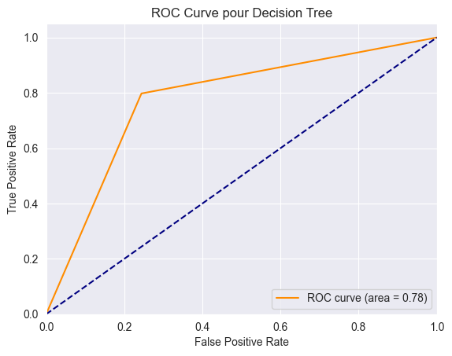
    


# 

# 

# 3- LogisticRegression

# Vous allez suivre pratiquement le même raisonnement. vous allez répondre aux même questions déjà posées


```python
X_res = data_res.drop("Y", axis=1)
y_res = data_res["Y"]
```


```python
from sklearn.model_selection import train_test_split
X_train, X_test, y_train, y_test_clf = train_test_split(X_res,y_res, test_size=0.2, random_state=0)
```


```python
# Chargement de LogisticRegression
from sklearn.linear_model import LogisticRegression
```

1-Créer un dictionnaire param_grid contenant les hyperparamètres :


```python
param_grid = {
    'C': [0.1, 1, 10],
    'penalty': ['l1', 'l2'],
    'solver': ['liblinear', 'saga']
}
```

2-Créer une instance de GridSearchCV pour trouver les meilleurs hyperparamètres :


```python
from sklearn.model_selection import GridSearchCV

clf = LogisticRegression(random_state=42)
grid_search = GridSearchCV(clf, param_grid=param_grid, cv=5)
```

3-Faire tourner la recherche sur grille et afficher les meilleurs hyperparamètres :


```python
grid_search.fit(X_train, y_train)
print("Meilleurs hyperparamètres : ", grid_search.best_params_)
```

    Meilleurs hyperparamètres :  {'C': 10, 'penalty': 'l2', 'solver': 'saga'}
    

4-Créer une instance de LogisticRegression avec les meilleurs hyperparamètres :


```python
best_clf = LogisticRegression(**grid_search.best_params_)
```

5-Entraîner votre modèle sur les données de formation :


```python
best_clf.fit(X_train, y_train)
```


<style>#sk-container-id-3 {color: black;background-color: white;}#sk-container-id-3 pre{padding: 0;}#sk-container-id-3 div.sk-toggleable {background-color: white;}#sk-container-id-3 label.sk-toggleable__label {cursor: pointer;display: block;width: 100%;margin-bottom: 0;padding: 0.3em;box-sizing: border-box;text-align: center;}#sk-container-id-3 label.sk-toggleable__label-arrow:before {content: "▸";float: left;margin-right: 0.25em;color: #696969;}#sk-container-id-3 label.sk-toggleable__label-arrow:hover:before {color: black;}#sk-container-id-3 div.sk-estimator:hover label.sk-toggleable__label-arrow:before {color: black;}#sk-container-id-3 div.sk-toggleable__content {max-height: 0;max-width: 0;overflow: hidden;text-align: left;background-color: #f0f8ff;}#sk-container-id-3 div.sk-toggleable__content pre {margin: 0.2em;color: black;border-radius: 0.25em;background-color: #f0f8ff;}#sk-container-id-3 input.sk-toggleable__control:checked~div.sk-toggleable__content {max-height: 200px;max-width: 100%;overflow: auto;}#sk-container-id-3 input.sk-toggleable__control:checked~label.sk-toggleable__label-arrow:before {content: "▾";}#sk-container-id-3 div.sk-estimator input.sk-toggleable__control:checked~label.sk-toggleable__label {background-color: #d4ebff;}#sk-container-id-3 div.sk-label input.sk-toggleable__control:checked~label.sk-toggleable__label {background-color: #d4ebff;}#sk-container-id-3 input.sk-hidden--visually {border: 0;clip: rect(1px 1px 1px 1px);clip: rect(1px, 1px, 1px, 1px);height: 1px;margin: -1px;overflow: hidden;padding: 0;position: absolute;width: 1px;}#sk-container-id-3 div.sk-estimator {font-family: monospace;background-color: #f0f8ff;border: 1px dotted black;border-radius: 0.25em;box-sizing: border-box;margin-bottom: 0.5em;}#sk-container-id-3 div.sk-estimator:hover {background-color: #d4ebff;}#sk-container-id-3 div.sk-parallel-item::after {content: "";width: 100%;border-bottom: 1px solid gray;flex-grow: 1;}#sk-container-id-3 div.sk-label:hover label.sk-toggleable__label {background-color: #d4ebff;}#sk-container-id-3 div.sk-serial::before {content: "";position: absolute;border-left: 1px solid gray;box-sizing: border-box;top: 0;bottom: 0;left: 50%;z-index: 0;}#sk-container-id-3 div.sk-serial {display: flex;flex-direction: column;align-items: center;background-color: white;padding-right: 0.2em;padding-left: 0.2em;position: relative;}#sk-container-id-3 div.sk-item {position: relative;z-index: 1;}#sk-container-id-3 div.sk-parallel {display: flex;align-items: stretch;justify-content: center;background-color: white;position: relative;}#sk-container-id-3 div.sk-item::before, #sk-container-id-3 div.sk-parallel-item::before {content: "";position: absolute;border-left: 1px solid gray;box-sizing: border-box;top: 0;bottom: 0;left: 50%;z-index: -1;}#sk-container-id-3 div.sk-parallel-item {display: flex;flex-direction: column;z-index: 1;position: relative;background-color: white;}#sk-container-id-3 div.sk-parallel-item:first-child::after {align-self: flex-end;width: 50%;}#sk-container-id-3 div.sk-parallel-item:last-child::after {align-self: flex-start;width: 50%;}#sk-container-id-3 div.sk-parallel-item:only-child::after {width: 0;}#sk-container-id-3 div.sk-dashed-wrapped {border: 1px dashed gray;margin: 0 0.4em 0.5em 0.4em;box-sizing: border-box;padding-bottom: 0.4em;background-color: white;}#sk-container-id-3 div.sk-label label {font-family: monospace;font-weight: bold;display: inline-block;line-height: 1.2em;}#sk-container-id-3 div.sk-label-container {text-align: center;}#sk-container-id-3 div.sk-container {/* jupyter's `normalize.less` sets `[hidden] { display: none; }` but bootstrap.min.css set `[hidden] { display: none !important; }` so we also need the `!important` here to be able to override the default hidden behavior on the sphinx rendered scikit-learn.org. See: https://github.com/scikit-learn/scikit-learn/issues/21755 */display: inline-block !important;position: relative;}#sk-container-id-3 div.sk-text-repr-fallback {display: none;}</style><div id="sk-container-id-3" class="sk-top-container"><div class="sk-text-repr-fallback"><pre>LogisticRegression(C=10, solver=&#x27;saga&#x27;)</pre><b>In a Jupyter environment, please rerun this cell to show the HTML representation or trust the notebook. <br />On GitHub, the HTML representation is unable to render, please try loading this page with nbviewer.org.</b></div><div class="sk-container" hidden><div class="sk-item"><div class="sk-estimator sk-toggleable"><input class="sk-toggleable__control sk-hidden--visually" id="sk-estimator-id-5" type="checkbox" checked><label for="sk-estimator-id-5" class="sk-toggleable__label sk-toggleable__label-arrow">LogisticRegression</label><div class="sk-toggleable__content"><pre>LogisticRegression(C=10, solver=&#x27;saga&#x27;)</pre></div></div></div></div></div>


#### Tracer la matrice de confusion de LogisticRegression


```python
from sklearn.metrics import confusion_matrix
import seaborn as sns

y_pred_clf = best_clf.predict(X_test)
cm = confusion_matrix(y_test_clf, y_pred_clf)

sns.heatmap(cm, annot=True, cmap='Greens', fmt='g', cbar=False)
plt.xlabel('Predicted labels')
plt.ylabel('True labels')
plt.show()

```


    
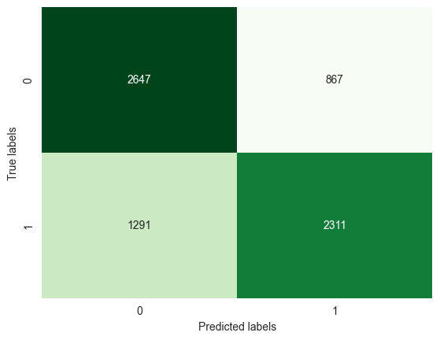
    


### Afficher le __`classification_report`__ de LogisticRegression


```python
from sklearn.metrics import classification_report
print(classification_report(y_test_clf, y_pred_clf))
```

                  precision    recall  f1-score   support
    
             0.0       0.67      0.75      0.71      3514
             1.0       0.73      0.64      0.68      3602
    
        accuracy                           0.70      7116
       macro avg       0.70      0.70      0.70      7116
    weighted avg       0.70      0.70      0.70      7116
    
    


```python
plot_roc_curve(y_test_clf,y_pred_clf,title='ROC Curve pour LogisticRegression')
```


    
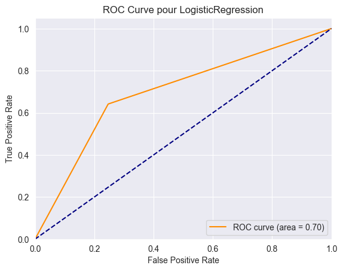
    


# 

# 

# 4- GaussianNB (Gaussian Naive Bayes)

# Vous allez suivre pratiquement le même raisonnement. vous allez répondre aux même questions déjà posées


```python
X_res = data_res.drop("Y", axis=1)
y_res = data_res["Y"]
```


```python
from sklearn.model_selection import train_test_split
X_train, X_test, y_train, y_test_gnb = train_test_split(X_res,y_res, test_size=0.2, random_state=0)
```


```python
# Chargement de GaussianNB
from sklearn.naive_bayes import GaussianNB
```

il n'y a pas d'hyperparamètres pour Gaussian Naive Bayes.

#### Créer une instance __`model`__ de l'algorithme de classification par GaussianNB.
#### Entrainer __`model`__ sur le sous-ensemble de données approprié.


```python
gnb = GaussianNB()
```


```python
gnb.fit(X_train, y_train)
```


<style>#sk-container-id-4 {color: black;background-color: white;}#sk-container-id-4 pre{padding: 0;}#sk-container-id-4 div.sk-toggleable {background-color: white;}#sk-container-id-4 label.sk-toggleable__label {cursor: pointer;display: block;width: 100%;margin-bottom: 0;padding: 0.3em;box-sizing: border-box;text-align: center;}#sk-container-id-4 label.sk-toggleable__label-arrow:before {content: "▸";float: left;margin-right: 0.25em;color: #696969;}#sk-container-id-4 label.sk-toggleable__label-arrow:hover:before {color: black;}#sk-container-id-4 div.sk-estimator:hover label.sk-toggleable__label-arrow:before {color: black;}#sk-container-id-4 div.sk-toggleable__content {max-height: 0;max-width: 0;overflow: hidden;text-align: left;background-color: #f0f8ff;}#sk-container-id-4 div.sk-toggleable__content pre {margin: 0.2em;color: black;border-radius: 0.25em;background-color: #f0f8ff;}#sk-container-id-4 input.sk-toggleable__control:checked~div.sk-toggleable__content {max-height: 200px;max-width: 100%;overflow: auto;}#sk-container-id-4 input.sk-toggleable__control:checked~label.sk-toggleable__label-arrow:before {content: "▾";}#sk-container-id-4 div.sk-estimator input.sk-toggleable__control:checked~label.sk-toggleable__label {background-color: #d4ebff;}#sk-container-id-4 div.sk-label input.sk-toggleable__control:checked~label.sk-toggleable__label {background-color: #d4ebff;}#sk-container-id-4 input.sk-hidden--visually {border: 0;clip: rect(1px 1px 1px 1px);clip: rect(1px, 1px, 1px, 1px);height: 1px;margin: -1px;overflow: hidden;padding: 0;position: absolute;width: 1px;}#sk-container-id-4 div.sk-estimator {font-family: monospace;background-color: #f0f8ff;border: 1px dotted black;border-radius: 0.25em;box-sizing: border-box;margin-bottom: 0.5em;}#sk-container-id-4 div.sk-estimator:hover {background-color: #d4ebff;}#sk-container-id-4 div.sk-parallel-item::after {content: "";width: 100%;border-bottom: 1px solid gray;flex-grow: 1;}#sk-container-id-4 div.sk-label:hover label.sk-toggleable__label {background-color: #d4ebff;}#sk-container-id-4 div.sk-serial::before {content: "";position: absolute;border-left: 1px solid gray;box-sizing: border-box;top: 0;bottom: 0;left: 50%;z-index: 0;}#sk-container-id-4 div.sk-serial {display: flex;flex-direction: column;align-items: center;background-color: white;padding-right: 0.2em;padding-left: 0.2em;position: relative;}#sk-container-id-4 div.sk-item {position: relative;z-index: 1;}#sk-container-id-4 div.sk-parallel {display: flex;align-items: stretch;justify-content: center;background-color: white;position: relative;}#sk-container-id-4 div.sk-item::before, #sk-container-id-4 div.sk-parallel-item::before {content: "";position: absolute;border-left: 1px solid gray;box-sizing: border-box;top: 0;bottom: 0;left: 50%;z-index: -1;}#sk-container-id-4 div.sk-parallel-item {display: flex;flex-direction: column;z-index: 1;position: relative;background-color: white;}#sk-container-id-4 div.sk-parallel-item:first-child::after {align-self: flex-end;width: 50%;}#sk-container-id-4 div.sk-parallel-item:last-child::after {align-self: flex-start;width: 50%;}#sk-container-id-4 div.sk-parallel-item:only-child::after {width: 0;}#sk-container-id-4 div.sk-dashed-wrapped {border: 1px dashed gray;margin: 0 0.4em 0.5em 0.4em;box-sizing: border-box;padding-bottom: 0.4em;background-color: white;}#sk-container-id-4 div.sk-label label {font-family: monospace;font-weight: bold;display: inline-block;line-height: 1.2em;}#sk-container-id-4 div.sk-label-container {text-align: center;}#sk-container-id-4 div.sk-container {/* jupyter's `normalize.less` sets `[hidden] { display: none; }` but bootstrap.min.css set `[hidden] { display: none !important; }` so we also need the `!important` here to be able to override the default hidden behavior on the sphinx rendered scikit-learn.org. See: https://github.com/scikit-learn/scikit-learn/issues/21755 */display: inline-block !important;position: relative;}#sk-container-id-4 div.sk-text-repr-fallback {display: none;}</style><div id="sk-container-id-4" class="sk-top-container"><div class="sk-text-repr-fallback"><pre>GaussianNB()</pre><b>In a Jupyter environment, please rerun this cell to show the HTML representation or trust the notebook. <br />On GitHub, the HTML representation is unable to render, please try loading this page with nbviewer.org.</b></div><div class="sk-container" hidden><div class="sk-item"><div class="sk-estimator sk-toggleable"><input class="sk-toggleable__control sk-hidden--visually" id="sk-estimator-id-6" type="checkbox" checked><label for="sk-estimator-id-6" class="sk-toggleable__label sk-toggleable__label-arrow">GaussianNB</label><div class="sk-toggleable__content"><pre>GaussianNB()</pre></div></div></div></div></div>


```python
y_pred_gnb = gnb.predict(X_test)
```

#### Tracer la matrice de confusion de __`model`__


```python
from sklearn.metrics import confusion_matrix
import seaborn as sns

cm = confusion_matrix(y_test_gnb, y_pred_gnb)

sns.heatmap(cm, annot=True, cmap='Reds', fmt='g', cbar=False)
plt.xlabel('Predicted labels')
plt.ylabel('True labels')
plt.show()
```


    
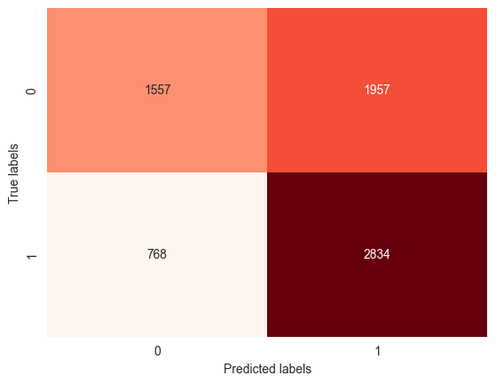
    


### Afficher le __`classification_report`__ de __`model`__


```python
from sklearn.metrics import classification_report
print(classification_report(y_test_gnb, y_pred_gnb))
```

                  precision    recall  f1-score   support
    
             0.0       0.67      0.44      0.53      3514
             1.0       0.59      0.79      0.68      3602
    
        accuracy                           0.62      7116
       macro avg       0.63      0.61      0.60      7116
    weighted avg       0.63      0.62      0.61      7116
    
    


```python
from sklearn.metrics import accuracy_score
accuracy = accuracy_score(y_test_gnb, y_pred_gnb)
print("Accuracy:", accuracy)
```

    Accuracy: 0.6170601461495222
    


```python
plot_roc_curve(y_test_gnb,y_pred_gnb,title='ROC Curve pour GaussianNB')
```


    
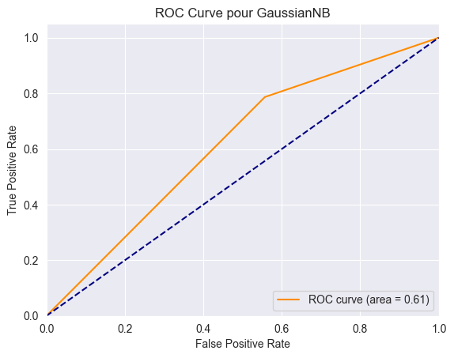
    


# 

# 

# 5- SVM (Support Vector Machine)

1-Importez le module SVM depuis sklearn.svm :


```python

from sklearn.svm import SVC
from sklearn.metrics import classification_report, confusion_matrix
from sklearn.model_selection import train_test_split, cross_val_score
```

# Vous allez suivre pratiquement le même raisonnement. vous allez répondre aux même questions déjà posées


```python
X_res = data_res.drop("Y", axis=1)
y_res = data_res["Y"]
```


```python
from sklearn.model_selection import train_test_split
X_train, X_test, y_train, y_test_svm = train_test_split(X_res,y_res, test_size=0.2, random_state=0)
```

2-Créer un dictionnaire param_grid contenant les hyperparamètres :


```python
param_grid = {
    'C': [0.1, 1, 10],
    'kernel': ['linear', 'rbf', 'sigmoid'],
    'gamma': ['scale', 'auto']
}
```

3-Créer une instance de GridSearchCV pour trouver les meilleurs hyperparamètres :


```python
from sklearn.model_selection import GridSearchCV

clf = SVC(random_state=42)
grid_search = GridSearchCV(clf, param_grid=param_grid, cv=5)
```

4-Faire tourner la recherche sur grille et afficher les meilleurs hyperparamètres :


```python
grid_search.fit(X_train, y_train)
print("Meilleurs hyperparamètres : ", grid_search.best_params_)
```

    Meilleurs hyperparamètres :  {'C': 10, 'gamma': 'scale', 'kernel': 'rbf'}
    

5-Créer une instance de SVC avec les meilleurs hyperparamètres :


```python
best_clf = SVC(C=grid_search.best_params_['C'],
               kernel=grid_search.best_params_['kernel'],
               gamma=grid_search.best_params_['gamma'],
               random_state=42)
```

6-Entraînez le modèle SVM sur les données de formation :


```python
best_clf.fit(X_train, y_train)

```


<style>#sk-container-id-5 {color: black;background-color: white;}#sk-container-id-5 pre{padding: 0;}#sk-container-id-5 div.sk-toggleable {background-color: white;}#sk-container-id-5 label.sk-toggleable__label {cursor: pointer;display: block;width: 100%;margin-bottom: 0;padding: 0.3em;box-sizing: border-box;text-align: center;}#sk-container-id-5 label.sk-toggleable__label-arrow:before {content: "▸";float: left;margin-right: 0.25em;color: #696969;}#sk-container-id-5 label.sk-toggleable__label-arrow:hover:before {color: black;}#sk-container-id-5 div.sk-estimator:hover label.sk-toggleable__label-arrow:before {color: black;}#sk-container-id-5 div.sk-toggleable__content {max-height: 0;max-width: 0;overflow: hidden;text-align: left;background-color: #f0f8ff;}#sk-container-id-5 div.sk-toggleable__content pre {margin: 0.2em;color: black;border-radius: 0.25em;background-color: #f0f8ff;}#sk-container-id-5 input.sk-toggleable__control:checked~div.sk-toggleable__content {max-height: 200px;max-width: 100%;overflow: auto;}#sk-container-id-5 input.sk-toggleable__control:checked~label.sk-toggleable__label-arrow:before {content: "▾";}#sk-container-id-5 div.sk-estimator input.sk-toggleable__control:checked~label.sk-toggleable__label {background-color: #d4ebff;}#sk-container-id-5 div.sk-label input.sk-toggleable__control:checked~label.sk-toggleable__label {background-color: #d4ebff;}#sk-container-id-5 input.sk-hidden--visually {border: 0;clip: rect(1px 1px 1px 1px);clip: rect(1px, 1px, 1px, 1px);height: 1px;margin: -1px;overflow: hidden;padding: 0;position: absolute;width: 1px;}#sk-container-id-5 div.sk-estimator {font-family: monospace;background-color: #f0f8ff;border: 1px dotted black;border-radius: 0.25em;box-sizing: border-box;margin-bottom: 0.5em;}#sk-container-id-5 div.sk-estimator:hover {background-color: #d4ebff;}#sk-container-id-5 div.sk-parallel-item::after {content: "";width: 100%;border-bottom: 1px solid gray;flex-grow: 1;}#sk-container-id-5 div.sk-label:hover label.sk-toggleable__label {background-color: #d4ebff;}#sk-container-id-5 div.sk-serial::before {content: "";position: absolute;border-left: 1px solid gray;box-sizing: border-box;top: 0;bottom: 0;left: 50%;z-index: 0;}#sk-container-id-5 div.sk-serial {display: flex;flex-direction: column;align-items: center;background-color: white;padding-right: 0.2em;padding-left: 0.2em;position: relative;}#sk-container-id-5 div.sk-item {position: relative;z-index: 1;}#sk-container-id-5 div.sk-parallel {display: flex;align-items: stretch;justify-content: center;background-color: white;position: relative;}#sk-container-id-5 div.sk-item::before, #sk-container-id-5 div.sk-parallel-item::before {content: "";position: absolute;border-left: 1px solid gray;box-sizing: border-box;top: 0;bottom: 0;left: 50%;z-index: -1;}#sk-container-id-5 div.sk-parallel-item {display: flex;flex-direction: column;z-index: 1;position: relative;background-color: white;}#sk-container-id-5 div.sk-parallel-item:first-child::after {align-self: flex-end;width: 50%;}#sk-container-id-5 div.sk-parallel-item:last-child::after {align-self: flex-start;width: 50%;}#sk-container-id-5 div.sk-parallel-item:only-child::after {width: 0;}#sk-container-id-5 div.sk-dashed-wrapped {border: 1px dashed gray;margin: 0 0.4em 0.5em 0.4em;box-sizing: border-box;padding-bottom: 0.4em;background-color: white;}#sk-container-id-5 div.sk-label label {font-family: monospace;font-weight: bold;display: inline-block;line-height: 1.2em;}#sk-container-id-5 div.sk-label-container {text-align: center;}#sk-container-id-5 div.sk-container {/* jupyter's `normalize.less` sets `[hidden] { display: none; }` but bootstrap.min.css set `[hidden] { display: none !important; }` so we also need the `!important` here to be able to override the default hidden behavior on the sphinx rendered scikit-learn.org. See: https://github.com/scikit-learn/scikit-learn/issues/21755 */display: inline-block !important;position: relative;}#sk-container-id-5 div.sk-text-repr-fallback {display: none;}</style><div id="sk-container-id-5" class="sk-top-container"><div class="sk-text-repr-fallback"><pre>SVC(C=10, random_state=42)</pre><b>In a Jupyter environment, please rerun this cell to show the HTML representation or trust the notebook. <br />On GitHub, the HTML representation is unable to render, please try loading this page with nbviewer.org.</b></div><div class="sk-container" hidden><div class="sk-item"><div class="sk-estimator sk-toggleable"><input class="sk-toggleable__control sk-hidden--visually" id="sk-estimator-id-7" type="checkbox" checked><label for="sk-estimator-id-7" class="sk-toggleable__label sk-toggleable__label-arrow">SVC</label><div class="sk-toggleable__content"><pre>SVC(C=10, random_state=42)</pre></div></div></div></div></div>


7-Tracez la matrice de confusion avec confusion_matrix de sklearn.metrics :


```python
from sklearn.metrics import confusion_matrix
import seaborn as sns

y_pred_svm = best_clf.predict(X_test)
cm = confusion_matrix(y_test_svm, y_pred)

sns.heatmap(cm, annot=True, cmap='gray', fmt='g', cbar=False)
plt.xlabel('Predicted labels')
plt.ylabel('True labels')
plt.show()
```


    
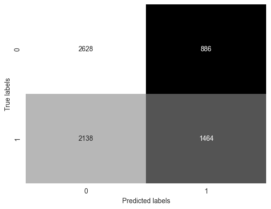
    


8-Afficher le rapport de classification avec classification_report de sklearn.metrics :


```python
from sklearn.metrics import classification_report
print(classification_report(y_test_svm, y_pred_svm))

```

                  precision    recall  f1-score   support
    
             0.0       0.76      0.80      0.78      3514
             1.0       0.79      0.75      0.77      3602
    
        accuracy                           0.78      7116
       macro avg       0.78      0.78      0.78      7116
    weighted avg       0.78      0.78      0.78      7116
    
    


```python
plot_roc_curve(y_test_svm,y_pred_svm,title='ROC Curve pour SVM')
```


    
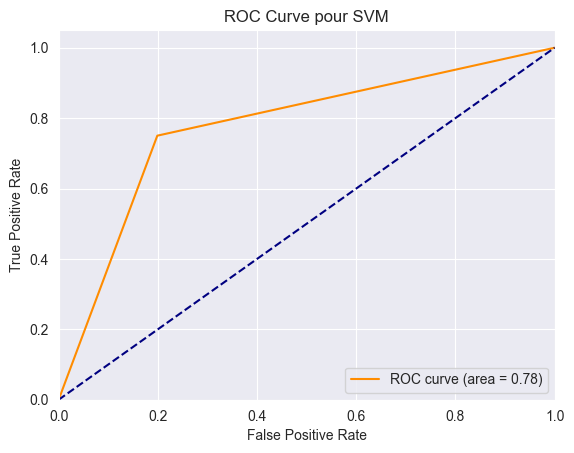
    


# 

# 

# 6- Random Forest

Dans cette partie on a utilisé le modele RandomForest Classifier avec BayesSearchCV pour trouver les meilleurs hyperparamètres: 

1-Importez le module RandomForestClassifier depuis sklearn.ensemble :


```python
from sklearn.ensemble import RandomForestClassifier
```

# Vous allez suivre pratiquement le même raisonnement. vous allez répondre aux même questions déjà posées


```python
#On va utiliser la Data de base avant La feature selection 
X_res = data_res.drop("Y", axis=1)
y_res = data_res["Y"]
```


```python
from sklearn.model_selection import train_test_split
X_train, X_test, y_train, y_test_rf = train_test_split(X_res,y_res, test_size=0.2, random_state=0)
```

2- Créer un dictionnaire param_grid contenant les hyperparamètres:


```python
#Installez cette bibliotheque afin que vous pourriez utilisé BayesSearchCV
#!pip install scikit-optimize
```


```python
from skopt import BayesSearchCV
from skopt.space import Real, Integer
from sklearn.model_selection import StratifiedKFold

param_grid = {'max_depth': Integer(1, 20),
              'n_estimators': Integer(10, 100),
              'min_samples_split': Integer(2, 20),
              'min_samples_leaf': Integer(1, 20)}
```

3- Créer une instance de BayesSearchCV pour trouver les meilleurs hyperparamètres :


```python
cv = StratifiedKFold(n_splits=5, shuffle=True, random_state=42)
rf = RandomForestClassifier()
bayes_search = BayesSearchCV(rf, param_grid, cv=cv, n_iter=50, n_jobs=-1)

```

4-Faire tourner la recherche sur grille et afficher les meilleurs hyperparamètres :


```python
bayes_search.fit(X_train, y_train)
print("Best parameters: ", bayes_search.best_params_)
```

    Best parameters:  OrderedDict([('max_depth', 20), ('min_samples_leaf', 1), ('min_samples_split', 2), ('n_estimators', 100)])
    

5-Créer une instance de RandomForestClassifier avec les meilleurs hyperparamètres :


```python
final_model_rf = RandomForestClassifier(**bayes_search.best_params_)
final_model_rf.fit(X_train, y_train)

```


<style>#sk-container-id-6 {color: black;background-color: white;}#sk-container-id-6 pre{padding: 0;}#sk-container-id-6 div.sk-toggleable {background-color: white;}#sk-container-id-6 label.sk-toggleable__label {cursor: pointer;display: block;width: 100%;margin-bottom: 0;padding: 0.3em;box-sizing: border-box;text-align: center;}#sk-container-id-6 label.sk-toggleable__label-arrow:before {content: "▸";float: left;margin-right: 0.25em;color: #696969;}#sk-container-id-6 label.sk-toggleable__label-arrow:hover:before {color: black;}#sk-container-id-6 div.sk-estimator:hover label.sk-toggleable__label-arrow:before {color: black;}#sk-container-id-6 div.sk-toggleable__content {max-height: 0;max-width: 0;overflow: hidden;text-align: left;background-color: #f0f8ff;}#sk-container-id-6 div.sk-toggleable__content pre {margin: 0.2em;color: black;border-radius: 0.25em;background-color: #f0f8ff;}#sk-container-id-6 input.sk-toggleable__control:checked~div.sk-toggleable__content {max-height: 200px;max-width: 100%;overflow: auto;}#sk-container-id-6 input.sk-toggleable__control:checked~label.sk-toggleable__label-arrow:before {content: "▾";}#sk-container-id-6 div.sk-estimator input.sk-toggleable__control:checked~label.sk-toggleable__label {background-color: #d4ebff;}#sk-container-id-6 div.sk-label input.sk-toggleable__control:checked~label.sk-toggleable__label {background-color: #d4ebff;}#sk-container-id-6 input.sk-hidden--visually {border: 0;clip: rect(1px 1px 1px 1px);clip: rect(1px, 1px, 1px, 1px);height: 1px;margin: -1px;overflow: hidden;padding: 0;position: absolute;width: 1px;}#sk-container-id-6 div.sk-estimator {font-family: monospace;background-color: #f0f8ff;border: 1px dotted black;border-radius: 0.25em;box-sizing: border-box;margin-bottom: 0.5em;}#sk-container-id-6 div.sk-estimator:hover {background-color: #d4ebff;}#sk-container-id-6 div.sk-parallel-item::after {content: "";width: 100%;border-bottom: 1px solid gray;flex-grow: 1;}#sk-container-id-6 div.sk-label:hover label.sk-toggleable__label {background-color: #d4ebff;}#sk-container-id-6 div.sk-serial::before {content: "";position: absolute;border-left: 1px solid gray;box-sizing: border-box;top: 0;bottom: 0;left: 50%;z-index: 0;}#sk-container-id-6 div.sk-serial {display: flex;flex-direction: column;align-items: center;background-color: white;padding-right: 0.2em;padding-left: 0.2em;position: relative;}#sk-container-id-6 div.sk-item {position: relative;z-index: 1;}#sk-container-id-6 div.sk-parallel {display: flex;align-items: stretch;justify-content: center;background-color: white;position: relative;}#sk-container-id-6 div.sk-item::before, #sk-container-id-6 div.sk-parallel-item::before {content: "";position: absolute;border-left: 1px solid gray;box-sizing: border-box;top: 0;bottom: 0;left: 50%;z-index: -1;}#sk-container-id-6 div.sk-parallel-item {display: flex;flex-direction: column;z-index: 1;position: relative;background-color: white;}#sk-container-id-6 div.sk-parallel-item:first-child::after {align-self: flex-end;width: 50%;}#sk-container-id-6 div.sk-parallel-item:last-child::after {align-self: flex-start;width: 50%;}#sk-container-id-6 div.sk-parallel-item:only-child::after {width: 0;}#sk-container-id-6 div.sk-dashed-wrapped {border: 1px dashed gray;margin: 0 0.4em 0.5em 0.4em;box-sizing: border-box;padding-bottom: 0.4em;background-color: white;}#sk-container-id-6 div.sk-label label {font-family: monospace;font-weight: bold;display: inline-block;line-height: 1.2em;}#sk-container-id-6 div.sk-label-container {text-align: center;}#sk-container-id-6 div.sk-container {/* jupyter's `normalize.less` sets `[hidden] { display: none; }` but bootstrap.min.css set `[hidden] { display: none !important; }` so we also need the `!important` here to be able to override the default hidden behavior on the sphinx rendered scikit-learn.org. See: https://github.com/scikit-learn/scikit-learn/issues/21755 */display: inline-block !important;position: relative;}#sk-container-id-6 div.sk-text-repr-fallback {display: none;}</style><div id="sk-container-id-6" class="sk-top-container"><div class="sk-text-repr-fallback"><pre>RandomForestClassifier(max_depth=20)</pre><b>In a Jupyter environment, please rerun this cell to show the HTML representation or trust the notebook. <br />On GitHub, the HTML representation is unable to render, please try loading this page with nbviewer.org.</b></div><div class="sk-container" hidden><div class="sk-item"><div class="sk-estimator sk-toggleable"><input class="sk-toggleable__control sk-hidden--visually" id="sk-estimator-id-8" type="checkbox" checked><label for="sk-estimator-id-8" class="sk-toggleable__label sk-toggleable__label-arrow">RandomForestClassifier</label><div class="sk-toggleable__content"><pre>RandomForestClassifier(max_depth=20)</pre></div></div></div></div></div>


6-Afficher l'importance des variables avec feature_importances_ :


```python
importances = final_model_rf.feature_importances_
indices = np.argsort(importances)[::-1]

for f in range(X_train.shape[1]):
    print("%d. feature %d (%f)" % (f + 1, indices[f], importances[indices[f]]))

```

    1. feature 11 (0.087074)
    2. feature 9 (0.081235)
    3. feature 24 (0.061765)
    4. feature 23 (0.060270)
    5. feature 17 (0.056498)
    6. feature 18 (0.055355)
    7. feature 25 (0.053770)
    8. feature 22 (0.050846)
    9. feature 19 (0.050199)
    10. feature 21 (0.048682)
    11. feature 28 (0.047646)
    12. feature 26 (0.047582)
    13. feature 27 (0.047364)
    14. feature 20 (0.047098)
    15. feature 10 (0.046765)
    16. feature 12 (0.031625)
    17. feature 13 (0.020600)
    18. feature 14 (0.015664)
    19. feature 16 (0.013198)
    20. feature 15 (0.011663)
    21. feature 1 (0.011109)
    22. feature 0 (0.010269)
    23. feature 2 (0.009709)
    24. feature 5 (0.008400)
    25. feature 4 (0.008124)
    26. feature 6 (0.007707)
    27. feature 7 (0.007570)
    28. feature 8 (0.001910)
    29. feature 3 (0.000304)
    

7-Tracer la matrice de confusion avec confusion_matrix de sklearn.metrics :


```python
from sklearn.metrics import confusion_matrix
import seaborn as sns

y_pred_rf = final_model_rf.predict(X_test)
cm = confusion_matrix(y_test_rf, y_pred_rf)

sns.heatmap(cm, annot=True, cmap='BuPu', fmt='g', cbar=False)
plt.xlabel('Predicted labels')
plt.ylabel('True labels')
plt.show()

```


    
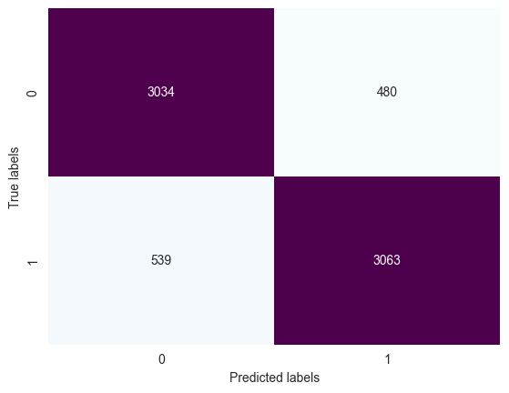
    


8-Afficher le rapport de classification avec classification_report de sklearn.metrics


```python
from sklearn.metrics import classification_report

y_pred = final_model_rf.predict(X_test)
print(classification_report(y_test_rf, y_pred_rf))
```

                  precision    recall  f1-score   support
    
             0.0       0.85      0.86      0.86      3514
             1.0       0.86      0.85      0.86      3602
    
        accuracy                           0.86      7116
       macro avg       0.86      0.86      0.86      7116
    weighted avg       0.86      0.86      0.86      7116
    
    

9-Calculer l'accuracy du modèle Random Forest avec la fonction accuracy_score de sklearn.metrics :


```python
from sklearn.metrics import accuracy_score

y_pred = final_model_rf.predict(X_test)
accuracy = accuracy_score(y_test_rf, y_pred_rf)
print("Accuracy:", accuracy)
```

    Accuracy: 0.8568015739179314
    


```python
plot_roc_curve(y_test_rf,y_pred_rf,title='ROC Curve pour Random Forest')
```


    
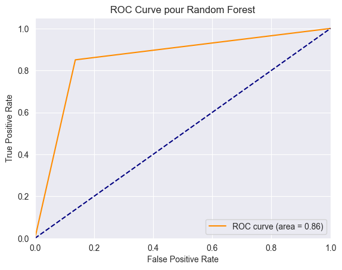
    


# 

# 

# 7- XGBoost

Dans cette partie on a utilisé le modele XGBoost Classifier avec RandomizedSearchCV pour trouver les meilleurs hyperparamètres: 

1-Importer le module XGBClassifier depuis xgboost :


```python
from xgboost import XGBClassifier
```

# Vous allez suivre pratiquement le même raisonnement. vous allez répondre aux même questions déjà posées


```python
#On va utiliser la Data de base avant La feature selection 
X_res = data_res.drop("Y", axis=1)
y_res = data_res["Y"]
```


```python
from sklearn.model_selection import train_test_split
X_train, X_test, y_train, y_test_xgboost = train_test_split(X_res,y_res, test_size=0.2, random_state=0)
```

2-Créer un dictionnaire param_grid contenant les hyperparamètres:


```python
param_grid = {'max_depth': range(3,10,2),
              'min_child_weight': range(1,6,2),
              'gamma': [i/10.0 for i in range(0,5)],
              'subsample': [i/10.0 for i in range(6,10)],
              'colsample_bytree': [i/10.0 for i in range(6,10)],
              'reg_alpha': [1e-5, 1e-2, 0.1, 1, 100]}

```

3-Utiliser RandomizedSearchCV pour trouver les meilleurs hyperparamètres :


```python
from sklearn.model_selection import RandomizedSearchCV

clf = XGBClassifier()
random_search = RandomizedSearchCV(clf, param_distributions=param_grid, n_iter=100, cv=5, random_state=42, n_jobs=-1)

```

4-Faire tourner la recherche aléatoire et afficher les meilleurs hyperparamètres :


```python
random_search.fit(X_train, y_train)
print(random_search.best_params_)

```

    {'subsample': 0.9, 'reg_alpha': 0.01, 'min_child_weight': 1, 'max_depth': 9, 'gamma': 0.1, 'colsample_bytree': 0.7}
    

5-Créer une instance de XGBClassifier avec les meilleurs hyperparamètres :


```python
final_model_xgb = XGBClassifier(**random_search.best_params_)
final_model_xgb.fit(X_train, y_train)

```


<style>#sk-container-id-1 {color: black;background-color: white;}#sk-container-id-1 pre{padding: 0;}#sk-container-id-1 div.sk-toggleable {background-color: white;}#sk-container-id-1 label.sk-toggleable__label {cursor: pointer;display: block;width: 100%;margin-bottom: 0;padding: 0.3em;box-sizing: border-box;text-align: center;}#sk-container-id-1 label.sk-toggleable__label-arrow:before {content: "▸";float: left;margin-right: 0.25em;color: #696969;}#sk-container-id-1 label.sk-toggleable__label-arrow:hover:before {color: black;}#sk-container-id-1 div.sk-estimator:hover label.sk-toggleable__label-arrow:before {color: black;}#sk-container-id-1 div.sk-toggleable__content {max-height: 0;max-width: 0;overflow: hidden;text-align: left;background-color: #f0f8ff;}#sk-container-id-1 div.sk-toggleable__content pre {margin: 0.2em;color: black;border-radius: 0.25em;background-color: #f0f8ff;}#sk-container-id-1 input.sk-toggleable__control:checked~div.sk-toggleable__content {max-height: 200px;max-width: 100%;overflow: auto;}#sk-container-id-1 input.sk-toggleable__control:checked~label.sk-toggleable__label-arrow:before {content: "▾";}#sk-container-id-1 div.sk-estimator input.sk-toggleable__control:checked~label.sk-toggleable__label {background-color: #d4ebff;}#sk-container-id-1 div.sk-label input.sk-toggleable__control:checked~label.sk-toggleable__label {background-color: #d4ebff;}#sk-container-id-1 input.sk-hidden--visually {border: 0;clip: rect(1px 1px 1px 1px);clip: rect(1px, 1px, 1px, 1px);height: 1px;margin: -1px;overflow: hidden;padding: 0;position: absolute;width: 1px;}#sk-container-id-1 div.sk-estimator {font-family: monospace;background-color: #f0f8ff;border: 1px dotted black;border-radius: 0.25em;box-sizing: border-box;margin-bottom: 0.5em;}#sk-container-id-1 div.sk-estimator:hover {background-color: #d4ebff;}#sk-container-id-1 div.sk-parallel-item::after {content: "";width: 100%;border-bottom: 1px solid gray;flex-grow: 1;}#sk-container-id-1 div.sk-label:hover label.sk-toggleable__label {background-color: #d4ebff;}#sk-container-id-1 div.sk-serial::before {content: "";position: absolute;border-left: 1px solid gray;box-sizing: border-box;top: 0;bottom: 0;left: 50%;z-index: 0;}#sk-container-id-1 div.sk-serial {display: flex;flex-direction: column;align-items: center;background-color: white;padding-right: 0.2em;padding-left: 0.2em;position: relative;}#sk-container-id-1 div.sk-item {position: relative;z-index: 1;}#sk-container-id-1 div.sk-parallel {display: flex;align-items: stretch;justify-content: center;background-color: white;position: relative;}#sk-container-id-1 div.sk-item::before, #sk-container-id-1 div.sk-parallel-item::before {content: "";position: absolute;border-left: 1px solid gray;box-sizing: border-box;top: 0;bottom: 0;left: 50%;z-index: -1;}#sk-container-id-1 div.sk-parallel-item {display: flex;flex-direction: column;z-index: 1;position: relative;background-color: white;}#sk-container-id-1 div.sk-parallel-item:first-child::after {align-self: flex-end;width: 50%;}#sk-container-id-1 div.sk-parallel-item:last-child::after {align-self: flex-start;width: 50%;}#sk-container-id-1 div.sk-parallel-item:only-child::after {width: 0;}#sk-container-id-1 div.sk-dashed-wrapped {border: 1px dashed gray;margin: 0 0.4em 0.5em 0.4em;box-sizing: border-box;padding-bottom: 0.4em;background-color: white;}#sk-container-id-1 div.sk-label label {font-family: monospace;font-weight: bold;display: inline-block;line-height: 1.2em;}#sk-container-id-1 div.sk-label-container {text-align: center;}#sk-container-id-1 div.sk-container {/* jupyter's `normalize.less` sets `[hidden] { display: none; }` but bootstrap.min.css set `[hidden] { display: none !important; }` so we also need the `!important` here to be able to override the default hidden behavior on the sphinx rendered scikit-learn.org. See: https://github.com/scikit-learn/scikit-learn/issues/21755 */display: inline-block !important;position: relative;}#sk-container-id-1 div.sk-text-repr-fallback {display: none;}</style><div id="sk-container-id-1" class="sk-top-container"><div class="sk-text-repr-fallback"><pre>XGBClassifier(base_score=0.5, booster=&#x27;gbtree&#x27;, callbacks=None,
              colsample_bylevel=1, colsample_bynode=1, colsample_bytree=0.7,
              early_stopping_rounds=None, enable_categorical=False,
              eval_metric=None, feature_types=None, gamma=0.1, gpu_id=-1,
              grow_policy=&#x27;depthwise&#x27;, importance_type=None,
              interaction_constraints=&#x27;&#x27;, learning_rate=0.300000012,
              max_bin=256, max_cat_threshold=64, max_cat_to_onehot=4,
              max_delta_step=0, max_depth=9, max_leaves=0, min_child_weight=1,
              missing=nan, monotone_constraints=&#x27;()&#x27;, n_estimators=100,
              n_jobs=0, num_parallel_tree=1, predictor=&#x27;auto&#x27;, random_state=0, ...)</pre><b>In a Jupyter environment, please rerun this cell to show the HTML representation or trust the notebook. <br />On GitHub, the HTML representation is unable to render, please try loading this page with nbviewer.org.</b></div><div class="sk-container" hidden><div class="sk-item"><div class="sk-estimator sk-toggleable"><input class="sk-toggleable__control sk-hidden--visually" id="sk-estimator-id-1" type="checkbox" checked><label for="sk-estimator-id-1" class="sk-toggleable__label sk-toggleable__label-arrow">XGBClassifier</label><div class="sk-toggleable__content"><pre>XGBClassifier(base_score=0.5, booster=&#x27;gbtree&#x27;, callbacks=None,
              colsample_bylevel=1, colsample_bynode=1, colsample_bytree=0.7,
              early_stopping_rounds=None, enable_categorical=False,
              eval_metric=None, feature_types=None, gamma=0.1, gpu_id=-1,
              grow_policy=&#x27;depthwise&#x27;, importance_type=None,
              interaction_constraints=&#x27;&#x27;, learning_rate=0.300000012,
              max_bin=256, max_cat_threshold=64, max_cat_to_onehot=4,
              max_delta_step=0, max_depth=9, max_leaves=0, min_child_weight=1,
              missing=nan, monotone_constraints=&#x27;()&#x27;, n_estimators=100,
              n_jobs=0, num_parallel_tree=1, predictor=&#x27;auto&#x27;, random_state=0, ...)</pre></div></div></div></div></div>


6-Afficher l'importance des variables avec plot_importance de xgboost :


```python
from xgboost import plot_importance

plot_importance(final_model_xgb)
plt.show()

```


    

    


7-Tracer la matrice de confusion avec confusion_matrix de sklearn.metrics :


```python
from sklearn.metrics import confusion_matrix
import seaborn as sns

y_pred_xgboost = final_model_xgb.predict(X_test)
cm = confusion_matrix(y_test_xgboost, y_pred_xgboost)

sns.heatmap(cm, annot=True, cmap='Blues', fmt='g', cbar=False)
plt.xlabel('Predicted labels')
plt.ylabel('True labels')
plt.show()

```


    
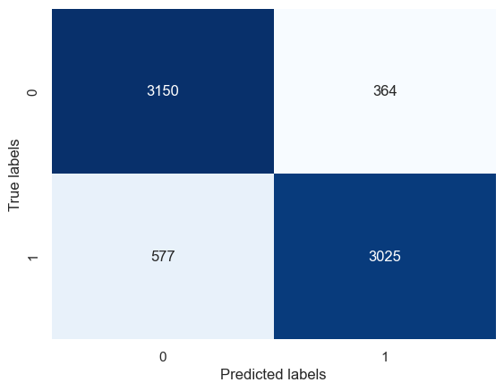
    


8-Afficher le rapport de classification avec classification_report de sklearn.metrics :


```python
from sklearn.metrics import classification_report

y_pred = final_model_xgb.predict(X_test)
print(classification_report(y_test_xgboost, y_pred_xgboost))

```

                  precision    recall  f1-score   support
    
             0.0       0.85      0.90      0.87      3514
             1.0       0.89      0.84      0.87      3602
    
        accuracy                           0.87      7116
       macro avg       0.87      0.87      0.87      7116
    weighted avg       0.87      0.87      0.87      7116
    
    


```python
final_model_xgb.save_model('model_weights.xgb')
```

9-Calculer l'accuracy du modèle XGBoost avec la fonction accuracy_score de sklearn.metrics :


```python
from sklearn.metrics import accuracy_score

y_pred = final_model_xgb.predict(X_test)
accuracy = accuracy_score(y_test_xgboost, y_pred_xgboost)
print("Accuracy:", accuracy)
```

    Accuracy: 0.8677627880831928
    


```python
plot_roc_curve(y_test_xgboost,y_pred_xgboost,title='ROC Curve pour XGboost')
```


    
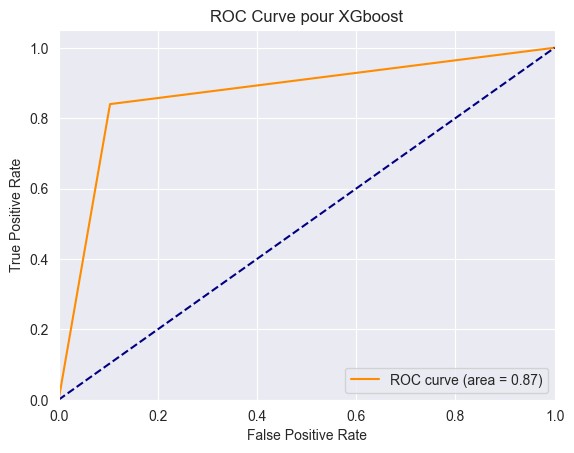
    


# 

# 

# 8- Neural Network


```python
X_res = data_res.drop("Y", axis=1)
y_res = data_res["Y"]
```


```python
from sklearn.model_selection import train_test_split
X_train, X_test, y_train, y_test_mlp = train_test_split(X_res,y_res, test_size=0.2, random_state=0)
```


```python
from sklearn.neural_network import MLPClassifier
```


```python
# Initialiser Multi-layer Perceptron 
from sklearn.neural_network import MLPClassifier
mlp = MLPClassifier(hidden_layer_sizes=(12,5),max_iter=20, random_state=25,shuffle=True, verbose=True)

#Entrainer le classifieur
mlp.fit(X_train, y_train)
```

    Iteration 1, loss = 0.65592884
    Iteration 2, loss = 0.59630709
    Iteration 3, loss = 0.57729957
    Iteration 4, loss = 0.56828872
    Iteration 5, loss = 0.56299255
    Iteration 6, loss = 0.55964953
    Iteration 7, loss = 0.55746055
    Iteration 8, loss = 0.55539677
    Iteration 9, loss = 0.55367072
    Iteration 10, loss = 0.55242281
    Iteration 11, loss = 0.55098820
    Iteration 12, loss = 0.55018091
    Iteration 13, loss = 0.54906903
    Iteration 14, loss = 0.54858957
    Iteration 15, loss = 0.54811834
    Iteration 16, loss = 0.54754995
    Iteration 17, loss = 0.54695120
    Iteration 18, loss = 0.54616424
    Iteration 19, loss = 0.54617463
    Iteration 20, loss = 0.54534163
    


<style>#sk-container-id-9 {color: black;background-color: white;}#sk-container-id-9 pre{padding: 0;}#sk-container-id-9 div.sk-toggleable {background-color: white;}#sk-container-id-9 label.sk-toggleable__label {cursor: pointer;display: block;width: 100%;margin-bottom: 0;padding: 0.3em;box-sizing: border-box;text-align: center;}#sk-container-id-9 label.sk-toggleable__label-arrow:before {content: "▸";float: left;margin-right: 0.25em;color: #696969;}#sk-container-id-9 label.sk-toggleable__label-arrow:hover:before {color: black;}#sk-container-id-9 div.sk-estimator:hover label.sk-toggleable__label-arrow:before {color: black;}#sk-container-id-9 div.sk-toggleable__content {max-height: 0;max-width: 0;overflow: hidden;text-align: left;background-color: #f0f8ff;}#sk-container-id-9 div.sk-toggleable__content pre {margin: 0.2em;color: black;border-radius: 0.25em;background-color: #f0f8ff;}#sk-container-id-9 input.sk-toggleable__control:checked~div.sk-toggleable__content {max-height: 200px;max-width: 100%;overflow: auto;}#sk-container-id-9 input.sk-toggleable__control:checked~label.sk-toggleable__label-arrow:before {content: "▾";}#sk-container-id-9 div.sk-estimator input.sk-toggleable__control:checked~label.sk-toggleable__label {background-color: #d4ebff;}#sk-container-id-9 div.sk-label input.sk-toggleable__control:checked~label.sk-toggleable__label {background-color: #d4ebff;}#sk-container-id-9 input.sk-hidden--visually {border: 0;clip: rect(1px 1px 1px 1px);clip: rect(1px, 1px, 1px, 1px);height: 1px;margin: -1px;overflow: hidden;padding: 0;position: absolute;width: 1px;}#sk-container-id-9 div.sk-estimator {font-family: monospace;background-color: #f0f8ff;border: 1px dotted black;border-radius: 0.25em;box-sizing: border-box;margin-bottom: 0.5em;}#sk-container-id-9 div.sk-estimator:hover {background-color: #d4ebff;}#sk-container-id-9 div.sk-parallel-item::after {content: "";width: 100%;border-bottom: 1px solid gray;flex-grow: 1;}#sk-container-id-9 div.sk-label:hover label.sk-toggleable__label {background-color: #d4ebff;}#sk-container-id-9 div.sk-serial::before {content: "";position: absolute;border-left: 1px solid gray;box-sizing: border-box;top: 0;bottom: 0;left: 50%;z-index: 0;}#sk-container-id-9 div.sk-serial {display: flex;flex-direction: column;align-items: center;background-color: white;padding-right: 0.2em;padding-left: 0.2em;position: relative;}#sk-container-id-9 div.sk-item {position: relative;z-index: 1;}#sk-container-id-9 div.sk-parallel {display: flex;align-items: stretch;justify-content: center;background-color: white;position: relative;}#sk-container-id-9 div.sk-item::before, #sk-container-id-9 div.sk-parallel-item::before {content: "";position: absolute;border-left: 1px solid gray;box-sizing: border-box;top: 0;bottom: 0;left: 50%;z-index: -1;}#sk-container-id-9 div.sk-parallel-item {display: flex;flex-direction: column;z-index: 1;position: relative;background-color: white;}#sk-container-id-9 div.sk-parallel-item:first-child::after {align-self: flex-end;width: 50%;}#sk-container-id-9 div.sk-parallel-item:last-child::after {align-self: flex-start;width: 50%;}#sk-container-id-9 div.sk-parallel-item:only-child::after {width: 0;}#sk-container-id-9 div.sk-dashed-wrapped {border: 1px dashed gray;margin: 0 0.4em 0.5em 0.4em;box-sizing: border-box;padding-bottom: 0.4em;background-color: white;}#sk-container-id-9 div.sk-label label {font-family: monospace;font-weight: bold;display: inline-block;line-height: 1.2em;}#sk-container-id-9 div.sk-label-container {text-align: center;}#sk-container-id-9 div.sk-container {/* jupyter's `normalize.less` sets `[hidden] { display: none; }` but bootstrap.min.css set `[hidden] { display: none !important; }` so we also need the `!important` here to be able to override the default hidden behavior on the sphinx rendered scikit-learn.org. See: https://github.com/scikit-learn/scikit-learn/issues/21755 */display: inline-block !important;position: relative;}#sk-container-id-9 div.sk-text-repr-fallback {display: none;}</style><div id="sk-container-id-9" class="sk-top-container"><div class="sk-text-repr-fallback"><pre>MLPClassifier(hidden_layer_sizes=(12, 5), max_iter=20, random_state=25,
              verbose=True)</pre><b>In a Jupyter environment, please rerun this cell to show the HTML representation or trust the notebook. <br />On GitHub, the HTML representation is unable to render, please try loading this page with nbviewer.org.</b></div><div class="sk-container" hidden><div class="sk-item"><div class="sk-estimator sk-toggleable"><input class="sk-toggleable__control sk-hidden--visually" id="sk-estimator-id-11" type="checkbox" checked><label for="sk-estimator-id-11" class="sk-toggleable__label sk-toggleable__label-arrow">MLPClassifier</label><div class="sk-toggleable__content"><pre>MLPClassifier(hidden_layer_sizes=(12, 5), max_iter=20, random_state=25,
              verbose=True)</pre></div></div></div></div></div>


```python
# Faire les prédictions
y_pred_mlp = mlp.predict(X_test)

# Cross_val score
from sklearn.model_selection import cross_val_score
mlp_cv=cross_val_score(mlp, X_train, y_train, cv=10).mean()
```

    Iteration 1, loss = 0.66116100
    Iteration 2, loss = 0.60282852
    Iteration 3, loss = 0.58003371
    Iteration 4, loss = 0.56990565
    Iteration 5, loss = 0.56397744
    Iteration 6, loss = 0.56021550
    Iteration 7, loss = 0.55725118
    Iteration 8, loss = 0.55498954
    Iteration 9, loss = 0.55330197
    Iteration 10, loss = 0.55180484
    Iteration 11, loss = 0.55060482
    Iteration 12, loss = 0.54992252
    Iteration 13, loss = 0.54839896
    Iteration 14, loss = 0.54759029
    Iteration 15, loss = 0.54689136
    Iteration 16, loss = 0.54604023
    Iteration 17, loss = 0.54565157
    Iteration 18, loss = 0.54513888
    Iteration 19, loss = 0.54440833
    Iteration 20, loss = 0.54423549
    Iteration 1, loss = 0.66038720
    Iteration 2, loss = 0.60185792
    Iteration 3, loss = 0.58072622
    Iteration 4, loss = 0.57125742
    Iteration 5, loss = 0.56562398
    Iteration 6, loss = 0.56207032
    Iteration 7, loss = 0.55933492
    Iteration 8, loss = 0.55735782
    Iteration 9, loss = 0.55565806
    Iteration 10, loss = 0.55426918
    Iteration 11, loss = 0.55292190
    Iteration 12, loss = 0.55272616
    Iteration 13, loss = 0.55127681
    Iteration 14, loss = 0.55037107
    Iteration 15, loss = 0.54940649
    Iteration 16, loss = 0.54880514
    Iteration 17, loss = 0.54844323
    Iteration 18, loss = 0.54782224
    Iteration 19, loss = 0.54730351
    Iteration 20, loss = 0.54675933
    Iteration 1, loss = 0.66061997
    Iteration 2, loss = 0.60156495
    Iteration 3, loss = 0.58033228
    Iteration 4, loss = 0.57085157
    Iteration 5, loss = 0.56501403
    Iteration 6, loss = 0.56154241
    Iteration 7, loss = 0.55872249
    Iteration 8, loss = 0.55675051
    Iteration 9, loss = 0.55495812
    Iteration 10, loss = 0.55347285
    Iteration 11, loss = 0.55219218
    Iteration 12, loss = 0.55179193
    Iteration 13, loss = 0.55059036
    Iteration 14, loss = 0.54971751
    Iteration 15, loss = 0.54873144
    Iteration 16, loss = 0.54835280
    Iteration 17, loss = 0.54774457
    Iteration 18, loss = 0.54745427
    Iteration 19, loss = 0.54685763
    Iteration 20, loss = 0.54628798
    Iteration 1, loss = 0.66224055
    Iteration 2, loss = 0.60448528
    Iteration 3, loss = 0.58265001
    Iteration 4, loss = 0.57245847
    Iteration 5, loss = 0.56655181
    Iteration 6, loss = 0.56276126
    Iteration 7, loss = 0.55994274
    Iteration 8, loss = 0.55803798
    Iteration 9, loss = 0.55593872
    Iteration 10, loss = 0.55443228
    Iteration 11, loss = 0.55294713
    Iteration 12, loss = 0.55264477
    Iteration 13, loss = 0.55134154
    Iteration 14, loss = 0.55027732
    Iteration 15, loss = 0.54938751
    Iteration 16, loss = 0.54863455
    Iteration 17, loss = 0.54800322
    Iteration 18, loss = 0.54724139
    Iteration 19, loss = 0.54701870
    Iteration 20, loss = 0.54636938
    Iteration 1, loss = 0.66193299
    Iteration 2, loss = 0.60318953
    Iteration 3, loss = 0.58151646
    Iteration 4, loss = 0.57195779
    Iteration 5, loss = 0.56635728
    Iteration 6, loss = 0.56284610
    Iteration 7, loss = 0.55976020
    Iteration 8, loss = 0.55778379
    Iteration 9, loss = 0.55584402
    Iteration 10, loss = 0.55476266
    Iteration 11, loss = 0.55347774
    Iteration 12, loss = 0.55324232
    Iteration 13, loss = 0.55185855
    Iteration 14, loss = 0.55103897
    Iteration 15, loss = 0.55008276
    Iteration 16, loss = 0.54963222
    Iteration 17, loss = 0.54915764
    Iteration 18, loss = 0.54847606
    Iteration 19, loss = 0.54837273
    Iteration 20, loss = 0.54760326
    Iteration 1, loss = 0.66182859
    Iteration 2, loss = 0.60507704
    Iteration 3, loss = 0.58313102
    Iteration 4, loss = 0.57328061
    Iteration 5, loss = 0.56729086
    Iteration 6, loss = 0.56356918
    Iteration 7, loss = 0.56030912
    Iteration 8, loss = 0.55795949
    Iteration 9, loss = 0.55633537
    Iteration 10, loss = 0.55469576
    Iteration 11, loss = 0.55344807
    Iteration 12, loss = 0.55320407
    Iteration 13, loss = 0.55204930
    Iteration 14, loss = 0.55101283
    Iteration 15, loss = 0.55014539
    Iteration 16, loss = 0.54974801
    Iteration 17, loss = 0.54919183
    Iteration 18, loss = 0.54833463
    Iteration 19, loss = 0.54804659
    Iteration 20, loss = 0.54734170
    Iteration 1, loss = 0.66042458
    Iteration 2, loss = 0.60339098
    Iteration 3, loss = 0.58156059
    Iteration 4, loss = 0.57166877
    Iteration 5, loss = 0.56587947
    Iteration 6, loss = 0.56211823
    Iteration 7, loss = 0.55897027
    Iteration 8, loss = 0.55698795
    Iteration 9, loss = 0.55538453
    Iteration 10, loss = 0.55376530
    Iteration 11, loss = 0.55226420
    Iteration 12, loss = 0.55186025
    Iteration 13, loss = 0.55058956
    Iteration 14, loss = 0.54952577
    Iteration 15, loss = 0.54876656
    Iteration 16, loss = 0.54823985
    Iteration 17, loss = 0.54742874
    Iteration 18, loss = 0.54659321
    Iteration 19, loss = 0.54631008
    Iteration 20, loss = 0.54583746
    Iteration 1, loss = 0.66188404
    Iteration 2, loss = 0.60393494
    Iteration 3, loss = 0.58185689
    Iteration 4, loss = 0.57189780
    Iteration 5, loss = 0.56587078
    Iteration 6, loss = 0.56208170
    Iteration 7, loss = 0.55888534
    Iteration 8, loss = 0.55669572
    Iteration 9, loss = 0.55486566
    Iteration 10, loss = 0.55338066
    Iteration 11, loss = 0.55199909
    Iteration 12, loss = 0.55173306
    Iteration 13, loss = 0.55051045
    Iteration 14, loss = 0.54957580
    Iteration 15, loss = 0.54883320
    Iteration 16, loss = 0.54798391
    Iteration 17, loss = 0.54739418
    Iteration 18, loss = 0.54687590
    Iteration 19, loss = 0.54657446
    Iteration 20, loss = 0.54589668
    Iteration 1, loss = 0.66219352
    Iteration 2, loss = 0.60420017
    Iteration 3, loss = 0.58144830
    Iteration 4, loss = 0.57149982
    Iteration 5, loss = 0.56539186
    Iteration 6, loss = 0.56132251
    Iteration 7, loss = 0.55829597
    Iteration 8, loss = 0.55604006
    Iteration 9, loss = 0.55434757
    Iteration 10, loss = 0.55270154
    Iteration 11, loss = 0.55160731
    Iteration 12, loss = 0.55075494
    Iteration 13, loss = 0.54987582
    Iteration 14, loss = 0.54899940
    Iteration 15, loss = 0.54797226
    Iteration 16, loss = 0.54717709
    Iteration 17, loss = 0.54681530
    Iteration 18, loss = 0.54609073
    Iteration 19, loss = 0.54559321
    Iteration 20, loss = 0.54532455
    Iteration 1, loss = 0.66180735
    Iteration 2, loss = 0.60449741
    Iteration 3, loss = 0.58214792
    Iteration 4, loss = 0.57216305
    Iteration 5, loss = 0.56659046
    Iteration 6, loss = 0.56263199
    Iteration 7, loss = 0.55978532
    Iteration 8, loss = 0.55751246
    Iteration 9, loss = 0.55595610
    Iteration 10, loss = 0.55439324
    Iteration 11, loss = 0.55348900
    Iteration 12, loss = 0.55249899
    Iteration 13, loss = 0.55173173
    Iteration 14, loss = 0.55100892
    Iteration 15, loss = 0.54992404
    Iteration 16, loss = 0.54931119
    Iteration 17, loss = 0.54910210
    Iteration 18, loss = 0.54838596
    Iteration 19, loss = 0.54805709
    Iteration 20, loss = 0.54758665
    


```python
# confusion matrix pour Multi-layer Perceptron.
from sklearn.metrics import confusion_matrix
import seaborn as sns

matrix = confusion_matrix(y_test_mlp,y_pred_mlp)
sns.set(font_scale=0.8)
plt.subplots(figsize=(4, 4))
sns.heatmap(matrix,annot=True, cmap='coolwarm',fmt="d")
plt.ylabel('True_Label')
plt.xlabel('Predicted_Label')
plt.title('Matrice De Confusion pour MLP');
```


    
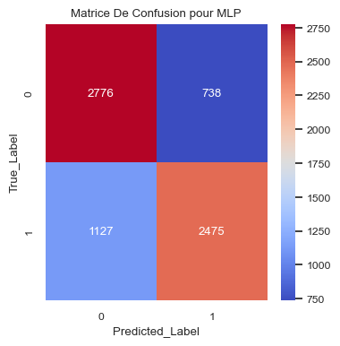
    


```python
from sklearn.metrics import roc_curve, auc

# Calculer les probabilités prédites de classe positive pour l'ensemble de test
mlp_prob = mlp.predict_proba(X_test)[:,1]

# Calculer fpr, tpr, and thresholds
fpr, tpr, thresholds = roc_curve(y_test_mlp, y_pred_mlp)

# Calculer AUC score
roc_auc = auc(fpr, tpr)

#  ROC curve
plt.plot(fpr, tpr, color='darkorange', label='ROC curve (area = %0.2f)' % roc_auc)
plt.plot([0, 1], [0, 1], color='navy', linestyle='--')
plt.xlim([0.0, 1.0])
plt.ylim([0.0, 1.05])
plt.xlabel('False Positive Rate')
plt.ylabel('True Positive Rate')
plt.title('ROC Curve Pour MLP')
plt.legend(loc="lower right")
plt.show()
```


    
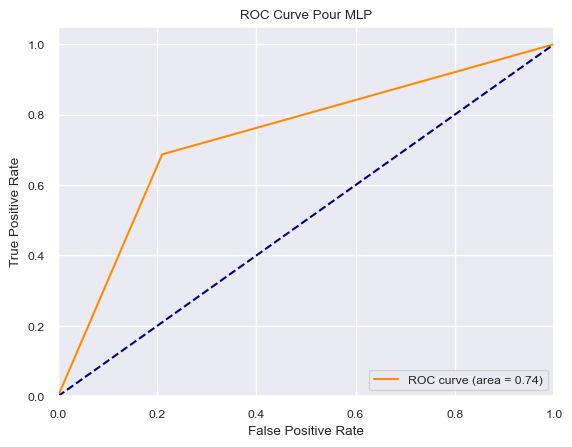
    


```python
from sklearn.metrics import classification_report
print(classification_report(y_test_mlp, y_pred_mlp))
```

                  precision    recall  f1-score   support
    
             0.0       0.71      0.79      0.75      3514
             1.0       0.77      0.69      0.73      3602
    
        accuracy                           0.74      7116
       macro avg       0.74      0.74      0.74      7116
    weighted avg       0.74      0.74      0.74      7116
    
    


```python
from sklearn.metrics import accuracy_score
accuracy = accuracy_score(y_test_mlp, y_pred_mlp)
print("Accuracy:", accuracy)
```

    Accuracy: 0.7379145587408656
    

# 

# 

# 9- KerasClassifier


```python
X_res = data_res.drop("Y", axis=1)
y_res = data_res["Y"]
```


```python
from sklearn.model_selection import train_test_split
X_train, X_test, y_train, y_test_keras = train_test_split(X_res,y_res, test_size=0.2, random_state=0)
```


```python
import tensorflow as tf
from tensorflow.keras.models import Sequential
from tensorflow.keras.layers import Dense
from tensorflow.keras.wrappers.scikit_learn import KerasClassifier
```

1-Créer une fonction pour le modèle :


```python
def create_model(optimizer='adam', activation='relu', units=64):
    model = Sequential()
    model.add(Dense(units=units, activation=activation, input_shape=(X_train.shape[1],)))
    model.add(Dense(units=1, activation='sigmoid'))
    model.compile(loss='binary_crossentropy', optimizer=optimizer, metrics=['accuracy'])
    return model

```

2-Créer une instance de KerasClassifier pour utiliser avec GridSearchCV :


```python
model = KerasClassifier(build_fn=create_model, verbose=0)
```

    C:\Users\LEOPARD\AppData\Local\Temp\ipykernel_3996\2566461152.py:1: DeprecationWarning: KerasClassifier is deprecated, use Sci-Keras (https://github.com/adriangb/scikeras) instead. See https://www.adriangb.com/scikeras/stable/migration.html for help migrating.
      model = KerasClassifier(build_fn=create_model, verbose=0)
    

3-Créer un dictionnaire param_grid contenant les hyperparamètres :


```python
param_grid = {
    'optimizer': ['adam', 'rmsprop'],
    'activation': ['relu', 'tanh'],
    'units': [32, 64, 128]
}
```

4-Créez une instance de GridSearchCV pour trouver les meilleurs hyperparamètres :


```python
from sklearn.model_selection import GridSearchCV

grid_search = GridSearchCV(estimator=model, param_grid=param_grid, cv=5)
```

5-Faire tourner la recherche sur grille et affichez les meilleurs hyperparamètres :


```python
grid_search.fit(X_train, y_train)
print("Meilleurs hyperparamètres : ", grid_search.best_params_)
```

    Meilleurs hyperparamètres :  {'activation': 'relu', 'optimizer': 'adam', 'units': 128}
    

6-Créer une instance de modèle avec les meilleurs hyperparamètres :


```python
best_model = create_model(optimizer=grid_search.best_params_['optimizer'],
                          activation=grid_search.best_params_['activation'],
                          units=grid_search.best_params_['units'])
```

7-Entraîner votre modèle sur les données de formation :


```python
best_model.fit(X_train, y_train, epochs=10, batch_size=32, verbose=0)
```


    <keras.callbacks.History at 0x1eca6dd5930>


8-Tracer la matrice de confusion avec confusion_matrix de sklearn.metrics :


```python

# confusion matrix pour Multi-layer Perceptron.
from sklearn.metrics import confusion_matrix
import seaborn as sns

matrix = confusion_matrix(y_test_keras,y_pred_keras)
sns.set(font_scale=0.8)
plt.subplots(figsize=(4, 4))
sns.heatmap(matrix,annot=True, cmap='coolwarm',fmt="d")
plt.ylabel('True_Label')
plt.xlabel('Predicted_Label')
plt.title('Matrice De Confusion pour Keras');
```


    
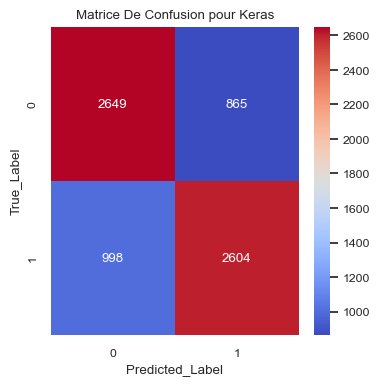
    


9-Afficher le rapport de classification avec classification_report de sklearn.metrics :


```python
from sklearn.metrics import classification_report
print(classification_report(y_test_keras, y_pred_keras  ))
```

                  precision    recall  f1-score   support
    
             0.0       0.73      0.75      0.74      3514
             1.0       0.75      0.72      0.74      3602
    
        accuracy                           0.74      7116
       macro avg       0.74      0.74      0.74      7116
    weighted avg       0.74      0.74      0.74      7116
    
    


```python
from sklearn.metrics import accuracy_score
accuracy = accuracy_score(y_test_keras, y_pred_keras  )
print("Accuracy:", accuracy)
```

    Accuracy: 0.7381956155143339
    


```python
plot_roc_curve(y_test_keras,y_pred_keras,title='ROC Curve pour KerasClassifier') 
```


    
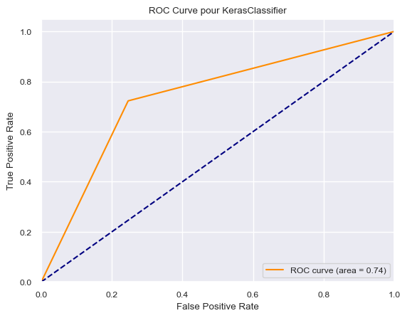
    


# 10- GradientBoostingClassifier


```python
from sklearn.ensemble import GradientBoostingClassifier
```


```python
X_res = data_res.drop("Y", axis=1)
y_res = data_res["Y"]
```


```python
from sklearn.model_selection import train_test_split
X_train, X_test, y_train, y_test_gbt = train_test_split(X_res,y_res, test_size=0.2, random_state=0)
```


```python
# Creation du model GradientBoostingClassifier
gbt = GradientBoostingClassifier()

# Entrainer le modele sur les données
gbt.fit(X_train, y_train)

# Faire la prédiction

y_pred_gbt = gbt.predict(X_test)

# Evaluation du modele
from sklearn.metrics import accuracy_score
accuracy = accuracy_score(y_test_gbt, y_pred_gbt)
print("Accuracy:", accuracy)
```

    Accuracy: 0.8093029792017987
    


```python
from sklearn.metrics import classification_report
print(classification_report(y_test_gbt, y_pred_gbt  ))
```

                  precision    recall  f1-score   support
    
             0.0       0.79      0.84      0.81      3514
             1.0       0.83      0.78      0.81      3602
    
        accuracy                           0.81      7116
       macro avg       0.81      0.81      0.81      7116
    weighted avg       0.81      0.81      0.81      7116
    
    


```python
plot_roc_curve(y_test_gbt,y_pred_gbt,title='ROC Curve pour GradientBoostingClassifier')
```


    
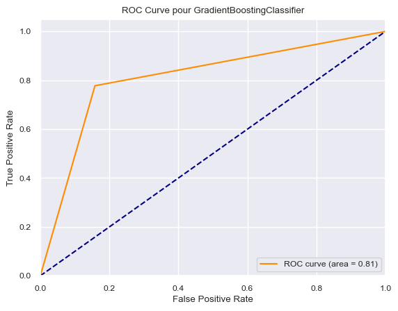
    


# 11- CatBoostClassifier


```python
from catboost import CatBoostClassifier
```


```python
X_res = data_res.drop("Y", axis=1)
y_res = data_res["Y"]
```


```python
from sklearn.model_selection import train_test_split
X_train, X_test, y_train, y_test_catboost = train_test_split(X_res,y_res, test_size=0.2, random_state=0)
```


```python
# Creation du modele CatBoost classifier
catboost = CatBoostClassifier()

# Train the model on the training data
catboost.fit(X_train, y_train)

# Make predictions on new data

y_pred_catboost = catboost.predict(X_test)

# Evaluate the model
from sklearn.metrics import accuracy_score
accuracy = accuracy_score(y_test_catboost, y_pred_catboost)
print("Accuracy:", accuracy)
```

    Learning rate set to 0.043042
    0:	learn: 0.6816283	total: 144ms	remaining: 2m 24s
    1:	learn: 0.6706938	total: 154ms	remaining: 1m 16s
    2:	learn: 0.6609156	total: 163ms	remaining: 54.3s
    3:	learn: 0.6514938	total: 173ms	remaining: 43.1s
    4:	learn: 0.6431419	total: 183ms	remaining: 36.4s
    5:	learn: 0.6353253	total: 192ms	remaining: 31.8s
    6:	learn: 0.6284198	total: 202ms	remaining: 28.6s
    7:	learn: 0.6204699	total: 212ms	remaining: 26.3s
    8:	learn: 0.6144793	total: 222ms	remaining: 24.4s
    9:	learn: 0.6087371	total: 232ms	remaining: 22.9s
    10:	learn: 0.6033378	total: 240ms	remaining: 21.6s
    11:	learn: 0.5986015	total: 248ms	remaining: 20.4s
    12:	learn: 0.5931746	total: 255ms	remaining: 19.3s
    13:	learn: 0.5884162	total: 262ms	remaining: 18.5s
    14:	learn: 0.5840104	total: 269ms	remaining: 17.7s
    15:	learn: 0.5794500	total: 277ms	remaining: 17s
    16:	learn: 0.5754339	total: 284ms	remaining: 16.4s
    17:	learn: 0.5722521	total: 292ms	remaining: 15.9s
    18:	learn: 0.5694315	total: 299ms	remaining: 15.4s
    19:	learn: 0.5658584	total: 306ms	remaining: 15s
    20:	learn: 0.5622476	total: 314ms	remaining: 14.6s
    21:	learn: 0.5597318	total: 321ms	remaining: 14.3s
    22:	learn: 0.5571399	total: 328ms	remaining: 13.9s
    23:	learn: 0.5542162	total: 336ms	remaining: 13.7s
    24:	learn: 0.5520826	total: 343ms	remaining: 13.4s
    25:	learn: 0.5501926	total: 351ms	remaining: 13.1s
    26:	learn: 0.5460302	total: 358ms	remaining: 12.9s
    27:	learn: 0.5429784	total: 365ms	remaining: 12.7s
    28:	learn: 0.5408544	total: 372ms	remaining: 12.5s
    29:	learn: 0.5385805	total: 380ms	remaining: 12.3s
    30:	learn: 0.5349069	total: 387ms	remaining: 12.1s
    31:	learn: 0.5328782	total: 394ms	remaining: 11.9s
    32:	learn: 0.5300845	total: 402ms	remaining: 11.8s
    33:	learn: 0.5275836	total: 409ms	remaining: 11.6s
    34:	learn: 0.5252043	total: 417ms	remaining: 11.5s
    35:	learn: 0.5239617	total: 426ms	remaining: 11.4s
    36:	learn: 0.5217141	total: 434ms	remaining: 11.3s
    37:	learn: 0.5195091	total: 442ms	remaining: 11.2s
    38:	learn: 0.5180929	total: 450ms	remaining: 11.1s
    39:	learn: 0.5160109	total: 458ms	remaining: 11s
    40:	learn: 0.5149585	total: 466ms	remaining: 10.9s
    41:	learn: 0.5139445	total: 474ms	remaining: 10.8s
    42:	learn: 0.5129097	total: 482ms	remaining: 10.7s
    43:	learn: 0.5114369	total: 489ms	remaining: 10.6s
    44:	learn: 0.5104507	total: 497ms	remaining: 10.6s
    45:	learn: 0.5095122	total: 506ms	remaining: 10.5s
    46:	learn: 0.5081380	total: 513ms	remaining: 10.4s
    47:	learn: 0.5066449	total: 521ms	remaining: 10.3s
    48:	learn: 0.5060091	total: 529ms	remaining: 10.3s
    49:	learn: 0.5045300	total: 538ms	remaining: 10.2s
    50:	learn: 0.5021853	total: 546ms	remaining: 10.2s
    51:	learn: 0.5014157	total: 554ms	remaining: 10.1s
    52:	learn: 0.4997291	total: 562ms	remaining: 10s
    53:	learn: 0.4990004	total: 570ms	remaining: 9.99s
    54:	learn: 0.4976655	total: 578ms	remaining: 9.93s
    55:	learn: 0.4968798	total: 586ms	remaining: 9.87s
    56:	learn: 0.4963235	total: 593ms	remaining: 9.81s
    57:	learn: 0.4944781	total: 601ms	remaining: 9.77s
    58:	learn: 0.4933328	total: 609ms	remaining: 9.71s
    59:	learn: 0.4921294	total: 616ms	remaining: 9.66s
    60:	learn: 0.4915966	total: 624ms	remaining: 9.6s
    61:	learn: 0.4904999	total: 632ms	remaining: 9.56s
    62:	learn: 0.4892650	total: 640ms	remaining: 9.52s
    63:	learn: 0.4884620	total: 649ms	remaining: 9.5s
    64:	learn: 0.4869346	total: 658ms	remaining: 9.46s
    65:	learn: 0.4858845	total: 666ms	remaining: 9.43s
    66:	learn: 0.4852964	total: 674ms	remaining: 9.38s
    67:	learn: 0.4842980	total: 681ms	remaining: 9.34s
    68:	learn: 0.4825605	total: 688ms	remaining: 9.29s
    69:	learn: 0.4815979	total: 695ms	remaining: 9.24s
    70:	learn: 0.4810875	total: 702ms	remaining: 9.19s
    71:	learn: 0.4802919	total: 709ms	remaining: 9.14s
    72:	learn: 0.4798243	total: 716ms	remaining: 9.09s
    73:	learn: 0.4783147	total: 724ms	remaining: 9.06s
    74:	learn: 0.4779415	total: 731ms	remaining: 9.02s
    75:	learn: 0.4760373	total: 738ms	remaining: 8.97s
    76:	learn: 0.4755472	total: 745ms	remaining: 8.93s
    77:	learn: 0.4743146	total: 752ms	remaining: 8.89s
    78:	learn: 0.4727117	total: 759ms	remaining: 8.85s
    79:	learn: 0.4713680	total: 766ms	remaining: 8.81s
    80:	learn: 0.4707368	total: 773ms	remaining: 8.77s
    81:	learn: 0.4688770	total: 781ms	remaining: 8.74s
    82:	learn: 0.4677804	total: 787ms	remaining: 8.7s
    83:	learn: 0.4673764	total: 795ms	remaining: 8.67s
    84:	learn: 0.4663874	total: 802ms	remaining: 8.63s
    85:	learn: 0.4657459	total: 809ms	remaining: 8.6s
    86:	learn: 0.4645433	total: 816ms	remaining: 8.56s
    87:	learn: 0.4641245	total: 824ms	remaining: 8.54s
    88:	learn: 0.4627304	total: 831ms	remaining: 8.5s
    89:	learn: 0.4624324	total: 840ms	remaining: 8.49s
    90:	learn: 0.4619828	total: 848ms	remaining: 8.47s
    91:	learn: 0.4612440	total: 856ms	remaining: 8.45s
    92:	learn: 0.4606377	total: 865ms	remaining: 8.43s
    93:	learn: 0.4597347	total: 873ms	remaining: 8.42s
    94:	learn: 0.4591710	total: 882ms	remaining: 8.4s
    95:	learn: 0.4587506	total: 890ms	remaining: 8.38s
    96:	learn: 0.4579222	total: 898ms	remaining: 8.36s
    97:	learn: 0.4576783	total: 906ms	remaining: 8.34s
    98:	learn: 0.4561391	total: 913ms	remaining: 8.31s
    99:	learn: 0.4557936	total: 920ms	remaining: 8.28s
    100:	learn: 0.4552613	total: 927ms	remaining: 8.25s
    101:	learn: 0.4548495	total: 935ms	remaining: 8.23s
    102:	learn: 0.4545074	total: 943ms	remaining: 8.21s
    103:	learn: 0.4536642	total: 952ms	remaining: 8.2s
    104:	learn: 0.4526248	total: 961ms	remaining: 8.19s
    105:	learn: 0.4522702	total: 971ms	remaining: 8.19s
    106:	learn: 0.4509225	total: 980ms	remaining: 8.18s
    107:	learn: 0.4502361	total: 990ms	remaining: 8.18s
    108:	learn: 0.4492123	total: 1s	remaining: 8.18s
    109:	learn: 0.4488918	total: 1.01s	remaining: 8.18s
    110:	learn: 0.4486071	total: 1.02s	remaining: 8.17s
    111:	learn: 0.4474292	total: 1.03s	remaining: 8.19s
    112:	learn: 0.4466724	total: 1.04s	remaining: 8.18s
    113:	learn: 0.4463785	total: 1.05s	remaining: 8.18s
    114:	learn: 0.4458982	total: 1.06s	remaining: 8.19s
    115:	learn: 0.4455437	total: 1.08s	remaining: 8.2s
    116:	learn: 0.4438489	total: 1.09s	remaining: 8.21s
    117:	learn: 0.4434498	total: 1.1s	remaining: 8.2s
    118:	learn: 0.4430871	total: 1.11s	remaining: 8.19s
    119:	learn: 0.4428581	total: 1.11s	remaining: 8.18s
    120:	learn: 0.4421251	total: 1.12s	remaining: 8.16s
    121:	learn: 0.4417890	total: 1.13s	remaining: 8.14s
    122:	learn: 0.4412539	total: 1.14s	remaining: 8.12s
    123:	learn: 0.4408999	total: 1.15s	remaining: 8.09s
    124:	learn: 0.4400811	total: 1.15s	remaining: 8.07s
    125:	learn: 0.4391014	total: 1.16s	remaining: 8.05s
    126:	learn: 0.4374630	total: 1.17s	remaining: 8.03s
    127:	learn: 0.4357962	total: 1.18s	remaining: 8.01s
    128:	learn: 0.4353313	total: 1.18s	remaining: 7.99s
    129:	learn: 0.4349564	total: 1.19s	remaining: 7.97s
    130:	learn: 0.4344342	total: 1.2s	remaining: 7.96s
    131:	learn: 0.4339920	total: 1.21s	remaining: 7.94s
    132:	learn: 0.4336711	total: 1.22s	remaining: 7.92s
    133:	learn: 0.4334820	total: 1.22s	remaining: 7.91s
    134:	learn: 0.4332805	total: 1.23s	remaining: 7.89s
    135:	learn: 0.4329708	total: 1.24s	remaining: 7.88s
    136:	learn: 0.4326823	total: 1.25s	remaining: 7.88s
    137:	learn: 0.4324521	total: 1.26s	remaining: 7.87s
    138:	learn: 0.4321016	total: 1.27s	remaining: 7.87s
    139:	learn: 0.4317829	total: 1.28s	remaining: 7.85s
    140:	learn: 0.4304326	total: 1.29s	remaining: 7.84s
    141:	learn: 0.4301425	total: 1.3s	remaining: 7.83s
    142:	learn: 0.4298719	total: 1.3s	remaining: 7.82s
    143:	learn: 0.4281394	total: 1.31s	remaining: 7.81s
    144:	learn: 0.4279240	total: 1.32s	remaining: 7.8s
    145:	learn: 0.4273147	total: 1.33s	remaining: 7.79s
    146:	learn: 0.4268499	total: 1.34s	remaining: 7.79s
    147:	learn: 0.4258424	total: 1.35s	remaining: 7.78s
    148:	learn: 0.4240102	total: 1.36s	remaining: 7.78s
    149:	learn: 0.4238136	total: 1.37s	remaining: 7.77s
    150:	learn: 0.4221260	total: 1.38s	remaining: 7.76s
    151:	learn: 0.4213626	total: 1.39s	remaining: 7.75s
    152:	learn: 0.4211848	total: 1.4s	remaining: 7.74s
    153:	learn: 0.4198349	total: 1.41s	remaining: 7.73s
    154:	learn: 0.4196109	total: 1.41s	remaining: 7.71s
    155:	learn: 0.4192573	total: 1.42s	remaining: 7.69s
    156:	learn: 0.4182022	total: 1.43s	remaining: 7.68s
    157:	learn: 0.4180575	total: 1.44s	remaining: 7.66s
    158:	learn: 0.4174377	total: 1.45s	remaining: 7.64s
    159:	learn: 0.4159144	total: 1.45s	remaining: 7.63s
    160:	learn: 0.4156476	total: 1.46s	remaining: 7.61s
    161:	learn: 0.4153760	total: 1.47s	remaining: 7.6s
    162:	learn: 0.4149086	total: 1.48s	remaining: 7.58s
    163:	learn: 0.4146678	total: 1.48s	remaining: 7.56s
    164:	learn: 0.4141533	total: 1.49s	remaining: 7.55s
    165:	learn: 0.4139440	total: 1.5s	remaining: 7.53s
    166:	learn: 0.4133185	total: 1.51s	remaining: 7.52s
    167:	learn: 0.4128119	total: 1.52s	remaining: 7.51s
    168:	learn: 0.4126389	total: 1.52s	remaining: 7.49s
    169:	learn: 0.4120458	total: 1.53s	remaining: 7.47s
    170:	learn: 0.4117643	total: 1.54s	remaining: 7.46s
    171:	learn: 0.4116046	total: 1.54s	remaining: 7.44s
    172:	learn: 0.4109851	total: 1.55s	remaining: 7.42s
    173:	learn: 0.4094884	total: 1.56s	remaining: 7.41s
    174:	learn: 0.4092254	total: 1.57s	remaining: 7.39s
    175:	learn: 0.4081233	total: 1.57s	remaining: 7.37s
    176:	learn: 0.4075264	total: 1.58s	remaining: 7.36s
    177:	learn: 0.4069737	total: 1.59s	remaining: 7.34s
    178:	learn: 0.4064076	total: 1.6s	remaining: 7.33s
    179:	learn: 0.4057509	total: 1.6s	remaining: 7.31s
    180:	learn: 0.4055390	total: 1.61s	remaining: 7.3s
    181:	learn: 0.4053403	total: 1.62s	remaining: 7.3s
    182:	learn: 0.4049430	total: 1.63s	remaining: 7.29s
    183:	learn: 0.4047609	total: 1.64s	remaining: 7.27s
    184:	learn: 0.4046129	total: 1.65s	remaining: 7.26s
    185:	learn: 0.4039955	total: 1.66s	remaining: 7.25s
    186:	learn: 0.4031346	total: 1.67s	remaining: 7.24s
    187:	learn: 0.4020250	total: 1.67s	remaining: 7.23s
    188:	learn: 0.4015961	total: 1.68s	remaining: 7.22s
    189:	learn: 0.4010772	total: 1.69s	remaining: 7.21s
    190:	learn: 0.4009129	total: 1.7s	remaining: 7.2s
    191:	learn: 0.4006192	total: 1.71s	remaining: 7.18s
    192:	learn: 0.4004405	total: 1.71s	remaining: 7.17s
    193:	learn: 0.4001356	total: 1.72s	remaining: 7.15s
    194:	learn: 0.3998480	total: 1.73s	remaining: 7.13s
    195:	learn: 0.3996126	total: 1.74s	remaining: 7.12s
    196:	learn: 0.3994900	total: 1.74s	remaining: 7.1s
    197:	learn: 0.3990800	total: 1.75s	remaining: 7.09s
    198:	learn: 0.3985255	total: 1.76s	remaining: 7.07s
    199:	learn: 0.3983263	total: 1.76s	remaining: 7.05s
    200:	learn: 0.3981802	total: 1.77s	remaining: 7.04s
    201:	learn: 0.3980106	total: 1.78s	remaining: 7.02s
    202:	learn: 0.3977866	total: 1.78s	remaining: 7.01s
    203:	learn: 0.3975888	total: 1.79s	remaining: 7s
    204:	learn: 0.3973511	total: 1.8s	remaining: 6.98s
    205:	learn: 0.3968997	total: 1.81s	remaining: 6.96s
    206:	learn: 0.3964502	total: 1.81s	remaining: 6.95s
    207:	learn: 0.3962400	total: 1.82s	remaining: 6.94s
    208:	learn: 0.3961005	total: 1.83s	remaining: 6.92s
    209:	learn: 0.3959735	total: 1.83s	remaining: 6.91s
    210:	learn: 0.3953291	total: 1.84s	remaining: 6.89s
    211:	learn: 0.3951407	total: 1.85s	remaining: 6.88s
    212:	learn: 0.3948351	total: 1.86s	remaining: 6.86s
    213:	learn: 0.3946649	total: 1.86s	remaining: 6.85s
    214:	learn: 0.3944335	total: 1.87s	remaining: 6.84s
    215:	learn: 0.3942720	total: 1.88s	remaining: 6.83s
    216:	learn: 0.3940574	total: 1.89s	remaining: 6.82s
    217:	learn: 0.3937481	total: 1.9s	remaining: 6.81s
    218:	learn: 0.3934545	total: 1.91s	remaining: 6.8s
    219:	learn: 0.3929407	total: 1.91s	remaining: 6.79s
    220:	learn: 0.3927191	total: 1.92s	remaining: 6.78s
    221:	learn: 0.3924895	total: 1.93s	remaining: 6.78s
    222:	learn: 0.3911910	total: 1.94s	remaining: 6.77s
    223:	learn: 0.3910762	total: 1.95s	remaining: 6.76s
    224:	learn: 0.3909018	total: 1.96s	remaining: 6.75s
    225:	learn: 0.3906931	total: 1.97s	remaining: 6.75s
    226:	learn: 0.3899437	total: 1.98s	remaining: 6.74s
    227:	learn: 0.3894478	total: 1.99s	remaining: 6.74s
    228:	learn: 0.3889147	total: 2s	remaining: 6.73s
    229:	learn: 0.3887985	total: 2.01s	remaining: 6.72s
    230:	learn: 0.3884020	total: 2.02s	remaining: 6.72s
    231:	learn: 0.3881820	total: 2.03s	remaining: 6.72s
    232:	learn: 0.3880015	total: 2.04s	remaining: 6.71s
    233:	learn: 0.3878226	total: 2.05s	remaining: 6.7s
    234:	learn: 0.3876037	total: 2.05s	remaining: 6.69s
    235:	learn: 0.3874397	total: 2.06s	remaining: 6.68s
    236:	learn: 0.3872423	total: 2.07s	remaining: 6.67s
    237:	learn: 0.3868969	total: 2.08s	remaining: 6.66s
    238:	learn: 0.3865170	total: 2.09s	remaining: 6.66s
    239:	learn: 0.3862976	total: 2.1s	remaining: 6.65s
    240:	learn: 0.3861236	total: 2.11s	remaining: 6.65s
    241:	learn: 0.3852858	total: 2.12s	remaining: 6.64s
    242:	learn: 0.3850659	total: 2.13s	remaining: 6.63s
    243:	learn: 0.3848463	total: 2.14s	remaining: 6.63s
    244:	learn: 0.3846110	total: 2.15s	remaining: 6.63s
    245:	learn: 0.3844661	total: 2.16s	remaining: 6.62s
    246:	learn: 0.3837905	total: 2.17s	remaining: 6.62s
    247:	learn: 0.3834824	total: 2.18s	remaining: 6.61s
    248:	learn: 0.3823740	total: 2.19s	remaining: 6.61s
    249:	learn: 0.3821391	total: 2.2s	remaining: 6.61s
    250:	learn: 0.3806650	total: 2.21s	remaining: 6.61s
    251:	learn: 0.3801081	total: 2.23s	remaining: 6.61s
    252:	learn: 0.3799232	total: 2.24s	remaining: 6.61s
    253:	learn: 0.3791366	total: 2.25s	remaining: 6.61s
    254:	learn: 0.3789632	total: 2.26s	remaining: 6.61s
    255:	learn: 0.3788042	total: 2.27s	remaining: 6.61s
    256:	learn: 0.3785811	total: 2.3s	remaining: 6.64s
    257:	learn: 0.3776002	total: 2.31s	remaining: 6.63s
    258:	learn: 0.3765639	total: 2.32s	remaining: 6.63s
    259:	learn: 0.3763862	total: 2.33s	remaining: 6.62s
    260:	learn: 0.3754235	total: 2.33s	remaining: 6.61s
    261:	learn: 0.3752033	total: 2.34s	remaining: 6.6s
    262:	learn: 0.3748149	total: 2.35s	remaining: 6.59s
    263:	learn: 0.3745673	total: 2.36s	remaining: 6.59s
    264:	learn: 0.3736971	total: 2.37s	remaining: 6.58s
    265:	learn: 0.3734308	total: 2.38s	remaining: 6.57s
    266:	learn: 0.3732711	total: 2.39s	remaining: 6.56s
    267:	learn: 0.3724613	total: 2.4s	remaining: 6.55s
    268:	learn: 0.3720196	total: 2.41s	remaining: 6.55s
    269:	learn: 0.3709816	total: 2.42s	remaining: 6.54s
    270:	learn: 0.3702107	total: 2.43s	remaining: 6.53s
    271:	learn: 0.3700298	total: 2.44s	remaining: 6.53s
    272:	learn: 0.3697111	total: 2.45s	remaining: 6.52s
    273:	learn: 0.3681423	total: 2.46s	remaining: 6.51s
    274:	learn: 0.3669726	total: 2.46s	remaining: 6.5s
    275:	learn: 0.3662170	total: 2.47s	remaining: 6.49s
    276:	learn: 0.3651900	total: 2.48s	remaining: 6.48s
    277:	learn: 0.3648980	total: 2.49s	remaining: 6.48s
    278:	learn: 0.3647449	total: 2.5s	remaining: 6.47s
    279:	learn: 0.3640883	total: 2.51s	remaining: 6.46s
    280:	learn: 0.3634442	total: 2.52s	remaining: 6.45s
    281:	learn: 0.3628416	total: 2.53s	remaining: 6.45s
    282:	learn: 0.3619419	total: 2.54s	remaining: 6.44s
    283:	learn: 0.3609574	total: 2.55s	remaining: 6.43s
    284:	learn: 0.3607713	total: 2.56s	remaining: 6.42s
    285:	learn: 0.3606022	total: 2.57s	remaining: 6.41s
    286:	learn: 0.3600594	total: 2.58s	remaining: 6.41s
    287:	learn: 0.3593527	total: 2.59s	remaining: 6.4s
    288:	learn: 0.3587793	total: 2.6s	remaining: 6.39s
    289:	learn: 0.3586169	total: 2.61s	remaining: 6.38s
    290:	learn: 0.3583693	total: 2.62s	remaining: 6.38s
    291:	learn: 0.3581938	total: 2.63s	remaining: 6.37s
    292:	learn: 0.3576215	total: 2.63s	remaining: 6.36s
    293:	learn: 0.3571558	total: 2.65s	remaining: 6.35s
    294:	learn: 0.3562748	total: 2.65s	remaining: 6.34s
    295:	learn: 0.3561204	total: 2.66s	remaining: 6.34s
    296:	learn: 0.3556969	total: 2.67s	remaining: 6.33s
    297:	learn: 0.3551357	total: 2.68s	remaining: 6.32s
    298:	learn: 0.3549813	total: 2.69s	remaining: 6.31s
    299:	learn: 0.3544914	total: 2.7s	remaining: 6.3s
    300:	learn: 0.3540547	total: 2.71s	remaining: 6.29s
    301:	learn: 0.3539009	total: 2.72s	remaining: 6.28s
    302:	learn: 0.3533241	total: 2.72s	remaining: 6.27s
    303:	learn: 0.3525261	total: 2.73s	remaining: 6.25s
    304:	learn: 0.3521884	total: 2.74s	remaining: 6.24s
    305:	learn: 0.3520339	total: 2.75s	remaining: 6.23s
    306:	learn: 0.3518659	total: 2.75s	remaining: 6.22s
    307:	learn: 0.3516375	total: 2.76s	remaining: 6.21s
    308:	learn: 0.3511238	total: 2.77s	remaining: 6.2s
    309:	learn: 0.3509404	total: 2.78s	remaining: 6.18s
    310:	learn: 0.3501877	total: 2.79s	remaining: 6.17s
    311:	learn: 0.3499212	total: 2.79s	remaining: 6.16s
    312:	learn: 0.3495374	total: 2.8s	remaining: 6.14s
    313:	learn: 0.3490945	total: 2.81s	remaining: 6.13s
    314:	learn: 0.3484668	total: 2.81s	remaining: 6.12s
    315:	learn: 0.3480628	total: 2.82s	remaining: 6.11s
    316:	learn: 0.3479316	total: 2.83s	remaining: 6.09s
    317:	learn: 0.3477675	total: 2.83s	remaining: 6.08s
    318:	learn: 0.3470366	total: 2.84s	remaining: 6.07s
    319:	learn: 0.3468736	total: 2.85s	remaining: 6.06s
    320:	learn: 0.3467096	total: 2.86s	remaining: 6.05s
    321:	learn: 0.3465522	total: 2.87s	remaining: 6.04s
    322:	learn: 0.3463674	total: 2.87s	remaining: 6.02s
    323:	learn: 0.3462028	total: 2.88s	remaining: 6.01s
    324:	learn: 0.3459369	total: 2.89s	remaining: 6s
    325:	learn: 0.3457650	total: 2.9s	remaining: 5.99s
    326:	learn: 0.3455192	total: 2.9s	remaining: 5.97s
    327:	learn: 0.3453041	total: 2.91s	remaining: 5.96s
    328:	learn: 0.3451669	total: 2.92s	remaining: 5.95s
    329:	learn: 0.3450362	total: 2.92s	remaining: 5.94s
    330:	learn: 0.3447753	total: 2.93s	remaining: 5.92s
    331:	learn: 0.3440389	total: 2.94s	remaining: 5.91s
    332:	learn: 0.3436020	total: 2.95s	remaining: 5.9s
    333:	learn: 0.3433927	total: 2.95s	remaining: 5.89s
    334:	learn: 0.3427588	total: 2.96s	remaining: 5.88s
    335:	learn: 0.3423917	total: 2.97s	remaining: 5.87s
    336:	learn: 0.3422064	total: 2.98s	remaining: 5.86s
    337:	learn: 0.3417697	total: 2.98s	remaining: 5.84s
    338:	learn: 0.3416018	total: 2.99s	remaining: 5.83s
    339:	learn: 0.3414888	total: 3s	remaining: 5.82s
    340:	learn: 0.3413297	total: 3s	remaining: 5.81s
    341:	learn: 0.3409915	total: 3.01s	remaining: 5.79s
    342:	learn: 0.3408099	total: 3.02s	remaining: 5.78s
    343:	learn: 0.3405328	total: 3.03s	remaining: 5.77s
    344:	learn: 0.3403037	total: 3.03s	remaining: 5.76s
    345:	learn: 0.3401530	total: 3.04s	remaining: 5.75s
    346:	learn: 0.3395449	total: 3.05s	remaining: 5.74s
    347:	learn: 0.3394448	total: 3.06s	remaining: 5.72s
    348:	learn: 0.3390706	total: 3.06s	remaining: 5.71s
    349:	learn: 0.3389178	total: 3.07s	remaining: 5.7s
    350:	learn: 0.3384496	total: 3.08s	remaining: 5.69s
    351:	learn: 0.3381321	total: 3.08s	remaining: 5.68s
    352:	learn: 0.3379889	total: 3.09s	remaining: 5.67s
    353:	learn: 0.3378025	total: 3.1s	remaining: 5.66s
    354:	learn: 0.3376619	total: 3.11s	remaining: 5.65s
    355:	learn: 0.3370534	total: 3.12s	remaining: 5.64s
    356:	learn: 0.3369205	total: 3.13s	remaining: 5.63s
    357:	learn: 0.3363866	total: 3.13s	remaining: 5.62s
    358:	learn: 0.3362690	total: 3.14s	remaining: 5.61s
    359:	learn: 0.3361075	total: 3.15s	remaining: 5.6s
    360:	learn: 0.3359073	total: 3.16s	remaining: 5.59s
    361:	learn: 0.3355418	total: 3.17s	remaining: 5.58s
    362:	learn: 0.3353884	total: 3.17s	remaining: 5.57s
    363:	learn: 0.3350746	total: 3.18s	remaining: 5.56s
    364:	learn: 0.3343778	total: 3.19s	remaining: 5.55s
    365:	learn: 0.3340493	total: 3.2s	remaining: 5.54s
    366:	learn: 0.3339394	total: 3.2s	remaining: 5.53s
    367:	learn: 0.3335138	total: 3.21s	remaining: 5.51s
    368:	learn: 0.3332108	total: 3.22s	remaining: 5.5s
    369:	learn: 0.3329652	total: 3.23s	remaining: 5.49s
    370:	learn: 0.3327044	total: 3.23s	remaining: 5.48s
    371:	learn: 0.3325694	total: 3.24s	remaining: 5.47s
    372:	learn: 0.3324413	total: 3.25s	remaining: 5.46s
    373:	learn: 0.3322151	total: 3.25s	remaining: 5.45s
    374:	learn: 0.3320758	total: 3.26s	remaining: 5.43s
    375:	learn: 0.3317734	total: 3.27s	remaining: 5.42s
    376:	learn: 0.3316371	total: 3.27s	remaining: 5.41s
    377:	learn: 0.3314855	total: 3.28s	remaining: 5.4s
    378:	learn: 0.3313977	total: 3.29s	remaining: 5.39s
    379:	learn: 0.3312620	total: 3.3s	remaining: 5.38s
    380:	learn: 0.3311329	total: 3.3s	remaining: 5.37s
    381:	learn: 0.3310066	total: 3.31s	remaining: 5.36s
    382:	learn: 0.3306158	total: 3.32s	remaining: 5.35s
    383:	learn: 0.3304376	total: 3.33s	remaining: 5.34s
    384:	learn: 0.3302881	total: 3.33s	remaining: 5.33s
    385:	learn: 0.3300611	total: 3.35s	remaining: 5.32s
    386:	learn: 0.3299400	total: 3.36s	remaining: 5.32s
    387:	learn: 0.3297971	total: 3.37s	remaining: 5.31s
    388:	learn: 0.3295325	total: 3.38s	remaining: 5.3s
    389:	learn: 0.3291452	total: 3.39s	remaining: 5.3s
    390:	learn: 0.3290348	total: 3.41s	remaining: 5.31s
    391:	learn: 0.3288975	total: 3.42s	remaining: 5.3s
    392:	learn: 0.3283383	total: 3.43s	remaining: 5.29s
    393:	learn: 0.3281210	total: 3.44s	remaining: 5.29s
    394:	learn: 0.3280241	total: 3.45s	remaining: 5.28s
    395:	learn: 0.3278541	total: 3.46s	remaining: 5.27s
    396:	learn: 0.3275077	total: 3.47s	remaining: 5.27s
    397:	learn: 0.3273860	total: 3.48s	remaining: 5.26s
    398:	learn: 0.3272351	total: 3.49s	remaining: 5.25s
    399:	learn: 0.3269137	total: 3.5s	remaining: 5.25s
    400:	learn: 0.3267776	total: 3.51s	remaining: 5.24s
    401:	learn: 0.3262650	total: 3.52s	remaining: 5.23s
    402:	learn: 0.3261387	total: 3.52s	remaining: 5.22s
    403:	learn: 0.3260193	total: 3.53s	remaining: 5.21s
    404:	learn: 0.3257364	total: 3.54s	remaining: 5.21s
    405:	learn: 0.3253334	total: 3.55s	remaining: 5.2s
    406:	learn: 0.3252075	total: 3.56s	remaining: 5.19s
    407:	learn: 0.3250776	total: 3.57s	remaining: 5.18s
    408:	learn: 0.3248979	total: 3.58s	remaining: 5.17s
    409:	learn: 0.3247642	total: 3.59s	remaining: 5.16s
    410:	learn: 0.3246208	total: 3.6s	remaining: 5.16s
    411:	learn: 0.3242952	total: 3.61s	remaining: 5.15s
    412:	learn: 0.3236484	total: 3.62s	remaining: 5.14s
    413:	learn: 0.3234826	total: 3.62s	remaining: 5.13s
    414:	learn: 0.3233466	total: 3.63s	remaining: 5.12s
    415:	learn: 0.3232125	total: 3.64s	remaining: 5.11s
    416:	learn: 0.3230439	total: 3.65s	remaining: 5.1s
    417:	learn: 0.3228473	total: 3.66s	remaining: 5.09s
    418:	learn: 0.3227049	total: 3.67s	remaining: 5.09s
    419:	learn: 0.3225906	total: 3.68s	remaining: 5.08s
    420:	learn: 0.3223846	total: 3.69s	remaining: 5.07s
    421:	learn: 0.3222334	total: 3.69s	remaining: 5.06s
    422:	learn: 0.3221359	total: 3.7s	remaining: 5.05s
    423:	learn: 0.3220243	total: 3.71s	remaining: 5.04s
    424:	learn: 0.3218964	total: 3.72s	remaining: 5.04s
    425:	learn: 0.3215593	total: 3.73s	remaining: 5.03s
    426:	learn: 0.3212850	total: 3.74s	remaining: 5.02s
    427:	learn: 0.3210487	total: 3.75s	remaining: 5.01s
    428:	learn: 0.3209378	total: 3.76s	remaining: 5s
    429:	learn: 0.3208331	total: 3.77s	remaining: 4.99s
    430:	learn: 0.3206897	total: 3.78s	remaining: 4.99s
    431:	learn: 0.3205797	total: 3.79s	remaining: 4.98s
    432:	learn: 0.3202842	total: 3.79s	remaining: 4.97s
    433:	learn: 0.3201362	total: 3.8s	remaining: 4.96s
    434:	learn: 0.3198676	total: 3.81s	remaining: 4.95s
    435:	learn: 0.3197169	total: 3.82s	remaining: 4.94s
    436:	learn: 0.3196054	total: 3.83s	remaining: 4.94s
    437:	learn: 0.3194827	total: 3.84s	remaining: 4.93s
    438:	learn: 0.3193213	total: 3.85s	remaining: 4.92s
    439:	learn: 0.3192118	total: 3.86s	remaining: 4.91s
    440:	learn: 0.3190834	total: 3.87s	remaining: 4.91s
    441:	learn: 0.3190066	total: 3.88s	remaining: 4.9s
    442:	learn: 0.3188858	total: 3.89s	remaining: 4.89s
    443:	learn: 0.3187554	total: 3.9s	remaining: 4.88s
    444:	learn: 0.3186381	total: 3.91s	remaining: 4.87s
    445:	learn: 0.3185180	total: 3.92s	remaining: 4.86s
    446:	learn: 0.3183151	total: 3.92s	remaining: 4.86s
    447:	learn: 0.3182299	total: 3.93s	remaining: 4.85s
    448:	learn: 0.3180030	total: 3.94s	remaining: 4.84s
    449:	learn: 0.3178864	total: 3.95s	remaining: 4.83s
    450:	learn: 0.3175890	total: 3.96s	remaining: 4.82s
    451:	learn: 0.3174917	total: 3.97s	remaining: 4.81s
    452:	learn: 0.3173971	total: 3.98s	remaining: 4.81s
    453:	learn: 0.3173093	total: 3.99s	remaining: 4.8s
    454:	learn: 0.3171821	total: 4s	remaining: 4.79s
    455:	learn: 0.3169231	total: 4.01s	remaining: 4.78s
    456:	learn: 0.3167456	total: 4.02s	remaining: 4.77s
    457:	learn: 0.3166365	total: 4.03s	remaining: 4.76s
    458:	learn: 0.3164854	total: 4.03s	remaining: 4.75s
    459:	learn: 0.3163604	total: 4.04s	remaining: 4.75s
    460:	learn: 0.3162192	total: 4.05s	remaining: 4.74s
    461:	learn: 0.3160980	total: 4.06s	remaining: 4.73s
    462:	learn: 0.3160145	total: 4.07s	remaining: 4.72s
    463:	learn: 0.3158701	total: 4.08s	remaining: 4.71s
    464:	learn: 0.3157390	total: 4.09s	remaining: 4.7s
    465:	learn: 0.3156468	total: 4.1s	remaining: 4.7s
    466:	learn: 0.3155048	total: 4.11s	remaining: 4.69s
    467:	learn: 0.3153007	total: 4.12s	remaining: 4.68s
    468:	learn: 0.3151866	total: 4.13s	remaining: 4.67s
    469:	learn: 0.3150628	total: 4.14s	remaining: 4.66s
    470:	learn: 0.3149731	total: 4.14s	remaining: 4.66s
    471:	learn: 0.3148628	total: 4.15s	remaining: 4.65s
    472:	learn: 0.3147801	total: 4.16s	remaining: 4.64s
    473:	learn: 0.3144735	total: 4.17s	remaining: 4.63s
    474:	learn: 0.3143842	total: 4.18s	remaining: 4.62s
    475:	learn: 0.3142945	total: 4.18s	remaining: 4.61s
    476:	learn: 0.3140471	total: 4.19s	remaining: 4.6s
    477:	learn: 0.3139499	total: 4.2s	remaining: 4.59s
    478:	learn: 0.3138206	total: 4.21s	remaining: 4.58s
    479:	learn: 0.3137002	total: 4.22s	remaining: 4.57s
    480:	learn: 0.3135770	total: 4.23s	remaining: 4.56s
    481:	learn: 0.3134555	total: 4.24s	remaining: 4.55s
    482:	learn: 0.3133440	total: 4.25s	remaining: 4.54s
    483:	learn: 0.3132244	total: 4.25s	remaining: 4.54s
    484:	learn: 0.3129257	total: 4.26s	remaining: 4.53s
    485:	learn: 0.3128349	total: 4.27s	remaining: 4.52s
    486:	learn: 0.3126897	total: 4.28s	remaining: 4.51s
    487:	learn: 0.3124317	total: 4.29s	remaining: 4.5s
    488:	learn: 0.3123015	total: 4.3s	remaining: 4.49s
    489:	learn: 0.3120958	total: 4.31s	remaining: 4.48s
    490:	learn: 0.3119736	total: 4.32s	remaining: 4.47s
    491:	learn: 0.3116386	total: 4.33s	remaining: 4.47s
    492:	learn: 0.3115570	total: 4.33s	remaining: 4.46s
    493:	learn: 0.3114819	total: 4.34s	remaining: 4.45s
    494:	learn: 0.3113697	total: 4.35s	remaining: 4.44s
    495:	learn: 0.3111893	total: 4.36s	remaining: 4.43s
    496:	learn: 0.3110844	total: 4.37s	remaining: 4.42s
    497:	learn: 0.3110147	total: 4.38s	remaining: 4.41s
    498:	learn: 0.3108225	total: 4.39s	remaining: 4.41s
    499:	learn: 0.3106960	total: 4.4s	remaining: 4.4s
    500:	learn: 0.3105852	total: 4.41s	remaining: 4.39s
    501:	learn: 0.3104593	total: 4.41s	remaining: 4.38s
    502:	learn: 0.3103479	total: 4.42s	remaining: 4.37s
    503:	learn: 0.3102398	total: 4.43s	remaining: 4.36s
    504:	learn: 0.3100506	total: 4.44s	remaining: 4.35s
    505:	learn: 0.3099810	total: 4.45s	remaining: 4.34s
    506:	learn: 0.3097474	total: 4.46s	remaining: 4.33s
    507:	learn: 0.3096170	total: 4.47s	remaining: 4.33s
    508:	learn: 0.3094936	total: 4.48s	remaining: 4.32s
    509:	learn: 0.3091648	total: 4.49s	remaining: 4.31s
    510:	learn: 0.3089740	total: 4.5s	remaining: 4.3s
    511:	learn: 0.3088717	total: 4.51s	remaining: 4.29s
    512:	learn: 0.3087709	total: 4.52s	remaining: 4.29s
    513:	learn: 0.3085616	total: 4.53s	remaining: 4.28s
    514:	learn: 0.3084278	total: 4.54s	remaining: 4.27s
    515:	learn: 0.3083193	total: 4.55s	remaining: 4.26s
    516:	learn: 0.3082121	total: 4.56s	remaining: 4.26s
    517:	learn: 0.3079237	total: 4.57s	remaining: 4.25s
    518:	learn: 0.3077980	total: 4.58s	remaining: 4.24s
    519:	learn: 0.3077111	total: 4.59s	remaining: 4.24s
    520:	learn: 0.3075487	total: 4.6s	remaining: 4.23s
    521:	learn: 0.3074506	total: 4.61s	remaining: 4.22s
    522:	learn: 0.3073632	total: 4.63s	remaining: 4.22s
    523:	learn: 0.3072864	total: 4.64s	remaining: 4.22s
    524:	learn: 0.3072015	total: 4.65s	remaining: 4.21s
    525:	learn: 0.3069596	total: 4.66s	remaining: 4.2s
    526:	learn: 0.3068958	total: 4.67s	remaining: 4.19s
    527:	learn: 0.3068194	total: 4.68s	remaining: 4.18s
    528:	learn: 0.3067608	total: 4.69s	remaining: 4.17s
    529:	learn: 0.3066720	total: 4.7s	remaining: 4.17s
    530:	learn: 0.3064979	total: 4.71s	remaining: 4.16s
    531:	learn: 0.3064256	total: 4.71s	remaining: 4.15s
    532:	learn: 0.3063045	total: 4.72s	remaining: 4.14s
    533:	learn: 0.3061179	total: 4.73s	remaining: 4.13s
    534:	learn: 0.3059869	total: 4.74s	remaining: 4.12s
    535:	learn: 0.3058666	total: 4.75s	remaining: 4.11s
    536:	learn: 0.3057346	total: 4.76s	remaining: 4.1s
    537:	learn: 0.3050986	total: 4.77s	remaining: 4.09s
    538:	learn: 0.3050275	total: 4.78s	remaining: 4.09s
    539:	learn: 0.3048810	total: 4.79s	remaining: 4.08s
    540:	learn: 0.3047267	total: 4.8s	remaining: 4.07s
    541:	learn: 0.3045393	total: 4.8s	remaining: 4.06s
    542:	learn: 0.3043998	total: 4.82s	remaining: 4.05s
    543:	learn: 0.3043191	total: 4.83s	remaining: 4.05s
    544:	learn: 0.3042480	total: 4.84s	remaining: 4.04s
    545:	learn: 0.3041549	total: 4.85s	remaining: 4.03s
    546:	learn: 0.3040577	total: 4.86s	remaining: 4.02s
    547:	learn: 0.3039337	total: 4.86s	remaining: 4.01s
    548:	learn: 0.3038303	total: 4.87s	remaining: 4s
    549:	learn: 0.3037247	total: 4.88s	remaining: 4s
    550:	learn: 0.3036121	total: 4.89s	remaining: 3.99s
    551:	learn: 0.3035435	total: 4.9s	remaining: 3.98s
    552:	learn: 0.3034023	total: 4.91s	remaining: 3.97s
    553:	learn: 0.3032624	total: 4.92s	remaining: 3.96s
    554:	learn: 0.3031837	total: 4.93s	remaining: 3.95s
    555:	learn: 0.3030733	total: 4.93s	remaining: 3.94s
    556:	learn: 0.3029846	total: 4.94s	remaining: 3.93s
    557:	learn: 0.3028759	total: 4.95s	remaining: 3.92s
    558:	learn: 0.3027747	total: 4.96s	remaining: 3.91s
    559:	learn: 0.3027083	total: 4.97s	remaining: 3.9s
    560:	learn: 0.3026171	total: 4.98s	remaining: 3.9s
    561:	learn: 0.3024450	total: 4.99s	remaining: 3.89s
    562:	learn: 0.3023630	total: 5s	remaining: 3.88s
    563:	learn: 0.3022781	total: 5.01s	remaining: 3.87s
    564:	learn: 0.3021748	total: 5.02s	remaining: 3.86s
    565:	learn: 0.3020812	total: 5.03s	remaining: 3.85s
    566:	learn: 0.3019018	total: 5.03s	remaining: 3.84s
    567:	learn: 0.3017782	total: 5.04s	remaining: 3.83s
    568:	learn: 0.3016576	total: 5.05s	remaining: 3.83s
    569:	learn: 0.3015507	total: 5.06s	remaining: 3.82s
    570:	learn: 0.3014784	total: 5.07s	remaining: 3.81s
    571:	learn: 0.3013751	total: 5.08s	remaining: 3.8s
    572:	learn: 0.3010366	total: 5.09s	remaining: 3.79s
    573:	learn: 0.3009541	total: 5.1s	remaining: 3.78s
    574:	learn: 0.3008586	total: 5.11s	remaining: 3.77s
    575:	learn: 0.3006290	total: 5.12s	remaining: 3.77s
    576:	learn: 0.3005027	total: 5.12s	remaining: 3.76s
    577:	learn: 0.3004227	total: 5.13s	remaining: 3.75s
    578:	learn: 0.3003254	total: 5.14s	remaining: 3.74s
    579:	learn: 0.3002433	total: 5.15s	remaining: 3.73s
    580:	learn: 0.3001636	total: 5.16s	remaining: 3.72s
    581:	learn: 0.3000980	total: 5.17s	remaining: 3.71s
    582:	learn: 0.2997396	total: 5.18s	remaining: 3.7s
    583:	learn: 0.2993870	total: 5.19s	remaining: 3.69s
    584:	learn: 0.2993277	total: 5.2s	remaining: 3.69s
    585:	learn: 0.2992252	total: 5.21s	remaining: 3.68s
    586:	learn: 0.2989697	total: 5.22s	remaining: 3.67s
    587:	learn: 0.2988058	total: 5.22s	remaining: 3.66s
    588:	learn: 0.2987231	total: 5.23s	remaining: 3.65s
    589:	learn: 0.2986122	total: 5.24s	remaining: 3.64s
    590:	learn: 0.2985162	total: 5.25s	remaining: 3.63s
    591:	learn: 0.2983890	total: 5.26s	remaining: 3.63s
    592:	learn: 0.2978191	total: 5.27s	remaining: 3.62s
    593:	learn: 0.2977447	total: 5.28s	remaining: 3.61s
    594:	learn: 0.2973955	total: 5.29s	remaining: 3.6s
    595:	learn: 0.2969735	total: 5.3s	remaining: 3.59s
    596:	learn: 0.2966779	total: 5.31s	remaining: 3.58s
    597:	learn: 0.2965496	total: 5.32s	remaining: 3.57s
    598:	learn: 0.2963041	total: 5.32s	remaining: 3.56s
    599:	learn: 0.2961372	total: 5.33s	remaining: 3.56s
    600:	learn: 0.2960238	total: 5.34s	remaining: 3.55s
    601:	learn: 0.2959313	total: 5.35s	remaining: 3.54s
    602:	learn: 0.2958409	total: 5.36s	remaining: 3.53s
    603:	learn: 0.2957213	total: 5.37s	remaining: 3.52s
    604:	learn: 0.2955821	total: 5.38s	remaining: 3.51s
    605:	learn: 0.2950547	total: 5.38s	remaining: 3.5s
    606:	learn: 0.2949135	total: 5.39s	remaining: 3.49s
    607:	learn: 0.2946243	total: 5.4s	remaining: 3.48s
    608:	learn: 0.2945076	total: 5.41s	remaining: 3.48s
    609:	learn: 0.2942936	total: 5.42s	remaining: 3.47s
    610:	learn: 0.2939960	total: 5.43s	remaining: 3.46s
    611:	learn: 0.2939120	total: 5.44s	remaining: 3.45s
    612:	learn: 0.2936701	total: 5.45s	remaining: 3.44s
    613:	learn: 0.2935628	total: 5.46s	remaining: 3.43s
    614:	learn: 0.2934456	total: 5.47s	remaining: 3.42s
    615:	learn: 0.2930966	total: 5.47s	remaining: 3.41s
    616:	learn: 0.2929291	total: 5.48s	remaining: 3.4s
    617:	learn: 0.2927719	total: 5.49s	remaining: 3.4s
    618:	learn: 0.2927180	total: 5.5s	remaining: 3.38s
    619:	learn: 0.2926297	total: 5.51s	remaining: 3.38s
    620:	learn: 0.2923972	total: 5.52s	remaining: 3.37s
    621:	learn: 0.2922805	total: 5.53s	remaining: 3.36s
    622:	learn: 0.2921923	total: 5.54s	remaining: 3.35s
    623:	learn: 0.2921138	total: 5.54s	remaining: 3.34s
    624:	learn: 0.2919810	total: 5.55s	remaining: 3.33s
    625:	learn: 0.2918687	total: 5.56s	remaining: 3.32s
    626:	learn: 0.2917746	total: 5.57s	remaining: 3.31s
    627:	learn: 0.2917031	total: 5.58s	remaining: 3.31s
    628:	learn: 0.2916016	total: 5.59s	remaining: 3.3s
    629:	learn: 0.2914995	total: 5.6s	remaining: 3.29s
    630:	learn: 0.2913969	total: 5.61s	remaining: 3.28s
    631:	learn: 0.2912329	total: 5.62s	remaining: 3.27s
    632:	learn: 0.2911757	total: 5.63s	remaining: 3.26s
    633:	learn: 0.2909548	total: 5.63s	remaining: 3.25s
    634:	learn: 0.2906937	total: 5.64s	remaining: 3.24s
    635:	learn: 0.2906078	total: 5.65s	remaining: 3.23s
    636:	learn: 0.2905343	total: 5.66s	remaining: 3.23s
    637:	learn: 0.2903799	total: 5.67s	remaining: 3.22s
    638:	learn: 0.2902758	total: 5.68s	remaining: 3.21s
    639:	learn: 0.2901884	total: 5.7s	remaining: 3.21s
    640:	learn: 0.2900822	total: 5.71s	remaining: 3.2s
    641:	learn: 0.2899607	total: 5.72s	remaining: 3.19s
    642:	learn: 0.2898163	total: 5.73s	remaining: 3.18s
    643:	learn: 0.2897418	total: 5.74s	remaining: 3.17s
    644:	learn: 0.2896057	total: 5.75s	remaining: 3.17s
    645:	learn: 0.2895226	total: 5.76s	remaining: 3.16s
    646:	learn: 0.2893936	total: 5.78s	remaining: 3.15s
    647:	learn: 0.2892836	total: 5.79s	remaining: 3.14s
    648:	learn: 0.2890602	total: 5.8s	remaining: 3.14s
    649:	learn: 0.2889608	total: 5.81s	remaining: 3.13s
    650:	learn: 0.2888515	total: 5.83s	remaining: 3.12s
    651:	learn: 0.2887789	total: 5.84s	remaining: 3.12s
    652:	learn: 0.2886871	total: 5.85s	remaining: 3.11s
    653:	learn: 0.2885169	total: 5.86s	remaining: 3.1s
    654:	learn: 0.2883264	total: 5.86s	remaining: 3.09s
    655:	learn: 0.2880291	total: 5.87s	remaining: 3.08s
    656:	learn: 0.2879620	total: 5.88s	remaining: 3.07s
    657:	learn: 0.2878752	total: 5.89s	remaining: 3.06s
    658:	learn: 0.2877806	total: 5.91s	remaining: 3.06s
    659:	learn: 0.2876976	total: 5.92s	remaining: 3.05s
    660:	learn: 0.2876254	total: 5.93s	remaining: 3.04s
    661:	learn: 0.2874922	total: 5.94s	remaining: 3.03s
    662:	learn: 0.2873918	total: 5.95s	remaining: 3.02s
    663:	learn: 0.2872508	total: 5.96s	remaining: 3.02s
    664:	learn: 0.2871732	total: 5.97s	remaining: 3.01s
    665:	learn: 0.2870863	total: 5.98s	remaining: 3s
    666:	learn: 0.2870097	total: 5.99s	remaining: 2.99s
    667:	learn: 0.2869215	total: 6s	remaining: 2.98s
    668:	learn: 0.2867948	total: 6.01s	remaining: 2.97s
    669:	learn: 0.2867053	total: 6.01s	remaining: 2.96s
    670:	learn: 0.2866248	total: 6.02s	remaining: 2.95s
    671:	learn: 0.2863879	total: 6.03s	remaining: 2.94s
    672:	learn: 0.2862856	total: 6.04s	remaining: 2.93s
    673:	learn: 0.2861740	total: 6.05s	remaining: 2.92s
    674:	learn: 0.2860966	total: 6.05s	remaining: 2.92s
    675:	learn: 0.2860001	total: 6.06s	remaining: 2.91s
    676:	learn: 0.2859277	total: 6.07s	remaining: 2.9s
    677:	learn: 0.2858538	total: 6.08s	remaining: 2.89s
    678:	learn: 0.2857411	total: 6.09s	remaining: 2.88s
    679:	learn: 0.2855107	total: 6.1s	remaining: 2.87s
    680:	learn: 0.2854521	total: 6.11s	remaining: 2.86s
    681:	learn: 0.2853108	total: 6.12s	remaining: 2.85s
    682:	learn: 0.2852321	total: 6.13s	remaining: 2.84s
    683:	learn: 0.2851501	total: 6.14s	remaining: 2.84s
    684:	learn: 0.2850625	total: 6.15s	remaining: 2.83s
    685:	learn: 0.2850000	total: 6.16s	remaining: 2.82s
    686:	learn: 0.2848877	total: 6.16s	remaining: 2.81s
    687:	learn: 0.2845878	total: 6.17s	remaining: 2.8s
    688:	learn: 0.2844736	total: 6.18s	remaining: 2.79s
    689:	learn: 0.2843026	total: 6.19s	remaining: 2.78s
    690:	learn: 0.2840437	total: 6.2s	remaining: 2.77s
    691:	learn: 0.2839376	total: 6.21s	remaining: 2.76s
    692:	learn: 0.2838347	total: 6.22s	remaining: 2.75s
    693:	learn: 0.2836996	total: 6.23s	remaining: 2.75s
    694:	learn: 0.2835632	total: 6.24s	remaining: 2.74s
    695:	learn: 0.2834730	total: 6.25s	remaining: 2.73s
    696:	learn: 0.2833637	total: 6.25s	remaining: 2.72s
    697:	learn: 0.2832762	total: 6.26s	remaining: 2.71s
    698:	learn: 0.2831835	total: 6.27s	remaining: 2.7s
    699:	learn: 0.2831025	total: 6.29s	remaining: 2.69s
    700:	learn: 0.2830137	total: 6.3s	remaining: 2.69s
    701:	learn: 0.2829316	total: 6.31s	remaining: 2.68s
    702:	learn: 0.2828779	total: 6.32s	remaining: 2.67s
    703:	learn: 0.2827493	total: 6.33s	remaining: 2.66s
    704:	learn: 0.2825645	total: 6.34s	remaining: 2.65s
    705:	learn: 0.2824644	total: 6.35s	remaining: 2.64s
    706:	learn: 0.2823379	total: 6.35s	remaining: 2.63s
    707:	learn: 0.2822097	total: 6.36s	remaining: 2.62s
    708:	learn: 0.2821518	total: 6.37s	remaining: 2.62s
    709:	learn: 0.2820736	total: 6.38s	remaining: 2.61s
    710:	learn: 0.2818457	total: 6.39s	remaining: 2.6s
    711:	learn: 0.2817119	total: 6.4s	remaining: 2.59s
    712:	learn: 0.2815310	total: 6.41s	remaining: 2.58s
    713:	learn: 0.2813058	total: 6.42s	remaining: 2.57s
    714:	learn: 0.2812445	total: 6.42s	remaining: 2.56s
    715:	learn: 0.2811429	total: 6.43s	remaining: 2.55s
    716:	learn: 0.2810236	total: 6.44s	remaining: 2.54s
    717:	learn: 0.2808909	total: 6.45s	remaining: 2.53s
    718:	learn: 0.2808172	total: 6.46s	remaining: 2.52s
    719:	learn: 0.2807663	total: 6.47s	remaining: 2.52s
    720:	learn: 0.2806853	total: 6.48s	remaining: 2.51s
    721:	learn: 0.2805227	total: 6.49s	remaining: 2.5s
    722:	learn: 0.2803942	total: 6.5s	remaining: 2.49s
    723:	learn: 0.2803212	total: 6.51s	remaining: 2.48s
    724:	learn: 0.2802493	total: 6.51s	remaining: 2.47s
    725:	learn: 0.2801765	total: 6.52s	remaining: 2.46s
    726:	learn: 0.2801101	total: 6.53s	remaining: 2.45s
    727:	learn: 0.2800179	total: 6.54s	remaining: 2.44s
    728:	learn: 0.2799255	total: 6.55s	remaining: 2.43s
    729:	learn: 0.2797904	total: 6.56s	remaining: 2.43s
    730:	learn: 0.2796732	total: 6.57s	remaining: 2.42s
    731:	learn: 0.2796148	total: 6.58s	remaining: 2.41s
    732:	learn: 0.2795144	total: 6.59s	remaining: 2.4s
    733:	learn: 0.2794249	total: 6.59s	remaining: 2.39s
    734:	learn: 0.2792413	total: 6.61s	remaining: 2.38s
    735:	learn: 0.2791551	total: 6.61s	remaining: 2.37s
    736:	learn: 0.2790723	total: 6.62s	remaining: 2.36s
    737:	learn: 0.2789495	total: 6.63s	remaining: 2.35s
    738:	learn: 0.2787200	total: 6.64s	remaining: 2.35s
    739:	learn: 0.2786543	total: 6.65s	remaining: 2.34s
    740:	learn: 0.2784857	total: 6.66s	remaining: 2.33s
    741:	learn: 0.2783719	total: 6.67s	remaining: 2.32s
    742:	learn: 0.2782992	total: 6.67s	remaining: 2.31s
    743:	learn: 0.2782385	total: 6.68s	remaining: 2.3s
    744:	learn: 0.2780998	total: 6.69s	remaining: 2.29s
    745:	learn: 0.2780596	total: 6.7s	remaining: 2.28s
    746:	learn: 0.2779468	total: 6.71s	remaining: 2.27s
    747:	learn: 0.2778598	total: 6.72s	remaining: 2.26s
    748:	learn: 0.2777814	total: 6.73s	remaining: 2.25s
    749:	learn: 0.2776982	total: 6.74s	remaining: 2.25s
    750:	learn: 0.2776467	total: 6.75s	remaining: 2.24s
    751:	learn: 0.2775651	total: 6.75s	remaining: 2.23s
    752:	learn: 0.2774885	total: 6.76s	remaining: 2.22s
    753:	learn: 0.2774035	total: 6.77s	remaining: 2.21s
    754:	learn: 0.2773147	total: 6.79s	remaining: 2.2s
    755:	learn: 0.2771978	total: 6.79s	remaining: 2.19s
    756:	learn: 0.2771351	total: 6.8s	remaining: 2.18s
    757:	learn: 0.2770501	total: 6.81s	remaining: 2.17s
    758:	learn: 0.2769134	total: 6.82s	remaining: 2.17s
    759:	learn: 0.2768447	total: 6.83s	remaining: 2.16s
    760:	learn: 0.2766750	total: 6.84s	remaining: 2.15s
    761:	learn: 0.2765322	total: 6.85s	remaining: 2.14s
    762:	learn: 0.2764476	total: 6.86s	remaining: 2.13s
    763:	learn: 0.2763856	total: 6.87s	remaining: 2.12s
    764:	learn: 0.2763227	total: 6.88s	remaining: 2.12s
    765:	learn: 0.2762229	total: 6.89s	remaining: 2.11s
    766:	learn: 0.2761560	total: 6.91s	remaining: 2.1s
    767:	learn: 0.2760577	total: 6.92s	remaining: 2.09s
    768:	learn: 0.2759408	total: 6.92s	remaining: 2.08s
    769:	learn: 0.2758565	total: 6.94s	remaining: 2.07s
    770:	learn: 0.2757877	total: 6.95s	remaining: 2.06s
    771:	learn: 0.2757019	total: 6.96s	remaining: 2.05s
    772:	learn: 0.2756428	total: 6.97s	remaining: 2.05s
    773:	learn: 0.2755594	total: 6.98s	remaining: 2.04s
    774:	learn: 0.2754649	total: 6.99s	remaining: 2.03s
    775:	learn: 0.2753467	total: 7s	remaining: 2.02s
    776:	learn: 0.2752380	total: 7.01s	remaining: 2.01s
    777:	learn: 0.2751536	total: 7.02s	remaining: 2s
    778:	learn: 0.2750392	total: 7.03s	remaining: 1.99s
    779:	learn: 0.2749358	total: 7.04s	remaining: 1.99s
    780:	learn: 0.2748067	total: 7.05s	remaining: 1.98s
    781:	learn: 0.2747310	total: 7.06s	remaining: 1.97s
    782:	learn: 0.2746539	total: 7.07s	remaining: 1.96s
    783:	learn: 0.2745009	total: 7.08s	remaining: 1.95s
    784:	learn: 0.2744742	total: 7.09s	remaining: 1.94s
    785:	learn: 0.2741110	total: 7.1s	remaining: 1.93s
    786:	learn: 0.2740175	total: 7.11s	remaining: 1.92s
    787:	learn: 0.2739562	total: 7.12s	remaining: 1.91s
    788:	learn: 0.2738631	total: 7.13s	remaining: 1.91s
    789:	learn: 0.2737788	total: 7.13s	remaining: 1.9s
    790:	learn: 0.2736806	total: 7.14s	remaining: 1.89s
    791:	learn: 0.2736060	total: 7.15s	remaining: 1.88s
    792:	learn: 0.2735267	total: 7.16s	remaining: 1.87s
    793:	learn: 0.2734185	total: 7.17s	remaining: 1.86s
    794:	learn: 0.2733590	total: 7.18s	remaining: 1.85s
    795:	learn: 0.2732789	total: 7.19s	remaining: 1.84s
    796:	learn: 0.2732136	total: 7.2s	remaining: 1.83s
    797:	learn: 0.2731610	total: 7.21s	remaining: 1.82s
    798:	learn: 0.2730968	total: 7.21s	remaining: 1.81s
    799:	learn: 0.2730175	total: 7.22s	remaining: 1.8s
    800:	learn: 0.2729420	total: 7.23s	remaining: 1.8s
    801:	learn: 0.2728723	total: 7.24s	remaining: 1.79s
    802:	learn: 0.2727375	total: 7.25s	remaining: 1.78s
    803:	learn: 0.2726221	total: 7.26s	remaining: 1.77s
    804:	learn: 0.2725667	total: 7.27s	remaining: 1.76s
    805:	learn: 0.2724778	total: 7.28s	remaining: 1.75s
    806:	learn: 0.2723905	total: 7.29s	remaining: 1.74s
    807:	learn: 0.2722623	total: 7.3s	remaining: 1.73s
    808:	learn: 0.2721207	total: 7.31s	remaining: 1.73s
    809:	learn: 0.2720330	total: 7.32s	remaining: 1.72s
    810:	learn: 0.2717850	total: 7.33s	remaining: 1.71s
    811:	learn: 0.2716610	total: 7.33s	remaining: 1.7s
    812:	learn: 0.2715937	total: 7.34s	remaining: 1.69s
    813:	learn: 0.2715263	total: 7.35s	remaining: 1.68s
    814:	learn: 0.2714235	total: 7.36s	remaining: 1.67s
    815:	learn: 0.2713635	total: 7.37s	remaining: 1.66s
    816:	learn: 0.2712484	total: 7.38s	remaining: 1.65s
    817:	learn: 0.2711623	total: 7.39s	remaining: 1.64s
    818:	learn: 0.2710444	total: 7.4s	remaining: 1.64s
    819:	learn: 0.2709782	total: 7.41s	remaining: 1.63s
    820:	learn: 0.2708806	total: 7.42s	remaining: 1.62s
    821:	learn: 0.2707760	total: 7.42s	remaining: 1.61s
    822:	learn: 0.2706701	total: 7.43s	remaining: 1.6s
    823:	learn: 0.2705969	total: 7.44s	remaining: 1.59s
    824:	learn: 0.2705373	total: 7.45s	remaining: 1.58s
    825:	learn: 0.2704441	total: 7.46s	remaining: 1.57s
    826:	learn: 0.2703425	total: 7.47s	remaining: 1.56s
    827:	learn: 0.2702305	total: 7.48s	remaining: 1.55s
    828:	learn: 0.2701882	total: 7.49s	remaining: 1.54s
    829:	learn: 0.2701204	total: 7.5s	remaining: 1.53s
    830:	learn: 0.2699813	total: 7.5s	remaining: 1.53s
    831:	learn: 0.2698984	total: 7.51s	remaining: 1.52s
    832:	learn: 0.2697969	total: 7.52s	remaining: 1.51s
    833:	learn: 0.2697060	total: 7.53s	remaining: 1.5s
    834:	learn: 0.2696323	total: 7.54s	remaining: 1.49s
    835:	learn: 0.2695725	total: 7.55s	remaining: 1.48s
    836:	learn: 0.2694981	total: 7.56s	remaining: 1.47s
    837:	learn: 0.2694263	total: 7.57s	remaining: 1.46s
    838:	learn: 0.2693469	total: 7.58s	remaining: 1.45s
    839:	learn: 0.2692721	total: 7.58s	remaining: 1.44s
    840:	learn: 0.2692268	total: 7.59s	remaining: 1.44s
    841:	learn: 0.2691352	total: 7.6s	remaining: 1.43s
    842:	learn: 0.2690402	total: 7.61s	remaining: 1.42s
    843:	learn: 0.2689652	total: 7.62s	remaining: 1.41s
    844:	learn: 0.2688499	total: 7.63s	remaining: 1.4s
    845:	learn: 0.2687517	total: 7.64s	remaining: 1.39s
    846:	learn: 0.2686464	total: 7.64s	remaining: 1.38s
    847:	learn: 0.2685678	total: 7.65s	remaining: 1.37s
    848:	learn: 0.2685107	total: 7.66s	remaining: 1.36s
    849:	learn: 0.2684408	total: 7.67s	remaining: 1.35s
    850:	learn: 0.2683870	total: 7.68s	remaining: 1.34s
    851:	learn: 0.2683219	total: 7.69s	remaining: 1.33s
    852:	learn: 0.2682559	total: 7.7s	remaining: 1.33s
    853:	learn: 0.2681836	total: 7.71s	remaining: 1.32s
    854:	learn: 0.2681178	total: 7.71s	remaining: 1.31s
    855:	learn: 0.2680591	total: 7.72s	remaining: 1.3s
    856:	learn: 0.2679963	total: 7.73s	remaining: 1.29s
    857:	learn: 0.2678768	total: 7.74s	remaining: 1.28s
    858:	learn: 0.2677849	total: 7.75s	remaining: 1.27s
    859:	learn: 0.2676700	total: 7.76s	remaining: 1.26s
    860:	learn: 0.2675698	total: 7.77s	remaining: 1.25s
    861:	learn: 0.2674620	total: 7.78s	remaining: 1.25s
    862:	learn: 0.2673687	total: 7.79s	remaining: 1.24s
    863:	learn: 0.2672903	total: 7.8s	remaining: 1.23s
    864:	learn: 0.2672167	total: 7.82s	remaining: 1.22s
    865:	learn: 0.2671510	total: 7.83s	remaining: 1.21s
    866:	learn: 0.2670501	total: 7.84s	remaining: 1.2s
    867:	learn: 0.2669669	total: 7.85s	remaining: 1.19s
    868:	learn: 0.2669158	total: 7.86s	remaining: 1.18s
    869:	learn: 0.2668011	total: 7.87s	remaining: 1.18s
    870:	learn: 0.2666160	total: 7.88s	remaining: 1.17s
    871:	learn: 0.2665507	total: 7.88s	remaining: 1.16s
    872:	learn: 0.2664341	total: 7.89s	remaining: 1.15s
    873:	learn: 0.2663580	total: 7.9s	remaining: 1.14s
    874:	learn: 0.2662759	total: 7.91s	remaining: 1.13s
    875:	learn: 0.2661938	total: 7.92s	remaining: 1.12s
    876:	learn: 0.2660844	total: 7.93s	remaining: 1.11s
    877:	learn: 0.2660242	total: 7.94s	remaining: 1.1s
    878:	learn: 0.2659404	total: 7.95s	remaining: 1.09s
    879:	learn: 0.2658761	total: 7.96s	remaining: 1.08s
    880:	learn: 0.2658054	total: 7.97s	remaining: 1.08s
    881:	learn: 0.2657077	total: 7.98s	remaining: 1.07s
    882:	learn: 0.2656644	total: 7.99s	remaining: 1.06s
    883:	learn: 0.2655556	total: 7.99s	remaining: 1.05s
    884:	learn: 0.2654827	total: 8s	remaining: 1.04s
    885:	learn: 0.2654225	total: 8.01s	remaining: 1.03s
    886:	learn: 0.2653421	total: 8.02s	remaining: 1.02s
    887:	learn: 0.2652731	total: 8.03s	remaining: 1.01s
    888:	learn: 0.2651579	total: 8.04s	remaining: 1s
    889:	learn: 0.2650665	total: 8.05s	remaining: 995ms
    890:	learn: 0.2649929	total: 8.07s	remaining: 987ms
    891:	learn: 0.2649085	total: 8.08s	remaining: 978ms
    892:	learn: 0.2648519	total: 8.09s	remaining: 969ms
    893:	learn: 0.2647772	total: 8.1s	remaining: 960ms
    894:	learn: 0.2647133	total: 8.11s	remaining: 951ms
    895:	learn: 0.2646531	total: 8.12s	remaining: 942ms
    896:	learn: 0.2645440	total: 8.13s	remaining: 933ms
    897:	learn: 0.2644870	total: 8.14s	remaining: 924ms
    898:	learn: 0.2644359	total: 8.15s	remaining: 916ms
    899:	learn: 0.2642690	total: 8.16s	remaining: 907ms
    900:	learn: 0.2642075	total: 8.17s	remaining: 898ms
    901:	learn: 0.2641597	total: 8.18s	remaining: 889ms
    902:	learn: 0.2640988	total: 8.2s	remaining: 880ms
    903:	learn: 0.2639910	total: 8.2s	remaining: 871ms
    904:	learn: 0.2639221	total: 8.21s	remaining: 862ms
    905:	learn: 0.2638766	total: 8.22s	remaining: 853ms
    906:	learn: 0.2638277	total: 8.23s	remaining: 844ms
    907:	learn: 0.2637236	total: 8.24s	remaining: 835ms
    908:	learn: 0.2636729	total: 8.25s	remaining: 826ms
    909:	learn: 0.2634978	total: 8.26s	remaining: 817ms
    910:	learn: 0.2634363	total: 8.27s	remaining: 808ms
    911:	learn: 0.2633382	total: 8.28s	remaining: 799ms
    912:	learn: 0.2632573	total: 8.29s	remaining: 790ms
    913:	learn: 0.2631725	total: 8.29s	remaining: 780ms
    914:	learn: 0.2630777	total: 8.3s	remaining: 771ms
    915:	learn: 0.2630471	total: 8.31s	remaining: 762ms
    916:	learn: 0.2629655	total: 8.32s	remaining: 753ms
    917:	learn: 0.2628511	total: 8.33s	remaining: 744ms
    918:	learn: 0.2627736	total: 8.34s	remaining: 735ms
    919:	learn: 0.2626983	total: 8.35s	remaining: 726ms
    920:	learn: 0.2626390	total: 8.36s	remaining: 717ms
    921:	learn: 0.2625281	total: 8.36s	remaining: 708ms
    922:	learn: 0.2624607	total: 8.37s	remaining: 698ms
    923:	learn: 0.2623185	total: 8.38s	remaining: 689ms
    924:	learn: 0.2622366	total: 8.39s	remaining: 680ms
    925:	learn: 0.2621490	total: 8.4s	remaining: 671ms
    926:	learn: 0.2620697	total: 8.41s	remaining: 662ms
    927:	learn: 0.2620054	total: 8.42s	remaining: 653ms
    928:	learn: 0.2618419	total: 8.43s	remaining: 644ms
    929:	learn: 0.2616563	total: 8.44s	remaining: 635ms
    930:	learn: 0.2615789	total: 8.45s	remaining: 626ms
    931:	learn: 0.2615037	total: 8.45s	remaining: 617ms
    932:	learn: 0.2614048	total: 8.46s	remaining: 608ms
    933:	learn: 0.2613534	total: 8.47s	remaining: 599ms
    934:	learn: 0.2613183	total: 8.48s	remaining: 590ms
    935:	learn: 0.2612559	total: 8.49s	remaining: 580ms
    936:	learn: 0.2611941	total: 8.5s	remaining: 571ms
    937:	learn: 0.2610947	total: 8.51s	remaining: 562ms
    938:	learn: 0.2609780	total: 8.52s	remaining: 553ms
    939:	learn: 0.2609254	total: 8.53s	remaining: 544ms
    940:	learn: 0.2607974	total: 8.54s	remaining: 535ms
    941:	learn: 0.2607324	total: 8.54s	remaining: 526ms
    942:	learn: 0.2606384	total: 8.55s	remaining: 517ms
    943:	learn: 0.2605726	total: 8.56s	remaining: 508ms
    944:	learn: 0.2604874	total: 8.57s	remaining: 499ms
    945:	learn: 0.2604258	total: 8.58s	remaining: 490ms
    946:	learn: 0.2603270	total: 8.59s	remaining: 481ms
    947:	learn: 0.2602437	total: 8.6s	remaining: 472ms
    948:	learn: 0.2601635	total: 8.61s	remaining: 463ms
    949:	learn: 0.2600951	total: 8.62s	remaining: 454ms
    950:	learn: 0.2600147	total: 8.63s	remaining: 444ms
    951:	learn: 0.2599442	total: 8.64s	remaining: 435ms
    952:	learn: 0.2598615	total: 8.64s	remaining: 426ms
    953:	learn: 0.2597830	total: 8.65s	remaining: 417ms
    954:	learn: 0.2597285	total: 8.66s	remaining: 408ms
    955:	learn: 0.2596376	total: 8.67s	remaining: 399ms
    956:	learn: 0.2595867	total: 8.68s	remaining: 390ms
    957:	learn: 0.2594966	total: 8.69s	remaining: 381ms
    958:	learn: 0.2594287	total: 8.69s	remaining: 372ms
    959:	learn: 0.2593327	total: 8.7s	remaining: 363ms
    960:	learn: 0.2592482	total: 8.71s	remaining: 354ms
    961:	learn: 0.2591963	total: 8.72s	remaining: 344ms
    962:	learn: 0.2591378	total: 8.73s	remaining: 335ms
    963:	learn: 0.2590843	total: 8.74s	remaining: 326ms
    964:	learn: 0.2590090	total: 8.75s	remaining: 317ms
    965:	learn: 0.2588972	total: 8.76s	remaining: 308ms
    966:	learn: 0.2588221	total: 8.77s	remaining: 299ms
    967:	learn: 0.2587583	total: 8.78s	remaining: 290ms
    968:	learn: 0.2586741	total: 8.79s	remaining: 281ms
    969:	learn: 0.2586004	total: 8.8s	remaining: 272ms
    970:	learn: 0.2584914	total: 8.81s	remaining: 263ms
    971:	learn: 0.2583909	total: 8.81s	remaining: 254ms
    972:	learn: 0.2582626	total: 8.82s	remaining: 245ms
    973:	learn: 0.2581774	total: 8.83s	remaining: 236ms
    974:	learn: 0.2581201	total: 8.84s	remaining: 227ms
    975:	learn: 0.2580477	total: 8.85s	remaining: 218ms
    976:	learn: 0.2579800	total: 8.86s	remaining: 209ms
    977:	learn: 0.2579253	total: 8.87s	remaining: 199ms
    978:	learn: 0.2578174	total: 8.88s	remaining: 190ms
    979:	learn: 0.2577673	total: 8.88s	remaining: 181ms
    980:	learn: 0.2577309	total: 8.89s	remaining: 172ms
    981:	learn: 0.2576523	total: 8.9s	remaining: 163ms
    982:	learn: 0.2575847	total: 8.91s	remaining: 154ms
    983:	learn: 0.2575387	total: 8.92s	remaining: 145ms
    984:	learn: 0.2574655	total: 8.93s	remaining: 136ms
    985:	learn: 0.2573726	total: 8.94s	remaining: 127ms
    986:	learn: 0.2572982	total: 8.95s	remaining: 118ms
    987:	learn: 0.2571810	total: 8.96s	remaining: 109ms
    988:	learn: 0.2571138	total: 8.97s	remaining: 99.7ms
    989:	learn: 0.2570595	total: 8.97s	remaining: 90.7ms
    990:	learn: 0.2570159	total: 8.98s	remaining: 81.6ms
    991:	learn: 0.2569183	total: 8.99s	remaining: 72.5ms
    992:	learn: 0.2568381	total: 9s	remaining: 63.5ms
    993:	learn: 0.2567870	total: 9.01s	remaining: 54.4ms
    994:	learn: 0.2566922	total: 9.02s	remaining: 45.3ms
    995:	learn: 0.2566045	total: 9.03s	remaining: 36.3ms
    996:	learn: 0.2565378	total: 9.04s	remaining: 27.2ms
    997:	learn: 0.2564563	total: 9.04s	remaining: 18.1ms
    998:	learn: 0.2563553	total: 9.05s	remaining: 9.06ms
    999:	learn: 0.2562890	total: 9.06s	remaining: 0us
    Accuracy: 0.8688870151770658
    


```python
# confusion matrix pour Multi-layer Perceptron.
from sklearn.metrics import confusion_matrix
import seaborn as sns

matrix = confusion_matrix(y_test_catboost,y_pred_catboost)
sns.set(font_scale=0.8)
plt.subplots(figsize=(4, 4))
sns.heatmap(matrix,annot=True, cmap='coolwarm',fmt="d")
plt.ylabel('True_Label')
plt.xlabel('Predicted_Label')
plt.title('Matrice De Confusion pour catboost');
```


    
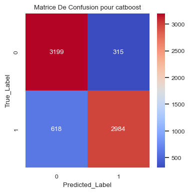
    


```python
from sklearn.metrics import classification_report
print(classification_report(y_test_catboost, y_pred_catboost  ))
```

                  precision    recall  f1-score   support
    
             0.0       0.84      0.91      0.87      3514
             1.0       0.90      0.83      0.86      3602
    
        accuracy                           0.87      7116
       macro avg       0.87      0.87      0.87      7116
    weighted avg       0.87      0.87      0.87      7116
    
    


```python
plot_roc_curve(y_test_catboost,y_pred_catboost,title='ROC Curve pour CatBoost')
```


    
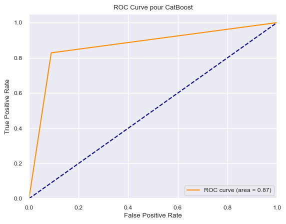
    


# 12- Lightgbm


```python
import lightgbm as lgb
```


```python
X_res = data_res.drop("Y", axis=1)
y_res = data_res["Y"]
```


```python
from sklearn.model_selection import train_test_split
X_train, X_test, y_train, y_test_lgb = train_test_split(X_res,y_res, test_size=0.2, random_state=0)
```


```python
from sklearn.metrics import accuracy_score
from sklearn.model_selection import GridSearchCV
import lightgbm as lgb

# Define the grid of hyperparameters to search
param_grid = {'n_estimators': [50, 100, 200],
              'max_depth': [3, 5, 7],
              'learning_rate': [0.01, 0.1, 0.5]}

# Create a GridSearchCV object and fit it to the data
lgb_model = lgb.LGBMClassifier()
grid_search = GridSearchCV(lgb_model, param_grid, cv=5)
grid_search.fit(X_train, y_train)

print("Best hyperparameters:", grid_search.best_params_)

final_model_lgb = grid_search.best_estimator_
y_pred_lgb = final_model_lgb.predict(X_test)

# Report accuracy score
accuracy = accuracy_score(y_test_lgb, y_pred_lgb)
print("Accuracy:", accuracy)
```

    Best hyperparameters: {'learning_rate': 0.1, 'max_depth': 7, 'n_estimators': 200}
    Accuracy: 0.8617200674536256
    


```python
from sklearn.metrics import classification_report
print(classification_report(y_test_lgb, y_pred_lgb  ))
```

                  precision    recall  f1-score   support
    
             0.0       0.84      0.90      0.86      3514
             1.0       0.89      0.83      0.86      3602
    
        accuracy                           0.86      7116
       macro avg       0.86      0.86      0.86      7116
    weighted avg       0.86      0.86      0.86      7116
    
    


```python
# confusion matrix pour Multi-layer Perceptron.
from sklearn.metrics import confusion_matrix
import seaborn as sns

matrix = confusion_matrix(y_test_lgb,y_pred_lgb)
sns.set(font_scale=0.8)
plt.subplots(figsize=(4, 4))
sns.heatmap(matrix,annot=True, cmap='coolwarm',fmt="d")
plt.ylabel('True_Label')
plt.xlabel('Predicted_Label')
plt.title('Matrice De Confusion pour catboost');
```


    
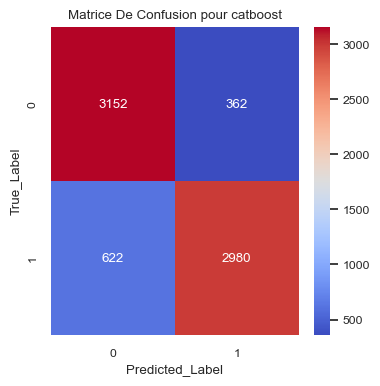
    


```python
plot_roc_curve(y_test_lgb,y_pred_lgb,title='ROC Curve pour Lightgbm')
```


    
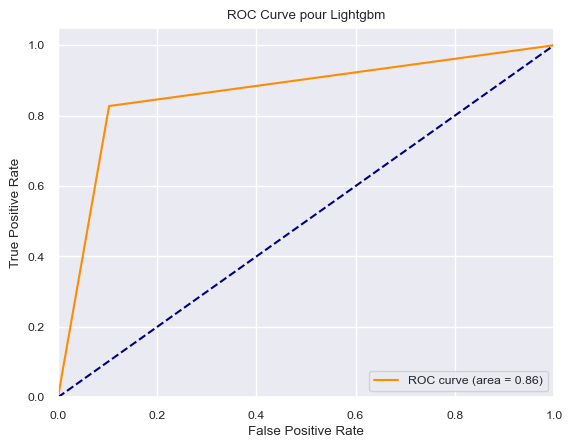
    


# Etude compartive


```python
def result(y_test, y_prediction):
    y_test = pd.Series(y_test)
    y_prediction = pd.Series(y_prediction)
    tp=0
    fp=0
    tn=0
    fn=0
    for i in range(len(y_test)):
        if y_test.iloc[i] == 1 and y_prediction.iloc[i]==1:
            tp+=1
        elif y_test.iloc[i]==0 and y_prediction.iloc[i]==1:
            fp+=1
        elif y_test.iloc[i]==0 and y_prediction.iloc[i]==0:
            tn+=1
        else:
            fn+=1
    tpr = tp/(tp+fn)
    tnr = tn/(tn+fp)
    fpr = fp/(fp+tn)
    precision = tp/(tp+fp)
    f = 2 * precision*tpr/(precision+tpr)
    accuracy = (tp+tn)/(tp+tn+fp+fn)

    return ({'Precision':precision,'Recall':tpr, 'Specificity':tnr,'False Positive Rate':fpr,
             'f-score':f, 'Accuracy':accuracy,'tp':tp,'fp':fp,'tn':tn,'fn':fn})
```


```python
res_knn = result(y_test,y_pred_knn)
res_treeD  = result(y_test_treeD,y_pred_Dtree)
res_clf  = result(y_test_clf,y_pred_clf)
res_gnb  = result(y_test_gnb,y_pred_gnb)
res_svm = result(y_test_svm,y_pred_svm)
res_rf = result(y_test_rf,y_pred_rf)
res_xgboost = result(y_test_xgboost,y_pred_xgboost)
res_mlp = result(y_test_mlp,y_pred_mlp)
res_keras = result(y_test_keras, y_pred_keras.flatten())
res_gbt = result(y_test_gbt,y_pred_gbt)
res_catboost = result(y_test_catboost,y_pred_catboost)
res_lgb = result(y_test_lgb,y_pred_lgb)
```


```python
res_ml=pd.DataFrame([res_knn,res_treeD,res_clf,res_gnb,res_svm,res_rf,res_xgboost,res_mlp,res_keras
                    ,res_gbt,res_catboost,res_lgb],
             index=['Knn','Decision tree','clf','Gnb','svm','Randomf','XGboost','MPL','keras',
                    'Gbt','Catboost','lgb'])
res_ml
#res_ml=pd.DataFrame([res_xgboost,res_mlp_prob,res_KerasC,res_gbt,res_catboost,res_lgb],
#            index=['CLF','GNB','Lightgb'])
#res_ml
```


<div>
<style scoped>
    .dataframe tbody tr th:only-of-type {
        vertical-align: middle;
    }

    .dataframe tbody tr th {
        vertical-align: top;
    }

    .dataframe thead th {
        text-align: right;
    }
</style>
<table border="1" class="dataframe">
  <thead>
    <tr style="text-align: right;">
      <th></th>
      <th>Precision</th>
      <th>Recall</th>
      <th>Specificity</th>
      <th>False Positive Rate</th>
      <th>f-score</th>
      <th>Accuracy</th>
      <th>tp</th>
      <th>fp</th>
      <th>tn</th>
      <th>fn</th>
    </tr>
  </thead>
  <tbody>
    <tr>
      <th>Knn</th>
      <td>0.772849</td>
      <td>0.798168</td>
      <td>0.759533</td>
      <td>0.240467</td>
      <td>0.785305</td>
      <td>0.779089</td>
      <td>2875</td>
      <td>845</td>
      <td>2669</td>
      <td>727</td>
    </tr>
    <tr>
      <th>Decision tree</th>
      <td>0.770241</td>
      <td>0.797612</td>
      <td>0.756118</td>
      <td>0.243882</td>
      <td>0.783688</td>
      <td>0.777122</td>
      <td>2873</td>
      <td>857</td>
      <td>2657</td>
      <td>729</td>
    </tr>
    <tr>
      <th>clf</th>
      <td>0.727187</td>
      <td>0.641588</td>
      <td>0.753273</td>
      <td>0.246727</td>
      <td>0.681711</td>
      <td>0.696740</td>
      <td>2311</td>
      <td>867</td>
      <td>2647</td>
      <td>1291</td>
    </tr>
    <tr>
      <th>Gnb</th>
      <td>0.591526</td>
      <td>0.786785</td>
      <td>0.443085</td>
      <td>0.556915</td>
      <td>0.675325</td>
      <td>0.617060</td>
      <td>2834</td>
      <td>1957</td>
      <td>1557</td>
      <td>768</td>
    </tr>
    <tr>
      <th>svm</th>
      <td>0.794472</td>
      <td>0.750139</td>
      <td>0.801081</td>
      <td>0.198919</td>
      <td>0.771669</td>
      <td>0.775295</td>
      <td>2702</td>
      <td>699</td>
      <td>2815</td>
      <td>900</td>
    </tr>
    <tr>
      <th>Randomf</th>
      <td>0.864522</td>
      <td>0.850361</td>
      <td>0.863404</td>
      <td>0.136596</td>
      <td>0.857383</td>
      <td>0.856802</td>
      <td>3063</td>
      <td>480</td>
      <td>3034</td>
      <td>539</td>
    </tr>
    <tr>
      <th>XGboost</th>
      <td>0.892594</td>
      <td>0.839811</td>
      <td>0.896414</td>
      <td>0.103586</td>
      <td>0.865398</td>
      <td>0.867763</td>
      <td>3025</td>
      <td>364</td>
      <td>3150</td>
      <td>577</td>
    </tr>
    <tr>
      <th>MPL</th>
      <td>0.747805</td>
      <td>0.685730</td>
      <td>0.762948</td>
      <td>0.237052</td>
      <td>0.715424</td>
      <td>0.723862</td>
      <td>2470</td>
      <td>833</td>
      <td>2681</td>
      <td>1132</td>
    </tr>
    <tr>
      <th>keras</th>
      <td>0.750649</td>
      <td>0.722932</td>
      <td>0.753842</td>
      <td>0.246158</td>
      <td>0.736529</td>
      <td>0.738196</td>
      <td>2604</td>
      <td>865</td>
      <td>2649</td>
      <td>998</td>
    </tr>
    <tr>
      <th>Gbt</th>
      <td>0.834376</td>
      <td>0.777624</td>
      <td>0.841776</td>
      <td>0.158224</td>
      <td>0.805001</td>
      <td>0.809303</td>
      <td>2801</td>
      <td>556</td>
      <td>2958</td>
      <td>801</td>
    </tr>
    <tr>
      <th>Catboost</th>
      <td>0.904517</td>
      <td>0.828429</td>
      <td>0.910359</td>
      <td>0.089641</td>
      <td>0.864802</td>
      <td>0.868887</td>
      <td>2984</td>
      <td>315</td>
      <td>3199</td>
      <td>618</td>
    </tr>
    <tr>
      <th>lgb</th>
      <td>0.891682</td>
      <td>0.827318</td>
      <td>0.896983</td>
      <td>0.103017</td>
      <td>0.858295</td>
      <td>0.861720</td>
      <td>2980</td>
      <td>362</td>
      <td>3152</td>
      <td>622</td>
    </tr>
  </tbody>
</table>
</div>


```python
import matplotlib.pyplot as plt
%matplotlib inline
fig, ax = plt.subplots(figsize=(25, 10))
ind = np.arange(12)
width = 0.2
rects1 = ax.bar(ind,res_ml['Accuracy'],width, color='tab:blue')
rects2 = ax.bar(ind+width,res_ml['f-score'],width, color='tab:green')
rects3 = ax.bar(ind+width*2,res_ml['Precision'],width, color='tab:cyan')

ax.set_xticks(ind + width)
ax.set_xticklabels(('Knn','Decision tree','clf','Gnb','svm','Randomf','XGboost','MPL','keras',
                    'Gbt','Catboost','lgb'))
ax.legend((rects1[0], rects2[0],rects3[0]), ('Accuracy', 'f-score','Precision'),loc='center left',bbox_to_anchor=(1, 0.4))
ax.set_ylabel('Value')
ax.set_title('ML results')
def autolabel(rects):
    """
    Attach a text label above each bar displaying its height
    """
    for rect in rects:
        height = rect.get_height()
        ax.text(rect.get_x() + rect.get_width()/2., 1.05*height,
                '{:.1%}'.format(height),
                ha='center', va='bottom' , )
        
autolabel(rects1)
autolabel(rects2)
autolabel(rects3)
plt.savefig('ML_result.png', dpi=600,bbox_inches="tight")
```


    

    


# Conclusion

Après avoir passé par l'étape la plus importante qui est le data engineering, comprenant tout d'abord la visualisation pour mieux comprendre les données et le contexte du projet, puis l'étape de data cleaning et data preprocessing pour nettoyer et préparer les données, on passe à la modélisation.

Pour ce projet, nous avons utilisé douze modèles de classification, parmi lesquels le Random Forest Classifier, le Neural Network et le Decision Tree. 

Les résultats ont montré que les meilleurs performances ont été obtenues par le modèle XGboost avec un score f1 de 0,865398, suivi par le Catboost avec un score f1 de 0,864802, et enfin le Lightgbm avec un score f1 de 0,858295.


```
python

```
# Credits 
Credits for this project structure and implementation goes to INNOVISION

INNOVISION Team Members:

- Med Karim Akkari
- Nadia Bedhiafi
- Sarra Gharsallah
- Karim Aloulou
- Yosr Abbassi
- Med Hedi Souissi
- Aziz Jebabli